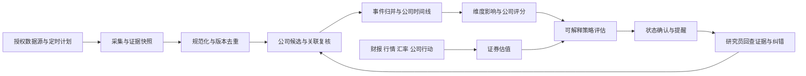

# 02 业务详细设计

## 1. 完整流程

每个阶段可停、可诊断和可重放；人工复核不让整个源停摆。失败项进入独立队列，不以空结果冒充成功。

## 2. 数据源与采集业务

首批覆盖交易所／发行人公告、许可财务与日行情、两个以上获许可资讯源。巨潮、上交所、深交所、HKEX 披露入口只列为候选来源，实际 API、抓取权、商用与保存许可均待核实。正文取不到时保持 metadata_only，不分析标题推导影响。社媒作为低等级线索，不能独自触发高影响经营结论。

源配置包括目标市场、公司名单／主题、允许字段、频率、IANA 时区、授权引用、内容和模型处理许可、保存期限、配额、解析版本、负责人。发布采集计划先运行小规模预览：预计请求量、回溯范围、数据权利、成本。默认日行情用各市场收盘数据；不能把时区相同当成交易日相同。

检查点按 source+partition 保存。分页完成且所有项持久化后推进；部分失败记录重试洞，不跳过未落盘项。增量窗口重叠 48 小时捕捉晚发与修订；补采单独任务、限制区间、不触发真实历史提醒。

## 3. 讯息、事件与公司关联

一份讯息可关联零到多家公司。关联类型：直接主体、控股／子公司、客户／供应商、竞争、行业／政策、间接主题。别名匹配只是候选召回，不能凭一个常见简称确定身份；母子关系须有有效日期和出处。不沿关系图无限扩散。

讯息关联保留；事件与公司关联为归并后的研究判断。相同事件多篇转述只作为多证据，不重复贡献评分。事件归并条件是“同一公司／对象、同一动作、同一事实时期”，不是语义相似即合并。来源冲突记录 claims 和 disputed 状态；事件修订、不再成立或误合并均建立新修订并重算。

### 关联度与影响值

关联度 r∈[0,1]：直接点名且实质讨论可为 0.9–1；主要交易对手且有明确传导链 0.6–0.8；行业整体政策 0.3–0.6；顺带提及 0–0.2。上述只是校准锚点，不是将模型数字当概率。关联置信度 c∈[0,1] 独立记录，经标注集校准；r 高而 c 低仍待复核。

初期 r≥0.5 且 c≥0.9、有有效证据、非歧义和非冲突，才自动接受一般关联；重大负面、间接强影响及可能退市等判断必须人工复核。其余 candidate，不加入生产分值。无关信息明确 no_link，不能为凑公司强制绑定。

每个公司每个维度的影响 m∈[-1,1]；负代表该维度受损，正代表改善。配套影响置信度 a、来源可靠性 q、有效期、半衰期 H、理由、证据与复核者。可靠性是出处等级，不是对事实真假的担保。标准 source-quality 示范锚点：发行人／监管原始披露 1.0、具明确出处的持牌／可信媒体 0.8、未独立核实转述 0.5、社媒线索 0.3；实际 source policy 由人批准。一个事件选择本维度已批准的最强可访问证据确定 q，不相加多个来源权重；冲突无法解决时 pending_review 不贡献。消息语气积极不等于经营影响正面。

## 4. 公司评分与证券估值

经营维度初始权重：盈利质量 0.25、财务韧性 0.25、商业模式／护城河 0.25、治理／资本配置 0.15、成长持续性 0.10；各维度 0–100。盈利和韧性用规范化指标；商业模式与治理是带证据、有效期和复核的人工 rubric。AI 可以提出建议，不能无出处地生产基准分。各维度 rubric 和指标版本由人维护。

初始量化示例（非金融行业）：ROE TTM 5%→0 分、20%→100 分线性截断；3 年 CFO/净利润 0.5→0、1.2→100；3 年正经营现金流年度占比按比例；净债务/EBITDA≤0→100、≥4→0；利息覆盖≤1→0、≥8→100。盈利质量中 ROE 0.4、现金转换 0.4、正现金流 0.2；韧性中净债务 0.6、利息覆盖 0.4。分母≤0 不偷换算法，按缺失／不适用规则处理；历史期不全，覆盖度降低。每维度的有效子指标权重覆盖低于 0.80 时该维度无效；达到 0.80 时对有效子指标权重归一化，另列子覆盖度，不能隐藏未有资料的指标。CFO/利润取最近三个完整年度经营现金流之和除以归母净利润之和，不平均年度比率；净利润和≤0 时 invalid。净债务取带出处的有息债务减现金及现金等价物，EBITDA 口径固定且≤0 时 invalid；利息费用≤0 不自动给满分，标不适用并应用子覆盖规则。

商业模式 rubric 五项：产品刚需／重复购买、定价权、竞争壁垒、客户与供应商集中度、资本投入要求；每项 0–4 档、等权映射到 0–100。治理 rubric 三项：关联交易透明度、资本配置、信息披露；成长三项：3 年收入稳定性、可解释的增量来源、再投资回报。每档必须有事实锚点；未调查不赋中位分。金融、地产和资源周期企业保留研究档案，默认标准策略标为 unsupported，不直接套 EBITDA 筛选。

### 事件如何贡献分数

同一评分时点 t、同一事件修订 e、同一公司维度 d，只保留一个已批准 contribution：

`x(e,d,t) = 10 × m × r × a × q × 2^(-age/H)`；age=max(0,t-event_time)，H 按维度取 30／90／180 个日历日，实际值以 `config/scoring-standard-v1.json` 为数字真源，保存在模型版本；age 超过 valid_until 则为 0。在系统知悉前不可产生贡献。重复转载不增大贡献。

`D_d(t) = clip(B_d(t) + clip(sum_e x(e,d,t), -15, 15), 0, 100)`。

B 为有效基准评分。如果一件事件已由新财报或人工基准吸收，设置 contribution.absorbed_by_baseline，后续不叠加；贡献上限减少新闻密度偏差，但不能取代事件归并。基准缺失时 D_d=null，不能只靠新闻制造经营分。

`coverage = sum(有效维度权重)`；`Q_observed = sum(w_d × D_d) / coverage`，coverage=0 时 Q=null；coverage<0.8 或策略必需项缺失时不能自动入选。界面并列展示 Q 与 coverage、最近更新时间和数据缺口；高分低覆盖不会成为确定候选。置信度逐维展示，不把这些启发式权重解释为收益概率。

### 证券估值与 A/H 口径

PE TTM、PB、现金流收益率属于 security，不属于 company。行情、每股分母、集团归母利润、总市值、股本与公司行动时间必须一致；A/H 两地价格不可相加后当任一证券价格。同股权经济权利且确认同口径时，用该证券价格除以同币种的每股归母盈利；币种不同按已知 FX 版本转换。股权不同、股份权利不清或多类股未建模时估值标为 invalid。

不对原始股价使用后复权价格计算当前估值；复权行情仅用于收益序列。PB 分母归母净资产，每股数量说明对应全部同权普通股；市值法也要明确全股本还是已上市流通股，不能混用。证券估值分 V 标准版先用有效且正的 PE：≤10→100、≥25→0、线性截断。负利润 PE invalid；PB 不作为金融公司不适用策略的后门。

## 5. 标准策略及可维护规则

策略输入是 immutable evaluation context：公司评分、证券估值、指标时点、交易日历、数据质量、硬风险及策略版本。配置用有类型的受限 AST，禁止任意 JS/Python/SQL。标准版配置见唯一机器真源 `config/strategy-standard-v1.json`。

标准版示范筛选：支持行业；Q≥70、覆盖≥0.8、V≥60、ROE TTM≥10%、3 年 CFO/利润≥0.8、净债务/EBITDA≤2、无已确认重大硬风险；人工基准≤180 日；财务公告知悉≤180 日；行情为评估截止时点最近应有的市场收盘，最多落后 1 个交易日。停牌时不伪造新行情，证券评估 suspension/unknown。指标单位在合同中固定，小数 0.10 表示 10%。规则为样例，不以历史收益优化阈值。

入选时用严格 enter 条件；已入选者用较宽 retain 条件（Q≥65、V≥50，其余保持），实现滞回。数值筛选结果采用三值逻辑 true/false/unknown，null 不比较为 0。AND 任一 false→false；否则任一 unknown→unknown；全 true→true。硬风险和质量门的优先级在下节规定。

人可以改权重、指标、阈值、适用范围、确认次数、静默时段；运行时仅使用发布版本。流程：草稿→校验→固定时点影子模拟→变化预览→权限内确认发布→新版本基线→监控。策略发布导致的重分类标为 CONFIG_CHANGE，默认发送一份变化摘要，不冒充市场进入／退出。回滚创建引用旧配置的新发布版本，不覆盖历史。

## 6. 状态机与告警

评估粒度是 workspace+strategy_release+security。显示状态：待评估 UNKNOWN、区间外 OUT、待入选 ENTER_PENDING、区间内 IN、待退出 EXIT_PENDING、暂停 SUSPENDED。待入选／待退出是候选状态，最后已确认状态单独保留。

| 当前已确认状态 | 本次有效判断 | 结果 |
|---|---|---|
| 尚无基线 | 有效 enter true/false | 建 IN/OUT 基线，不发进入／退出 |
| OUT | enter true | 两个不同市场收盘 session 连续满足后 IN，产生 ENTER |
| OUT | enter false | OUT，清待确认计数 |
| IN | retain false | 两个不同收盘 session 连续不满足后 OUT，产生 EXIT |
| IN | retain true | IN，清待确认计数 |
| 任意 | 必需数据缺失／过期／歧义 | UNKNOWN，保留 last_confirmed，打断连续计数，只生成数据质量提示 |
| 任意 | 明确停牌或用户暂停 | SUSPENDED，保留基线；恢复后重新确认，不立即重复 ENTER |
| 任意 | 已确认重大硬风险 | 不等确认次数即 OUT，RISK；之前 IN 时同一转移附退出原因，不额外重复通知 |

优先级：用户暂停→已确认重大硬风险（仍记录风险、暂停用户的发送遵循订阅）→质量门／停牌→普通策略规则。UNKNOWN／SUSPENDED 恢复以 last_confirmed 为起点；若不存在则静默建基线。同一 session 的模型重试、重算或新数据，不增加确认次数；取该 session 最新有效评估替换 pending 依据，历史不覆写。

策略可日内更新研究结果，但标准入退确认按每证券所属市场收盘 session 计算。A 股节假日不能作为港股跳过日期，反之亦然。A/H 共享经营分、各自评估与提醒。

通知事务与状态转移同事务生成 outbox。去重键为 transition_id+recipient+channel；重大风险独立 risk_event_id+recipient+channel。首次状态、补采、历史回放、策略影子模拟默认不发外部消息；人工 replay 需选择 live_authorized 且限制范围。相同状态不重复发。投递失败只重试 delivery，不能重跑状态转移。EXIT 之后重新 ENTER 才是新通知，不用长冷却吞掉真实反转。

通知显示公司与证券、市场、策略版本、前后状态、最关键失败／通过条件、数据时间与证据入口；不使用“买入／卖出”作为系统按钮。站内为必选主记录；邮件／IM 待独立渠道授权。

## 7. 合成端到端例子

示例公司“示例制造”持有 SYN-A 和 SYN-H 两个同权证券，均为合成 ID。已批准质量分 72、覆盖 1.0。A 证券 V=68，H 证券 V=45：A 的两个有效交易 session 满足进入条件后入选，H 在区间外。次日同一订单事件出现 5 篇转载，只计一个贡献；当财报吸收订单收入，撤去已吸收贡献。A 行情采集失效时显示待评估、保留 IN，不发退出。随后确认现金流及债务风险达到已批准硬风险条件，触发一条 RISK，保留证据链。完整演练用合成数据，不声称识别真实投资机会。
