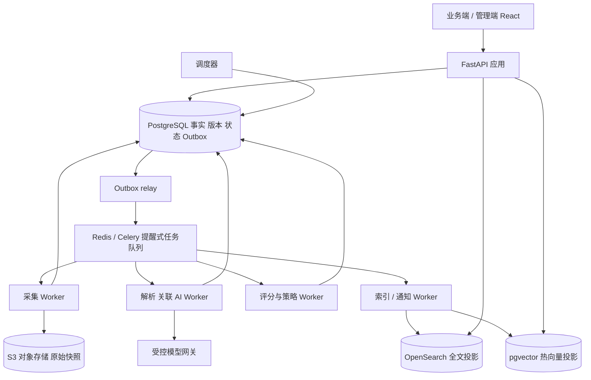

# 03 工程架构与技术框架

## 1. 架构选择

模块化单体 + 分角色 Worker，单个版本化 API 与领域模型；无需先建立微服务平台。领域运算是确定性函数，模型分析与外部请求放到适配器。数据库为事实与业务状态真源，检索和向量是可重建投影；向量库不能承担公司身份、权限、评分历史和告警事务。



## 2. 技术栈提案与取舍

| 层 | 建议 | 理由及限制 |
|---|---|---|
| 前端 | React + TypeScript + Vite + TanStack Router/Query/Table | 两端一套交互、URL 状态和表格；不用 SSR 承担私有后台 |
| 设计系统 | Tailwind CSS tokens + Radix primitives + 自有 domain components | 一处维护焦点、表单、密度和语义颜色；不以库默认皮肤当完成 |
| 图表 | Apache ECharts，文字表格等价输出 | 时间线与贡献图；避免雷达图成为唯一解释 |
| 后端 | Python + FastAPI + Pydantic + SQLAlchemy + Alembic | 抓取与 AI 工具生态、类型合同和事务；领域逻辑不依赖框架 |
| 事实库 | PostgreSQL，decimal、JSONB、分区与行级安全 | 原子状态／outbox、时点查询与版本，避免双真源 |
| 异步 | Celery + Redis broker，Postgres job ledger / outbox | 适合中等规模；Redis 不是持久任务真源，丢队列可从 ledger 重建 |
| 检索 | OpenSearch 中文分词 + 原生 BM25；pgvector 热语义 | 股票代码精确检索与全文是必需；向量选配并按需分层 |
| 证据 | S3 兼容对象存储 | 哈希快照、保留权限；商业发行版／自建许可和费用上线前核实 |
| 身份 | OIDC 适配器，开发隔离模拟身份 | 服务端验证 issuer/audience/expiry；不得把开发入口部署生产 |
| 工程 | uv、pnpm、pytest、Ruff、mypy、Vitest、Playwright、Storybook | 锁版本、可复现、边界测试；不预填未来“最新版本” |
| 部署 | OCI 容器；开发 Compose；生产容器平台／托管服务二选一 | 先预算和恢复能力后定主机，首期不强制 Kubernetes |

版本须在实施选型时验证支持周期、兼容性及许可证，记录 lockfile/SBOM。此阶段未安装依赖，技术名不是已验证运行环境。

## 3. 模块接口与责任

- ingestion：计划、检查点、采集结果、原始对象提交，外部源通过 SourceAdapter 变化。
- identity：公司、证券、别名和有效期关系图；唯一负责身份合并与拆分。
- information：规范文本、证据定位、讯息修订和事件归并。
- analysis：候选、模型结果、复核和已批准关联／影响；提交建议，不直接改策略状态。
- fundamentals：财务、行情、FX 和公司行动规范化；输出有单位、有时间和质量标记的指标。
- scoring：输入固定快照，返回维度、贡献、覆盖和解释；不读网络、不发送通知。
- strategy：AST 校验、版本、确定性评估、状态转移；唯一拥有 membership。
- notification：站内与 delivery，订阅和渠道；发送幂等，不能改判断。
- search：全文／向量投影和 ACL 过滤，重建不改变业务真源。
- governance：权限、审计、模型及源策略、成本账本。

模块间只能调用公开应用接口或消费已版本化事件，不能互相更新私有表。初期一库按表责任分组，服务端事务可以跨本次必需的状态、审计和 outbox；不实施全量 event sourcing。

## 4. 未来代码组织（目标，不是已存在实现）

```text
apps/web/src/{app,features,design-system}
apps/api/src/{modules,platform}
workers/src/{ingest,analysis,score,index,notify}
packages/api-client/      # 从 OpenAPI 生成，不能手改
contracts/               # Schema 与跨端事件合同
config/                  # 标准策略与行业维度模板
migrations/              # 版本化数据库迁移
infra/                   # 配置模板，无真实密钥
qa/                      # 合成场景、E2E、负载与演练
```

保持单一 monorepo；前端不复制规则计算，只显示后端 evaluation 的解释。Python 类型从 JSON Schema 或同一后端 DTO 导出，前端客户端从发布 OpenAPI 生成，CI 防漂移。所有钱和精确指标 API 用 decimal 字符串；百分比 decimal ratio，展示层做格式化。

## 5. 处理及一致性

外部抓取至少一次，持久化幂等键消重，后续每阶段 task ledger 唯一键 = stage+entity_revision+algorithm_version+mode。领域业务变更与 outbox 同事务。消息包含 ID／revision／trace，不放正文、凭证。消费者先按 ID 取得已提交输入，再领取租约、执行、提交输出和新 outbox；提交后 ACK。

队列丢失由 sweeper 重新投递 ledger 的 due 任务；定时调度使用数据库唯一约束防止多 scheduler 重复创建。长任务用 lease+heartbeat；过期租约用 fencing generation 拒绝旧 worker 的迟到提交。禁止声称队列带来 exactly-once，保证业务效果幂等。

对象存储上传与数据库不跨系统事务：临时对象→验证 hash→记录 revision/reference→标记对象 committed；孤儿在保留期后由带 dry-run 的清理流程处理。对象写成功、DB 失败必须能用相同内容 hash 重试；hash 不作为跨 workspace 可枚举 URL。

评分 run 固定 source manifest 与算法版本。只发布 complete 的整组 snapshot；失败不替换当前成功版本。公司和证券关联 snapshot 通过 manifest 固定，不能混用一半新财报一半旧 FX。发布采用 expected_generation CAS，输入有新版本时旧 run 保留但不覆盖最新指针。

## 6. 扩容与降级

先以 10 万份合成讯息校准，达到 100 万、1,000 万量级分别测索引、查询、重建。财务／评分按时间和 workspace 分区，search 按月份 rollover，原始对象 lifecycle 按来源权利配置。热向量最多 90 天起步，pgvector 达瓶颈后再评估独立向量库；跨库迁移按相同 chunk ID 双写影子比较后切读，PG 仍是真源。

全文故障：业务公司列表与时间线从 PG 使用结构化索引可用，搜索页面明确降级；语义故障退回全文；模型故障保留规范化证据和人工队列；行情源失败策略 UNKNOWN；通知故障留站内主记录。不能把采集失败显示成“无新闻”。

不预先加入 Kafka、Temporal、多 Agent 协调、分布式图数据库。只有无法达到实际 SLO、工作流跨日人工恢复确实复杂或队列吞吐形成瓶颈，才用 ADR 决定升级。
