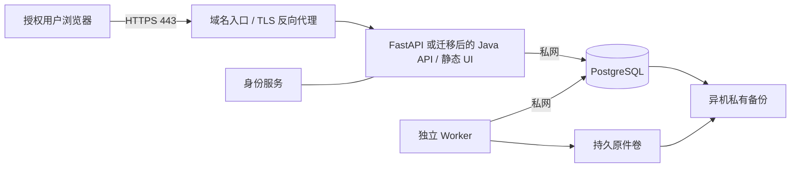

# 19 生产发布资源清单与配置要求

2026-10-06。用途：根据现有实现整理资源准备、域名访问配置和上线待办，并比较 Java 迁移的影响。**本文件是部署准备建议，未执行采购、生产配置、数据库写入或部署，也不表示生产验收通过。**

核对基线：`main` / `a3d1a4ef87148a051762d6253f5bc01b38ca21d1`，同时读取当前未提交的来源适配与配置修改；因此清单针对该时点工作树，不能全部归属该提交。文件 hash、核对结果和边界见[清单核对证据](../review/production-resource-inventory-evidence.json)。项目状态以[PROJECT](../PROJECT.md)和[版本验证](../versions/v0.0.1/VERIFICATION.md)为准，本文不改变业务合同或既定必选验收。

## 1. 现有组件与目标方案

部署资源先按实际运行依赖准备。[03](./03-architecture.md)描述完整目标架构，[17](./17-coding-readiness.md)是编码前选型；其中部分组件尚未接入，不能当作当前必须启动的服务。

| 层 | 已存在的实现或记录 | 生产配置含义 |
|---|---|---|
| 前端 | React / React DOM 19.1.1、TypeScript 5.9.2、esbuild 0.25.9；`frontend/package-lock.json` | 静态产物由 FastAPI 挂载 `backend/static/`；当前没有独立 Node 前端服务，也没有 Vite/TanStack/Tailwind/Radix 运行依赖 |
| API | FastAPI 0.141.1、Uvicorn 0.53.0、Pydantic 2.13.5；`backend/uv.lock` | Python 3.12，API 放在反向代理后；静态前端与 API 可使用同一域名 |
| 数据库 | SQLAlchemy 2.1.1、Alembic 1.20.0、psycopg2-binary 2.9.13；已有至 `0010_formal_sealing` 的迁移 | PostgreSQL 是业务数据、修订、任务效果和审计真源；应用/迁移权限应分离 |
| 普通 Worker | `python -m app.worker`，轮询 PostgreSQL outbox，领取租约并用 generation fencing 提交 | 独立常驻进程、自动重启、监测任务积压；不依赖 Redis 或 Celery |
| 正式封存 | `seal_worker.run_one` 与显式 `scripts_seal.py` | 已有内部执行机制，尚无生产常驻调度入口；普通 Worker 不会自动完成全部正式封存 |
| 资料处理 | BaoStock 0.9.4、PySocks 1.7.1、pypdf 6.19.0；另有当前未提交的 EODHD 适配 | 外部源需要网络、授权和可持久保存原始快照的目录；EODHD 不计为已发布生产能力 |
| 身份 | 五角色/workspace 校验；身份来自客户端 `X-Vip-Login` 请求头，匿名 `/api/identities` 列举身份 | **尚无生产登录。替换开发身份入口是公网发布的必要前置工作** |
| 交付 | uv lock + npm lock、本机启动/迁移工具 | 未发现 Dockerfile、Compose、`infra/` 或 `.github/` 配置；生产制品与发布入口待补 |

Redis/Celery、Elasticsearch、pgvector、S3 对象存储和 OIDC 属于设计或后续接入项。OIDC/等效可信登录必须在公网发布前落地；其余基础设施按对应业务能力实施后启用。全文检索等已确认能力和必选验收仍然保留，推迟采购未使用服务不等于删减功能。

这些核心选型具备成熟的生产生态：React/TypeScript 是主流前端组合，PostgreSQL/Redis/Nginx 广泛用于生产；FastAPI/Pydantic 常用于 Python API 和 AI/数据服务，SQLAlchemy/Alembic 是成熟的 Python 数据层工具。Java 的 Spring Boot/Spring Security 体系在企业后端广泛使用。Celery/Elasticsearch 按任务/检索需求采用；Caddy 支持生产与自动 HTTPS，普及程度低于 Nginx；S3/OIDC 是接口/身份标准。BaoStock/EODHD 属于数据服务，其许可、覆盖和稳定性需单独核查。这里是选型性质的定性判断，未做市场份额排名或供应商 SLA 核验；组件成熟不代表本项目已完成生产验收。

## 2. 首期资源清单

适用估算：首批 50–100 家的受控试运行准备，面向少量研究成员；当前真实接入仅两家公司。既有 20 并发目标仍需压测，下列规格没有性能实测依据，不是满足全部设计容量的承诺。暂不选定云厂商或报价。

| 资源 | 建议起步配置/数量 | 要求与用途 |
|---|---|---|
| 应用计算 | Linux VM/容器宿主 1 台，**4 vCPU / 8 GB RAM**，系统盘约 50 GB | API、静态 UI、普通 Worker；正式调度按批准范围另行启用。建议 Ubuntu 24.04 LTS，镜像与 patch 在实施时锁定 |
| PostgreSQL | 同地域私网独立实例 1 个，**2 vCPU / 4–8 GB RAM**，SSD 数据盘约 100 GB、可扩容 | 托管 PG 或独立自建均可；设计目标 PG 17，选受支持 patch。现有验证记录是本机 PG 14.23，不能直接视为 PG 17 已验收 |
| 原始资料卷 | 初期约 **100–200 GB SSD**，可扩容、API 无需公开挂载 | 保存原始响应、PDF、输入快照及 hash；容器重建后必须保留，按来源权利管理保留期限 |
| 异机备份 | 私有存储初期约 **200–500 GB**，按数据量与保留策略调整 | PG 全备/WAL、必要原始资料、配置版本与恢复清单；与生产数据不同故障域 |
| 公网入口 | 1 个稳定公网 IPv4/EIP，或托管负载均衡入口 | 只有入口对外开放；初期可按 5–10 Mbps 出站带宽询价，PDF 下载并发与地域实测后调整 |
| 域名与 DNS | 已有主域名下 1 个子域，例如 `research.example.com` | 域名控制权、DNS 修改权限、自动续费负责人；无需为 API 另买域名 |
| HTTPS | 1 份自动续期证书，或托管证书 | 覆盖实际域名、TLS 1.2/1.3、证书到期监测；托管代理/负载均衡与 Nginx/Caddy 选一种入口方案 |
| 身份服务 | 1 个 OIDC 应用/客户端，优先复用已有 IdP | 服务端验证可信身份，映射本项目用户与 workspace 角色；自建 IdP 才另计其资源 |
| 运维通道 | 私网/VPN/堡垒机或限制来源 IP 的 SSH | 管理入口与研究入口分开；备份、升级、证书和故障恢复有负责人 |
| 监控日志 | 云监控或轻量本机采集 + 独立可访问的监控端 | CPU/RAM/磁盘、API、PG、Worker、证书、备份和业务新鲜度；日志限额/轮转，告警渠道由运营选定 |
| 数据源 | 批准的数据套餐、合法服务使用权及所需凭证 | 个人本地研究许可不自动覆盖远程托管、多人使用或商业服务 |
| 构建环境 | 隔离的 CI/构建机；Python 3.12、uv、Node/npm | 可复用构建资源；Node 仅构建 UI，生产运行不需要常驻 Node 服务 |

若优先简化运维，可把应用、普通 Worker 和自建 PG 放在 **1 台 8 vCPU / 16 GB、约 300 GB SSD** 的 Linux 主机，仍需异机备份。此方案共享故障域，主机维护/故障会中断全部服务；没有高可用保证。应用与 PG 分离更便于恢复和后续扩容，托管 PG 的高可用/PITR 套餐需单独核实。

当前建议不需要 GPU、Kubernetes 或独立向量数据库。Java 迁移也不会自动增加这些需求。

### 完整目标架构的增量

| 接入条件 | 增量资源 | 初步配置依据 |
|---|---|---|
| 实施 Celery 调度/队列 | 私网 Redis + Celery Worker/relay | Redis 可从 1 vCPU/2 GB 评估；PG ledger/outbox 仍是真源，队列丢失恢复必须验收 |
| 实施全文检索 | 独立 Elasticsearch | 可从 4 vCPU/16 GB、独立 SSD 评估；需要扩展目标检索能力，单节点没有高可用保证 |
| 实施对象存储适配 | 私有 S3 兼容桶与最小权限账号 | 原件/版本化快照、生命周期、访问审计；当前用桶备份不代表应用已支持 S3 读写 |
| 实施语义检索 | 优先评估 Elasticsearch 向量能力；pgvector 为替代候选 | 语义增益、资源及订阅按版本实测；不默认双套索引；如选pgvector，扩展/schema另按实施范围授权 |
| 实施外部模型分析 | 受控模型 API/网关、配额与费用记录 | 无需预购 GPU；只有获准外发的资料才能进入模型，当前适配与实际调用待实施 |
| 要求持续可用 | 第二应用实例、负载均衡、PG HA、对应备份恢复配置 | 按可用性和维护窗口选择，不把多应用副本当成数据库高可用 |

[08 §4](./08-security-and-operations.md)的 8–16 vCPU / 32–64 GB 是包含检索等组件的 PoC 总资源估算，与首期资源口径不同。01 的完整基线每天 20,000 份、平均 8 KB、三年约 2,190 万份，规范正文就约 175 GB，尚不含 PDF、修订、索引、向量与备份；上述初期磁盘不能外推到全量容量。

## 3. 域名、网络与 HTTPS

推荐同源根路径：`https://research.example.com/` 访问 UI，`/api/*` 访问 API。当前 UI 使用 `/app.js`、`/app.css` 及 `/api/…` 绝对路径；放在 `/vip/` 之类子目录需要先改造，不能仅加代理前缀。

图中身份对接和备份链路是部署配置目标，尚未实施；外部源采集只在获准后启用。

| 配置项 | 要求 |
|---|---|
| 部署地域 | 与数据许可、访问用户及企业要求一起确定；中国大陆公网托管需按服务类型核实 ICP 备案、适用许可及公安备案要求/时限，域名实名和接入要求由供应商确认；境外托管另核实资料远程存储与使用范围 |
| DNS | A 指向 EIP，或 CNAME 指向负载均衡；切换期 TTL 可设 300 秒。只有实际启用 IPv6 并验证服务/防火墙后才配置 AAAA |
| 公网入站 | 443 对外；80 仅按证书签发方案用于验证/跳转。SSH 限来源或走私网；PG 5432、应用端口及任何管理端口不公网开放 |
| API 内部监听 | 单机代理可用 loopback `8766`；容器内可监听容器网络接口，但只允许代理访问，不向公网发布宿主端口 |
| 代理与身份头 | 保留正确 Host/协议，应用只信任指定代理的转发头；禁止把客户端自报的 `X-Vip-Login` 当身份。仅剥除该头不足以完成生产认证，仍需服务端验证与身份映射 |
| 静态/API 路由 | 保留 `/api/*` 路由与 JSON 错误，不将 API 404 回退为 UI HTML；静态资源缓存与制品版本联动，HTML 应能及时刷新；当前资源名无内容 hash，需处理缓存更新 |
| 浏览器安全 | HTTPS、受控 CSP、`nosniff`、合理 Referrer-Policy；若采用 Cookie 会话，配置 Secure/HttpOnly/SameSite 和适用 CSRF 防护。HSTS 在证书/域名链路验证后启用 |
| 跨域 | 同源无需新增 CORS。若将 UI/API 拆域，仅允许批准的精确 origin，带凭证不使用 `*` |
| 请求限制 | API/下载/登录限流，上传体积、超时与并发按实际接口配置；默认不把后台长任务作为长 HTTP 请求，避免代理超时后盲重试 |
| 运维与文档接口 | `/api/worker/*`、审计等保持真实权限保护；默认 FastAPI `/docs`、`/redoc`、`/openapi.json` 是否开放由发布配置决定。匿名开发身份列表必须移除/禁用 |

### 出站要求

基础设施需要批准的 DNS/NTP、身份服务/JWKS 和备份端点。抓取凭证、查询参数、原文与私有地址不进入访问日志。

| 来源 | 已核对的连接形态 | 上线约束 |
|---|---|---|
| BaoStock | SDK 指向 `public-api.baostock.com`，**出站 TCP 10030**；当前适配可选已有 loopback SOCKS5 | 仅放行实际批准的 provider；不能只开放 HTTPS 443 就认为采集可达；不复制本机代理配置作为生产依赖 |
| Wikimedia 文本 | `en.wikipedia.org` HTTPS 443 | 当前保存/处理政策是本地有署名文本研究，远程/多人用途重新核实 |
| EODHD（当前工作树） | `eodhd.com` HTTPS 443，令牌认证 | 核实套餐市场覆盖、调用限额、服务器/多人使用权；免费个人方案不能直接推定生产许可 |
| HKMA 汇率（当前工作树） | `api.hkma.gov.hk` HTTPS 443 | 验证响应可用性、日期/方向和来源政策；过期 FX 不配到当前行情 |
| 财报原件 | 当前 CLI 从限定本机快照/PDF 导入 | 上线前选定批准的取得渠道与原件存储方式；不将现有个人阅读范围扩成批量抓取 |

## 4. 应用、身份与数据库配置

### 已有参数与待实现参数

| 参数/配置 | 当前代码状态 | 生产要求 |
|---|---|---|
| `VIP_DB_URL` | Settings 已支持，缺省指向本机开发库 | 必须显式注入核验后的生产目标；不同环境独立角色/凭证。私网连接，远程 PG 配置 TLS、CA 与主机校验；不回退到开发库 |
| `VIP_DEMO_MODE` | Settings 已支持；合成操作另受本机指定 test 库限制 | 保持 false；**它不关闭 mock 身份认证**，不能以此作为公网安全开关 |
| `EODHD_API_TOKEN` | 当前未提交 Settings/适配已支持 SecretStr | 只在采用且获准的数据源任务中注入；SecretStr 不会自动避免 URL/代理日志泄露，日志仍需脱敏 |
| `VIP_DEEPSEEK_API_KEY`（及后台登记的其他模型密钥变量） | R5 资讯雷达读取；后台 › 模型配置只保存变量名 | 只用环境变量/secret manager 注入；未配置时资讯关联退回规则匹配并在事件上标注原因 |
| `VIP_REAL_SOURCE_ENABLED` | Wikimedia adapter 的显式采集开关 | 只用于批准任务，不在 API/普通 Worker 启动时默认打开 |
| `VIP_HTTP_PORT` | 仅本机 `tools/local_manage.py` 读取 | 生产端口由进程/容器入口配置，不能假定这是全局 API Settings |
| OIDC issuer/JWKS/audience/client、回调/登出 URL、会话策略 | 当前没有相应认证配置和实现 | 需要新增可信登录与服务端验证；精确注册 HTTPS 回调。用户映射用可信 `sub`，workspace 成员/角色仍由本项目服务端校验 |
| 生产环境标志、allowed hosts、代理信任、健康端点、连接池额度、存储根目录 | 当前没有完整生产配置合同 | 实施时增加并验证缺项 fail closed；不能把未经实现的环境变量名列成现有可用参数 |

生产配置由 secret manager/受限环境文件注入，不将本机 `backend/.env`、`.venv`、备份或真实资料复制进镜像或 Git。源码按目录查找 `config/` 和部分 `examples/`，打包时核对全部运行时读取文件；保留必要配置/合同与已发布版本、算法 hash，不能只复制 `backend/app/`。

### 进程与交付

- Python 运行线固定 3.12，依赖用 `uv.lock` 的冻结版本。UI 使用 npm lock；Node 24 LTS 可作为构建候选，需在该版本验证构建。此次只读核对本机 Node 是 26.3.1/npm 11.16.0，SCOPE 中 Node 22.23.2 是历史记录；本轮没有重建 UI 或验证新运行线。
- API、普通 Worker 分开监督，启动失败可观察，退出/升级有优雅停止与租约恢复；先从少量进程开始，按负载调整。每个 API/Worker 进程拥有独立数据库连接池，总连接数需要一起预算，不能无限增加副本。
- 生产启动入口不依赖本机 PID 文件/开发目录。`tools/vip migrate`、原始导入、封存及多个来源 adapter 有本机目标/路径限制，不能直接拿来部署远程实例，也不能通过删除校验绕过保护；需实现显式环境/数据范围验证的生产入口。
- 采集与正式封存按批准源、市场日历、FINAL 和 cutoff 建立内部调度，唯一任务键、lease/fencing、审计/outbox 原子性继续成立；不可将 `app.worker` 的 outbox 处理视为已有完整采集/封存调度器。
- 系统服务使用非 root 运行账号，代码/配置只读，原件/日志/临时目录分别授权。提供镜像或 systemd 制品、版本/锁文件/hash、构建记录及上一兼容制品；本次不选择或实现新的发布框架。
- 使用本地/隔离 staging 的合成数据验证发布，测试入口不得连接生产。生产迁移是单独受控任务，写前确认真实服务器、环境、数据范围和授权；不要在每个 API 副本启动时自动跑 DDL。

### PostgreSQL、持久化与恢复

生产建议新建项目专用库；运行角色只拥有所需表操作权限，迁移角色单独持有 DDL，避免超级用户。应用、审计、outbox 同事务和不可变修订要求不变；审计 UPDATE/DELETE、RLS（若采用）和连接池隔离的有效权限需验证，不能只根据配置名认定已实现。

生产候选迁移至少包含当前 `0010`。切换 PG 版本/操作系统时验证迁移与兼容，记录真实 schema revision；封存使用的 artifact/模板/政策/算法 hash 与制品一致。`raw-data/` 等代码固定路径需映射到持久卷或改为显式受控目录，原件/PDF/hash/定位一起保存；`local-evidence/` 是持久历史证据，不默认搬迁或清理。

既有恢复目标为 **RPO ≤15 分钟、RTO ≤4 小时**，需验证全备 + WAL/PITR 与隔离恢复。单次每日 dump 无法承诺 15 分钟 RPO；同机备份无法应对整机/磁盘丢失。备份保留天数按资料权利与项目恢复需求确定，监测最近成功时间、覆盖范围与可恢复性。恢复要核对事实、修订、审计、manifest、策略基线及最新撤权依据，再开放读取；历史任务静默重放，不自动发送通知。

现有证据包含本机迁移前 dump 与目录可读检查，**不等于已做生产恢复演练**。如需迁移现有研究资料，必须另行确认传输/托管对象、许可、目标、备份与验证范围；不默认把本机全部资料传到云上。

## 5. 换成 Java 后的差异

**资源类别和拓扑基本相同，应用规格与运行配置需重新验证。** Java 可以继续使用模块化单体 + 独立 Worker + PostgreSQL，也可使用同一套域名、TLS、私网与备份；无需因为语言迁移自动升级为微服务。

以下 Spring Boot/JDK 是比较用的候选，不是已选定或已实施方案。

| 项目 | 当前 Python | Java 候选影响 |
|---|---|---|
| API 框架/运行时 | FastAPI/Uvicorn，Python 3.12 | Spring Boot，选择匹配且受支持的 JDK 21/25 LTS 发行版；锁定 Spring Boot/JDK patch 与许可 |
| 构建部署 | uv 冻结依赖 + Python 制品；UI 独立 npm 构建 | Maven/Gradle Wrapper + JAR/OCI 镜像；UI 可继续保留 React，由同源入口提供 |
| 内存 | 每个 Uvicorn/Worker 进程均有独立内存与池 | 每个 API/Worker JVM 都要预算 heap、metaspace、direct buffer 和线程栈；容器上限不能全部分给 `-Xmx`。初期可把 heap 设为单容器额度约 50–60% 的候选，再按实测调整 |
| 并发与连接池 | API/Worker 进程数 × 各自 SQLAlchemy 池 | HTTP 线程池、后台并发、HikariCP 池和所有实例共同预算；吞吐不能仅用语言推断 |
| ORM/迁移 | SQLAlchemy/Alembic | JDBC/JPA/MyBatis 与 Flyway/Liquibase 为候选；保留已有 schema 和迁移历史，建立明确接管点；禁止 ORM 自动重建/更新生产表，禁止两套工具同时迁移 |
| Worker/调度 | PG outbox 轮询 + 显式封存 CLI | 可继续 PG 轮询；若选 Spring 调度/Quartz，必须保留唯一键、租约、fencing 和效果幂等，实例副本不会天然避免重复执行 |
| 身份 | 当前 mock，OIDC 待实现 | Spring Security/OIDC 可复用身份平台；仍要落实五角色、workspace/source ACL，选择框架不等于验收通过 |
| 财务计算 | Decimal、固定 numeric/time policy、manifest | BigDecimal 按既定精度/半偶数/阈值和时点合同实现；用相同黄金输入比对，不能顺手改计算口径 |
| 数据源/解析 | BaoStock Python SDK、pypdf、既有 adapter | Python 专用 SDK 需 Java 可用接口/解析库，或保留明确边界的 Python 采集进程；后者会继续需要 Python 运行资源及跨进程合同 |
| 可观测性 | 当前最小 `/api/health` 与业务页面 | Actuator/Micrometer 可作为候选；健康细分与访问保护仍需配置，不公网暴露 env、heap dump 等管理内容 |

首期 8 vCPU/16 GB 合并主机或应用/PG 分离可继续作为 Java 的估算起点，不能据此保证相同性能。如果 API 和 Worker 各运行一个 JVM，应分别设置容器/进程预算，给 OS、PG（同机时）和文件缓存留余量。

迁移 Java 的主要工作是 API、身份、业务服务、任务/事务、资料适配与测试迁移；域名和服务器采购仅占一部分。外部 API/DTO、decimal 字符串、R/W/T、有效/知识时间、不可变修订、audit/outbox 和失败恢复合同应保持，变更另记录。本次用户提出的是架构比较，没有实施 Java 重写。

## 6. 发布前需要补齐与验证的事项

下面是部署候选的检查入口，不是已通过结果；原完整必选验收继续适用，不能把这张表当作缩减签收标准。

| 检查 | 工作与预期 | 关联/当前状态 |
|---|---|---|
| DEP-01 身份与权限 | 真实登录成功；未登录/失效 token 拒绝；伪造开发头无效；禁止匿名身份枚举；五角色与跨 workspace 越权拒绝 | R-11/17、T-20/29；生产身份未实现，直接公网发布阻断 |
| DEP-02 可复现发布 | 锁定制品/schema/hash；持久卷正确；正常启动无采集/正式封存副作用；升级失败可回到兼容版本；不丢原件或审计 | R-13、T-24；生产制品、配置与发布入口未提供 |
| DEP-03 域名与边界 | DNS/证书/续期正确；仅入口公网可达；代理头无伪造身份；API 错误正确；受控请求/下载不泄漏资料 | R-11/13；域名/地区/入口未选定，未实测 |
| DEP-04 来源使用权 | 分别核实 fetch/store/analyze/export、远程托管与多人范围；撤权即禁读；未许可不抓取、不外发模型 | R-01/11、T-15/17；已有政策以本地个人研究为主，需要生产用途核查 |
| DEP-05 后台与业务链路 | 有效任务最终完成；Worker 重启/过期租约/双实例无重复效果；缺价格/FX/日历不封存，不把 partial 显示为正式结果 | R-08/12、T-14/18/31/43；局部本机/合成证据已记录，真实完整运行未通过 |
| DEP-06 备份恢复 | 隔离恢复并量测 RPO/RTO；原文、manifest、审计与策略基线可回读；最新撤权依据生效后才恢复读路径 | R-11/12、T-19/32/34；没有生产恢复证据，独立撤权恢复链路仍有缺口 |
| DEP-07 容量与观测 | 按 01 的 20 并发/已启用数据范围压测，记录 p95、连接数、积压、磁盘增长与成本；源失败/PG 失联可观察并正确降级 | R-12/13、T-23；本轮未压测，所有资源规格为估算 |
| DEP-08 用户可用闭环 | 公司/原文/固定研究/解释可读；完整正式能力按既定必选验证，UNKNOWN/partial 准确；目标用户按原要求签收 | 版本 VERIFICATION、T-UX-01…04；完整首 slice 尚未通过 |

当前 `/api/health` 执行 `SELECT 1`，只证明 API 当次能够查询 PG。08 中的 `/health/live`、`/health/ready`、`/ops/pipeline/status` 是目标设计，当前未见对应实现；部署时需要最小化落实存活、依赖就绪、任务/源新鲜度监测，或提供等效受保护检查。前轮测试/构建结果不计为本轮生产验证。

## 7. 实施前待填信息与本轮证据

| 信息 | 用途 |
|---|---|
| 域名/DNS 管理方式、部署地区与云厂商/已有主机 | 落实公网入口、适用接入要求与网络可达性 |
| 并发人数、首批公司/来源范围、可接受维护窗口 | 校准应用/数据库规格、是否需要多实例/HA；扩展真实接入另确认 |
| 已有 IdP 与登录方式、成员/运营负责人 | 注册 OIDC 客户端、分配角色与支持故障恢复 |
| 原件/备份保留策略、是否搬迁既有资料 | 明确存储、异机恢复及资料远程使用权 |
| 继续 Python 或另行实施 Java 迁移 | 固定制品、业务合同兼容及运行/验收方式 |

费用需要按云厂商/地域实际询价，拆为计算、PG、存储与备份、带宽/出口、域名/证书服务、身份服务、数据订阅与模型调用；备案/运维工作亦需计入。当前未报价、未采购。

本轮仅做仓库只读核对与此清单/导航文档整理；没有读取本机秘密 `.env` 或真实资料目录，没有连接数据库、启停服务、生成新业务数据或外部传输。必要核对是锁文件/依赖、API 与身份入口、Worker、固定路径/目标限制、设计/验收对照和文档链接；详情见[本轮证据](../review/production-resource-inventory-evidence.json)。正式部署和 Java 迁移均待相应实施任务授权。

## 2026-10-07 检索选型补充

全文平台按[ADR-0004](./adr/0004-elasticsearch-search-platform.md)调整为 Elasticsearch，未部署；资源规格仍为容量测试起点，不是已测承载量。自托管 Basic 基础功能可免费使用，默认发行物为 ELv2；云托管、进阶功能和商业支持另询价。搜索节点、索引磁盘、备份/重建和运维是新增费用，未包含在报告129.80美元三项基础设施示例内。语义召回有收益再启用，同平台向量能力与pgvector择适合路径，不预购双套服务。
