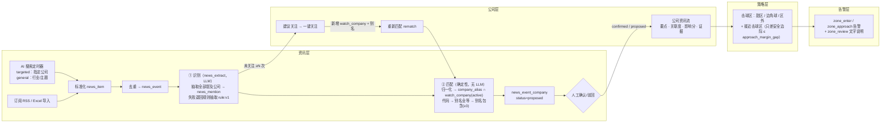
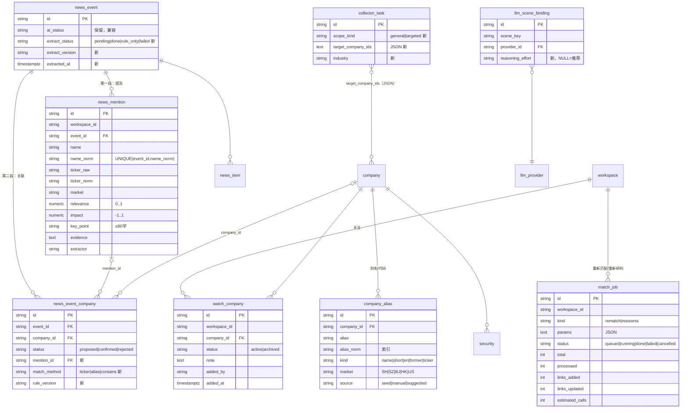
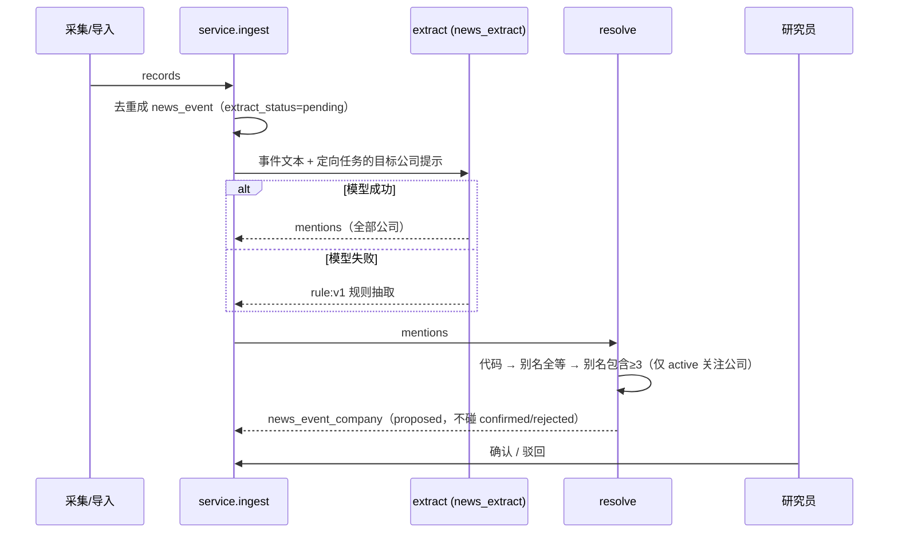

# 24 资讯 → 公司匹配闭环（R10–R14）

> 一句话：**每条资讯先把提到的公司全部找出来（不管关不关注），再按关注列表确定性地对上公司**；关注列表或别名一变，旧资讯可以一键重新匹配，不用再调大模型。
>
> 决策见 [ADR 0016](./adr/0016-news-company-matching.md)。状态：**R10a 已实现、本机测试通过**（数据结构、归一化、推理强度、接口契约）；抽取/匹配引擎、任务、页面、接近击球区分别在 R10b / R11 / R12 / R13 落地（§8）。

## 1. 为什么要改

原来的“资讯研判打分”（`score_events → llm.propose_links`）把**全部公司名单**塞进提示词，让模型挑；名单外的公司模型只在“事件主角”时返回，返回后再用“名称包含/代码”去对公司（`match_company`）。问题：

1. 关注列表一改，历史资讯无法重新对上——只能整批再调一次模型；
2. 名单外公司被丢掉，看不出“最近总被提到、但还没关注”的公司；
3. 别名（BeOne / 百济神州 / ONC / 06160.HK / 688235.SH）、港股前导零、`-B` 后缀都靠模型碰运气；
4. 采集、研判共用一个“场景”，模型和推理强度不能按用途分开配。

## 2. 总体逻辑（四层不变：资讯 → 公司 → 策略 → 告警）

- **第一段 识别（extract）**：每个事件调用一次场景 `news_extract` 的模型，返回事件里**每一家**公司：原文写法、代码（有就给）、市场、关联度 0..1、影响分 -1..1、要点（≤80 字）、证据（原文短引文），连同抽取器版本与模型写入 `news_mention`。定向采集任务把目标公司作为提示传入。模型失败时用别名字典扫描原文（`rule:v1`）。
- **第二段 匹配（resolve）**：只在本工作区 `watch_company.status = active` 的公司里，用 `company_alias` 确定性查找——先代码，再别名全等，再“别名被包含且长度 ≥ 3”；**从不模糊匹配**；同一步命中多家公司视为歧义、不关联。命中则新建/更新 `news_event_company`（`status=proposed`，记 `mention_id`、`match_method`、`rule_version`）。**人工确认或驳回过的关联永不被覆盖。**
- **重新匹配（rematch）**：只重跑第二段，覆盖已有的全部 mention，不调模型，秒级。关注列表或别名变化后使用。
- **重新研判（reassess）**：对一个日期范围的事件重跑第一段 + 第二段（场景 `news_reassess`）。执行前显示预计调用次数；需要权限 `news.reassess`（数据管理员、系统管理员）；由 worker 异步执行并显示进度。
- **建议关注**：近 `days` 天内被 ≥ `min_events` 个事件提到、但未关注的归一化公司名（`config/news-matching-v1.json`），一键关注（公司档案没有就新建公司并写入别名）。
- **公司资讯流**：该公司已确认 + 待确认的关联，按时间倒序，每条带要点、关联度、影响分、证据。
- **策略**：在 甜区/边角球/区外 之外新增 **接近击球区**：只差安全边际一项、且差距 ≤ `approach_margin_gap`（默认 10 个百分点，`config/strike-zone-v1.json`，R13 加入）。告警规则 `zone_enter` / `zone_approach` 复用现有告警管道，附 `zone_review` 文字说明（无模型时跳过）。

## 3. 归一化规则（`backend/app/domains/news/matching/normalize.py`，`norm:v1`）

| 对象 | 规则 | 例 |
|---|---|---|
| 公司名 | NFKC（全角→半角）→ 小写 → 去掉括号限定语 → 去标点、合并空白（中文旁不留空格）→ 反复去掉上市/法律后缀（`-B -W -SW -U`、股份有限公司、有限责任公司、有限公司、集团、Inc、Ltd、Co、Corp、Limited、Holdings、Group…），不会去成空串 | `百济神州-B`→`百济神州`；`信达生物制药（苏州）有限公司`→`信达生物制药`；`Hansoh Pharmaceutical Group Co., Ltd.`→`hansoh pharmaceutical` |
| 证券代码 | 统一为 `代码.市场`，市场 SH/SZ/BJ/HK/US；后缀或前缀写法都认（`.SS`→SH、`HKEX:`、`NASDAQ:`、`.O`）；纯数字按形状定市场（4–5 位=HK，6 位 6/9 开头=SH、0/2/3=SZ、4/8/92=BJ）；数字代码去前导零；纯字母=US | `09969.HK`、`HK09969`、`09969`→`9969.HK`；`000001`→`1.SZ`；`NASDAQ: ONC`→`ONC.US` |
| 正文中的代码 | 只认带市场的写法（`688428.SH`、`HK03696`、`NASDAQ: ONC`、`ONC.US`）；正文里的裸数字不当代码（日期、金额、例数太多） | |

改规则 = 提升 `NORM_VERSION`，并在别名重算后执行一次重新匹配。

## 4. 数据结构（迁移 `0016_news_company_matching`）

| 表 / 列 | 变更 | 为什么 | 迁移时的数据处理 |
|---|---|---|---|
| `watch_company` | 新表，UNIQUE(workspace_id, company_id) | 公司档案是全局的，“关注哪些公司”按工作区；只有 active 参与第二段匹配 | 现有每家公司在每个有 `news_event` 或 `collector_task` 的工作区里设为 active（都没有时用最早的工作区）——与原来“全部公司参与匹配”行为一致 |
| `company_alias` | 新表，UNIQUE(company_id, alias_norm)，alias_norm 索引 | 别名/英文名/曾用名/代码确定性匹配 | 种子：`company.name`、全部 `security.ticker`、`config/company-aliases-v1.json`（7 家重点创新药公司；公司档案里没有的公司跳过，R11 `seed-aliases` 可重放） |
| `news_mention` | 新表，UNIQUE(event_id, name_norm) | 保存第一段结果，重新匹配不再调模型；未关注公司可统计“建议关注” | 空表；R10b 起写入，历史事件由 reassess 回刷 |
| `news_event_company.mention_id / match_method / rule_version` | 新列，可空 | 关联可追溯到哪条提及、哪种规则、哪个版本 | 旧行为空 |
| `news_event.extract_status / extract_version / extracted_at` | 新列 | 第一段状态；`ai_status` 保留给旧页面并保持同步 | `scored→done`、`rule_only`、`failed`、其余 `pending` |
| `collector_task.scope_kind / target_company_ids / industry` | 新列（默认 general / `[]`） | 定向公司采集把目标公司作为识别提示 | 全部为 general |
| `llm_scene_binding.reasoning_effort` | 新列，可空 | 每个场景可单独设推理强度；空 = 场景推荐 | 空；场景键 `news_analysis` 改为 `news_extract` |
| `match_job` | 新表 | 重新匹配 / 重新研判的进度与结果 | 空表 |

回退（downgrade 到 0015）：删除新表与新列（关注列表、别名、提及、任务丢失），场景绑定改回 `news_analysis`，旧代码不认识的场景绑定删除。测试：`tests/test_migrations.py::test_0016_news_company_matching_data_migration`。

## 5. 流程

### 5.1 新资讯（R10b 起）

### 5.2 重新匹配 rematch（R11）

1. 页面“重新匹配”或关注/别名变更后的提示 → `POST /api/news/match-jobs/estimate {kind:"rematch"}` 显示涉及事件数（预计调用 0 次）。
2. `POST /api/news/match-jobs {kind:"rematch", date_from?, date_to?, event_ids?}` → 202，`queued`。
3. worker 分批（`jobs.batch_size`）对每个事件的 mentions 重跑第二段：新增/更新 proposed 关联；不再命中的 proposed 关联保留原样（不删除，避免抹掉人工正在看的项）；confirmed/rejected 不动。
4. `GET /api/news/match-jobs/{id}` 轮询 `processed/total`、`links_added/links_updated`；可 `POST …/cancel`。

### 5.3 重新研判 reassess（R11）

同上，但每个事件先重跑第一段（场景 `news_reassess`，默认 deepseek-flash · high），再第二段；需 `news.reassess`；预估 = 事件数 × `jobs.reassess_calls_per_event`，上限 `jobs.reassess_max_events`；页面二次确认后才排队。

## 6. 接口（R10a 已定契约；未实现的返回 501 `not_implemented`）

| 方法与路径 | 权限 | 请求 | 响应 | 实现 |
|---|---|---|---|---|
| `GET /api/watchlist/companies?status=&q=&limit=&offset=` | research.read | | `WatchCompanyPage` | R10b |
| `POST /api/watchlist/companies` | watchlist.manage | `WatchCompanyIn`（company_id 或 name 二选一，tickers、aliases、note） | 201 `WatchCompanyOut` | R10b |
| `PATCH /api/watchlist/companies/{watch_id}` | watchlist.manage | `WatchCompanyPatch`（status、note） | `WatchCompanyOut` | R10b |
| `DELETE /api/watchlist/companies/{watch_id}` | watchlist.manage | | 204 | R10b |
| `GET /api/companies/{company_id}/aliases` | research.read | | `AliasListOut` | R10b |
| `POST /api/companies/{company_id}/aliases` | watchlist.manage | `AliasIn`（alias、kind、market） | 201 `AliasOut` | R10b |
| `DELETE /api/companies/{company_id}/aliases/{alias_id}` | watchlist.manage | | 204 | R10b |
| `GET /api/companies/{company_id}/news?cursor=&limit=` | research.read | | `CompanyNewsOut`（items、next_cursor） | R10b |
| `GET /api/news/events/{event_id}/mentions` | research.read | | `MentionListOut` | R10b |
| `GET /api/news/suggested-companies?limit=&offset=` | research.read | | `SuggestedCompanyPage` | R10b |
| `POST /api/news/suggested-companies/add` | watchlist.manage | `SuggestedAddIn`（name_norm、name?、ticker?） | 201 `SuggestedAddOut` | R10b |
| `POST /api/news/match-jobs/estimate` | rematch：watchlist.manage 或 news.reassess；reassess：news.reassess | `MatchJobIn`（kind、date_from?、date_to?、event_ids?） | `MatchEstimateOut`（kind、events、estimated_calls） | R11 |
| `POST /api/news/match-jobs` | 同上 | `MatchJobIn` | 202 `MatchJobOut` | R11 |
| `GET /api/news/match-jobs?limit=&offset=` | research.read | | `MatchJobPage` | R11 |
| `GET /api/news/match-jobs/{job_id}` | research.read | | `MatchJobOut` | R11 |
| `POST /api/news/match-jobs/{job_id}/cancel` | watchlist.manage 或 news.reassess | | `MatchJobOut` | R11 |
| `GET / PUT /api/admin/model-scenes` | model.configure | PUT `bindings[{scene, provider_id?, reasoning_effort?}]` | `ScenesOut`（每个场景 recommended、allowed_efforts、effective_reasoning_effort、effort_source、cost_note；顶层 efforts、allowed_efforts_by_provider） | **R10a 已实现** |
| `POST /api/admin/collectors`、`PUT …/{id}` | source.manage 或 system.configure | 新增 `scope_kind`、`target_company_ids`、`industry`（不传 = 保持原值） | 定时器带这三个字段 | **R10a 已实现**（保存与校验；目标公司作为提示传给识别在 R11） |

权限：新增 `watchlist.manage`（研究员、策略负责人、数据管理员、系统管理员）与 `news.reassess`（数据管理员、系统管理员）。读接口沿用现有的 `research.read`（规格中写的 `news.read` 在本系统不存在，资讯雷达读接口一直用 `research.read`）。

领域代码契约（R10a 只放签名与说明，调用即 `NotImplementedError`）：`domains/news/matching/` 下 `extract.py`、`resolve.py`、`watchlist.py`、`suggest.py`、`stream.py`、`jobs.py`，见各文件文档字符串。

## 7. 模型场景（`config/model-scenes-v1.json`，2026-10-09 按官方文档核对，未用真实 Key 实测）

| 场景 | 中文名 | 联网 | 首选（模型 · 推理强度） | 备选 | 状态 |
|---|---|---|---|---|---|
| `news_collect` | 资讯采集（联网） | 是 | OpenAI gpt-6-luna · high（原 max 太慢） | gpt-6.1-sol · medium（定向公司任务） | 已有调用 |
| `news_extract`（旧键 `news_analysis`） | 资讯识别与研判 | 否 | DeepSeek deepseek-flash · low | gpt-6-luna · low | 已有调用（`score_events`）；R10b 换成抽取 |
| `news_reassess` | 批量重新研判 | 否 | deepseek-flash · high | deepseek-v4-pro · high | R11 |
| `company_digest` | 公司资讯摘要 | 否 | deepseek-v4-pro · high | gpt-6.1-sol · high | R12 |
| `zone_review` | 击球区复核说明 | 否 | gpt-6.1-sol · high | deepseek-v4-pro · max | R13 |

推荐只是默认值，实际模型始终由 **后台设置 › 模型配置 › 按场景配置模型** 决定，业务代码不写死模型。推理强度取用顺序：场景绑定的强度（只对绑定的那个模型）→ 模型自身 `options.reasoning_effort`（旧配置兼容）→ 场景对该模型/厂商的推荐 → 不发送；最后按模型允许值过滤、按厂商映射（`domains/news/reasoning.py`）：

| 厂商 | 允许值（`model-presets-v1.json reasoning_efforts`） | 请求写法 |
|---|---|---|
| OpenAI | gpt-6-luna：none/low/medium/high/xhigh/max；gpt-6.1-sol、gpt-6-astra：low–max（不支持 none） | Chat `reasoning_effort`；Responses `reasoning.effort` |
| DeepSeek | none/low/high/max | `reasoning_effort` low/high/max（medium→high，xhigh→max）；none → `thinking: {type: disabled}` |
| 其他 | 预设未声明 → 不发送 | 声明后原样 `reasoning_effort` |

核对来源：OpenAI 模型页 <https://developers.openai.com/api/docs/models>（Luna/Sol/Astra 的模型 ID、推理强度、价格）；DeepSeek 价格页 <https://api-docs.deepseek.com/quick_start/pricing>（`deepseek-flash` = DeepSeek-V4.1-Flash，`deepseek-v4-pro`，价格与并发上限）；DeepSeek 思考模式 <https://api-docs.deepseek.com/guides/thinking_mode/>（`thinking` 开关、`reasoning_effort` 取值与映射）。DeepSeek 预设与内置默认模型同时改为 `deepseek-flash`（原 `deepseek-chat` 不在当前模型表中）。

## 8. PR 计划与状态

| PR | 分支（基于） | 内容 | designed | implemented | verified |
|---|---|---|---|---|---|
| R10a | `feature/matching-foundation`（main） | 迁移 0016 + 模型；别名种子配置；归一化模块与测试；推理强度管线；场景推荐配置；接口契约（501 占位）+ OpenAPI；本文与 ADR 0016 | ✅ | ✅ | 本机 PostgreSQL 16 全量后端测试、前端类型检查与构建；CI 见 PR |
| R10b | `feature/matching-engine`（R10a） | `news-extract` Skill v1、`extract_mentions`、resolver、管线替换 `score_events`（保留函数名）、建议关注、关注/别名/提及/资讯流接口、评测集 ≥40 例 + `scripts/eval_matching.py` + CI 门槛（precision ≥0.95、recall ≥0.90） | ✅ | — | — |
| R11 | `feature/match-jobs`（R10a） | match_job 执行器（rematch/reassess、预估、进度、取消）、worker/scheduler、定向/通用采集与提示、预置“重点创新药公司”改 targeted、admin_cli `seed-aliases` / `watchlist import/export` / `rematch` / `reassess --from --to --yes`、`scripts/upgrade-news-matching.sh`、docs/22 运维节 | ✅ | — | — |
| R12 | `feature/matching-ui`（R10a） | 关注列表页、资讯雷达公司标签/未关注提及/建议关注/重新匹配与重新研判按钮、公司资讯时间线、模型配置的推荐与强度选择、采集任务范围字段、`company_digest` | ✅ | — | — |
| R13 | `feature/zone-approach`（R10a） | 接近击球区、`zone_enter`/`zone_approach` 告警、`zone_review` 说明 | ✅ | — | — |
| R14 | `land/news-matching`（全部合入后） | 端到端脚本 `scripts/e2e_news_matching.py`、本文终稿、README 指引 | ✅ | — | — |

R10a 合入前其余 PR 只基于 `feature/matching-foundation`；契约（表、列、路由、Schema、函数签名）如需改动，先改 R10a 分支再各自 rebase。
