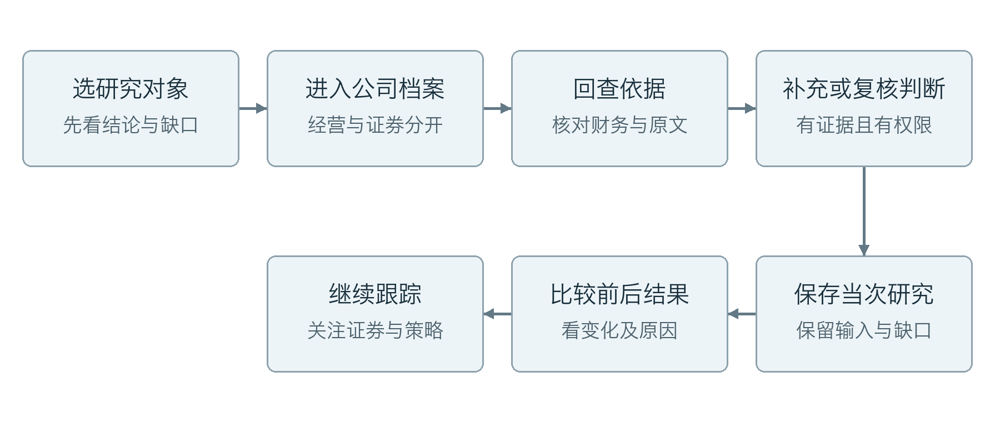
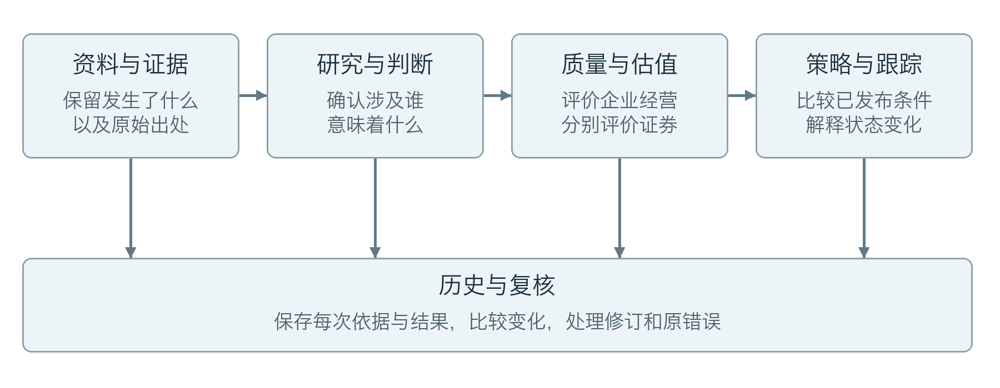
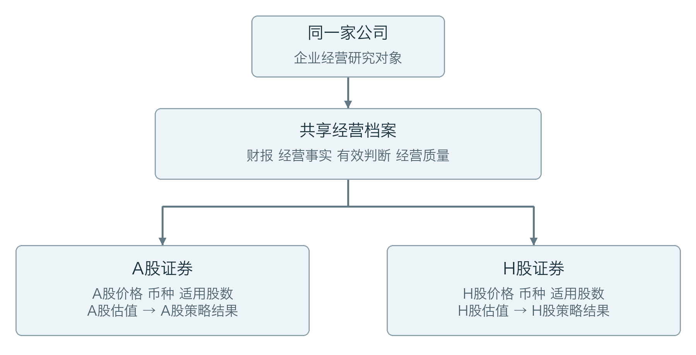
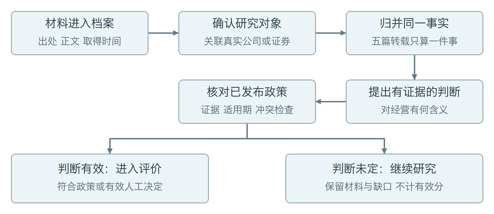
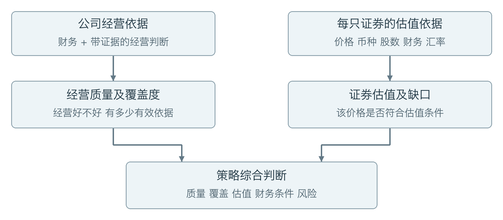
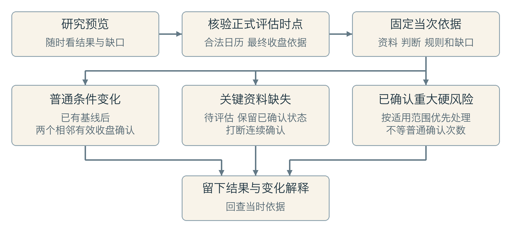

# 需求方报告业务正文 · 0.3

以下九个章节是报告前部的排版正文。图中的业务职责和流程来自已确认设计，示例是合成情景；实际交付程度集中在最后一章说明。图片编号供本地生成器引用，不代表产品截图。

## 01 系统帮助人完成什么工作
研究一家企业，需要把财报、公告、价格和经营判断放在一起。真正困难的往往是：新资料是否改变了原来的判断？某只证券为什么符合或不符合策略？上次结论依据什么，现在又为什么变化？

系统围绕这些问题建立一份可持续更新的研究档案。用户从当前结论出发，可以回到支撑它的原文和数据，看到适用的规则与尚缺的资料，再决定下一步补什么、复核什么、继续跟踪什么。

### 最终交给用户的是一条可解释的研究链
这条链连接“研究对象→资料依据→经营判断→质量和估值→策略结果→变化解释”。每个环节留下可回查的记录。用户看到的不是孤立分数，而是分数为什么成立、哪里还不确定，以及该结论对应什么时点。

### 一次研究结束时，应当说清四件事
企业经营情况如何，这只证券的价格是否符合规则，当前结论还有哪些缺口，以及相较上次发生了什么变化。结果不完整时，系统应给出待补依据和可继续处理的入口；没有依据的部分不填零，也不填一个看似合理的中间分。

## 02 业务架构：五项职责怎样协作
从业务角度看，系统由五项相互衔接的职责组成。它们围绕同一份研究档案工作，分别解决“依据在哪里、如何理解、如何评价、如何跟踪、如何复核”的问题。这不是五套独立软件。

### 资料交给研究的是证据，研究交给评价的是有效判断
资料与证据负责保留出处、正文、报告期和实际取得时间。研究与判断据此确认材料涉及谁、描述了什么、对经营有什么含义。一条判断需要能回到证据，存在歧义或冲突时保留待核实。

### 评价交给跟踪的是结果，跟踪交给用户的是变化解释
经营评价回答企业本身的质量；证券估值回答具体证券在其价格和币种下是否符合条件。策略与跟踪把这些结果同已发布规则比较，记录待确认、已确认或待评估状态，并解释变化原因。

### 历史与复核使前后结果能够比较
每次研究保留当时采用的资料、判断和规则。用户发现变化，可以分辨它来自新财报、新判断、新价格还是新规则；发现原错误，则沿原记录进行更正。旧结果有出处，新结果有原因，这才形成持续研究闭环。

## 03 研究对象：一家公司，可以对应不同证券
“企业是否经营得好”和“这只证券是否符合估值条件”是两个问题。公司是经营研究对象，证券是市场估值及策略跟踪对象；不能把两者合成一个总标签。

### 公司层面共享，证券层面分别判断
同一公司的A股和H股共享企业财报、经营事实与经营判断。但两只证券的价格、报价币种、市场交易日及适用股份口径分别核对。因此，公司质量符合要求时，A股可能符合估值条件，H股仍可能不符合。

资料先关联到真实公司或证券，再形成有出处的事实与判断。行业新闻可能关联多家公司，也可能与任何研究对象都无关；出现公司简称只是线索，不能因此自动认定有经营影响。

### 规则和研究结果也属于档案的一部分
规则定义怎样评价，研究结果保存某个时点按某个规则得到的结论。以后换规则或补材料，会形成新结果，旧结果仍能阅读。遇到行业不适用当前标准模板的公司，系统保留档案和研究材料，等待适用规则，不强行套用分数。

## 04 一份材料怎样成为有效研究依据
材料先进入档案，再处理对象关联、事实归并和判断。摘要可以先阅读；摘要、标题或上游星级本身不能直接变成有效评分依据。

### 先确认发生了什么，再判断意味着什么
公告说“签订订单”，是可定位的事实。是否改善增长持续性，还需看订单规模、兑现条件、时期和现有经营基准。语气积极不等于经营改善；资料矛盾时不能取平均意见凑分。

### 多篇报道可以加强出处，不能把同一件事算多次
同一公司、同一动作和同一事实时期的五篇转载，保留多份证据，只形成一次有效贡献。后续财报已将订单影响纳入经营基准时，旧事件不再叠加，避免重复计算。

### 建议能否生效，由已发布政策判断
系统或AI提出建议，符合已发布政策、证据和适用要求时可以自动生效；不符合则保留待核实和缺口。研究员可按权限修订，有效人工决定在适用期内优先。

## 05 两条评价线怎样汇合
经营质量和证券估值分开计算，最后由策略共同使用。经营好不代表任何价格都合适；价格看起来便宜，也不能弥补关键经营依据缺失或已确认的重大风险。

### 经营质量：既看财务，也看经营依据
企业评价包含盈利质量、财务韧性、商业模式与护城河、治理与资本配置、成长持续性。财务部分按一致口径计算，经营部分使用带证据和适用期的判断。结果同时显示分数和覆盖度；覆盖度说明有多少必要内容具备有效依据。

高分但低覆盖不能当作确定结论。缺少必需项时保留待评估，不补零、不补中间值，也不靠几条利好新闻制造完整经营评分。

### 证券估值：把价格与同口径财务放在一起
每只证券核对其价格、币种、同口径普通股盈利或权益、当前适用股数，以及需要时的同日汇率。报告期末股数不能未经检查就拿来配当前价格；财务数据有效，也不意味着当前估值输入完整。

策略综合经营质量、覆盖度、证券估值、财务条件和风险。关键依据缺失时，档案仍可读，但暂时不能形成有效入选结论，并须说明缺口。

## 06 从研究预览到正式跟踪
研究预览随时检查当前资料和规则；正式结果固定合法市场时点及当时输入、规则和缺口。后来取得的资料不能写成“当时已经知道”。

### 普通变化需要连续确认，第一次先建立基线
已建立基线后，普通进入或退出要求两个相邻、有效的最终收盘时点确认。第一次有效评估先确定基线，不伪造“进入”。进入和保持条件可以不同，减少阈值附近频繁进出。

### 缺数据不是退出，暂停也不伪造新结论
缺关键数据时显示待评估，保留最后确认状态，并打断连续确认。停牌或暂停时保留基线，恢复后重新确认。已有合法日历和评估时点但缺报价时，可以固定一个“未知”正式结果；日历或时点本身不明，则不能固定正式结果。

### 已确认重大风险优先处理
已确认且适用的重大硬风险可以不等普通确认次数，直接按风险规则调整状态。公司级风险可以影响适用的A/H证券；仅某一挂牌市场的风险不能无依据扩大到其他证券。首版保存变化及理由，提醒投递后置。

## 07 用“示例制造”串起完整过程
以下是业务情景示意，使用合成公司与证券，说明设计逻辑；不是真实研究结果，也不是本轮产品运行验收。

### 第一步：收到订单公告，研究员能看什么
“示例制造”发布一笔订单公告，随后出现五篇转载。系统保存公告与报道出处，把它们归到同一个订单事实。用户在公司档案中回查原文，了解订单规模、执行条件和判断理由。若依据尚不足，相关判断保持待核实；依据满足政策时才参与后续评价。

### 第二步：同一公司，A股与H股为何不同
假设企业经营质量已满足规则，其A股估值及其他进入条件均满足，而H股估值不满足。A股原有“区间外”基线：第一个有效最终收盘显示待入选，第二个相邻有效最终收盘仍满足才确认入选。H股继续处于区间外。系统由此给出两份证券结果，共用一份经营依据。

### 第三步：财报到来、行情缺失，系统怎样处理
新财报已经吸收该订单影响，系统不再叠加一次旧订单贡献。之后A股某个应评估日期缺失行情，页面显示待评估、保留最后确认的入选状态；连续确认被打断，不能把缺失日期跳过去接着累计，也不能称这次缺价就是退出。

### 第四步：出现重大风险，用户如何回查
后来确认公司现金流和债务情况达到已发布硬风险条件。系统按公司级适用范围处理证券状态，保存风险变化和证据。用户从变化记录回到原文，能说明“状态因风险而变”，而不是误以为价格波动、转载数量或缺失行情造成了变化。

这一过程最终留下材料、事实、判断、评价和变化的完整来路。用户面对不同结果时，可以找到对应依据并继续研究，而不是只接受一个无法解释的标签。

## 08 人与系统怎样分工，历史怎样保持可信
系统负责整理、校验、计算、比较和记录。人负责维护并发布规则，提供有依据的判断，在需要时修订系统结论。管理员负责获授权的账号与运行配置，不因为管理系统就自动拥有研究判断或规则发布权。

### 规则先解释清楚，再投入正式使用
规则分为通用基础、行业差异、企业差异。企业只补充其特殊部分。调整规则时，先编辑草稿，再模拟并查看哪些公司或证券结果会变化，最后由有权限的人发布新版本。已经发布的研究依据保留，不能随上层草稿修改而悄悄变化。

### 人工修订是新记录，不是擦掉旧记录
研究员修订关联或经营判断时，留下证据、理由和适用期。有效人工覆盖期间，系统的新建议可以保存，但不能压过人工决定。覆盖到期或解除后，系统按当前合法依据重新评价，而不是恢复一条可能已经过时的旧建议。

### 新信息和原错误，走不同的历史处理路径
今天获得新公告，或者形成新判断，应形成新的研究结果；如果发现原数据、映射或计算有错，则检查受影响历史范围，保留“当时记录”和“更正说明”。更正可能影响当前状态，需要沿后续依据核对，不能简单把今天的状态倒回过去。

用户比较两次研究时，应能分辨资料变了、判断变了、价格变了还是规则变了。资料的实际取得时间照实记录，今天新知道的信息不能伪装为过去已知。这些约束让自动处理与人工复核能够共同工作。

## 09 用户怎样日常使用，目前做到哪里
用户从今日概览选择需要跟进的对象，进入公司研究，先看结论和缺口，再回查财务及原文。有研究权限的人补充或修订判断，普通读者阅读与跟进；策略维护者处理规则版本，数据运营处理来源及任务问题。五类职责可以按授权兼任。

### 页面对业务链的支持
公司研究把经营、A/H证券及财务依据放在一起；资讯与研判承接材料阅读和判断；研究快照与策略候选池解释当次结果及变化；个人工作台保留自己的关注和笔记。系统支持负责运行问题。后续六组截图按这条路径排列，当前均为明确占位。

### 当前已能查看部分真实研究，完整闭环仍未交付
项目记录显示，比亚迪、格力、诺诚健华已有部分真实资料与研究预览，财报原始科目合计182项；有22日双币种参考汇率。七项带原文的AI经营建议仍待审、未校准，不计入有效评分；真实外部模型API尚未接通。

港股参考行情接入代码及可选官方组件已有隔离合成验证，但本机行情网关未准备就绪，账户权限、资料使用范围及报价币种依据仍待核实，尚未取得真实港股日线。当前股数、批准日历、最终价格政策和正式结果也仍有缺口，真实正式封存记录为0。

### 下一步以完整用户任务验证，不能用局部检查代替
最新行情接入记录为223项隔离合成库检查通过，属于局部实现证据，不代表用户研究任务、风险纠错、完整必选验收或生产上线通过。本报告未重新运行产品测试，也未连接数据库。

前述业务图描述已确认设计；目前交付程度以上述阶段事实为准。正式截图、完整业务结果、需求方签收和生产报价均保留待补。后部再说明承载这些业务职责的技术架构、生产资源、框架采用依据和费用。
