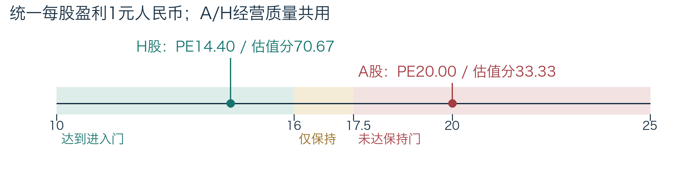
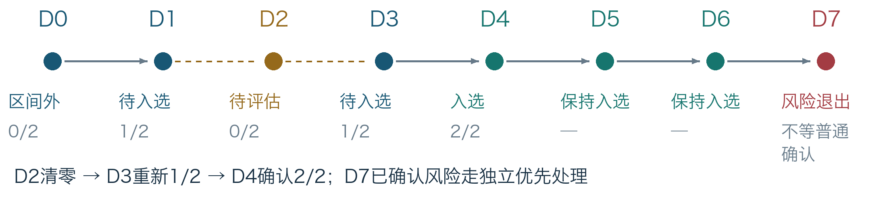

# 价值投资研究系统：业务方案与使用流程

## 1 业务架构：每一步交付什么
系统把研究工作组织成一条链：材料成为证据，证据支撑判断，判断与财务形成经营评价，经营评价与证券估值进入策略，最后把状态变化和原因交给用户。每一步都有明确产物，用户可以沿结果返回原文，也可以沿缺口补资料。

| 环节 | 输入与处理 | 交给下一步的产物 |
| --- | --- | --- |
| 资料与证据 | 接入获准公告、财报PDF、资料文件和行情；保留出处、正文、报告期、取得时间 | 可读原文、财务科目、证券日线及来源记录 |
| 研究与判断 | 确认涉及的公司/证券，归并同一事实，解释经营影响 | 事实记录、有效判断，或待核实问题及缺少的证据 |
| 质量与估值 | 按发布规则计算五维质量；按各证券价格、币种与每股盈利估值 | 公司质量分及覆盖度；每只证券估值及缺口 |
| 策略与跟踪 | 检查行业、质量、估值、财务和风险，连续确认普通变化 | 当次评估、待确认/已确认状态、变化理由 |
| 历史与复核 | 固定当次输入与规则；比较新旧，处理修订或原错误 | 研究快照、差异说明、更正记录及下一步工作 |

这些职责共用一份研究档案。资料不完整时仍可阅读和研究；缺某项依据，只标明受影响的结论，其他有效研究继续进行。

## 2 为什么公司与证券必须分开
公司回答“企业能否持续创造价值”，证券回答“在这个市场、这个价格下是否符合条件”。混在一起，会把好公司等同于任何价格都值得关注，也会把某市场价格变化误认为经营变化。

以下“远景制造 / SYN-A、SYN-H”均为合成演示。假定A/H普通股经济权利相同且已核实，普通股股东TTM盈利10亿元、同权普通股总数10亿股，每股盈利1元人民币。公司经营质量79.0，覆盖度100%。

| 同一经营基础 | A股 | H股 |
| --- | --- | --- |
| 每股盈利，统一人民币口径 | 1.00元 | 1.00元 |
| 证券价格 | 20.00元人民币 | 16.00港元 |
| 演示汇率：1港元=0.90元人民币 | 无需换汇 | 折合14.40元人民币 |
| PE：同币种价格 ÷ 每股盈利 | 20.00倍 | 14.40倍 |
| 示范规则估值分 | 33.33 | 70.67 |
| 其他条件均符合时 | 未达到进入门 | 达到进入门，仍需连续确认 |

示范估值分在PE≤10时为100，PE≥25时为0，中间线性变化。进入要求估值分≥60，对应PE≤16；已入选的保持要求≥50，对应PE≤17.5。演示H股折合人民币价格比A股低28%，这是价格差异描述，不意味着无成本套利。

汇率改变会改变H股估值；股份权利或股数不一致则不能套用比较。交易日历各自处理，不能用A股休市推定港股休市。当前模型按税前PE研究，尚未纳入股息税、交易费用、南向可交易日及通道资格；这些影响个人实际回报与可执行性，后续扩展需另行定义。

## 3 材料怎样变成判断：用一笔订单说明
演示公司上年收入100亿元，公告披露20亿元订单，相当于上年收入20%。这个比例说明值得研究，不直接等于当年收入增加20%：还要读执行期、交付条件和取消条款。

业务上按“公司＋动作＋合同批次/对象＋事实期间”识别同一事实；金额、对手方及履约期交叉核对，标题相似只是线索。五篇转载若都指向同一合同，保留五份出处，归为一个事实。金额或履约期冲突时，相关判断待核实，不合并成貌似确定的数字。

判断进一步回答影响哪个维度、多大、多久。演示有证据的判断按政策生效：尺度10×影响0.5×相关度1×置信度0.8×来源质量1=成长贡献4。该维度权重10%，总分79.0→79.4。参数是演示假设，订单占比不直接换算分数。

同一比较时点，假设吸收前成长基准60、当前事件贡献4，吸收后基准64、事件0，最终仍64，总分仍79.4；不能错算成68。跨日事件贡献会衰减，新财报也可能改变基准。时间线中D1–D5假定事件年龄依次为0至4个自然日，按现有30自然日半衰期计算，D6假定采用新的有效基准64并吸收订单，避免重复计算。

## 4 评价依据：质量、覆盖度和估值各说明什么
经营分衡量企业，覆盖度衡量证据是否足够，估值分衡量证券价格条件。三者并列，避免把高分当完整结论。演示财务和经营档位均具备有效证据，基础分如下。

| 经营维度 | 权重 | 基准分 | 计算/依据 |
| --- | --- | --- | --- |
| 盈利质量 | 25% | 92 | ROE17%对应80分；三年现金/利润1.2和现金流全正各100分，按40%/40%/20%合成 |
| 财务韧性 | 25% | 85 | 净债务/EBITDA=1对应75分；利息覆盖8倍对应100分，按60%/40%合成 |
| 商业模式与护城河 | 25% | 70 | 演示有证据的评价档位；不从新闻语气推导 |
| 治理与资本配置 | 15% | 75 | 演示有适用期的治理依据与评价档位 |
| 成长持续性 | 10% | 60 | 有效经营基准；订单当前贡献+4后为64 |

基础总分：92×25%＋85×25%＋70×25%＋75×15%＋60×10%=79.0。订单贡献增加4×10%=0.4，得到79.4。以上为演示计算；经营档位分是明确假设，不是真实公司评级。

示范进入条件同时要求：经营分≥70、覆盖度≥80%、估值分≥60、ROE≥10%、三年现金/利润≥0.8、净债务/EBITDA≤2，且行业适用、必需依据有效、无已确认重大硬风险。保持条件将经营分和估值分放宽至65、50，其余门槛保持。

若缺商业模式这一必需维度，覆盖度降至75%，剩余资料仍可读，但不能有效入选。普通股盈利非正时PE不适用；股数只核验到旧报告日时，当前估值保留缺口。未知不是0，也不能填中间值。

## 5 全景推演：从订单到风险变化
D0–D6是合成日历中相邻的应评估交易日，假定有合法时点及最终收盘依据；D7是独立风险知悉时点。汇率统一为演示值0.90。日历、许可、模板及输入有效性假定已满足，不代表当前真实运行已完成这些条件。

{{CASE_TIMELINE}}

D2无行情，不能沿用D1价格，也不能等D3恢复后把D1、D3凑成“两次”。D3重新记1/2，D4才完成2/2。若缺价发生在已入选以后，显示待评估，最后确认状态仍保留入选。

D5估值分54.47低于进入门60、高于保持门50，原入选状态继续保持；若原来在区间外，同价不能推进进入。已入选后连续两个相邻有效收盘均不满足保持条件，才确认普通退出。停牌或暂停保留基线，恢复后重新确认。

D7假定发行人原文已证实1亿元到期债务未偿，且债务违约判断按政策生效。它属于现有风险类别，不是临时发明“负债率超过80%”门槛。公司级风险作用于适用A/H：H股风险退出；A股原已在区间外，更新风险说明，不制造重复退出。

## 6 用户怎样操作：看结果、回原文、继续研究
路径是“概览选对象→公司看质量和证券→财务/原文核对→研判补判断→快照比较→策略跟踪”。每一步交给用户具体材料、结果或下一步，避免面对孤立标签。

| 页面 | 用户任务与操作重点 | 产物/下一步 |
| --- | --- | --- |
| 今日概览 | 看对象、最近研究及缺口，选跟进公司 | 进入公司；对象数不等于完整评分覆盖 |
| 公司研究 | 分区看经营、A/H、财务、资料与规则 | 找已具备依据的评价，回查输入 |
| 资讯与研判 | 读原文，核对关联和理由；有权者维护判断 | 生效判断或待核实问题及证据 |
| 研究快照 | 保存/读取当次输入，比较新旧研究 | 说明资料、判断、价格或规则哪项变了 |
| 策略候选池 | 看进入/保持条件、模拟、版本和状态原因 | 正式状态和变化；规则维护按权限 |
| 我的工作台 | 分别关注A/H，记录个人笔记 | 持续跟进与个人研究上下文 |
| 系统支持 | 按职责处理来源、任务或运行问题 | 原因、影响范围和恢复工作 |

本图依据现有七个导航和公司四个栏目组织，未取运行画面。实际截图在页面联调交付时补充；本稿用信息结构和功能指引说明产品，不再用成页空白框占版。

## 7 人机分工：规则、判断和历史分别管理
系统整理、校验、计算、比较和记录；研究员提供判断及修订，策略维护者发布规则，数据运营处理来源，管理员维护授权账号与运行连接。职责可兼任，管理员身份不自动授予研究或发布权。

| 变化 | 处理流程 | 结果与历史影响 |
| --- | --- | --- |
| 新公告/财报 | 固定原文→更新有效依据→新研究 | 从实际知悉时间影响后续，不伪装成过去已知 |
| 人工修订 | 证据、理由、适用期→新判断→重评 | 有效人工覆盖优先；旧研究保留 |
| 规则调整 | 草稿→模拟→影响比较→按权发布 | 通用/行业/企业差异有来源；新旧版本各自保留 |
| 原数据/计算错误 | 定位→检查历史窗口→重放更正 | 保留当时记录及更正说明，核对后续再改当前 |

例：研究员发现订单包含可取消部分，将增长判断改为待核实，系统从新的合法知悉时点移除受影响贡献，说明哪些结果需重算；不能只改前端标签，还让旧+4继续有效。取得合同补充证据后再形成新判断。

模型建议满足已发布政策即可自动生效，证据不足或冲突则待核实。人工覆盖到期/解除后按当前依据重评，不恢复过时建议。首版记录变化与解释，通知后置，不产生交易指令。

## 8 当前进展与交付路径
当前已形成原文、财务整理、证券参考行情、研究预览及主要页面的基础路径，正在补足完整策略评估依据。以下按业务产物说明阶段，不把局部测试数当用户签收。

| 业务产物 | 当前项目记录 | 下一段重点 |
| --- | --- | --- |
| 研究档案 | 比亚迪、格力、诺诚健华已有部分资料；182项原始财务科目可回查 | 完整经营判断与适用行业口径 |
| 证券输入 | 两港股各22条未复权参考日线已接入，已有A股参考日线及22日双币种参考汇率 | 当前股数、正式日历及最终价格政策 |
| 判断与预览 | 七项带原文建议可读，仍待审和校准；研究可固定依据及缺口 | 获准模型路径、校准及有效质量/估值结果 |
| 正式策略/运行 | 相关机制局部实现，完整首版及正式业务验收仍在推进 | 连续状态、风险纠错、用户任务和生产身份/恢复 |

依赖顺序是：完成一家公司及其证券的有效依据→贯通正式结果与变化解释→用需求方日常任务验证多人权限和对外域名访问。完成以可回读结果及用户任务为准；日期由剩余资料取得与联调排期确定。

需求方协同首批对象、使用成员、经营判断与规则负责人、数据用途。IT准备可信登录、生产账号、域名和维护职责；数据许可与人员工作量进入预算。完整研究、正式结果及生产服务的签收记录在交付时补充。
