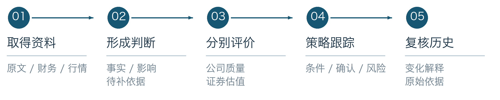
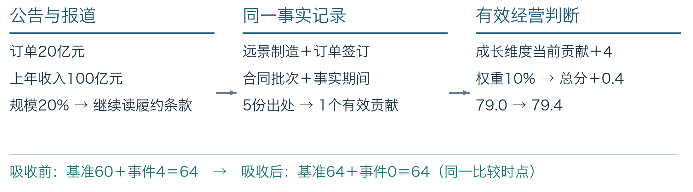
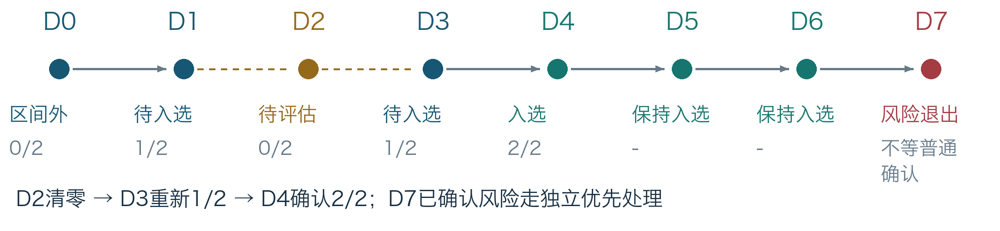
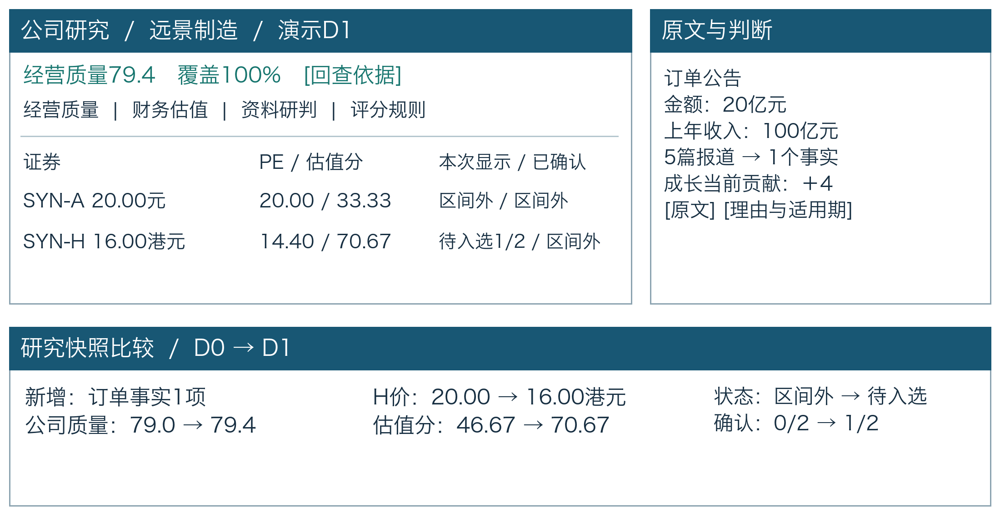

# 价值投资研究系统：业务方案与使用流程

## 1 业务架构：每一步交付什么
系统把研究工作组织成一条链：材料成为证据，证据支撑判断，判断与财务形成经营评价，经营评价与证券估值进入策略，最后把状态变化和原因交给用户。每一步都有明确产物，用户可以沿结果返回原文，也可以沿缺口补资料。

| 环节 | 输入与处理 | 交给下一步的产物 |
| --- | --- | --- |
| 资料与证据 | 接入获准公告、财报PDF、资料文件和行情；保留出处、正文、报告期、取得时间 | 可读原文、财务科目、证券日线及来源记录 |
| 研究与判断 | 确认涉及的公司/证券，归并同一事实，解释经营影响 | 事实记录、有效判断，或待核实问题及缺少的证据 |
| 质量与估值 | 按发布规则计算五维质量；按各证券价格、币种与每股盈利估值 | 公司质量分及覆盖度；每只证券估值及缺口 |
| 策略与跟踪 | 检查行业、质量、估值、财务和风险，连续确认普通变化 | 当次评估、待确认/已确认状态、变化理由 |
| 历史与复核 | 固定当次输入与规则；比较新旧，处理修订或原错误 | 研究快照、差异说明、更正记录及下一步工作 |

这些职责共用一份研究档案。资料不完整时仍可阅读和研究；缺某项依据，只标明受影响的结论，其他有效研究继续进行。

## 2 为什么公司与证券必须分开
公司回答“企业能否持续创造价值”，证券回答“在这个市场、这个价格下是否符合条件”。混在一起，会把好公司等同于任何价格都值得关注，也会把某市场价格变化误认为经营变化。

{{CASE_SETUP}}

| 同一经营基础 | A股 | H股 |
| --- | --- | --- |
| 每股盈利，统一人民币口径 | 1.00元 | 1.00元 |
| 证券价格 | 20.00元人民币 | 16.00港元 |
| 演示汇率：1港元=0.90元人民币 | 无需换汇 | 折合14.40元人民币 |
| PE：同币种价格 ÷ 每股盈利 | 20.00倍 | 14.40倍 |
| 示范规则估值分 | 33.33 | 70.67 |
| 其他条件均符合时 | 未达到进入门 | 达到进入门，仍需连续确认 |

示范估值分在PE≤10时为100，PE≥25时为0，中间线性变化。进入门≥60对应PE≤16，保持门≥50对应PE≤17.5；H股折合人民币价格较A股低28%。

两地资金成本、风险溢价、汇率敞口和投资者结构可能形成持续价差。独立估值让人民币与外币账户分别识别符合自身约束的估值窗口；此处“安全边际”体现为策略估值门，不代表已证明内在价值或可直接套利。

汇率改变会改变H股估值；股份权利或股数不一致则不能套用比较。交易日历各自处理，不能用A股休市推定港股休市。当前模型按税前PE研究，尚未纳入股息税、交易费用、南向可交易日及通道资格；这些影响个人实际回报与可执行性，后续扩展需另行定义。

## 3 材料怎样变成判断：用一笔订单说明
20亿元订单相当于上年收入20%，还需核对执行期、交付和取消条款，再判断经营影响。

同一事实按公司、动作、合同批次/对象和期间归并，核对金额与履约期。五篇转载保留出处，只计一个贡献；来源质量取当前批准的最强可访问证据，冲突待核实。

事件贡献=尺度10×业务影响0.5×相关度1.0×置信度0.8×来源质量1.0=+4.0。成长权重10%使总分79.0→79.4；单维度事件合计限±15分，10为计算尺度。

沙盘由有权限研究员接受：0.5为经营影响强度；0.8反映待执行与可取消的不确定性，非履约概率。1.0分别指直接相关和发行人原文来源等级；转载数量不累加分数。

成长由60＋4变为64＋0；D1-D5按30自然日半衰期衰减，D6财报吸收后停止叠加。

## 4 评价依据：质量、覆盖度和估值各说明什么
经营分衡量企业，覆盖度反映依据完整性，估值分反映价格条件。三者并列，帮助区分企业质量、资料缺口与配置窗口。

| 经营维度 | 权重 | 基准分 | 计算/依据 |
| --- | --- | --- | --- |
| 盈利质量 | 25% | 92 | ROE17%对应80分；三年现金/利润1.2和现金流全正各100分，按40%/40%/20%合成 |
| 财务韧性 | 25% | 85 | 净债务/EBITDA=1对应75分；利息覆盖8倍对应100分，按60%/40%合成 |
| 商业模式与护城河 | 25% | 70 | 演示有证据的评价档位；不从新闻语气推导 |
| 治理与资本配置 | 15% | 75 | 演示有适用期的治理依据与评价档位 |
| 成长持续性 | 10% | 60 | 有效经营基准；订单当前贡献+4后为64 |

基础总分：92×25%＋85×25%＋70×25%＋75×15%＋60×10%=79.0。订单贡献4×10%=0.4，得到79.4；本沙盘各档位均按设定的有效证据计算。

示范进入条件同时要求：经营分≥70、覆盖度≥80%、估值分≥60、ROE≥10%、三年现金/利润≥0.8、净债务/EBITDA≤2，且行业适用、必需依据有效、无已确认重大硬风险。保持条件将经营分和估值分放宽至65、50，其余门槛保持。

商业模式缺失时覆盖75%，研究可继续，正式入选待补。盈利非正则PE不适用，旧报告股数不延用至当前；未知保留缺口，不以0或中间分替代。

## 5 全景推演：从订单到风险变化
D0-D6为沙盘相邻应评估日，D7为独立风险时点。两日确认（Two-Day Confirmation）减少单日波动造成的频繁切换，保持门另提供滞回。

{{CASE_TIMELINE}}

数据缺失中断确认（Interruption Reset）：D2缺价，转入待评估并重置计数；D3重新1/2，D4才完成2/2。确认仅跨两个相邻有效应评估日，D1与D3不能拼接。已入选后缺价，仍保留最后确认的入选基线。

D5估值分54.47低于进入门60、高于保持门50，原入选状态继续保持；若原来在区间外，同价不能推进进入。已入选后连续两个相邻有效收盘均不满足保持条件，才确认普通退出。停牌或暂停保留基线，恢复后重新确认。

硬风险即时否决（Hard Risk Override）：D7发行人原文证实1亿元到期债务未偿，债务违约判断按政策生效，独立于两日确认窗口处理。公司级风险覆盖适用A/H：H股风险退出，A股更新区间外的风险说明，保留统一证据链。

## 6 用户怎样操作：看结果、回原文、继续研究
团队通过三条工作流组织七个页面。行业研究员交付可复核判断，策略负责人审阅变化并维护规则，数据与系统运营维持输入及运行质量。岗位名称对应业务分工，操作仍按实际角色权限控制。

| 工作角色 | 日常工作流 | 交付物与权限 |
| --- | --- | --- |
| 行业研究员 | 今日概览/工作台选对象→公司研究→资讯与研判读原文并维护判断→保存研究快照 | 证据、理由、适用期和快照；研究权限不包含规则发布 |
| 基金经理/策略负责人 | 快照对比查变化→策略候选池审阅条件与两日确认→模拟、比较、按权发布规则 | 状态解释、规则版本和复核意见；修改人工判断需另具研究权限 |
| 数据与系统运营 | 概览核查缺口→系统支持定位来源/任务→获准修复→回查研究输入 | 数据运营管来源与质量，系统管理员管身份和连接；不代替研究判断 |

图按现有导航与公司栏目组织，展示沙盘D1的信息结构；运行截图在联调交付时补充。历史快照用于回看当时依据，规则模拟用于比较固定输入下的配置差异；任意历史反事实演练的完整能力仍待扩展与验收。

## 7 人机分工：规则、判断和历史分别管理
系统整理、校验、计算、比较和记录；研究员提供判断及修订，策略维护者发布规则，数据运营处理来源，管理员维护授权账号与运行连接。职责可兼任，管理员身份不自动授予研究或发布权。

| 变化 | 处理流程 | 结果与历史影响 |
| --- | --- | --- |
| 新公告/财报 | 固定原文→更新有效依据→新研究 | 从实际知悉时间影响后续，不伪装成过去已知 |
| 人工修订 | 证据、理由、适用期→新判断→重评 | 有效人工覆盖优先；旧研究保留 |
| 规则调整 | 草稿→模拟→影响比较→按权发布 | 通用/行业/企业差异有来源；新旧版本各自保留 |
| 原数据/计算错误 | 定位→检查历史窗口→重放更正 | 保留当时记录及更正说明，核对后续再改当前 |

例：研究员取得新材料，发现可取消范围大于沙盘原判断，将成长判断改为待核实；系统从新知悉时点撤去相关贡献并标明重算范围，保留旧研究。取得补充证据后，再按同一判断问题形成新修订。

模型建议满足已发布政策即可自动生效，证据不足或冲突则待核实。人工覆盖到期/解除后按当前依据重评，不恢复过时建议。首版记录变化与解释，通知后置，不产生交易指令。

## 8 当前进展与交付路径
截至2026-10-07核对的项目记录，原文、财务、参考行情、股本输入和研究预览已贯通基础路径，正在补足正式策略依据。下一阶段以一家公司及其证券的完整研究结果作为业务验收单元。

| 业务产物 | 当前项目记录 | 下一段重点 |
| --- | --- | --- |
| 研究档案 | 比亚迪、格力、诺诚健华已有部分资料；182项原始财务科目可回查 | 完整经营判断与适用行业口径 |
| 证券输入 | 两港股各22条参考日线、A股行情及22日双币种参考汇率；独立股本输入已接入 | 当前连续股数覆盖、港股最终时点及截止内汇率 |
| 判断与预览 | 固定研究已读28份资料，七项带原文建议待审；快照保留依据与缺口 | 经营判断校准、生效及有效质量/估值结果 |
| 正式策略/运行 | 深市四个计划日与两项待完成任务已准备；正式封存尚待输入闭合 | 实际日终验证、完整状态路径及生产身份/恢复 |

依赖顺序是：完成一家公司及其证券的有效依据→贯通正式结果与变化解释→用需求方日常任务验证多人权限和对外域名访问。完成以可回读结果及用户任务为准；日期由剩余资料取得与联调排期确定。

需求方协同首批对象、使用成员、经营判断与规则负责人、数据用途。IT准备可信登录、生产账号、域名和维护职责；数据许可与人员工作量进入预算。完整研究、正式结果及生产服务的签收记录在交付时补充。
