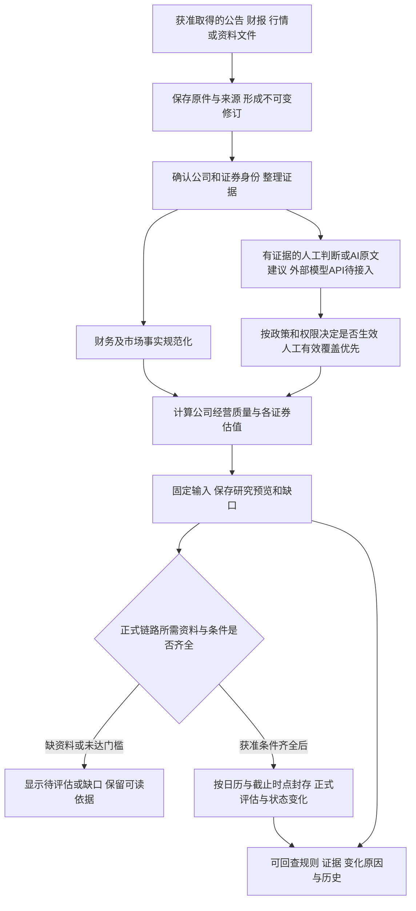
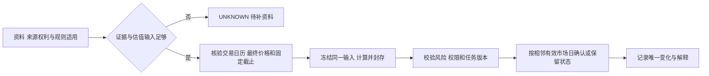
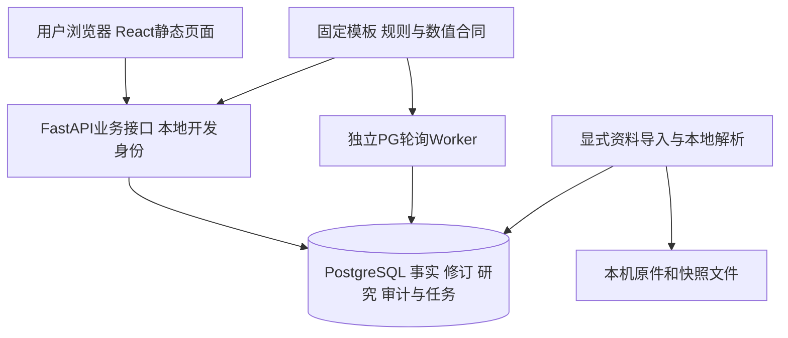
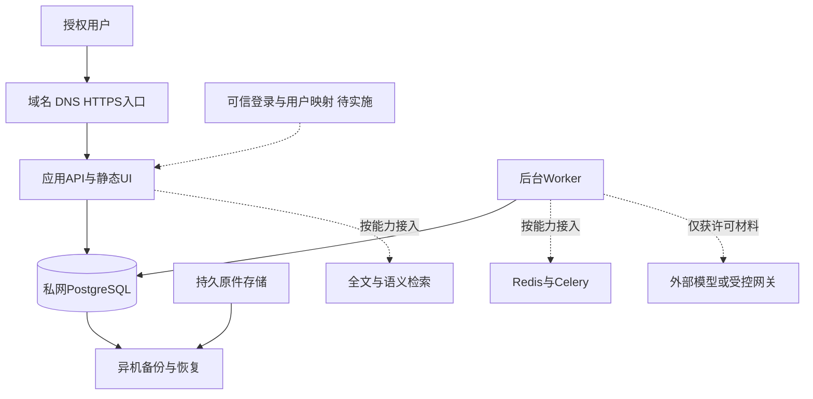

# 价值投资研究系统：业务方案、系统说明与阶段进展

**正文底稿 · 2026-10-06 · 系统开发中，全部必选验收尚未完成**

这是图文报告的内容底稿。S-01…12采用明确占位，未采集系统截图，不能作为功能通过证据。结构/分镜见[报告方案](../../docs/20-stakeholder-report-design.md)，技术与费用附件见[框架费用表](./frameworks-and-costs.md)。本轮制作用到的读取基线为 `6f231481128330576219b3919fd453fafba963f1`；交付前回读发现并同步[最新缺口续建](../../review/REAL-GAP-CLOSURE.md)，[前轮三公司记录](../../review/REAL-DATA-AND-JUDGMENTS.md)保留为历史。定稿时再次更新版本和日期。

## 1. 系统要解决的问题

公司研究通常同时依赖公告、财报、行情与研究判断。资料分散时，容易出现来源难回查、同一信息反复整理、不同口径混用，以及无法解释“当时为什么得出这个结论”的情况。

本系统把资料、证据、判断、评分和策略结果连接起来：用户可以先看当前状态与缺口，再回到原文核对，补充有依据的判断，保存当次研究结果，并比较历史变化。每个结论尽量回答“依据是什么、适用什么时期、采用什么规则、哪些资料仍缺”。预期改进是减少重复整理和提高可解释性；时间节约、准确率或投资收益没有业务实测，报告不填虚构百分比。

系统定位是研究与策略管理。公司经营质量与A/H证券估值分别处理；策略变化属于研究提示，当前不产生交易指令。自动交易、券商接入、真实持仓管理不属于首期范围。通知后置，先完整记录状态变化和解释。

## 2. 谁使用、有哪些系统功能

业务端与管理端共享一套界面和权限体系，下表是功能区域，不是七个独立应用或微服务。

| 主要页面 | 谁使用（按权限） | 使用目的 | 用户下一步 | 当前说明/截图位置 |
|---|---|---|---|---|
| 今日概览 | 有研究读取权限的成员 | 看公司、关键缺口和最近研究 | 进入公司，确定今天先研究什么 | S-01待采集；能看到对象不代表其完整评分已经完成 |
| 公司研究 | 研究读者、研究员；模板维护按授权 | 看经营质量、A/H证券、财务/原文、评分规则 | 回查依据，补充经营判断 | S-02/03/04/09待采集；公司经营与证券估值分别展示 |
| 资讯与研判 | 研究读者阅读、研究员录入 | 阅读资料，查看/录入有证据的判断 | 将原文事实转为适用时期的研判 | S-05/06待采集；不能只凭标题或上游评级形成有效分数 |
| 研究快照 | 有读取权限的成员；生成按授权 | 保存/阅读当次固定输入和结果，比较历史 | 理解新资料和判断带来的变化 | S-07待采集；当前真实研究仍有未完成阶段 |
| 策略候选池 | 有读取权限的成员；策略维护者维护/发布 | 查看策略、模拟/版本、正式评估与变化 | 在有权限时维护和发布规则 | S-08待采集；当前没有真实正式封存结果，不把预览写成正式入选 |
| 我的工作台 | 获授权的本人 | 管自己的自选和研究笔记 | 持续跟进关注的公司/证券 | S-10待采集；A/H自选独立，私人内容有可见权范围 |
| 系统支持 | 数据运营、管理员，分别按职责授权 | 查看来源、任务和运行故障 | 由有权人员恢复任务、核查运行 | S-11待采集；管理员不自动拥有研判或策略发布权限 |

角色分为研究读者、研究员、策略维护者、数据运营和管理员。读者阅读与跟进，研究员维护有依据的判断，策略维护者维护/模拟/发布规则，数据运营处理源与任务，管理员管理账号与系统连接。五角色可兼任是已确认的目标要求，当前本地权限路径有验证，完整角色分配/兼任及生产身份仍需完成验收。

### F-01 用户研究路径

本图说明用户路径；部分动作需要相应权限和合法资料。最终截图采用已有记录只读采集，不为报告在真实库创建新结果。

## 3. 当前进展与尚未完成的部分

以下状态来自项目记录和源码，未在本轮重新运行产品测试或实时数据库检查。

| 范围 | 当前记录的进展 | 仍需补齐/不能据此推断 |
|---|---|---|
| 公司与证券 | 比亚迪、格力、诺诚健华三家公司有可读资料；09969为新增港股证券 | 不代表全市场已接入；新增公司未自动加入其A股 |
| 原两家财务 | 8份原报告、100项原始科目，两家各23项标准财务事实；五项财务指标有复算/回读记录 | 100项不包含新增公司；总经营质量仍缺商业模式、治理、成长等研判 |
| 09969 | 四份法定财报82项原值、23项标准事实及4项有效指标有真实回读；港股PDF以固定pdfplumber版本重核 | 财务韧性可算；三年现金转换率因合计利润非正不适用，盈利质量仍UNKNOWN；生物医药专用模板未发布 |
| 最新资料与AI建议 | 三公司原始财务科目共182项；原两家近30天A股参考日线更新；7项固定原文AI经营建议可读 | 建议为pending且未校准，不计入评分；无新外部模型API调用，不将建议数当有效判断数 |
| 行情/估值 | 有原两家A股参考日线；22日ECB双币种参考FX已接入；股数口径和时效门已实现 | 当前股份覆盖、真实港股价格、同日行情/FX匹配、最终收盘政策仍缺；ECB不等同香港收盘时点汇率 |
| 策略与封存 | 模拟/发布绑定和封存机制有局部/合成验证；真实接口可显示状态 | 真实seal=0，研究partial；没有批准日历和FINAL依据不能生成正式状态 |
| 运行与界面 | 最新续建记录194项后端隔离合成库检查、构建、真实API/原文/幂等/旧hash/权限通过 | 前轮181及文案两模块19属于历史范围，不与194相加。本轮只制作报告，未重跑产品测试；用户签收、恢复、风险/纠错/Excel等必选仍未完成 |
| 生产与外部能力 | 当前本地研究版本；外部模型能力已确认在设计中 | 可信生产登录、生产部署、真实外部模型调用、通知/交易均未完成/执行 |

当前EODHD令牌已生效，但项目实际支持市场/身份调用未取得港交所挂牌，真实港股未取得；“全球套餐”不能当作港股可用性证据，也不据此建议付费升级。来源许可仍以本地研究范围为主，生产托管/多人使用需核实。[财务续建](../../review/REAL-FINANCIAL-CONTINUATION.md)、[新增公司](../../review/COMPANY-09969-ADDITION.md)、[版本验证](../../versions/v0.0.1/VERIFICATION.md)。

## 4. 主要业务逻辑与流程

### F-02 资料如何形成研究结果

这是总体业务设计图。当前真实主路径完成了资料阅读、部分标准财务、7项待审AI原文建议、研判入口和固定研究预览；外部模型API调用、完整正式封存与全部风险/纠错等仍有未完成项，图中的后续路径不计作已交付。

### 六条需求方需要理解的规则

| 规则 | 用业务语言解释 | 对结果的影响 |
|---|---|---|
| 公司与证券分开 | 一家公司的经营资料可以共享，A/H不同挂牌的价格、币种和估值独立 | 不能将A/H价格加在一起形成某一证券的估值 |
| 证据与判断分开 | 原文记录说了什么，判断记录它意味着什么 | 模型/上游摘要不是自动成立的事实或分数；原文不足时保留待复核 |
| 未知不是零或否定 | 没有资料无法确认，不等于公司差或策略不符合 | 高分但低覆盖不能当作确定候选；缺数必须说明 |
| 规则与人工负责 | 基础→行业→企业模板固定来源；策略由有权人员发布 | 生物医药等需适用规则；未发布专门模板不冒充已定制 |
| 历史固定且有时间边界 | 保留当次已知资料、有效时期、规则和结果 | 今天取得的财报不能回填成过去已经知道；新研究不覆盖旧快照 |
| 预览与正式状态分开 | 预览供研究检查；正式状态依赖已批准行情/日历/质量门与确认机制 | 参考价格和未封存结果不能直接写成正式进入/退出策略 |

自动接受政策可使满足证据、适用性和阈值条件的合法建议生效；有效人工覆盖优先。不采用统一的“所有AI判断必须逐项人工批准”新门槛，也不让模型自行发布模板/策略。完整要求见[11](../../docs/11-templates-automation-and-roles.md)。

### F-05 正式结果的条件（目标流程）

尚未通过真实完整正式链路验收。重复处理不能重复生效，暂停/风险/缺数据有各自处理，A/H按各市场交易日计算；内部租约和事务细节放入技术附件。[12](../../docs/12-time-numerics-and-corrections.md)、T-14/31/43。

## 5. 系统怎样运行、为何采用当前架构

### F-03 当前实现架构

当前采用模块化单体：业务模块职责分开，部署先保持少量服务。React负责页面，FastAPI负责统一接口，PostgreSQL负责可靠事实与事务，Worker处理需要重试的后台效果；不同页面复用数据和规则，前端不另算策略。资料处理使用Python SDK/解析生态，金额与比率按固定十进制合同处理。这些理由比“市场流行”更直接对应本项目需求。

### F-04 生产部署与后续接入

本图是目标配置，尚未部署。检索/队列/对象存储需要时实施，可信登录是公网发布前置条件。正式上线的资源和恢复选择见[19](../../docs/19-production-resources-and-configuration.md)及当前费用附件；19的历史数据规模/令牌状态不替代本报告最新进展。

若另行选择Java，Spring Boot/Security可承接API与身份，PostgreSQL、域名、TLS、存储和备份仍可沿用。JVM资源、源码/数据适配、事务、接口与业务测试需迁移验证；并非只换启动命令。当前没有实施Java迁移，相关费用作为可选方案，不与Python现状叠加。

## 6. 组件与费用如何看

主要框架的标准开源发行版在适用条件内通常无按用户数或API次数的软件授权费。生产运行仍需计算、数据库、磁盘、备份、出口、身份运维和监控；数据服务、外部模型和研发维护单独计费。开源授权费为0不等于整套系统免费。

按框架和平台层级整理的作用、采用理由、许可/服务费和状态见[框架与费用附件](./frameworks-and-costs.md)，底层依赖核查保留内部记录。总预算同时列一次性建设/迁移和持续运行，不用单一云主机价格代表整套系统成本。尚未选定数据/模型或未取账单的项保持待核实，不计为0。

## 7. 下一阶段建议与需求方参与

| 交付方向 | 需要完成的结果 | 如何判断完成 |
|---|---|---|
| 补足真实研究依据 | 当前股份、经营判断、港股价格与已接参考FX的同日匹配及适用模板 | 固定真实原文与口径可回查，缺口不被合成值代填；参考FX不冒充香港收盘时点汇率 |
| 完整正式闭环 | 批准日历/FINAL/封存、风险与纠错/恢复等必选 | 依原R/W/T验收及业务回读，不能只凭build/health通过 |
| 用户可用性与签收 | 核心阅读/研判/历史/策略任务连贯，角色与失败状态清楚 | 目标用户按既定T-UX任务验证；当前自动浏览器结果不替代签收 |
| 生产候选与远程访问 | 真实身份、部署制品/配置、来源使用权、备份恢复和运行监测 | 权限负例、真实业务路径与恢复目标有实测，获准后才上线 |
| 图文报告定稿 | 固定版本实际截图、官方费用与内容更新 | 图文状态一致、金额可复算、材料可见权确认、本地逐页检查 |

需求方后续参与：确定首批研究对象和使用成员、经营判断/模板维护责任、允许的数据服务/预算、部署地区和账号体系，以及可接受维护窗口。已确认的多人/三层模板/自动判断与人工覆盖/通知后置等不重新当作未决问题；新采购与实施范围分别确认。当前先完成报告方案和底稿，不向需求方发送文件或作交付承诺。
