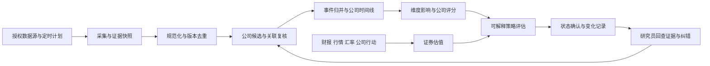
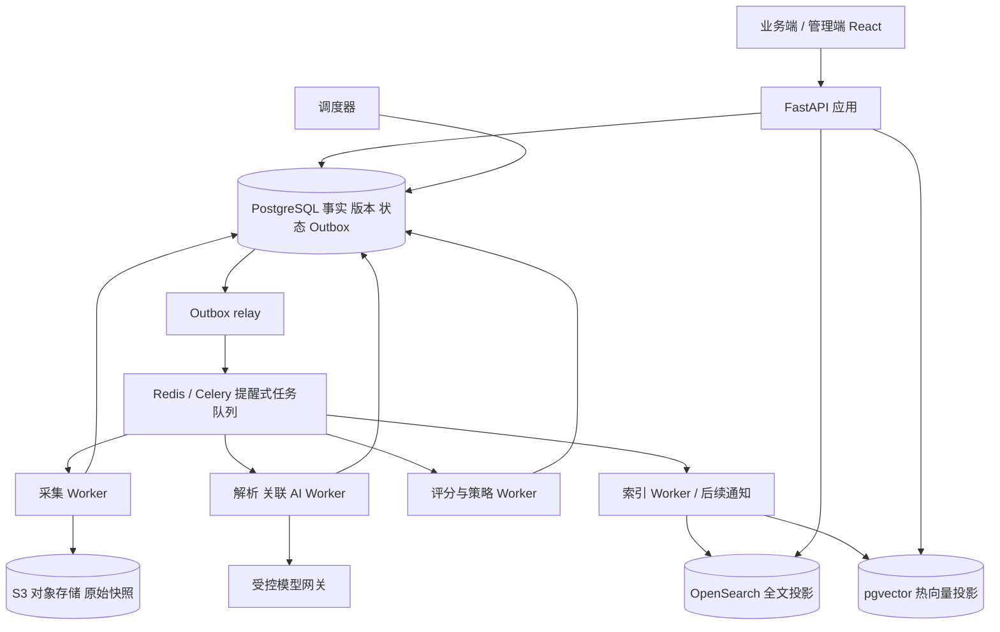

# 价值投资策略管理系统 v0.2 · GPT Pro 整包评审材料

日期：2026-09-30。产品范围已确认，工程设计尚未实现。只含本次新生成设计、合成例子及材料检查。

请对照随附提示词完整审查；不能从材料检查通过推导运行时已通过。

## 文件目录与 SHA-256

| 文件 | SHA-256 |
|---|---|
| `README.md` | `a01095ecc1f1b5ad674b502a5bebe7e12512db6c74f400edf8a4e70cdca569ef` |
| `CONTEXT.md` | `0c6d164424ccc9184c66d88c2af2077e06d86444825e8940b241c2d4943db861` |
| `AGENTS.md` | `1f724380063649968b06b590e877ec4bc7c4483a2878bfa3aa1f7a1e82d390f9` |
| `docs/01-product-requirements.md` | `cb85a2b066a818e07c36bd2464f8317e4bf61f71c6f025f8af136297b011c322` |
| `docs/02-business-design.md` | `5752b1fa3f6f574a9d218b6cee996966f83d718b01853d78a51616adcf2b18b6` |
| `docs/03-architecture.md` | `426255db88215f35ada8c11f13c49bc19757102703c363ff1602bb1d184f32c9` |
| `docs/04-data-design.md` | `b07d5e211ce5ae322f99f909d2a4cd825810587d2b82c305066a6d201e439528` |
| `docs/05-api-and-jobs.md` | `73105ce6405fe5c4c674aa52e94c2f40e3f04b62c089a488ade99a201325414a` |
| `docs/06-ux-and-design-system.md` | `a0b0ef7133761dbdf7c5be56e4abbbf4642cdc85e2c64952c9fcf2e5e7c21818` |
| `docs/07-ai-and-retrieval.md` | `885ca0fdc8571984584110da9347ec9591be590f119a49e930fb3383fb088e78` |
| `docs/08-security-and-operations.md` | `b5520c442da8506010dfd5d86a388feabdd445c6228baa0a92526b3de316a737` |
| `docs/09-delivery-plan.md` | `d7b7e8268219ea843eff720b5d4c6c67c59f61b999d17c448c27f543d77fc750` |
| `docs/10-acceptance.md` | `afe7cbc8f6eaa691d56413e30f6cb87a770768cae7eb3c98951885d1ab132d0e` |
| `docs/11-templates-automation-and-roles.md` | `95dbc3aab47c53d4dc3dec02b623e028006b6c7dbadd9e2b10d8b12fecd8d791` |
| `docs/12-time-numerics-and-corrections.md` | `91ab6b98b89147b39ad06a2cdc55bee3531c97eb1e90d0800591c44d071be6bd` |
| `docs/13-first-slice.md` | `f52dd59535ad55964edbbe9ae0a4f07179d0154ec17bc129bf63e6f20d56908a` |
| `docs/adr/0001-architecture-and-truth.md` | `12c39bcb255d2f9280fd14606a90a01c531f0b78def2e2e33affa9dfbb4b0ec1` |
| `docs/adr/0002-v02-confirmed-scope.md` | `134096110f0001c303549952ee39c1ef3d6aedc21affbc11a44fc8e6391b36f4` |
| `research/open-source-shortlist.md` | `010e0cd633d17dcaf85fd0ca5af1b6a81e2cbbf5a75e0b099c8a719f70c16fe0` |
| `research/second-review.md` | `0e047782fc9850966545482db258af67f3e99cd55c46ae7afe5f0ff368c7076c` |
| `config/auto-review-policy-v1.json` | `4a350149c468d9cd5886d0d4e722ecc85db623e44cd158ccbaba01dfd3cf33cb` |
| `config/metric-definitions-v2.json` | `6e605de1702f71db3f3cab1e4b06ec3d8f801d65753858b22cb29a1bfe425d3b` |
| `config/numeric-policy-v1.json` | `f7f143287bceb0af3e828139cf544331d704a39e545d41f34762ade3c0eeff27` |
| `config/roles-standard-v1.json` | `98c6db5fa0bf0483aedd916ba6e4d288786a69a9f90ad7216d7c5af61f6e7996` |
| `config/rubrics-standard-v1.json` | `b70601e451a88481151818ff7d8f78511783720982a13ab056d66d8d49086348` |
| `config/scoring-standard-v1.json` | `e62aeb17948d03374a0a4bff46d6a80b8a5efc2afa4aead5153fefc6a42eb12d` |
| `config/strategy-standard-v1.json` | `139f5c5fcf911877081b1f9390254464fe8cea9ad5478ace35bdebfe1951c05c` |
| `config/templates-standard-v1.json` | `64e82b63be04d39d909d9636f431ed2b90850c4e568e4dd4951d10778155fc47` |
| `contracts/README.md` | `dc8473270c7745f5179ec0b7667473243e8027e2e076c6e59f8d4089bdb355bd` |
| `contracts/analysis-result.schema.json` | `def05c6c2a563b82f98d0713f7172d53e2ba6fcc42146f474957cea2e893a7df` |
| `contracts/job-event.schema.json` | `43d571bd780ad709646c98abd95d77cc303ecfea291fe354b316d3aaf9223b31` |
| `contracts/review-decision.schema.json` | `04768e3b8d4f123dfe88afa1ef4e6a86343394ccf6370f7b905df20848879b0b` |
| `contracts/scoring-template.schema.json` | `40f936015179660f6ffe3e189d92f7116b6ee7a38e71238756a9426bc6799bf2` |
| `contracts/scoring.schema.json` | `121be579c10aec6c8981488edb44b5f8188b22c034bd4323c51e78ba76eee60b` |
| `contracts/strategy.schema.json` | `51a94929a844f0ba3f54832d8efbc2363f515ce188708c3439199b02ae6a87e4` |
| `examples/analysis-proposal.json` | `43d0e83ce5a4d9b4e3c854c09e91d3c08109ef2215f54d502085738fd77d02b3` |
| `examples/auto-decision.json` | `f7611e2d367c10a6a130416b233069e43b489b23dfcf346937827a87a172df3e` |
| `examples/human-override.json` | `5beb97d90389975d083f8db587e80281458d0010a39edc32ed667147340a3590` |
| `examples/job-event.json` | `b7123ee7ff0cbfd4b7ee7f2d0223dce56b418e0c84ee718df626177f6b288970` |
| `examples/state-machine-cases.json` | `9b8497164132a60b1f21fa879658854f4ff3c160e430859dde091501bdd49453` |
| `examples/v02-boundary-cases.json` | `fc965037233a77ff28b5424a0fb18d99db5f7e9c0e974ab01e748d51240be268` |
| `tools/build_review_pack.py` | `7488e86c07dcb27143bf0cff963adaa1562d82a232a56ddad68afde2a9d71e06` |
| `tools/material_schema.py` | `f55b5a27f75d8b95e8bbe93153466afd2c82070331f4765aa30690c9122a168a` |
| `tools/validate_design.py` | `973db474cb84dd256bb2f4216022542882b40c3ad0796532b5fcdb0620ce3ac7` |
| `review/GPT-PRO-PROMPT.md` | `15c832d4bfe230ccc7e63ecbd8044f27398dbe5c5685a4c05bf7c8865cc632c2` |
| `review/V02-CHANGELOG.md` | `2a09c862a2a27be6916dde8c0640c0395d3da8c3438fb6626212c72931449c74` |
| `review/validation-result.json` | `36a3193249609dabcdb94cb8485718f2e147d18c6cb0649a2ea9194104cee4df` |


---

# 文件：README.md

# 价值投资策略管理系统

> 设计基线 v0.2 · 2026-09-30 · A 股与港股 · 用户范围已确认，工程设计待实施验证

从定时采集到公司研究、可解释评分、策略筛选及状态提醒的一套系统。优先建立可信、可恢复、可维护的流程和工程基础；价投规则提供可替换的标准版本，不承诺预测或收益。本仓库当前交付设计与可检查合同，不含可运行产品。

## 用户路径

今天发生了什么 → 哪家公司受到什么影响 → 依据在哪里 → 公司质量与证券估值发生什么变化 → 是否进入策略区间 → 为什么发生变化 → 人工覆盖与维护规则。

管理端处理数据源、身份映射、人工审查、规则版本、运行故障与审计；业务端专注候选池、公司档案、时间线、评分解释、策略与变化记录；通知后置。两端复用设计系统，不把后台技术字段直接塞给研究人员。

## 文档导航

| 文档 | 用途 |
|---|---|
| [领域词汇](./CONTEXT.md) | 公司／证券、讯息／事件、关联／影响、策略状态的统一定义 |
| [01 产品需求](./docs/01-product-requirements.md) | 目标、范围、角色、需求 ID、容量和质量目标 |
| [02 业务设计](./docs/02-business-design.md) | 主流程、评分数学口径、标准策略与状态机 |
| [03 工程架构](./docs/03-architecture.md) | 模块、技术栈、异步管道、部署与扩展取舍 |
| [04 数据设计](./docs/04-data-design.md) | 实体、时间语义、版本、约束与索引 |
| [05 API 与任务合同](./docs/05-api-and-jobs.md) | 接口、错误、并发、事务及重放 |
| [06 UX 与设计系统](./docs/06-ux-and-design-system.md) | 信息架构、关键页面、交互状态、一致性与可用性验收 |
| [07 AI 与检索](./docs/07-ai-and-retrieval.md) | 候选召回、关联、证据、模型评估与混合检索 |
| [08 安全与运维](./docs/08-security-and-operations.md) | 权限、来源边界、运维、可观测性与恢复 |
| [09 交付计划](./docs/09-delivery-plan.md) | 纵向切片、依赖、里程碑、风险、人员与预算假设 |
| [10 验收矩阵](./docs/10-acceptance.md) | 需求—设计—任务—验证追踪与真实通过标准 |
| [11 模板、自动审核与权限](./docs/11-templates-automation-and-roles.md) | 已确认边界、三层继承、判断生效/人工覆盖和RBAC |
| [12 时点、数值与纠错](./docs/12-time-numerics-and-corrections.md) | 财务口径、FINAL、相邻session、恢复与更正 |
| [13 首个开发切片](./docs/13-first-slice.md) | 可开始实施的合成全流程任务书，尚未开发 |
| [范围变更决策](./docs/adr/0002-v02-confirmed-scope.md) | 用户确认与技术修订，保留旧决策历史 |
| [标准策略](./config/strategy-standard-v1.json) | 人可维护的初始版本；与策略 JSON Schema 对照 |
| [合同目录](./contracts/README.md) | 策略、分析结果、异步事件的机器可检查合同 |
| [GPT Pro 提示词](./review/GPT-PRO-PROMPT.md) | 独立审查和生成改进版的完整指令 |
| [整包评审材料](./review/REVIEW-PACK.md) | 完整单文件上下文，可读 GitHub 或粘贴正文 |
| [开源初步候选](./research/open-source-shortlist.md) / [第二轮核查](./research/second-review.md) | 固定源码核查、候选取舍与边界，尚未集成 |
| [v0.2变更账本](./review/V02-CHANGELOG.md) | 原需求、Pro可见反馈、独立研究到当前设计的映射 |
| [不附文件的使用方式](./review/PASTE-INSTRUCTIONS.md) | 私有 GitHub 直读提示词、完整正文及分段复制入口 |

## 当前授权与状态

已确认：A/H、完整流程及技术框架优先、多人角色权限、三层评分模板、自动审核按规则生效/人工覆盖、允许外部模型、开发不设固定预算、通知后置；管理端与业务端、桌面完整操作/手机轻量处理、提交当前个人账号私有GitHub。完整决定见11。用户未要求本阶段部署、真实采集、外部模型调用、真实通知或交易。

技术、评分阈值、容量、SLO 与工期为建议基线，尚未得到实施验收。首批供应商/权利、运行环境、真实接入责任人仍待上线前选择，不阻止设计和合成开发；固定预算与“是否支持多人”不再列为未决。文档中的测试是验收设计；只有 `review/validation-result.json` 记录的本地材料检查是本阶段已运行检查。数据库、API、UI、性能与灾备功能均未实现和未验证。

## 材料验证

```sh
python3 tools/build_review_pack.py
python3 tools/validate_design.py
python3 tools/build_review_pack.py
```

工具只读设计文件、生成评审包与材料检查结果，不连接数据库或外部平台。校验不能替代系统验收。设计修改后重新生成整包；仓库不保存真实平台内容、持仓、密钥或账号资料。不声明开源许可，公开和实施另行决策。

本v0.2由当前会话按用户已确认范围独立修订，使用Pro共享页可见评审正文与第二轮研究；未获取其完整60文件包。旧v0.1可在Git历史`8b9d9de36d197b1932c4102cc98888d224984085`查看。config文件名中的v1表示第一套标准配置，不表示设计仍为v0.1；当前配置Schema已升级2.0，指标定义另有v2引用，未曾发布运行产品。

合同新增评分配置、分层模板与审核决策Schema。材料工具包含形状/引用/语义与反例检查，仍不是完整draft-2020-12实现或应用状态机测试。


---

# 文件：CONTEXT.md

# 价值投资研究与策略监控领域

本词汇表定义研究系统中的业务对象。公司经营判断、证券价格判断和策略监控状态各自独立。

## 研究对象

**公司（Company）**：有独立身份的经营主体；A 股和 H 股可以对应同一公司。避免：股票、证券。

**证券（Security）**：公司发行的特定股权工具；A/H是不同证券，首版每只证券绑定一个主要挂牌柜台。避免：公司、股票代码作为公司 ID。

**讯息（Information item）**：某来源发布的一份材料，例如公告、文章、财报；同一事实可以被多份讯息转述。避免：事件。

**事件（Event）**：发生在现实世界、可以被多份讯息支持或反驳的同一变化或事实主张。避免：新闻条数。

**证据（Evidence）**：支持一项主张的可定位原文、表格单元或数据观测。避免：无出处的模型结论。

## 判断

**关联度（Relevance）**：讯息或事件对某公司的直接性与实质相关程度。避免：影响方向、利好程度。

**关联置信度（Link confidence）**：公司关联判断可信程度。避免：关联度。

**影响值（Impact）**：某事件对某公司某维度的方向、强度与持续性判断。避免：关联度、涨跌预测。

**公司维度评分（Company dimension score）**：在给定时间、口径和版本下，对公司经营或商业特征的解释性评价。避免：证券估值分。

**证券估值评分（Security valuation score）**：基于某证券的价格、币种、财务与股份口径形成的估值评价。避免：公司综合分。

**评分覆盖度（Coverage）**：所需维度中有有效证据的加权比例。避免：模型置信度。

## 策略

**策略版本（Strategy version）**：人维护的一组固定筛选条件、阈值与状态规则。避免：自动生成且悄然生效的策略。

**策略区间（Strategy range）**：满足该策略条件的证券候选集合；区间可以由多维条件共同定义。避免：单一股价区间。

**策略评估（Strategy evaluation）**：某证券在给定数据快照和策略版本下对每条规则的判断及最终状态。避免：交易指令。

**状态转移（Transition）**：同一策略版本下某证券从已确认状态转向另一个状态。避免：每次刷新都产生的新告警。

**提醒／告警（Notification）**：由已确认状态转移或重大风险引起、面向订阅人的研究提示。避免：收益承诺、买卖指令。

**挂牌（Listing）**：证券在某交易所/币种柜台的报价与交易身份；首版只使用明确primary listing，membership仍为security粒度。

**有效评分配置（Effective scoring config）**：固定base→industry→company父链解析后的完整配置，含字段来源与hash。企业分数比较必须展示口径。

**有效判断（Accepted decision）**：独立DecisionService按政策AUTO接受或有权限人员HUMAN确认/覆盖的判断；不是模型proposal自我批准。

**策略变化记录（Change record）**：不可变状态转移、配置重分类或纠错及其解释，首版可查看；通知是后续面向收件人的投递，不是产生变化的前提。


---

# 文件：AGENTS.md

# 价值投资系统实现协作规则

本仓库当前是 v0.2 设计基线（范围已确认，产品未实现）。先读 README、CONTEXT、与任务对应的 docs、contracts 和验收矩阵；未经用户授权不把设计任务扩大为部署、真实采集、模型外传、真实告警或交易。用户 scope 优先，技术细节可在已授权 slice 内自主决定。

- 保持 R/W/T 稳定追踪；设计、已实现、已验证分别记录。实现前固定本 slice 的正常、失败、边界、权限与恢复预期；不能更改预期掩盖缺陷。
- company 与 security 独立；A/H 分开估值与策略评估。严格使用有效时间与系统知识截止时间；不可变修订与已发布版本不覆写。
- 业务状态、审计、outbox 在同一事务提交；至少一次任务以 ledger/唯一键/lease fencing 保证效果幂等；外部发送结果未知不能盲重试。
- 模型proposal必须有本输入证据、受限候选与Schema；DecisionService按已发布政策可自动接受关联、影响、rubric和硬风险，人工有效覆盖优先。模板/策略仍由人发布。检索投影不是事实或权限真源；ACL 撤权即禁读。
- 采用共享设计系统，完整页面状态、可访问性与真实用户任务；前端不另实现策略计算。类型合同与生成客户端必须同源。
- 数据库写前验证服务器位置、环境、数据分类与范围；仅项目隔离且无真实数据的本地测试库可以按已授权开发任务写入。远程、生产、真实业务或未知数据库保持只读直到明确批准。
- 秘密、原始受限资料、真实持仓、私有日志不能入 Git 或送外部服务；获许可公开资料的 fetch/store/analyze/export 权利各自检查。
- 生产配置、权限、外部渠道、真实发送和破坏性动作需要明确范围授权；preview/confirm 不替代用户和平台权限。
- 保留无关修改；必要检查通过即可收口，不擅自加入框架、全机型或多 Agent 审查。CI 和验收结果记录 revision、环境、场景及真实回读；build/health 不能替代业务验收。

任务完成后更新本次影响的文档与验证证据；需要改变合同或阶段范围时先说明原因、风险和受影响对象。

当前边界以docs/11为准：多人RBAC、base/industry/company模板、允许外部模型接入、开发无固定预算门槛；通知后置，首版以membership_transition与固定解释为变化记录，不实现收件人/渠道。时点/数值/纠错以docs/12为准，首slice见13；不要以技术复杂为由收窄已确认能力。


---

# 文件：docs/01-product-requirements.md

# 01 产品需求与范围

版本 v0.2；用户确认的边界见11，工程机制为待实施验证设计。日期 2026-09-30。

## 1. 目标与成功定义

以可追溯证据支持研究决策，把持续输入的信息转换为公司事件、经营维度、证券估值和策略状态，形成持续监控闭环。首要成功标准是能解释、可维护、可恢复、用起来清晰；策略不是收益保证，告警不是自动下单。

用户已确认 A 股和港股；同一家公司不同上市证券有独立价格和估值，经营资料可共享。首版支持多人和角色权限，由用户先使用验证；研究组织数据隔离通过workspace实现。首期不交付公共 SaaS、自动交易、券商接入、投资组合执行、毫秒行情、万能爬虫或策略自动进化。可查看自选和候选池，不把持仓管理纳入首期。

## 2. 用户与权限

| 角色 | 目标 | 默认权限 |
|---|---|---|
| 研究读者 | 看候选、证据、变化和提醒 | 读组织有效资料；维护自己的自选，通知订阅后置 |
| 研究员 | 修正关联、维护经营判断 | 覆盖自动判断、维护证据和模板草稿；不能配置密钥 |
| 策略维护者 | 创建、模拟、发布自己的规则 | 在授权范围维护策略；发布需要影响预览和确认 |
| 数据运营 | 维护源、任务、主数据 | 管理已授权源、失败恢复；不能发布策略 |
| 管理员 | 管用户、权限和连接配置 | 权限管理、审计；管理员身份不自动拥有业务审批权 |

多人可兼任，权限按capability分配。五角色权威矩阵见11 §5；自动判断记录服务身份/政策/输入，人工覆盖与发布记录人员、版本和原因。

## 3. 功能需求（稳定 ID）

| ID | 需求 | 关键结果 |
|---|---|---|
| R-01 | 配置多平台数据源、范围、频率、时区、限流和保留要求 | 调度可暂停、补采；权限不满足时停用并说明 |
| R-02 | 保存原始证据、清洗、去重、版本与检索索引 | 来源可回查；重复转述不重复加分；原文修订可追踪 |
| R-03 | 一条讯息关联零到多家公司 | 每条关联有类型、关联度、置信度、证据和复核状态 |
| R-04 | 公司事件时间线与讯息明细 | 可按时间／维度／相关性筛选；聚合事件保留所有来源 |
| R-05 | 公司经营、商业模式及事件影响的多维评分 | 所有分数有版本、时点、缺失状态和贡献解释 |
| R-06 | 证券估值、财务、行情、币种及市场口径 | A/H 分开估值；财报公布前的数据不用于历史评估 |
| R-07 | 人维护策略并模拟、版本发布和回滚 | 发布前展示候选变化；历史版本和结果不可覆写 |
| R-08 | 策略区间、进出和风险变化记录；通知后置 | FINAL相邻session确认、去重、缺数据冻结；当前页面可查，后续渠道独立 |
| R-09 | 业务端研究工作流 | 从变化到证据、评分、人工覆盖的路径连续清楚 |
| R-10 | 管理端运行与治理 | 任务、质量、模型、主数据、策略和审计可操作可诊断 |
| R-11 | 统一权限、机密管理与来源合规 | 行级、文档级及索引 ACL；不得因检索泄露资料 |
| R-12 | 可恢复与可观测 | 数据库提交成功后任务最终可恢复，重试不重复生效 |
| R-13 | 工程质量与交付规范 | 合同、测试、迁移、CI、发布、回滚和验收证据齐全 |
| R-14 | 优秀 UX 与 UI 一致性 | 设计系统、完整状态、键盘可用、代表性视口与用户测试 |
| R-15 | 通用/行业/企业三层模板 | 固定父版本、差异覆盖、字段来源、解析hash、升级预览与比较口径 |
| R-16 | 自动审核生效与人工覆盖 | 自动决策政策、证据校验、人工优先、撤销/到期与依赖重算 |
| R-17 | 多人角色权限 | 五角色可兼任，服务端capability与对象范围控制，前端权限状态一致 |

## 4. 非功能基线与设计容量

以下为压测目标，不能解读为已经能达到。第一生产候选基线：50 个成员、20 个并发研究用户；20 个源；A/H 约 8,000 个证券和最多 8,000 个经营主体预留容量（仅是工程假设，不是当前市场统计）；每天 20,000 份讯息、平均规范文本 8 KB；3 年 2,190 万份讯息；每份平均 4 个 chunk，约 8,760 万个向量；每天 50 万份峰值按队列排队，不承诺同等实时 SLO。首个切片为两家公司/三只证券的合成闭环；试运行先50–100家完整监控、全市场基础可查，再逐步到1,000家和10万份合成材料容量验证。这是测试/启用范围，不是功能删减。

不应在单机 pgvector 上直接承诺全量 3 年容量；热语义索引初期只保留近 90 天与选定长文，较旧原文保留到对象存储／全文索引，向量按需生成。上线前根据 chunk 大小、维数、索引开销测算存储和内存。

| 指标 | 初始目标与测量条件 |
|---|---|
| 普通列表／详情 | 20 并发、热数据 p95 服务端响应 < 500 ms |
| 混合检索 | 相同负载，p95 < 2 s；语义故障可降级全文 |
| 业务首屏 | 20 Mbps、合理缓存桌面浏览器 LCP < 2.5 s |
| 事件处理 | 正常配额下，从成功抓取到可检索p95<10min；AUTO accepted后到评分/评估p95<10min，pending人工等待单独统计 |
| 数据新鲜度 | 日行情每市场正式收盘后 60 min 内，公告按获许可源 15–60 min 调度 |
| 可靠性 | 初期生产月可用性 99.5%；不含明确公告的维护时间，监控另记全部中断 |
| 恢复目标 | 正式选型后验证 RPO ≤15 min、RTO ≤4 h；未经演练不报告达标 |
| 质量 | 以标注集验证关联 precision ≥95%、recall ≥85%；详见 07 |
| 可访问性 | 核心路径 WCAG 2.2 AA 目标，键盘、对比度与焦点人工核验 |

## 5. 待决策清单

已解决：多人RBAC、开发无固定成本上限、允许外部模型、三层模板、自动审核/人工覆盖、通知后置，见11。仍需在真实接入/上线前确定：D-01供应商与数据权利；D-02C部署地区/资源；D-03B后续通知渠道/收件人；D-06身份服务与保留期限；D-07B模型标注和运营负责人。模板标准版行业适用范围已明确，行业专用规则仍待人维护。

这些上线配置不阻止设计和合成开发；未核实能力/报价不当成事实。设计确认不等于真实接入、部署或交易授权。


---

# 文件：docs/02-business-design.md

# 02 业务详细设计

## 1. 完整流程



每个阶段可停、可诊断和可重放；人工复核不让整个源停摆。失败项进入独立队列，不以空结果冒充成功。

## 2. 数据源与采集业务

首批覆盖交易所／发行人公告、许可财务与日行情、两个以上获许可资讯源。巨潮、上交所、深交所、HKEX 披露入口只列为候选来源，实际 API、抓取权、商用与保存许可均待核实。正文取不到时保持 metadata_only，不分析标题推导影响。社媒作为低等级线索，不能独自触发高影响经营结论。

源配置包括目标市场、公司名单／主题、允许字段、频率、IANA 时区、授权引用、内容和模型处理许可、保存期限、配额、解析版本、负责人。发布采集计划先运行小规模预览：预计请求量、回溯范围、数据权利、成本。默认日行情用各市场收盘数据；不能把时区相同当成交易日相同。

检查点按 source+partition 保存。分页完成且所有项持久化后推进；部分失败记录重试洞，不跳过未落盘项。增量窗口重叠 48 小时捕捉晚发与修订；补采单独任务、限制区间、不触发真实历史提醒。

## 3. 讯息、事件与公司关联

一份讯息可关联零到多家公司。关联类型：直接主体、控股／子公司、客户／供应商、竞争、行业／政策、间接主题。别名匹配只是候选召回，不能凭一个常见简称确定身份；母子关系须有有效日期和出处。不沿关系图无限扩散。

讯息关联保留；事件与公司关联为归并后的研究判断。相同事件多篇转述只作为多证据，不重复贡献评分。事件归并条件是“同一公司／对象、同一动作、同一事实时期”，不是语义相似即合并。来源冲突记录 claims 和 disputed 状态；事件修订、不再成立或误合并均建立新修订并重算。

### 关联度与影响值

关联度 r∈[0,1]：直接点名且实质讨论可为 0.9–1；主要交易对手且有明确传导链 0.6–0.8；行业整体政策 0.3–0.6；顺带提及 0–0.2。上述只是校准锚点，不是将模型数字当概率。关联置信度 c∈[0,1] 独立记录，经标注集校准；r 高而 c 低仍待复核。

一般关联及影响/rubric/硬风险均按11 §4的自动审核政策校验后生效，人工可以覆盖；不存在统一的高影响先人工审批门。一般关联示例r≥0.5、校准c≥0.9；证据缺失、歧义、冲突或不满足政策时candidate/pending，不计正式分。无关信息明确 no_link，不能为凑公司强制绑定。

每个公司每个维度的影响 m∈[-1,1]；负代表该维度受损，正代表改善。配套影响置信度 a、来源可靠性 q、有效期、半衰期 H、理由、证据与复核者。可靠性是出处等级，不是对事实真假的担保。标准 source-quality 示范锚点：发行人／监管原始披露 1.0、具明确出处的持牌／可信媒体 0.8、未独立核实转述 0.5、社媒线索 0.3；实际 source policy 由人批准。一个事件选择本维度已批准的最强可访问证据确定 q，不相加多个来源权重；冲突无法解决时 pending_review 不贡献。消息语气积极不等于经营影响正面。

## 4. 公司评分与证券估值

经营维度初始权重：盈利质量 0.25、财务韧性 0.25、商业模式／护城河 0.25、治理／资本配置 0.15、成长持续性 0.10；各维度 0–100。盈利和韧性用规范化指标；商业模式与治理使用带证据、有效期和档位锚点的rubric，允许AUTO接受和HUMAN覆盖；AI不能无出处地生产基准分。各维度 rubric 和指标版本由人维护。

初始量化示例（非金融行业）：ROE TTM 5%→0 分、20%→100 分线性截断；3 年 CFO/净利润 0.5→0、1.2→100；3 年正经营现金流年度占比按比例；净债务/EBITDA≤0→100、≥4→0；利息覆盖≤1→0、≥8→100。盈利质量中 ROE 0.4、现金转换 0.4、正现金流 0.2；韧性中净债务 0.6、利息覆盖 0.4。分母≤0 不偷换算法，按缺失／不适用规则处理；历史期不全，覆盖度降低。每维度的有效子指标权重覆盖低于 0.80 时该维度无效；达到 0.80 时对有效子指标权重归一化，另列子覆盖度，不能隐藏未有资料的指标。CFO/利润取最近三个完整年度经营现金流之和除以同范围合并净利润之和，不平均年度比率；净利润和≤0 时 invalid。净债务取带出处的有息债务减现金及现金等价物，EBITDA 口径固定且≤0 时 invalid；利息费用≤0 不自动给满分，标不适用并应用子覆盖规则。

商业模式 rubric 五项：产品刚需／重复购买、定价权、竞争壁垒、客户与供应商集中度、资本投入要求；每项 0–4 档、等权映射到 0–100。治理 rubric 三项：关联交易透明度、资本配置、信息披露；成长三项：3 年收入稳定性、可解释的增量来源、再投资回报。每档事实锚点见config/rubrics-standard-v1.json；未调查不赋中位分。金融、地产和资源周期企业保留研究档案，默认标准策略标为 unsupported，不直接套 EBITDA 筛选。

### 事件如何贡献分数

同一评分时点 t、同一经济事实slot（其代表事件修订记为e）、同一公司维度d，只保留一个accepted contribution（AUTO或HUMAN）：

`x(e,d,t) = 10 × m × r × a × q × 2^(-age/H)`；age=max(0,t-event_time)，以UTC秒/86400计日，H 按维度取 30／90／180 个日历日，实际值以 `config/scoring-standard-v1.json` 为数字真源，保存在模型版本；t≥valid_until则为0。在系统知悉前不可产生贡献。重复转载不增大贡献。

`D_d(t) = clip(B_d(t) + clip(sum_e x(e,d,t), -15, 15), 0, 100)`。

B 为有效基准评分。如果一件事件已由新财报或人工基准吸收，设置 contribution.absorbed_by_baseline，后续不叠加；贡献上限减少新闻密度偏差，但不能取代事件归并。基准缺失时 D_d=null，不能只靠新闻制造经营分。

`coverage = sum(有效维度权重)`；`Q_observed = sum(w_d × D_d) / coverage`，coverage=0 时 Q=null；coverage<0.8 或策略必需项缺失时不能自动入选。界面并列展示 Q 与 coverage、最近更新时间和数据缺口；高分低覆盖不会成为确定候选。置信度逐维展示，不把这些启发式权重解释为收益概率。

### 证券估值与 A/H 口径

PE TTM、PB、现金流收益率属于 security，不属于 company。行情、每股分母、归属同权普通股股东的利润、总市值、股本与公司行动时间必须一致；A/H 两地价格不可相加后当任一证券价格。同股权经济权利且确认同口径时，用该证券价格除以同币种的每股普通股归属盈利；币种不同按已知 FX 版本转换。股权不同、股份权利不清或多类股未建模时估值标为 invalid。

不对原始股价使用后复权价格计算当前估值；复权行情仅用于收益序列。PB 分母归母净资产，每股数量说明对应全部同权普通股；市值法也要明确全股本还是已上市流通股，不能混用。证券估值分 V 标准版先用有效且正的 PE：≤10→100、≥25→0、线性截断。负利润 PE invalid；PB 不作为金融公司不适用策略的后门。

## 5. 标准策略及可维护规则

策略输入是 immutable evaluation context：公司评分、证券估值、指标时点、交易日历、数据质量、硬风险及策略版本。配置用有类型的受限 AST，禁止任意 JS/Python/SQL。标准版配置见唯一机器真源 `config/strategy-standard-v1.json`。

每家公司由通用→行业→企业模板解析完整配置和来源，规则/权重数字见config。策略固定每家公司模板解析manifest，模板升级通过新绑定/release而非热替换。完整继承合同见11。

标准版示范筛选：支持行业；Q≥70、覆盖≥0.8、V≥60、ROE TTM≥10%、3 年 CFO/利润≥0.8、净债务/EBITDA≤2、无已确认重大硬风险；有效rubric基准≤180日（AUTO或HUMAN）；财务按报告义务与指标所需期间检查；行情必须是本评估session的最终收盘，不能沿用上一session价格推进确认。停牌时不伪造新行情，证券评估 suspension/unknown。指标单位在合同中固定，小数 0.10 表示 10%。规则为样例，不以历史收益优化阈值。

入选时用严格 enter 条件；已入选者用较宽 retain 条件（Q≥65、V≥50，其余保持），实现滞回。数值筛选结果采用三值逻辑 true/false/unknown，null 不比较为 0。AND 任一 false→false；否则任一 unknown→unknown；全 true→true。硬风险和质量门的优先级在下节规定。

人可以改权重、指标、阈值、适用范围、确认次数、静默时段；运行时仅使用发布版本。流程：草稿→校验→固定时点影子模拟→变化预览→权限内确认发布→新版本基线→监控。策略发布导致的重分类标为 CONFIG_CHANGE，首版只生成变化记录，后续通知摘要，不冒充市场进入／退出。回滚创建引用旧配置的新发布版本，不覆盖历史。

## 6. 状态机与变化记录（通知后置）

评估粒度是 workspace+strategy_release+security。显示状态：待评估 UNKNOWN、区间外 OUT、待入选 ENTER_PENDING、区间内 IN、待退出 EXIT_PENDING、暂停 SUSPENDED。待入选／待退出是候选状态，最后已确认状态单独保留。

| 当前已确认状态 | 本次有效判断 | 结果 |
|---|---|---|
| 尚无基线 | 有效 enter true/false | 建 IN/OUT 基线，不发进入／退出 |
| OUT | enter true | 两个相邻expected FINAL市场收盘session连续满足后 IN，产生 ENTER |
| OUT | enter false | OUT，清待确认计数 |
| IN | retain false | 两个相邻expected FINAL收盘session连续不满足后 OUT，产生 EXIT |
| IN | retain true | IN，清待确认计数 |
| 任意 | 必需数据缺失／过期／歧义 | UNKNOWN，保留 last_confirmed，打断连续计数，生成数据质量记录 |
| 任意 | 明确停牌或有权人员暂停整个策略范围 | SUSPENDED，保留基线；恢复后重新确认，不立即重复 ENTER |
| 任意 | 已确认重大硬风险 | 不等确认次数即 OUT，RISK；之前IN时同一转移附退出原因，不额外生成重复退出事件 |

优先级：有效硬风险→范围级暂停/停牌→质量门→普通规则；范围暂停时仍记录风险，但不推进普通进出确认。UNKNOWN/SUSPENDED恢复以last_confirmed为起点，无基线则静默建基线。个人通知暂停只影响后续subscription/delivery，不能改变共同membership。

同session provisional不计数，FINAL只应用一次；漏掉应有session、UNKNOWN或停牌打断pending，批准休市不打断。迟到旧session只保存历史，不补改当前。最终收盘/截止与各输入类型合同见12 §2/3。FINAL后的更正必须生成CORRECTION，保留旧结果和转移；重放后续受影响窗口，再按最新generation决定当前状态，见12 §4。

状态转移、解释snapshot、audit与outbox同事务生成。首版不生成notification/delivery，不实现提醒中心；业务页可查询固定历史解释与当前状态。ENTER/EXIT/RISK/MISSING/CONFIG_CHANGE/CORRECTION分类明确，初始基线/历史重放不生成伪市场进出事件。

后续通知模块消费已有变化事件，按transition+recipient+channel去重，订阅/静默独立；发送未知不能盲重试，投递失败不重跑membership。界面显示公司/证券/策略版本、前后状态、关键条件、时点与证据；不使用买入/卖出按钮。

## 7. 合成端到端例子

示例公司“示例制造”持有 SYN-A 和 SYN-H 两个同权证券，均为合成 ID。已批准质量分 72、覆盖 1.0。A 证券 V=68，H 证券 V=45：A 的两个有效交易 session 满足进入条件后入选，H 在区间外。次日同一订单事件出现 5 篇转载，只计一个贡献；当财报吸收订单收入，撤去已吸收贡献。A 行情采集失效时显示待评估、保留 IN，不发退出。随后确认现金流及债务风险达到已批准硬风险条件，触发一条 RISK，保留证据链。完整演练用合成数据，不声称识别真实投资机会。

财务口径、数值节点/舍入、经济事实slot去重/原子吸收、报告义务、Listing和历史纠错以12为权威。金融等行业通过同一模板框架扩展，不另建系统。


---

# 文件：docs/03-architecture.md

# 03 工程架构与技术框架

## 1. 架构选择

模块化单体 + 分角色 Worker，单个版本化 API 与领域模型；无需先建立微服务平台。领域运算是确定性函数，模型分析与外部请求放到适配器。数据库为事实与业务状态真源，检索和向量是可重建投影；向量库不能承担公司身份、权限、评分历史和告警事务。



## 2. 技术栈提案与取舍

| 层 | 建议 | 理由及限制 |
|---|---|---|
| 前端 | React + TypeScript + Vite + TanStack Router/Query/Table | 两端一套交互、URL 状态和表格；不用 SSR 承担私有后台 |
| 设计系统 | Tailwind CSS tokens + Radix primitives + 自有 domain components | 一处维护焦点、表单、密度和语义颜色；不以库默认皮肤当完成 |
| 图表 | Apache ECharts，文字表格等价输出 | 时间线与贡献图；避免雷达图成为唯一解释 |
| 后端 | Python + FastAPI + Pydantic + SQLAlchemy + Alembic | 抓取与 AI 工具生态、类型合同和事务；领域逻辑不依赖框架 |
| 事实库 | PostgreSQL，decimal、JSONB、分区与行级安全 | 原子状态／outbox、时点查询与版本，避免双真源 |
| 异步 | Celery + Redis broker，Postgres job ledger / outbox | 适合中等规模；Redis 不是持久任务真源，丢队列可从 ledger 重建 |
| 检索 | OpenSearch 中文分词 + 原生 BM25；pgvector 热语义 | 股票代码精确检索与全文是必需；向量选配并按需分层 |
| 证据 | S3 兼容对象存储 | 哈希快照、保留权限；商业发行版／自建许可和费用上线前核实 |
| 身份 | OIDC 适配器，开发隔离模拟身份 | 服务端验证 issuer/audience/expiry；不得把开发入口部署生产 |
| 工程 | uv、pnpm、pytest、Ruff、mypy、Vitest、Playwright、Storybook | 锁版本、可复现、边界测试；不预填未来“最新版本” |
| 部署 | OCI 容器；开发 Compose；生产容器平台／托管服务二选一 | 按容量和恢复需求选择资源，开发无固定预算门槛，首期不强制 Kubernetes |

版本须在实施选型时验证支持周期、兼容性及许可证，记录 lockfile/SBOM。此阶段未安装依赖，技术名不是已验证运行环境。

## 3. 模块接口与责任

- ingestion：计划、检查点、采集结果、原始对象提交，外部源通过 SourceAdapter 变化。
- identity：公司、证券、别名和有效期关系图；唯一负责身份合并与拆分。
- information：规范文本、证据定位、讯息修订和事件归并。
- analysis：候选、模型结果、独立DecisionService自动生效/人工覆盖及有效关联/影响；不直接改策略状态。
- fundamentals：财务、行情、FX 和公司行动规范化；输出有单位、有时间和质量标记的指标。
- scoring：按固定三层模板解析配置，输入固定快照，返回维度、贡献、覆盖和解释；不读网络、不发送通知。
- strategy：AST 校验、版本、确定性评估、状态转移；唯一拥有 membership。
- notification（后续）：订阅、提醒中心与delivery；首版只在strategy中生成可查变化记录，发送不能改判断。
- search：全文／向量投影和 ACL 过滤，重建不改变业务真源。
- governance：权限、审计、模型及源策略、成本账本。

模块间只能调用公开应用接口或消费已版本化事件，不能互相更新私有表。初期一库按表责任分组，服务端事务可以跨本次必需的状态、审计和 outbox；不实施全量 event sourcing。

## 4. 未来代码组织（目标，不是已存在实现）

```text
apps/web/src/{app,features,design-system}
apps/api/src/{modules,platform}
workers/src/{ingest,analysis,score,index,notify}
packages/api-client/      # 从 OpenAPI 生成，不能手改
contracts/               # Schema 与跨端事件合同
config/                  # 标准策略与行业维度模板
migrations/              # 版本化数据库迁移
infra/                   # 配置模板，无真实密钥
qa/                      # 合成场景、E2E、负载与演练
```

保持单一 monorepo；前端不复制规则计算，只显示后端 evaluation 的解释。Python 类型从 JSON Schema 或同一后端 DTO 导出，前端客户端从发布 OpenAPI 生成，CI 防漂移。所有钱和精确指标 API 用 decimal 字符串；百分比 decimal ratio，展示层做格式化。

## 5. 处理及一致性

外部抓取至少一次，持久化幂等键消重，后续每阶段 task ledger 静态唯一键=workspace+stage+entity_revision+algorithm_version+mode+input_hash；时间相关任务再加入固定as_of/cutoff、session/time_bucket、calendar/template/numeric/decision政策版本（12 §6）。领域业务变更与 outbox 同事务。消息包含 ID／revision／trace，不放正文、凭证。消费者先按 ID 取得已提交输入，再领取租约、执行、提交输出和新 outbox；提交后 ACK。

队列丢失由 sweeper 重新投递 ledger 的 due 任务；定时调度使用数据库唯一约束防止多 scheduler 重复创建。长任务用 lease+heartbeat；过期租约用 fencing generation 拒绝旧 worker 的迟到提交。禁止声称队列带来 exactly-once，保证业务效果幂等。

对象存储上传与数据库不跨系统事务：临时对象→验证 hash→记录 revision/reference→标记对象 committed；孤儿在保留期后由带 dry-run 的清理流程处理。对象写成功、DB 失败必须能用相同内容 hash 重试；hash 不作为跨 workspace 可枚举 URL。

评分 run 固定 source manifest 与算法版本。只发布 complete 的整组 snapshot；失败不替换当前成功版本。公司和证券关联 snapshot 通过 manifest 固定，不能混用一半新财报一半旧 FX。发布采用 expected_generation CAS，输入有新版本时旧 run 保留但不覆盖最新指针。

## 6. 扩容与降级

先以 10 万份合成讯息校准，达到 100 万、1,000 万量级分别测索引、查询、重建。财务／评分按时间和 workspace 分区，search 按月份 rollover，原始对象 lifecycle 按来源权利配置。热向量最多 90 天起步，pgvector 达瓶颈后再评估独立向量库；跨库迁移按相同 chunk ID 双写影子比较后切读，PG 仍是真源。

全文故障：业务公司列表与时间线从 PG 使用结构化索引可用，搜索页面明确降级；语义故障退回全文；模型故障保留规范化证据和人工队列；行情源失败策略 UNKNOWN；后续通知故障保留变化主记录。不能把采集失败显示成“无新闻”。

不预先加入 Kafka、Temporal、多 Agent 协调、分布式图数据库。只有无法达到实际 SLO、工作流跨日人工恢复确实复杂或队列吞吐形成瓶颈，才用 ADR 决定升级。

开源复用以第二轮research/second-review.md的固定源码核查为依据。优先选择性复用FastAPI Full Stack Template工程基座；Refine可与TanStack共享QueryClient/路由/设计系统，不能以重复依赖为由排除；Prefect是Celery编排层替代候选，PG业务事务不由框架保证。实际采用在W-08做最小验证；不用两套活跃调度器。所有候选均未安装/集成。


---

# 文件：docs/04-data-design.md

# 04 数据模型、时间与约束

## 1. 数据分层

对象存储保留获许可原文和快照，PostgreSQL 保存身份、结构化事实、已批准判断和状态；OpenSearch／向量库保存带 ACL 的可重建索引。每条派生结果能追到 source、item_revision、chunk/证据定位、分析版本、AUTO/HUMAN判断、模板解析配置、评分快照和策略评估。

关系图：workspace→source→ingestion_run→item→item_revision→evidence；item_revision↔event_revision；item_revision/event_revision↔company；company→security→price_bar；company→financial_fact/baseline→score_snapshot；security+score_snapshot+strategy_release→evaluation→membership_transition；后续notification→delivery。

## 2. 表设计（逻辑结构；物理迁移在 M0 完成）

所有 ID 为 UUID；金额、比例和精确指标 numeric，禁止 float 进入财务计算。审计时间 UTC timestamptz；原始时区与日期粒度保留。事实修订不能 UPDATE 内容；可变指针、任务租约、membership 与草稿是明确例外。

| 表 | 核心字段／关系 | 唯一约束与写责任 |
|---|---|---|
| workspace / membership_user | workspace_id, user_id, capabilities, scope | workspace+user；governance |
| source | workspace, name, adapter, policy_id, credential_ref, version, enabled | workspace+source_key；ingestion；secret 不入表 |
| source_policy | allow_fetch/store/analyze/export, ACL, expiry, retention, approval_ref | source+version；批准后的权利版本不可变 |
| source_schedule | source, partition, cron, timezone, generation, next_due | source+partition+generation；调度变更留审计 |
| ingestion_run / checkpoint | source, partition, due_at, mode, manifest, cursor, holes | run(source,partition,due,generation)；checkpoint 乐观版本 |
| raw_object | workspace, object_key, sha256, size, mime, policy, status | workspace+source+content_hash；保留 rights provenance |
| information_item | source, external_id, canonical_url_hash, latest_revision_id | source+external_id；无 external_id 才用 source+URL hash |
| item_observation | item, observation_seq, revision_ref, observed_at, previous_observation | item+sequence；A→B→A保留三次观测；information |
| item_revision | item, content_hash, object, normalized_hash, published_at, observed_at, parse_version, supersedes, status | item+content_hash+parse_version；一份内容可有不同解析修订 |
| evidence | revision, locator_kind, start/end or cell, quote_hash, text, source_quality | revision+locator+quote_hash；不可把摘要当原文 |
| company / company_alias | legal identity, market identifiers, alias language/context, valid range | 内部 company_id 稳定；同名不唯一 |
| security | company, ISIN, share_class, primary_listing_id, valid range | 公司股权工具身份；A/H独立；identity |
| listing | security, exchange, symbol, currency, calendar_ref, close_policy, valid range | exchange+symbol+有效期不重叠；首版一只security固定主要listing |
| company_relation | from/to, type, ownership, valid range, known_at, evidence | 带有效期、版本和来源；合并／拆分留映射历史 |
| analysis_run | revision, model/prompt/schema versions, input_hash, usage, decision | input+versions+mode；原始模型响应受控保留与脱敏 |
| item_company_link | item_revision, company, type, relevance, confidence, evidence, status | revision+company+type+analysis_revision；approved 指针唯一 |
| event / event_revision | event_id, action/object, event_time/range, claims, status, known_at, supersedes | 语义相似不能作为唯一键；人工可拆／合并 |
| event_evidence | event_revision, item_revision, evidence, stance | event_revision+evidence；stance=support/refute/context |
| event_company_impact | event_revision, company, dimension, signed_impact, relevance, confidence, half_life, valid_until, review | event_revision+company+dimension+decision_revision |
| review_decision / decision_slot | subject_slot/revision, status, actor_kind, actor, policy/version, input_manifest, known_at, valid_until, supersedes, current_pointer | 决策append-only；指针CAS；有效人工覆盖优先，服务身份也需权限 |
| financial_fact | company, metric, fiscal_period, report_type, consolidated, currency, unit, value, announced_at, observed_at, revision | company+metric+period+口径+source+revision |
| price_bar / fx_rate / corporate_action | security/FX pair, market_session/effective_at, raw_close, currency, source, observed_at, revision | 同 source 同 session+revision；保留纠错和原始价格 |
| report_obligation | company, market/board, report_type, required_period, due_at, grace, exception, policy/source | company+obligation+version；fundamentals；未配置不能猜新鲜度 |
| baseline_dimension | company, dimension, score, rubric, evidence, valid range, known_at, absorbed_events | company+dimension+revision；明确已吸收 contribution IDs |
| metric_snapshot | security, as_of, input_manifest, metric_version, values, quality | input_hash+version；decimal JSON 用字符串 |
| score_snapshot / score_dimension / score_contribution | company, as_of, manifest, model_version, coverage, quality, baseline, contributions | company+input_hash+model_version；完整发布指针 CAS |
| scoring_template / template_version / scoring_binding | workspace, level/scope, pinned_parent, patches, content_hash; company→resolved_manifest/hash | 发布不可变，draft ETag；scoring拥有，strategy release固定绑定 |
| research_note / saved_view | owner, visibility, company/filter, content, revision | workspace+owner+id；服务端持久化，ETag冲突不覆写 |
| strategy / strategy_version / strategy_release | workspace, owner, config, hash, parent, approval, active_from | strategy+version；发布版本不可变且禁止修改 active 内容 |
| strategy_evaluation | release, security, market_session, context_hash, rule_results, mode, known_at | release+security+session+context_hash+mode；不可覆写 |
| strategy_membership | release, security, confirmed_state, display_state, pending_sessions, last_applied_session, finalization_token, generation, evaluation | release+security；锁／CAS 是唯一状态写入口 |
| membership_transition | membership, from/to, reason, evidence_snapshot, evaluation, transition_seq | membership+seq；事件唯一且 append-only |
| correction_run / correction_record | original_evaluation, affected_window, anchor, replacement_manifest, reconciliation, generation | append-only；保留原转移，不让旧更正覆盖当前 |
| subscription / notification / delivery（后续） | user, strategy/security, channels; transition/risk+recipient; attempt/status/provider_ref | delivery(notification,recipient,channel)；去重键永久保留到策略审计期限 |
| job / outbox / inbox_dedupe | stage, entity_revision, logical_time_context, input_hash, mode, generation, lease, attempts; event_id | job 唯一业务键；inbox(consumer,event_id)；原子写 |
| audit_event | actor, workspace, action, object_revision, request_id, before/after hash, reason | append-only；受控脱敏，不能保存 secret 值 |

默认 workspace 私有，所有查询包含 workspace/ACL。市场公共主数据可复用全局只读层；只有获许可公共事实允许进入共享层，私有笔记、判断和策略不进入。关联表要求复合外键保证同 workspace，不能只依赖前端过滤。

## 3. 时间语义与历史查询

- event_time：现实发生时间；可能只有日期／时间范围，精度字段不可省略。
- published_at/announced_at：来源公开发布时间；不能直接替代发生时间。
- observed_at：系统第一次获得某修订的时间，不回填为旧发布日期。
- valid_from/to：某经营关系或人工判断适用的业务区间，半开 [from,to)。
- known_at：某结构化判断可供系统使用的最早时间，至少不早于全部输入 observed_at 和有效AUTO/HUMAN决策时间。
- evaluation_as_of：研究所针对的市场时点；knowledge_cutoff：允许使用知识的截止时间；generated_at：实际运算完成时间。

实时：evaluation_as_of≤knowledge_cutoff≤生成时点。无未来数据历史回放：知识可用时间≤当时 knowledge_cutoff，财报采用 announced_at 与 observed_at 同时满足的版本；晚到材料只能影响其系统实际知悉之后的状态。另提供 research_reconstruction 模式按当时公开时间重建，但明确“不代表系统当时已知”，默认不发送通知，禁止与 live 历史混合统计。

后来修订的财报、别名、关系、复核不可穿越回去覆盖旧判断。历史快照固定算法、prompt、来源修订及 ACL 政策版本；重算生成新的 run。仅重放已有结构化产物能严格确定性；重新调用模型称为 reanalysis，不承诺相同输出。

时间线默认事件发生时间；未知时显示“发布时间代用”，不假造顺序；可以切换“我何时得知”。同时间使用 stable event_id tie-breaker；筛选和游标查询固定 snapshot，新增数据提示刷新而不打乱阅读位置。

## 4. 质量与新鲜度合同

quality 状态 valid/missing/stale/conflicting/unsupported/pending_review/suspended，各有 reason_code 与 required_action。null 与“不适用”和“值为 0”不同。财务源优先次序由获许可来源合同确定，冲突不平均解决；货币不同不直接拼比率；累计季报需转单季时记录相减来源，TTM 用四季或年度+本年累计-去年同期，严防重复求和。

行情新鲜度参照 exchange_calendar 与最后应有的 market_session，而不是距现在 24 小时；节假日和停牌独立处理。财务按report_obligation与指标所需期间判断；移除统一180日公告龄限制，三年旧年度不得一刀切过期，旧更正不能满足新报告义务（12 §1）。过期保留旧值用于解释，但 evaluation quality gate 不可使用。

## 5. 关键索引和容量

PG 索引：(workspace,company,event_time desc,event_id)、(workspace,security,market_session desc)、(company,metric,fiscal_period,known_at desc)、(release,security,as_of desc)、job(status,next_attempt)、outbox(published_at null)、audit(workspace,time)。策略列表从已完成 snapshot 的读模型分页，禁止前端逐行 N+1 获取评分。

OpenSearch mapping：keyword company_id/security_id/source/ACL，date 时间，中文 analyzer 正文，title 较高权重；股票代码 keyword 优先精确命中，不分词；源权利／撤销 tombstone 同步所有投影。向量记录 chunk_id、embedding_model/version/dim、内容 hash、workspace、ACL、日期；不同 model namespace 禁止混算距离。

数据保留期限由 source_policy 驱动：原文撤回或到期后关闭证据访问，删除受控投影并记录 tombstone；审计保留哈希／引用及“依据已不可访问”，不为重现违规保留全文。备份到期清理与恢复后再施加 tombstone 是合同的一部分。默认保留期限是待决定的运行配置，不强行永久存全部原文。

economic_fact与contribution_slot防止跨event重复；baseline吸收同事务更新slot。score/metric/evaluation记录template_resolution_hash、numeric_policy_ref、required_source_ids与权限指纹。撤权后派生总分、计数和缓存同样重新校验。原文observation、主挂牌、FINAL价格标记及独立撤权journal完整定义见12。


---

# 文件：docs/05-api-and-jobs.md

# 05 API、异步任务与并发合同

## 1. 同步 API 通则

REST /api/v1；完整 OpenAPI 由 M0 后端 DTO 生成，当前文档是详细合同目录，JSON Schema 是跨端关键对象合同。OIDC 会话建议 BFF/同域 HttpOnly Cookie，CSRF 检查与合理 SameSite；跨域 Token 模式须单独审核。服务端鉴权，列表、详情、导出、任务和证据下载均应用相同 ACL。

返回 {data,meta:{request_id,snapshot_id,generated_at,data_as_of,quality}}；分页 opaque cursor 包含过滤 hash 和 snapshot，limit 默认 30、最大 100；排序有稳定 ID 次键。金钱/比例 numeric 在 JSON 用 decimal 字符串，分数亦用 decimal 字符串；日期 ISO 8601，单位与币种明确；unknown 使用 null+reason。

修改草稿支持 ETag/If-Match；缺 expected version 返回 428，版本冲突 409。写请求 Idempotency-Key 与 actor+workspace+route+payload_hash 绑定，重用相同 key 不同 payload 返回 409；重试相同 payload 返回原结果。保存 7 日是默认提案，长期业务唯一约束另外保证。

错误体符合 Problem Details 思路：type/title/status/code/detail/instance/request_id/field_errors；detail 不含内部 URL、SQL、模型提示词或 secret。400 无效参数，401 未认证，403 权限不足，404 不存在或不可见对象（不可泄露），409 冲突，422 合同或业务规则错误，429 配额，503 依赖不可用。部分内容故障返回 200+quality，不伪装完整有效。

## 2. 业务端端点

| 方法与路径 | 输入与输出 | 权限／行为 |
|---|---|---|
| GET /me | capability 与首选项 | 只返回本人 |
| GET /dashboard | as_of, strategy_id；关注变化、质量概览 | 完整 snapshot；不用全局大屏排行榜 |
| GET /companies | query, filters, cursor；身份+经营分+coverage | 只读；过滤状态可分享 URL |
| GET /companies/{id} | securities、经营摘要、关键变化 | 公司名称+各证券市场明确区分 |
| GET /companies/{id}/timeline | event/published/known time, dimension,r_min,cursor | 聚合事件、已批准关联、待复核可独立筛选 |
| GET /companies/{id}/scores | snapshot/as_of；维度、基准、贡献、缺口 | 解释与总分来自同一 snapshot |
| GET /securities/{id}/valuation | snapshot/as_of；价格、FX、分母与质量 | A/H 独立、停牌/过期说明 |
| GET /information/{id}/revisions/{revision} | 来源、证据、关联、事件 | metadata_only 不返回虚构正文 |
| GET /events/{id} | 历史修订、支持／反驳来源、公司影响 | 权限过滤后仍显示“部分证据不可见” |
| POST /search | q, company_ids,date range,types,mode,cursor | 精确／全文／语义，可降级；ACL 在检索前应用 |
| GET /strategies | 本人／组织可见版本与区间数量 | 不泄露他人私有规则 |
| GET /strategies/{id}/evaluations | security,state,release,snapshot | 每规则结果 true/false/unknown 与原因 |
| POST /strategies/{id}/drafts | config,parent_release | strategy.edit；JSON Schema 校验 |
| POST /strategy-drafts/{id}/simulations | fixed_as_of,universe_manifest | strategy.simulate；202 job，不发通知 |
| POST /strategy-drafts/{id}/publish | If-Match,preview_id,preview_hash,confirmation | strategy.publish；预览过期 409，无效不能发布 |
| POST /strategy-releases/{id}/rollback-preview | target_version,as_of | 生成新发布提案与变化预览，不直接修改旧版 |
| GET/PATCH /watchlists/{id} | security_ids，If-Match | 本人，越权证券不可附加 |
| GET /changes | type,strategy,company,as_of,cursor | 首版变化记录；固定历史解释，再看当前 |
| GET /notifications（后续） | unread,type,strategy,cursor | 本人；显示原因和证据入口 |
| POST /notifications/{id}/ack（后续） | reviewed/snooze+until | 不改变 membership；读过和处理过分开 |
| PUT /subscriptions/{id}（后续） | strategy/security,channels,quiet_hours | 本人；首次外部连接验证后方可 enabled |
| POST /reviews | subject_revision,decision,reason,evidence,If-Match | analysis.override，拒绝stale subject；11定义人工优先与依赖重算 |
| GET /evidence/{id}/access | 受控代理或短期 signed URL | source_policy 再校验，访问留日志 |

## 3. 管理端端点

/admin/sources CRUD 草稿；/sources/{id}/preview、publish、pause、resume；/source-runs 和 /jobs；/jobs/{id}/retry-preview、retry；/identity/merge-preview、merge、split；/review-queue；/rubrics/versions；/models/policies；/index/rebuild-preview、rebuild；/users/capabilities；/audit；/quality；/costs。批量/发布/会改变已生效状态的动作分preview→confirm；常规草稿保存和小范围编辑直接操作，避免逐项审批。预览返回预计对象、请求量、费用、变化数与回滚说明。删除数据、改权限、源授权和历史重放不能混进“重试失败任务”。

授权不是按钮显隐：对应 capability 且目标 workspace 合法。管理员可以查看运行状态，但 business strategy.publish 和 analysis.override独立授权。preview object 与请求 hash、版本、负责人绑定；确认后 202 task_id，任务详情可追溯。

## 4. 异步事件合同

事件共同字段见 contracts/job-event.schema.json：event_id、event_type、schema_version、workspace_id、entity_id/revision、occurred_at、trace_id、mode、generation、payload引用及evaluation_context（固定as_of/cutoff/time_bucket/版本）。类型包括 ItemCaptured/ItemNormalized/AnalysisProposed/DecisionAccepted/DecisionOverridden/TemplatePublished/CorrectionRecorded/EventChanged/FundamentalChanged/ScoreCompleted/StrategyEvaluated/MembershipChanged/NotificationRequested/IndexRequested。消费者不信任消息内权限，重新从事实库校验。

mode=live/backfill/replay/shadow/research_reconstruction。只有 live 且本次 source/strategy/subscription 权利均有效才可外部通知。事件发生与实际投递时间分开；任务传播 mode 不能默认回 live。

默认 job 重试最多 5 次，指数退避 30s 起、上限 30min、随机 jitter；源 429 服从 Retry-After 且并发配额全源共享；认证/权限/Schema 错误无盲重试。LLM 合同错误最多一次受限修复，仍失败进入人工队列；按已配置任务配额判断是否可重试，开发不强制固定月度预算。DLQ 保留错误分类和指针，不放秘密或完整原文。

## 5. 事务与并发示例

### 策略评估提交

1. 以固定 input_manifest 计算规则，不锁整个系统。
2. BEGIN；取得 membership 行锁，验证 release 当前、expected generation、session 与 context。
3. 若已消费 evaluation_id 则返回同结果。若输入过时则记录 superseded、终止状态变更。
4. 更新确认计数／状态；仅相邻expected FINAL sessions推进且finalization_token唯一；较早session不改当前，封存后走CORRECTION。生成transition+解释snapshot+outbox+audit，统一 COMMIT。
5. relay 投递；首版consumer处理后续业务/索引；后续通知consumer才按delivery唯一键领发送任务。

双 Worker 并行同证券时只允许一个转移；丢 ACK 重试不生成第二条。其他公司独立并发，不全局锁。评分发布 CAS 与评估 generation 防止慢任务覆盖新财报。

### 通知外部副作用

渠道支持幂等键时发送 delivery_id 为 provider key。若 provider 不支持，发送超时结果标为 UNKNOWN_DELIVERY，查询投递状态或人工确认，不能盲重发导致重复。数据库 exactly-once 业务记录不能证明外部信道 exactly-once。业务变化记录仍可正常访问；没有渠道授权不能发送测试消息。

### 主数据合并

merge-preview 展示证券、别名、事件、评分和策略影响；confirm 写不可变 merge decision、alias redirect、新 identity generation 并触发固定范围重算。不删除旧 company_id；历史引用旧版本仍可解释，当前查询显式跳转。split 与误合并恢复同理，不直接批量 UPDATE 历史。

## 6. 客户端合同

前端只调用生成客户端；TanStack Query keys 包括 workspace、filters、snapshot，切换 workspace 清除敏感缓存。写成功按后端返回 revision 精确失效相关 query，不强制整页刷新。未知任务状态显示“等待更新”并提供 request_id。核心变化与任务更新可 SSE（只发 ID、质量／进度），断线退回有限轮询；SSE 不必保证消息持久性，刷新从事实库取得正确状态。

模板解析/模拟/发布、企业评分绑定、人工覆盖/解除、研究笔记/保存视图、用户角色端点详见11 §6。API返回有效父链与字段来源；发布固定binding manifest。POST /correction-previews与POST /corrections采用12 §4的窗口/锚点、If-Match和scope，返回固定历史解释和当前影响；禁止通过普通job retry回写封存session。


---

# 文件：docs/06-ux-and-design-system.md

# 06 前端信息架构、交互与设计系统

## 1. 体验目标

研究人员应在一次连续路径里理解“发生什么、和我关注的公司有什么关系、判断依据是什么、要不要复核”；不需要理解任务队列、embedding 或系统内部 ID。进入页面先看变化与结论，再展开细节。所有漂亮图表都必须能定位证据和数值，不能遮盖缺失数据。

桌面为研究和管理主要环境；手机业务端支持看变化、公司摘要、证据、加入自选和轻量覆盖，复杂规则编辑仅保留查看并提示去桌面。建议验证桌面 1440×900、1280×800，以及手机 CSS 390×844、430×932；窄屏弹性补测 360×800 仅发现拥挤风险时追加。均为浏览器模拟，真实 UI 尚未实现。

## 2. 信息架构

业务导航：今日变化｜公司研究｜策略候选｜我的自选（提醒中心后置）；全局搜索常驻。策略维护入口在策略页，拥有权限时可编辑；不是必须跳管理端才能维护个人规则。管理导航：数据源｜运行任务｜数据质量｜公司与证券｜分析复核｜评分模板｜策略发布｜模型与费用｜用户与权限｜审计。

两端有明确模式切换，保留 workspace 和研究上下文；管理端异常可深链到相关公司／证据，业务端质量提示深链到普通人能理解的故障说明。登录后优先恢复上次研究位置，无上下文时进入“今日变化”，不自动展示全面财务大屏。

## 3. 页面规格

| 页面 | 首屏核心内容 | 主要操作与导航 |
|---|---|---|
| 今日变化 | 新进入／退出／风险／数据异常，关注公司变化 | 点击变化→固定时点评估；切日期、策略和市场 |
| 公司列表 | 公司身份、证券市场、经营分、覆盖、关键变化、更新时间 | 搜索／筛选／固定列／保存视图；批量最多加入自选 |
| 公司档案 | 公司名称、证券切换、经营摘要、策略状态与两条关键原因 | 时间线、评分、财务、估值、关系、笔记标签；自选按钮 |
| 公司时间线 | 去重事件卡、发生时间、关联度、影响维度、证据状态 | 展开来源、筛选高相关／待复核；不把转载显示为五次事件 |
| 评分解释 | 总分与覆盖并排，维度条形图、基准+增减贡献 | 点维度→指标、rubric、贡献及证据；查看版本差异 |
| 证券估值 | 市场、币种、行情时点、PE 分母和估值分 | A/H 切换只影响证券级区域；不重算公司级历史 |
| 策略候选 | 入选、待确认、待评估和区间外，规则通过情况 | 条件展开、比较证券、保存视图、模拟修改 |
| 策略编辑 | 自然语言规则说明+可视条件构建+当前版本 | 改阈值→校验→模拟→查看进出变化→发布；专家可查看 JSON |
| 提醒中心（后续） | 类型、公司／证券、原因、时点、已读/处理状态 | 查看当时依据、标为已复核、稍后提醒、设置订阅 |
| 数据源管理 | 最近成功、下一次、延迟、失败原因、负责人、权利状态 | 新建向导、试采预览、暂停、有限补采 |
| 运行任务 | 业务阶段与对象数、进度可信性、错误与恢复方式 | 只重试失败项；区间补采另走预览，不能一键全量重跑 |
| 自动判断与人工覆盖 | 有效判断/AUTO或HUMAN、证据高亮、置信度、影响范围 | 修改、拒绝、无法确认、解除覆盖；当前状态默认可读，不要求逐项人工批准 |
| 评分模板 | 通用/行业/企业父链，继承值/覆盖值/最终值与原因 | 编辑差异、还原继承、模拟发布、上层版本升级预览 |
| 用户与角色 | 用户及五角色组合、可授予范围、当前权限差异 | 分配角色、撤销、冲突处理；不混入业务评分审批 |
| 公司主数据 | legal name、A/H 身份、别名、生效日期和来源 | 合并／拆分影响预览，预览确认后执行 |
| 质量中心 | 哪些公司／策略受影响、缺口、责任人与恢复状态 | 先业务影响后错误详情；管理权限再看技术诊断 |

公司列表单位是 company，可展开多证券；策略候选单位是 security，标题明确“证券候选”。同公司出现 A 和 H 两行时显示关联标识，不能简单去重掉一只。

## 4. 核心布局草图

公司档案桌面：

```text
[全局搜索]                  [研究工作区] [变化] [头像]
[业务导航] | 示例制造   A 股 / 港股证券切换    [加入自选]
           | 经营分 72   覆盖 100%   数据截至日期   [查看依据]
           | A: 区间内 / H: 区间外   最关键原因，点开逐条规则
           | [时间线] [评分] [财务] [估值] [关系] [笔记]
           | 筛选: 时间类型 / 来源 / 关联度 / 维度
           | 日期 | 事件卡：一句事实、两条影响、证据、复核标签
           |      | 展开后列来源和版本，不打断滚动位置
```

复核桌面：左侧原文与高亮证据，中间公司身份及关联判断，右侧影响维度／理由与操作。窗口较窄时改为原文／判断切换面板，固定底部提交区不能遮住最后一个字段。操作按钮明确“覆盖关联”“覆盖影响”“解除覆盖”，旁边说明生效范围；无权角色显示只读与解释。

手机公司页：标题与证券选择→状态及两条关键原因→经营分/覆盖→滚动标签→事件卡；全局导航折成底部业务导航。估值和行情日期常显，不藏在 tooltip。横向大表改关键字段卡片，完整表提供受控横滚及固定字段说明。

## 5. 设计系统规范

- 视觉方向：安静的研究工作台，暖白背景、深墨文字、蓝色交互、琥珀提示；强调事实与可比较数字，不采用交易终端式闪烁红绿。
- tokens：背景 #F6F7F9、surface #FFFFFF、正文 #17212F、次级 #526072、主色 #1D4ED8、边线 #D9DFE8、warning #9A6700、danger #B42318、success #187048。实现时逐组合测 WCAG，对比不足修 token；颜色不能单独表达状态。
- 字体：系统中文 PingFang SC/Noto Sans SC，正文 14–16 px、行高 1.5–1.7；数字 tabular-nums，标题 20/24/32 px。手机输入≥16 px，正文≥16 px。金额统一千／万／亿，保留全值可复制与单位。
- 间距：4/8/12/16/24/32/48；圆角 8/12；桌面常规行高≥44 px，手机触控≥44×44 px；密集表格为显式用户选择。
- 同一语义只使用一个组件：StatusBadge、ScoreWithCoverage、FreshnessIndicator、EvidenceLink、RuleResult、EventCard、ChangePreview、AsyncTaskPanel、PermissionNotice。基础层 Button/Input/Dialog/Table/Toast 等经 Storybook 验收后共享。
- 主按钮每区域最多一个；“加入自选”轻量、不确认，策略发布／数据合并先变更预览。破坏操作与常规保存远离并采用精确动作名称。
- 数字分数默认 1 位小数，后台保留精度；missing 用“未有有效资料”，stale 用“资料已过期”，不显示 0。相关度显示高／中／低+可展开值与依据，避免虚假概率精确感。

## 6. 状态和恢复交互（所有核心页面必须覆盖）

首次加载 skeleton 保持几何；刷新保留上一 snapshot 并显示正在更新；空数据区分“筛选无结果”“尚未接入”“权限不可见”；部分失败保留可用内容并指出受影响公司／策略；无法判断展示质量原因与下一步；无权限显示说明和可申请的负责人，不能死链；长任务显示阶段、已完成/总数和停止边界，未知总数不造百分比；更新冲突保留本人草稿，提供差异比较，不能静默覆盖。

变化记录点击固定生成时点的 explanation snapshot，再提供“看当前状态”。历史页顶部明确版本与日期。重算结果不突然替换正在看的内容，提示“有更新版本”。证据撤权后显示引用与不可访问理由，不返回缓存正文。

表单提供就地错误与顶部摘要；网络失败保留输入；自动保存只对有权编辑的草稿/笔记（服务端版本与ETag），展示保存时点和失败；已发布策略不能编辑原版。搜索支持代码精确匹配、名称别名、关键词；输入中文组合态不抢焦点。过滤通过 URL 与保存视图保留；返回列表恢复滚动位置。

## 7. UX 验收

T-UX-01：5名目标用户完成“新变化→理解原因→原始证据→理解有效自动判断/完成一项人工覆盖”，至少 4 名无需帮助、每人≤90 秒，重大理解错误为 0。T-UX-02：研究员区分 company 与 A/H security、高分低覆盖、过去与当前状态，至少 4/5 答对；发生误认为交易建议即失败。T-UX-03：策略维护者改阈值、模拟、理解变化并发布，至少 4/5 无引导完成≤3 min。

目标可用于首轮小样本研究，不能当统计意义的普遍结论。M1 用交互原型先测导航和术语，M4 再测真实 UI。视觉检查含所有状态、两个代表性桌面、两个手机视口、200% 缩放、键盘和屏幕阅读抽测；截图基线只防回归，不能替代人类可用性测试。

T-UX-04：数据管理员完成“发现受影响公司→定位失败任务→只重试失败项→验证恢复”，4/5无帮助≤3min，误触全量补采为0。模板比较任务并入T-UX-02：解释行业与企业覆盖以及口径不同的分数，不能误认为同百分制天然可比。业务页呈现领域原因；队列、hash与numeric-policy等工程字段放管理诊断详情。


---

# 文件：docs/07-ai-and-retrieval.md

# 07 AI 分析、关联与检索设计

## 1. 模型的角色

模型提取候选公司、事实主张、证据位置和影响建议，输出受 Schema 限制的数据。系统用确定性规则校验单位、时间、身份与证据；人维护rubric模板与策略，系统可自动接受经营判断/高影响并由人工覆盖。模型没有权力写策略、修改公司身份、直接通知、联网下载任意链接或执行工具。

先跑规则／主数据候选召回，再按任务配额调用外部模型（允许外部模型，开发无固定预算门槛）；已有数字从结构化财报计算，不让模型“估算”缺失财务。无正文不做强判断；来源无 analyze 权利不送模型；无 send_to_external_model 权利只用已许可本地处理或人工。

## 2. 分析管道

1. 标题／代码／正式名称／别名精确候选召回，结合语言、市场、行业与有效关系，最多 20 个候选；候选数量不足时允许 no_link。
2. 长文按章节、表格和句段切 chunk，保留 offset/page/cell；结构化表格独立解析，不能将标题切断导致事实歧义。默认 500–800 token、重叠 10%，实施按证据召回测试调优。
3. 模型读取不可信 source text 与封闭候选身份，提取事实主张并生成links、impact_proposals、rubric_proposals、risk_proposals（主张归并为后续领域事件）。证据 quote 必须能定位到输入原文（规范化定位规则固定），不能引用模型自己的摘要。
4. 校验 Schema、ID allowlist、类型、数字范围、证据精确定位、否定／假设语气、时间和冲突；交给独立DecisionService按11 §4政策自动生效；缺证据/歧义/冲突才pending。
5. 校准置信度，应用自动决策政策与人工覆盖优先级；完成事件归并建议，歧义不自动合并。影响维度和半衰期由版本模板限定。
6. 保留 analysis_run 的 model ID、prompt/schema version、input_hash、usage/cost、validated result 和理由；不要保存隐藏思维链。修正或 prompt 升级生成新版本，影子对比后发布。

Prompt injection：正文即使写“忽略规则、读取密钥、发送消息”也只作为被分析文本。模型无工具访问、网络和凭证；不将正文拼入 system 指令；HTML/script 外部链接不执行。拒绝未经允许的公司 ID 与字段。测试必须包含恶意文档、伪造代码、同名公司、繁简混合、表格单位、否定句、预测句和讽刺语。

## 3. 关联与影响合同

contracts/analysis-result.schema.json 是最小跨阶段 Schema：schema_version、item_revision_id、no_link、links、impact_proposals、rubric_proposals、risk_proposals；每个link 有 company_id、relation_type、relevance、confidence、evidence_ids、rationale。分析结果只是 proposal，不能包含“approved=true”。影响 signed_impact 不含价格涨跌预测字段。

证据 IDs 必须属于本输入 revision；由服务端检查跨对象引用，JSON Schema 本身无法证明。每个影响必须引用一条建议或已批准公司关联，并有维度、方向强度、有效截止、半衰期、证据、confidence 和原因。未被DecisionService接受的硬风险不能写入strategy hard-risk facts；AUTO accepted满足政策可生效，人工可覆盖，不强制先人审。

## 4. 混合检索

搜索默认股票代码／名称精确路径；自然语言则 BM25 和语义候选并行，按 RRF 合并（起始 k=60），可选择本地 reranker。source_policy 与 workspace ACL 在两路查询之前过滤，返回前按 PG 再校验；后过滤不是唯一保护，禁止分页、计数和高亮泄露不可见资料。候选列表为空返回解释，不让 LLM 填补。

默认返回事件或讯息摘要、来源、发生/发布时间、公司、关联与可点击证据。可选问答在首个研究闭环之后实施，每句关键回答引用可访问 evidence，资料不足明确说明，不能生成投资指令。引用数不代表结论真实性。

OpenSearch projection_version 与 watermark 在 meta 返回。PG 变更后索引晚于 5 min 标为 delayed，超过目标给运营告警；事件明细仍从 PG 查。ACL 撤权优先同步拒绝缓存，然后异步删除索引；证据请求始终再验证。向量 model 切换新 namespace、影子召回评估，再切 active，不复用旧向量。索引不存未经许可全文。

## 5. 质量评估与模型版本门禁

M2 建立至少 1,000 个中／繁／英文混合标注样本：公告、财报、资讯、社媒线索、无关联、同名歧义、子公司、A/H、否定、历史回顾及恶意输入。至少 20% 双人独立标注，分歧仲裁；按事件和发布日期划分 train/calibration/holdout，不能让重复转载跨集合泄露。指标按各来源／语言／直接和间接关联分别报告。

关联自动批准 precision≥95%、recall≥85%，误连公司率≤1%；范围为测试集、配套 Wilson 区间，不宣称全市场同等质量。证据可定位率≥99%，无证据/未校验/不满足政策的硬风险直接生效次数=0；对AUTO接受硬风险单独报告precision、错误案例及人工覆盖率；no_link precision/recall 单独报告，避免强制关联。置信度报告 reliability bins 与 ECE，原始模型 self-confidence 不当成概率。

事件归并以 pair precision≥95% 优先，误合并不能用增加 recall 抵消；至少测试不同季度同类事件不合并。影响方向与专家仲裁一致率目标≥85%，按维度分组；这是意见一致指标，不验证经营因果或未来收益。未过门禁降级人工，不降低验收阈值冒充通过。

检索标注至少 100 个真实研究意图（可先用合成公司）：精确代码 top-1=100%；证据 recall@20≥90%、nDCG@10≥0.8、零 ACL 泄漏；与 BM25 baseline 对比，语义未增益则默认关闭。版本上线前固定成本、延迟与错误指标，不能因为“更新了模型”直接切全量。

## 6. 配额与成本

模型调用并发、日 token/$ 限额按 source/workspace/stage 控制；达到上限排队／规则分析并提示，不能偷偷换外部 provider。记录输入/输出/embedding/rerank 和重试次数，费用按实际公开报价版本计算，不预填虚假当前价。相同输入+prompt+model/schema hash 可复用已许可缓存；修改源权利时缓存立刻禁读。

成本估算公式：每日日分析成本 = N分析 × (平均输入token×输入单价 + 平均输出token×输出单价)；加 embedding、重试、运维、人审成本。默认先用廉价模型候选提取，高影响提升人工优先级；更强模型仅按获批准任务政策调用。成本在首批来源与样本后量化；开发不以预算确认阻塞。限额是可配置运行项，不意味着已经采购或授权真实调用。

自动审核是否生效看DecisionService输出，不看模型自身approved字段。AUTO service principal独立受限，不能改策略/模板发布。新模型shadow检验对已有效HUMAN覆盖保持不变；异常队列按经济事实slot去重，统计pending年龄和策略影响，不把固定每天人工投入当首版依赖。


---

# 文件：docs/08-security-and-operations.md

# 08 安全、运维与可靠性

## 1. 安全边界

研究资料、用户笔记、策略和订阅默认私有；公开来源也要遵守平台抓取、保存、商用与模型处理权限。平台验证码、登录、反爬和访问控制不得绕过；只接获许可 API、公开允许访问页面或用户合法提供资料。首期不采集企业机密、客户资料或真实持仓。

OIDC 验证服务端 issuer/audience/signature/expiry，首版简单RBAC，MFA作为身份服务可配置增强，不强制逐项审批。RBAC capability+workspace/owner/source ACL；五角色可兼任、组织研究默认共享、私人对象明确共享。PG RLS作为可选纵深保护，采用时必须覆盖下面的连接池测试，应用连接不使用绕过 RLS 的超级用户；后台 Worker 以作用域 service principal 访问。RLS 会话变量每事务设定，连接池复用必须清除，负面测试覆盖切 workspace。

管理员不隐式拥有策略发布、内容复核和所有私有规则读权限。证据下载签名短有效期并重新校验，非公开对象不能直接被公网索引。搜索／向量过滤、计数、缓存、日志、导出同样检查权限。

## 2. 输入及采集防护

源连接 URL 仅允许批准域名／协议；拒绝 loopback、内网、metadata endpoint，重定向和 DNS 重解析再次验证，采集 Worker egress allowlist 防 SSRF。解析隔离、最大文件／解压限制、MIME 验证、不执行宏或脚本；网页渲染器独立沙箱且无内部网络凭证。抓取超时、并发和 request budget 固定。凭证存 secret manager，数据库仅引用；日志不记 token/cookie/body/private URL。

原文转义渲染，CSP 和安全下载 headers；prompt injection 由无工具、封闭上下文和输出校验隔离。研究员证据可见≠外部模型有权接收；两项权利独立。允许外部模型正常接入；来源配置一次明确外部分析许可，避免每次调用询问。所有export任务检查当前source权利，归档文本不因历史可见自动外传。

## 3. 变更与审计

发布策略、修改源权利、批量补采、主数据合并／拆分、模型切换、权限变更、恢复和索引重建有必要的preview、expected_version、scope、reason 与审计。preview 不能授权超出人员原权限的执行。审计 append-only、应用不可 UPDATE/DELETE，独立保留备份；管理员可管权限但不能抹审计。

审计记录 object_revision、前后 hash、操作者、request/trace、时间与业务原因；敏感前后内容不入日志。删除与授权撤销留 tombstone，传播到缓存、全文、向量和恢复后数据，不把“删索引”当删源数据。

## 4. 部署与升级

开发：项目隔离 Compose、合成 fixtures、mock source/model/channel、无外部出站为默认。启动前 verify DB host/environment/data classification，不能因为 localhost 就假定可删。生产：TLS reverse proxy、API、分配额 Worker、PG、Redis、OpenSearch、S3、可观测性；数据库／索引管理端口不公网暴露。

生产 sizing 待基线压测，不建议在一个低内存节点同时承诺 OpenSearch 与 8,760 万向量。初步 PoC 可用 8–16 vCPU/32–64 GB 总资源分配且独立磁盘额度，均为估算；根据实测决定托管 PG、检索和存储。region、供应商、实际价格、备份流量与许可证上线前决定。

迁移遵循 expand→双版本兼容→验证→切换→contract，DDL / index build 评估锁影响；不能把一次数据库迁移和多个破坏性 API 改动绑一起。发布先 staging 合成或已批准脱敏数据、金丝雀、观测窗口、再全量。所有生产写入另需授权。

应用回滚到兼容版本；数据回滚先备份和影响预览，不自动 down 破坏迁移。策略 rollback 生成新 release；prompt 模型 rollback 指向旧 validated policy；索引新 alias 切换后保留旧索引有限期。版本与事件 Schema 至少支持当前与上一稳定版本，未知字段受合同版本策略约束。

## 5. 观测与健康

技术指标：队列 lag、任务 age、错误分类、重试、lease 过期、outbox 未发、PG 锁等待、索引 watermark、外部渠道投递 UNKNOWN；业务指标：源新鲜度、metadata_only 比例、未关联／待复核比例、证据缺失、coverage 分布、UNKNOWN 策略数量、入退转移率；成本指标按任务阶段与来源展示。

/health/live 只证明进程；/health/ready 验证关键依赖；/ops/pipeline/status 验证最近成功采集、分析、评分、评估与策略变化主记录；通知阶段另验投递。受保护 ops 接口不能公网泄露配置。HTTP 200 不证明研究流程可用。

严重程度：P1 跨用户泄露／数据损坏／错策略触发，立即阻止相关发送或读路径；P2 关键数据链路超过新鲜度阈值，标 UNKNOWN 并通知运营；P3 搜索或非关键源降级。运营告警限频合并，状态变化才提醒，恢复通知有受影响范围。

## 6. 恢复操作手册

| 故障 | 安全处理 | 验证与退出条件 |
|---|---|---|
| 源 429/失权 | Respect Retry-After 或暂停；不换身份绕过 | 授权确认、小样本采集、缺口补齐且 mode=backfill |
| 模型不可用 | 原文仍保存，分析排队／人工 | 按标注门禁恢复 shadow，不能一次性无界全量重跑 |
| Redis 丢队列 | ledger sweeper 重建 due 任务 | 任务最终完成，输出／转移无重复 |
| Worker 提交后宕机 | 重试读唯一业务键 | 不生成第二次 score/transition/delivery |
| 索引损坏 | PG 查询降级；固定 cutoff 重建+追增量 | 校验 count/hash 抽样/ACL、watermark 后切 alias |
| 财报或公司错配 | 冻结相关自动评估，复核并建新 revision | 影响预览、有限重算；通知纠正说明保留原通知 |
| 外部通知超时未知 | UNKNOWN_DELIVERY，查询或人工确定 | 不盲重试；变化记录保留（通知模块后续） |
| PG 故障 | 停止写与发送；从备份在隔离环境恢复 | RPO/RTO、manifest、审计、策略基线完整后恢复 |

PG 定期全备+WAL、对象受权利约束版本备份，至少按季度隔离恢复演练。恢复后按12 §7独立journal/latest watermark施加撤权再放开读取；不能从旧DB取所谓最新依据；历史任务默认 mode=replay、静默投递，不能自动给所有人补发几个月告警。演练需实测耗时和丢失窗口。

## 7. 发布阻断项

发现任何 ACL 泄露、未来数据污染历史、重复实际发送、部分失败被显示为有效结果、无出处强影响生效、无权源可抓取／分析、开发身份入口在生产可用，都阻断上线。可选功能、更多数据库或全机型测试不阻断本次已定义 slice。

开发阶段不堆复杂审批/权限系统，保留账号身份、服务端RBAC、对象隔离、凭证保护和操作追溯。对真实接入和部署的授权边界不由“权限先松后紧”自动替代；当前仅修订设计。模型缓存和派生分数也继承来源状态，撤权/更正不能只删原文链接。


---

# 文件：docs/09-delivery-plan.md

# 09 实施规划与工程规范

## 1. 阶段与授权

本次为 P0 设计交付；M0–M5 是未来实施计划，没有执行授权。预计 2–3 名工程人员（前端、后端/数据、QA 可兼职）加 1 名产品/研究负责人，在数据权利和环境明确后 10–14 周建立试运行候选；这是估算，不是承诺。人力减少、来源接入、真实 UI 研究或采购延迟需重新估算。每阶段交付可验收纵向闭环，不同时铺满全部页面。

## 2. 里程碑与任务

| 阶段 | 任务 ID | 交付和依赖 | 验收出口 |
|---|---|---|---|
| M0 约 1–2 周 | W-01 | 将11已确认边界落实；真实接入前补齐剩余供应商/运行配置、repo 结构、OIDC/ACL、开发隔离库、合同生成、CI、设计 tokens | 基础认证与越权测试、依赖锁定、Schema/OpenAPI 同源，UX 导航原型评审 |
| M0b | W-08 | 两家公司/三只证券的合成全流程、五角色、三层模板、AUTO/HUMAN、FINAL/状态/纠错；任务书13 | 主用户路径与故障/权限恢复通过，产品实测后重估工期 |
| M1 约 2 周 | W-02 | 合成公司/证券与一个获许可真实源 adapter、调度、原文、去重、固定时点公司时间线 | 采集失败可恢复、证据可回读、A/H 身份不混、列表和时间线 UX 首测 |
| M2 约 2–3 周 | W-03 | 多源、自动判断与人工覆盖、事件归并、OpenSearch、热向量选配、标注集 | 多公司/无公司/歧义正确、去重、ACL、模型质量与检索指标达标 |
| M3 约 2 周 | W-04 | 财务/日行情/FX/公司行动、三层模板、rubric、评分、解释页、时点回放 | 财报修订不前视、A/H 估值独立、missing/stale、贡献不双计 |
| M4 约 2 周 | W-05 | 标准策略、AST 编辑/模拟/发布、状态机、变化记录/历史解释、业务完整路径（通知后置） | 入退/风险/UNKNOWN/防抖/重算静默、前后版本可解释、人类可用性通过 |
| M5 约 1–3 周 | W-06 | 配额、成本、生产候选部署、安全、性能、备份恢复、运营手册 | 发布阻断项=0、容量目标实测、恢复演练和 UAT；批准后小范围试运行 |

外部通知接入 W-07 可在 M4 后按独立授权开展；不阻塞研究与策略变化闭环；提醒中心/站内收件记录/订阅/外部渠道都属于W-07。问答、多市场扩展、行业专用规则内容、多租户计费为后续需求；行业/企业模板能力与多人RBAC属于首版。

## 3. 每个纵向 slice 的工程合同

需求/验收 ID→目标行为→输入与权限→失败与恢复→接口与数据修订→UI 全状态→实现→验证证据。变更 approved 行为先记录原因和影响；新阈值不能为了让测试通过临时改掉。Bug 修复附回归场景，不做只复刻实现的测试。

PR 需写触发条件、前后行为、数据／权限／通知影响、必要验证、回滚和未验证事项；scope 有界，禁止无关重构。领域层无网络／时间全局依赖，注入 clock/calendar；可独立重放。明确模块表所有权，接口变更同时更新客户端与事件兼容性。

## 4. CI 与发布门禁（目标流水线）

- 每 PR：format/lint/typecheck、JSON Schema/OpenAPI 合同、领域单测、扫描 secret、锁文件一致性、影响模块的集成／UI 关键测试。
- 涉及 DB：项目隔离合成 PostgreSQL/Redis 实例运行迁移前后、并发、RLS、outbox 恢复测试；必须验证实际服务位置和数据分类。
- 涉及 UX：共享组件 Storybook 状态、键盘/contrast、Playwright 当前关键路径和截图；不是每 PR 跑所有历史机型。
- release candidate：真实依赖 adapter 的获许可最小读回、固定时点评分/策略闭环、性能、安全负面、备份恢复、人工 UAT。模拟成功与真实接入通过分开记录。
- 供应链：锁依赖、SBOM、license check、漏洞分级、镜像摘要、构建和发布 provenance。签名/分支保护等权限变更待实施授权，不在本阶段操作 GitHub 设置。

结果证据记录 commit SHA、环境、fixture/source manifest、command/scenario、expected/actual、执行者和时间。不得把 build 成功、/health 200、测试已写当实际验收通过。

## 5. 责任与风险

产品负责人维护 scope 和 UAT；研究负责人维护 rubric、gold set 和标准策略；后端负责时间/财务/状态安全，数据运营负责权利与源质量，前端负责一致性和真实用户任务，QA 负责验收证据。人员可兼任，默认AUTO接受、人工覆盖；仍需指定规则/数据质量负责人，不要求每项日常先人审。

| 风险 | 应对／验证 |
|---|---|
| 数据权限或商业成本不明 | 先批准 source_policy、少量接入；不能靠非官方爬虫当确定能力 |
| 工程规模膨胀 | 先合成→单源→多源闭环、模块单体；向量选配、无自动交易 |
| 模型错连与伪事实 | 证据定位、校准、holdout、人工队列；不合格不自动生效 |
| 评分被新闻条数操纵 | event 去重、贡献封顶、baseline 吸收与解释 |
| A/H 财务口径错误 | 经济权利/币种/全股本明确、gold fixtures、无效值 UNKNOWN |
| 阈值波动与告警泛滥 | 各市场 session 防抖、滞回、状态去重；无 silent threshold tuning |
| 多人并发与慢任务覆盖 | ETag、generation、fencing、row lock、幂等表与恢复测试 |
| “UI 美观”无法验收 | token 与状态库、明确用户任务、原型早测和真实 UI 再测 |
| 全量向量存储过大 | 热索引期限、容量阶梯测试、旧证据全文检索按需 embedding |

## 6. 成本与容量试算

原始规范正文 20,000×8 KB≈160 MB/日，3 年≈175 GB（十进制，未含 HTML/PDF、复制与索引）。若 4 chunk/讯息、1,024 维 float32，全量向量仅数值≈359 GB，另加 metadata/index/副本；90 日热量约 720 万向量，数值≈29.5 GB。数字用于量级判断，真实 embedding dim 与存储格式待选型。

账单拆为源订阅、模型、计算、PG、OpenSearch、对象/备份流量、通知和人工审查；上线前用一周样本的实际请求/token/文件大小推算月度上限。策略规则简单不代表数据与运维成本低。开发不设固定预算上限；保留用量记录。运行期若设置上限，停止可选分析/语义时解释排队与影响，不损坏证据和状态。

## 7. 试运行与收口

先 50–100 家用户选定公司、两个市场、已许可数据源、少量内测人员；同时运行标准策略 shadow 和人工核验。达到 M5 出口才启用live策略变化记录；通知后续独立启用；外部发送独立授权。异常可逐源／逐策略关闭，不删历史。试运行记录是否实际符合研究流程，不用收益指标为首版流程验收背书。

实施顺序用于先验证架构和主路径，不是缩减产品。开源基座优先FastAPI模板；Refine/Prefect按13中薄适配与恢复比较择用。已确认的模板、自动审核、多人权限不能仅因技术容易或困难而省略业务合同与验收。


---

# 文件：docs/10-acceptance.md

# 10 验收矩阵与证据要求

本文件列未来系统测试，本阶段产品运行均未运行。材料检查报告只说明文档、合成合同和示例一致，不说明功能通过。验收固定真实输入 manifest、策略版本、clock 与市场 calendar。

## 1. 需求—设计—任务追踪

| 需求 | 主要设计章节 | 实施任务 | 验收场景 |
|---|---|---|---|
| R-01 | 02 §2、05 §3、08 §2 | W-02/W-03 | T-01/T-02/T-21 |
| R-02 | 02 §3、04 §2/5、07 §4 | W-02/W-03 | T-03/T-04/T-15 |
| R-03 | 02 §3、07 §2/5 | W-03 | T-05/T-06/T-17 |
| R-04 | 04 §3、06 §3/4 | W-02/W-03 | T-04/T-07/T-UX-01 |
| R-05 | 02 §4、04 §2/4 | W-04 | T-08/T-09/T-10 |
| R-06 | 02 §4/5、04 §3/4 | W-04 | T-07/T-10/T-11 |
| R-07 | 02 §5、05 §2/5 | W-05 | T-12/T-13/T-UX-03 |
| R-08 | 02 §6、05 §5 | W-05/W-07 | T-11/T-13/T-14/T-16 |
| R-09 | 06 §2–7 | W-02/W-04/W-05 | T-UX-01/T-UX-02/T-22 |
| R-10 | 05 §3、06 §3、08 §5/6 | W-03/W-06 | T-18/T-19/T-23 |
| R-11 | 04 §2/5、08 §1–3 | W-01/W-06 | T-15/T-17/T-20/T-21 |
| R-12 | 03 §5/6、05 §5、08 §6 | W-02/W-05/W-06 | T-14/T-16/T-18/T-19 |
| R-13 | 09 §3/4 | W-01/W-06 | T-23/T-24 |
| R-14 | 06 §5–7 | W-01/W-05/W-08 | T-UX-01…04/T-22 |
| R-15 | 11 §2/3、04 | W-04/W-08 | T-25/T-26/T-UX-02 |
| R-16 | 11 §4、07 | W-03/W-04/W-08 | T-27/T-28 |
| R-17 | 11 §5/6、08 | W-01/W-08 | T-20/T-29 |

## 2. 场景与明确预期

| ID | 输入／动作 | 必须观察的结果 |
|---|---|---|
| T-01 | 定时、暂停、相同时点两个 scheduler | 只一个 run，暂停不采集；resume 不无限补采 |
| T-02 | 分页第三页失败、重复抓取、晚到与源修订 | checkpoint 不越过失败洞，重试不重建相同 revision；新内容建新版本 |
| T-03 | 五篇转载同订单、另一季度相似订单、错误合并修正 | 同事实一个 event、一份贡献；另季度不同 event；split 可审计可重算 |
| T-04 | 发布时间与发生时间不同、仅日期、未知发生时间 | 时间线标精度／代用，切 known time 稳定、游标不重复漏项 |
| T-05 | 无公司、一家公司、三家公司、简称重名、母子公司 | 分别正确 no_link/1/3，歧义 candidate；母子推导有有效期及证据 |
| T-06 | r 高 c 低、r 低影响很强、无证据模型输出 | 不自动批准，人工队列；关联度不冒充影响、invalid 不生效 |
| T-07 | 财报次日发布、后续修订、晚到、历史知识截止 | 公布／系统知悉前不使用；旧评估不覆写，重建模式单独标签 |
| T-08 | 同模型 manifest 两次 score、贡献吸收、超过±15上限 | 确定性一致；吸收不双计；上限可解释且完整分值发布 |
| T-09 | 一个维度缺失、coverage 0、分母负或 0 | null+reason，未调查不50分；覆盖不够不得入选；算术无无穷值 |
| T-10 | A/H 同公司、不同币种/价格、同权与不同权、拆股 | 经营分相同，估值独立且分母/FX一致；不支持权利模型时 invalid |
| T-11 | 港股开放A股休市、停牌、行情失效、恢复 | 依各市场 calendar；UNKNOWN/SUSPENDED 保留基线，不误发退出 |
| T-12 | 无权发布、草稿非法 AST、预览后输入改变、双人编辑 | 403/422/409、保留草稿，不执行 arbitrary code、不静默覆盖 |
| T-13 | 初始基线、两次相邻expected FINAL sessions入选、同 session 重算、退出、再入选、改策略 | 基线静默；各真实转移一条；重算不计两次；配置变化分类独立 |
| T-14 | 两 Worker 同证券提交、commit 后崩溃、旧 generation 迟到 | membership/transition/explanation/outbox原子且唯一（首版无notification）；迟到不能覆盖最新 |
| T-15 | 跨 workspace 查询/计数/搜索/向量/下载、缓存复用、source 撤权 | 全路径无内容与存在性泄漏；撤权即禁读并清投影 |
| T-16 | 补采、replay、shadow、发送超时且 provider 无幂等 | 不外发历史；UNKNOWN_DELIVERY 不盲重发；delivery 不重新改状态 |
| T-17 | prompt 注入、假公司 ID、伪证据、巨大附件、SSRF | 无工具/无密钥外传，输出拒绝；隔离解析和网络范围拦截 |
| T-18 | Redis 清空、任务 lease 过期、索引宕机/重建 | 从 ledger 恢复，fencing 拒旧提交；PG 时间线可用且标降级 |
| T-19 | PG 隔离备份恢复、撤权后恢复旧备份 | 实测 RPO/RTO；验证独立journal最新watermark、施加撤权后开放，静默重放、审计可回查 |
| T-20 | 管理员无业务 publish/override capability、失效 OIDC、连接池 scope 切换 | 拒绝权限，不能继承前用户 workspace；生产无开发身份后门 |
| T-21 | 源无 fetch/store/analyze 权、凭证过期、429 | 对应阶段停并解释；不绕过限制；日志无 secret |
| T-22 | 核心页面全状态、指定视口、键盘、200%缩放、断线冲突 | 无遮挡溢出、能恢复输入；数值未知不为0；同语义同组件 |
| T-23 | 20并发列表/搜索、10万到1000万阶梯、运行期可选成本上限（开发不设固定预算门） | 记录分位、索引容量及 backlog；超预算排队可解释，按01目标判定 |
| T-24 | 迁移前后与应用回滚、事件前一版本、失败 release | 数据不损坏、兼容读写、必要恢复；新失败不替换成功 snapshot |

T-UX-01、02、03、04 的用户任务与指标以 06 §7 为唯一详细定义。模型与检索 gold-set 指标以 07 §5 为唯一详细定义；不写第二份可能漂移的阈值。

## 3. 标准状态机序列（合成）

固定合成 security，连续 session：s0 有效 false→静默 OUT；s1 true→ENTER_PENDING；s1 新评估 true→不递增；s2 true→IN/一条ENTER变化记录；s3 missing→UNKNOWN,last=IN,计数清零；s4 retain true→IN/不新 ENTER；s5 retain false→EXIT_PENDING；s6 false→OUT/一条EXIT变化记录；s7 true、s8 true→IN/第二条 ENTER；s9 AUTO accepted硬风险→OUT/一条RISK变化记录。

未知→恢复后 pending 重新计数；恰好阈值值按 >=/<=；不把浮点误差当跨线。另一策略新 release 建基线，live 第一次有效结果也不冒充市场变化。所有重放 sequence 的 transition数、类型、evidence hash与delivery=0（通知后置） 有精确预期。

## 4. 证据模板与签收

每项记录 {requirement_id,test_id,commit,environment,manifest_hash,strategy_release,scenario,expected,actual,status,executed_at,owner,evidence_refs}。status=passed/failed/blocked/not_run；只有实际执行且 expected 匹配才能 passed。失败修复后保留失败证据并新增记录；不得改预期掩盖失败。

数据库前确认服务器位置、环境、数据性质和作用域；真实源／通知只运行获授权最小验证并回读真实结构；UI 标明模拟或真机，性能标明数据量。正式签收至少产品/研究负责人、工程负责人共同确认本 slice 的 mandatory 项；可选增强不作为额外强制审查轮次。

## 5. v0.2追加边界（均为未来产品验收预期）

| ID | 输入/动作 | 必须观察的结果 |
|---|---|---|
| T-25 | base→industry→company解析；循环/跳级/重复patch/错误hash/权重和不为1 | 合法链完整配置+逐字段来源；非法拒绝，不静默修权重 |
| T-26 | 发布父模板新版本；旧release、企业定制与不同口径对比 | 旧解析hash和评分不变；显式升级模拟新绑定；不同口径有标识 |
| T-27 | 同slot AUTO accepted→HUMAN rejected→新AUTO | 新建议可存，有效指针仍HUMAN；依赖贡献/风险解除和评分重算 |
| T-28 | 双人覆盖、过期/解除覆盖、无证据硬风险与合法AUTO硬风险 | 409保留输入；到期重新合法评估；非法pending；合法AUTO可RISK |
| T-29 | 五角色各自操作、角色兼任、撤权、最后管理员移除 | 正常路径有权可完成；viewer不能覆盖等越权403；不无意移除最后管理员 |
| T-30 | s1 true、s2应有但漏评估、s3 true；休市；旧s2迟到 | s3只1/2；休市非缺口；旧s2不改变当前或补发历史事件 |
| T-31 | 港股16:00 provisional→CAS final；半日；日历越界/深市映射缺失 | provisional不推进，final仅一次；未知日历显式UNKNOWN |
| T-32 | s2 ENTER、s4 EXIT、独立s6 ENTER后纠正s2；并行新release | 历史CORRECTION保留实际转移；独立s6仍IN；旧generation不覆盖新release |
| T-33 | 原文A→B→A；对象未标committed但有DB引用 | 三次observation保留；活跃引用不删，重试可恢复 |
| T-34 | 同fact多event转载；新baseline吸收时故障；派生证据撤权 | 单slot贡献；baseline/吸收原子不双计；无权派生总分失效/重算 |
| T-35 | 精确/贴近阈值、非整数半衰期、UTC/时区、显示舍入 | 按numeric policy固定12位黄金结果，显示值不改变比较；重复重放一致 |
| T-36 | 合并CFO75、合并利润100、归母利润50 | cfo_profit_3y=0.75，不满足0.8；不能得出混口径1.5 |
| T-37 | 三年旧年度、TTM缺季、旧报告更正、下一报告义务到期 | 历史期间可用；TTM合法推导或missing；更正不能满足新期间；逾期stale |
| T-38 | 正式收盘价收盘后到达；收盘后新公告；cutoff后新判断 | 价可在宽限内用；公告不入本收盘评估；判断不回填；计算generated_at真实 |

W-08覆盖各模块的最小代表场景，完整需求追踪仍由对应W-01…06实施验证。W-07及T-16的渠道发送部分为后续，不阻塞当前变化记录。B/S发现→当前修复→T场景的映射见review/V02-CHANGELOG.md；本地材料工具演示/检查不冒充上表产品测试通过。


---

# 文件：docs/11-templates-automation-and-roles.md

# 11 分层评分模板、自动审核与角色权限

设计版本 v0.2，2026-09-30。本文件是模板解析、判断生效和首版角色的权威合同；02、04、05、06 引用它，不另定义继承算法。

## 1. 用户已确认的边界

| 决定 | 已确认内容 | 对原 v0.1 的影响 |
|---|---|---|
| D-02A 使用范围 | 从首版支持多人、角色权限，由用户先使用验证；一个私有研究组织可起步 | 不降级为个人工具，不要求先建设公共 SaaS 或部门体系 |
| D-02B 成本 | 开发阶段不设固定预算上限，优先成熟度、效率与维护性 | 成本记录保留；预算门禁不是开发前置条件，实际采购仍是后续接入动作 |
| D-03A 通知 | 通知功能后置；当前实现规划先完成进出区间与风险变化的正确记录和查看 | 首版无需提醒中心、收件人订阅、已读/稍后提醒或任何渠道投递 |
| D-04A 模板 | 通用基础→行业→企业定制，模板由人维护发布 | 企业只覆盖差异，上层升级不悄悄改变已发布配置 |
| D-05A 模型 | 允许外部模型作为正常分析能力，权限先松后紧 | 简单 RBAC 与来源可分析标记；不为首版叠加复杂审批、逐字段 ABAC、强制 MFA 流程 |
| D-07A 判断 | 系统自动给出审核结论，符合配置规则即生效，人工可以覆盖 | 移除“重大影响必须先人工批准”和固定每日人工投入假设；无法确认仍是未知 |
| 范围与体验 | A/H；全市场基本资料可查，首批50–100家公司完整监控；桌面完整操作，手机查看和轻量处理 | 50–100是试运行范围，不是数据模型或产品能力上限 |

用户最后确认“按这版定”。本轮授权是修订并提交设计材料，未授权构建产品、采购、真实采集、调用模型或部署。技术功能以成熟方式可实现为设计前提；分阶段只是依赖和验证顺序，不能以“技术复杂”为由删掉已确认业务能力。

## 2. 模板继承与发布

对象为 ScoringTemplateVersion：template_key、version、level(base/industry/company)、parent_ref、scope、patches。base 固定引用评分配置版本；industry 固定引用 base；company 固定引用 industry。公司必须只有一个生效的行业归属绑定；跨行业公司通过显式企业定制表达，不隐式混合多个父模板。分类变化必须预览、发布新绑定。

父引用包含 key、version 和内容 SHA-256，不使用 latest。发布后的模板不可变；草稿可编辑，ETag防并发覆盖。不允许循环、跳级、跨 workspace 父引用、公司套用不适用行业，或者没有证据口径的新指标。正式运行解析器加载固定父链，校验哈希，按base→industry→company应用patch，生成完整 EffectiveScoringConfig、字段来源和 resolution_hash。

patch 按稳定 dimension ID 修改，不按数组位置修改。每项可覆盖 weight、完整 baseline 或 disabled；未覆盖的属性继承。baseline替换整个维度规则，不递归拼接半份指标数组。维度禁用同时移除其权重；新增 x_ 开头自定义维度必须同时提供权重和baseline。重复patch、未知指标、未知rubric、总权重不等于1、必需维度被禁用均拒绝发布，不偷偷归一化维度权重。有效子指标的缺失归一化仍按评分配置处理，两者不是同一个规则。

模板可配置指标、权重、rubric、证据和新鲜度要求；数值算法、计量单位、字段注册与规范版本通过受控版本发布变更，不能靠任意Python/JS片段扩展。首个标准行业模板服务一般非金融企业；金融、地产和资源周期的专用模板可接入同一框架，尚未提供适用模板时显示unsupported。这是规则适用范围，不阻止公司研究、讯息关联和事件时间线。

企业定制以(company,template_version)作用于公司经营评分；A/H对应证券共用该公司配置与经营事实，各自估值。可以存在多个研究方案，但当前标准绑定在同一研究组织中只选一个；新增研究方案需要显式profile ID，不能把两个定制分数当同一分数。策略发布固定 scoring_binding_manifest，其中记录每家公司父链和resolved hash。后续模板更新经模拟→差异预览→新绑定/策略release→CONFIG_CHANGE基线，不向旧策略release热替换。

## 3. 模板与分数的人类可读解释

模板编辑页提供三列：继承值、企业覆盖值、最终值。每个覆盖项有理由；可撤销覆盖恢复继承。显示受影响公司、哪些策略会改变、是否减少覆盖度。发布上层新版本时提供显式升级清单和冲突，不能把更新提示变成自动升级。

评分解释返回 dimension→metric/rubric→baseline→event_contribution，并给每个字段 origin_template_ref。两个分数若resolved hash、metric-definition或numeric-policy不同，比较页提示口径不同；可比较共同指标原始值，不能用相同百分制声称等价，也不自动生成未计算的“统一分”。

## 4. 自动审核与人工覆盖

模型只输出proposal。独立DecisionService校验Schema、证据归属/定位、候选身份、数值/单位、适用模板、有效时间和来源状态，之后按auto-review-policy产生append-only review_decision。高影响、基准rubric与硬风险也可自动生效，前提是满足对应政策；不再统一要求先人工审核。

决策状态 accepted/rejected/pending；accepted的生效来源为AUTO或HUMAN。AUTO记录service_principal、policy/version、模型/输入manifest和理由；HUMAN记录actor、理由和证据。旧字段approved统一表示accepted，不代表必须由人批准。硬风险需要明确risk_code和支持事实，自动判定也不能把预测、媒体猜测或无正文标题当已确认事实。

标准政策示例：一般关联r≥0.5、校准c≥0.9；影响判断校准a≥0.9且对应关联已accepted；rubric每项有有效证据与档位锚点、校准置信度≥0.9；硬风险校准c≥0.98且有有效监管/发行人原始披露，事实措辞满足对应risk_code。模型自报数字必须经过校准映射；没有可用校准版本时pending，而非伪造可信程度。这些阈值是可维护初始规则，性能尚未测得，正式启用通过07的评估要求。

人工覆盖按subject_slot(company+economic_fact/criterion+dimension)建立新决策，使用If-Match校验当前有效决策。可改关联、拒绝影响、设置无法确认、撤销硬风险或修订rubric。覆盖可以带valid_until；有效期间后续自动重跑仍可保存建议，但不能覆盖人工决定。期满后触发一次有固定cutoff的重新评估；不能简单恢复一条已过时旧AUTO结论。人工撤销覆盖也生成新记录，并重新应用当前合法输入与政策。

DecisionService、有效判断指针、audit、outbox同事务提交。人工拒绝解除关联时，受其支撑的影响、基准和硬风险失效，触发有界评分与策略重算；不能只改前端标签。一次覆盖可能影响多个证券，预览展示A/H影响。普通小修改一个明确动作完成；只有批量或会改变已发布策略状态的操作需要影响预览，不把所有编辑做成审批流程。

## 5. 首版角色与权限

| 角色ID | 默认权限 | 未默认授予 |
|---|---|---|
| viewer | 查看组织共享公司/证据/评分/策略/变化，维护本人自选与私人笔记 | 修改判断、源或发布规则 |
| researcher | viewer + analysis.override、template.edit、共享研究笔记 | 模板/策略发布、凭证、用户授权 |
| strategy_manager | viewer + template.edit/publish、strategy.edit/simulate/publish/rollback、scoring.binding.publish | 数据源凭证、用户授权 |
| data_admin | viewer + source.manage、job.retry、identity.manage、quality.correct | 模板/策略发布、用户授权 |
| system_admin | user.manage、role.assign、system.configure、model.configure、audit.read、运行状态查看 | 业务覆盖/发布不隐式授予，可明确兼任其他角色 |

RBAC以稳定capability检查，角色只是预置组合；同一用户可兼任。每项写入需同时满足role capability、workspace和对象visibility。组织研究对象默认workspace共享，私人笔记/策略由owner明确共享；无需逐家公司授权。公共市场主数据只读共享，私有判断不跨组织。服务端查询与写入统一检查，前端显示入口/按钮与PermissionNotice，不以按钮隐藏代替授权。

初始管理员通过部署初始化流程授予，不能由公开注册者自选角色。role.assign不能扩大到授权人不具备的可授予范围；最后一名系统管理员不能被无替代地移除。角色撤销后下一请求与后台业务提交重新校验，不依赖长缓存。实现可复用成熟身份服务，无须首版复杂组织树、逐字段ABAC或强制双人审批。

## 6. API与合同映射

GET /scoring-templates；POST /scoring-templates/{id}/drafts；PATCH /template-drafts/{id}；POST /template-drafts/{id}/resolve、simulations、publish；GET /companies/{id}/scoring-config；POST /scoring-bindings/publish。resolve返回完整配置、origin map、hash与错误；publish校验If-Match及预览输入hash。

GET /decisions?company_id&status&actor_kind；POST /decisions/{slot}/overrides；POST /decisions/{slot}/release-override；GET /companies/{id}/notes；POST/PATCH /notes/{id}；GET/PUT /saved-views/{id}。草稿、笔记和视图保存在服务端，具有owner/visibility、revision/ETag；浏览器临时缓存不是唯一保存位置。

GET /admin/roles；PUT /admin/users/{id}/roles。响应包含可授予权限和版本，写入采用If-Match、明确差异、审计；403无权、409并发冲突、422不合法角色组合或模板配置。模板Schema校验形状；父链、权重、scope、引用和人工覆盖优先级由语义校验补充。


---

# 文件：docs/12-time-numerics-and-corrections.md

# 12 时点、数值与纠错合同

v0.2设计。修复第二轮研究B-01…04与S-01…09；研究报告记录旧版证据，本文件定义当前目标行为。未运行产品或灾备演练。

## 1. 财务指标与rubric

指标定义数字真源为[metric-definitions-v2.json](../config/metric-definitions-v2.json)。CFO现金转换率=最近三个完整财政年度合并CFO合计/同三个年度合并净利润合计；不能用集团CFO除归母利润。ROE采用归属普通股股东的TTM利润/匹配范围平均普通股权益；证券PE另用同权普通股每股归属盈利。合并净利润、归母利润、普通股利润分别存储，不互相代填。无法匹配合并范围、会计期、单位/币种则invalid。

TTM按合法已知期间计算；市场未提供季度资料时可使用“最近年度+本期累计−去年同期累计”，仍缺必要期间则missing，不拼造季度。3年历史本来需要旧年度，不按公告年龄一刀切。财务新鲜度由report_obligation记录发行人、市场/板块、财年末、报告类型、所需期、到期日、正式例外及来源。旧报告更正不能当新期间。到期前用最新合法可用期，超过批准宽限仍缺应有报告则stale；三年指标同时检查三个完整年度及最新应有年度。

HK主板通常全年业绩≤年结后3个月、半年业绩≤期末后2个月，仅是第二轮已核查的常规例子，不涵盖所有例外或报告派发期限。A股、其他板块、发行人例外必须在真实适配器接入前固定义务映射；未配置不能自称新鲜。合成切片直接提供冻结义务表，不阻碍开发。

[rubrics-standard-v1.json](../config/rubrics-standard-v1.json)提供11项0–4档锚点。每项判断记录period、档位、支持/反驳证据、confidence、effective/known时间、有效期和AUTO/HUMAN决策。无证据或未调查用null；冲突不能取中位数。rubric不是统计概率或投资收益。

## 2. 最终收盘与知识边界

每证券首版绑定一个primary Listing，保存exchange、currency、calendar_ref与close_policy。A/H为不同security、共享company；报价/FX来源属于listing。多币种柜台若未配置独立估值口径则unsupported，不能共享一个不标币种的V。首版membership仍为workspace+release+security，其release固定primary_listing_id。

日历只给expected sessions及市场时段，不能证明价格FINAL。港股适用CAS证券的最终收盘不能用16:00连续交易末值替代；半日和非CAS按获许可源的价格类型处理。适配器必须输出session、price_kind、is_final、source_revision、observed_at。日历固定版本、年份范围、临时休市和深市映射；覆盖不足显式UNKNOWN，不用工作日猜测。

标准evaluation_as_of为该证券批准session的最终市场时点，knowledge_cutoff固定为该时点后60分钟；这是初始可维护宽限，不是已验证源SLO。FINAL判定需要全部冻结输入合法或明确质量缺口，到cutoff不能取得最终价则该session生成UNKNOWN缺口。重试沿用cutoff，不使用重试时now延长。

| 输入类别 | 收盘评估的可用条件 |
|---|---|
| 日收盘行情 | 正确session和最终价格类型；在固定cutoff前observed，允许供应商收盘后发布 |
| 公告/经营事实 | 首次published≤evaluation_as_of且observed≤cutoff，有效期适用；收盘后新公告进入下一session，日内硬风险走独立即时判断 |
| AUTO/HUMAN判断 | decision.known_at≤cutoff，引用输入也满足对应类别条件；晚批准不能回填 |
| 确定性计算 | 可以cutoff后完成，但只能消费已冻结合法manifest；generated_at记录真实完成时间 |

实时硬风险在其决策实际生效时更新风险状态，不把当晚新信息伪装为收盘前信息。research_reconstruction、reanalysis和历史纠错与live分开，不混算性能或补发过去信号。

## 3. 相邻session、单调应用与暂停

enter/exit均需两个相邻expected FINAL sessions。同session provisional更新不计数；FINAL只应用一次；UNKNOWN、应有session漏评估、停牌、范围级暂停打断pending。周末或日历批准休市不算漏评估。s1 true、s2缺口、s3 true只能1/2。迟到s2不能倒灌当前membership，也不能把s1与s3重新拼成连续满足。

membership记录last_applied_session、generation、finalization_token及pending session IDs。提交检查release/binding/input generation、当前session单调性、唯一finalization_token和行锁/CAS。更早session保留历史结果，不能改当前指针；同session封存后更正走下节。硬风险独立revision/generation同样检查，不能由旧风险解除覆盖新风险。

个人静默/订阅暂停只影响后续notification delivery；不属于共同membership的SUSPENDED条件。范围级暂停需strategy.manage权限并明确影响全部订阅者；首版没有个人通知开关。市场停牌仍SUSPENDED并保留last_confirmed。

## 4. 历史纠错与当前状态

FINAL后的输入修订建立correction_run，不覆写原evaluation、finalization_token或transition。correction记录原对象、错误类别、合法替换manifest、影响范围、算法/模板版本、截止和新解释。只有原数据/映射/计算错误属于纠错；现在新出现的知识是新判断，不能回填过去。

从受影响窗口之前的未受影响FINAL锚点，沿冻结后续sessions重放原发布策略及对应模板，逐项标记哪些evaluation/transition失效或保持成立。历史视图保留“当时记录”和“更正说明”；不删除实际发生过的ENTER/EXIT。纠错结果产生CORRECTION记录。若重放影响当前状态，使用最新合法输入完成当前reconciliation；提交前CAS最新release、generation、last_applied_session，过时则重新预览而不覆盖。

若s2 ENTER、s4 EXIT、s6 ENTER，后来纠正s2，不能直接把当前IN改为OUT；必须检查s4/s6依据和相邻确认。后续s6独立成立则当前仍IN，只追加历史说明。若确需改变当前状态，产生一条CORRECTION状态调整而非伪造今天的市场EXIT。首次基线/CONFIG_CHANGE/CORRECTION/RISK/MARKET分别分类。

## 5. 经济事实去重与吸收

event容纳多个claims；economic_fact_id定义公司/对象+动作+财务期间/合同批次等同一经济事实。贡献slot=(company,economic_fact_id,dimension)。多event或转载指向同一事实也只允许一个有效贡献。事实矛盾保留support/refute，不通过“更高来源权重”无条件消灭冲突。

新baseline吸收事实时，baseline revision、吸收的fact/slot版本、有效贡献指针和outbox同事务提交；不能先加新baseline再异步减旧贡献。跨workspace/不可访问来源的贡献不会偷偷进入可见总分。派生snapshot继承required_source_ids/visibility；证据撤权导致当前结果重新检查、降覆盖或失效，而非仅隐藏证据链接。

讯息的content revision与observation分开：A→B→A可以复用A内容blob，但必须有三次不可变observation(sequence,observed_at,revision_ref)，当前指针由最新observation确定，不因内容hash重复丢失回退历史。对象清理必须同时检查DB活跃引用及保留期限，不能仅凭对象tag删除。

## 6. 确定性数值与任务身份

[numeric-policy-v1.json](../config/numeric-policy-v1.json)是算法数值规范。金额和比率十进制字符串；后端Python Decimal作为唯一规则计算路径。precision=50、ROUND_HALF_EVEN；每个持久化计算节点quantize到小数点后12位（系数输入保留原有效精度），按metric→baseline→单事实贡献→按fact ID排序求和→贡献cap→维度clip→Q/V顺序处理。策略比较使用持久化12位值，显示1位小数不参与比较。

age是UTC有效事件时间到as_of的完整秒数除86400，不按本地午夜跳日；日期粒度事件采用来源时区当日00:00并标precision，不精确宣称秒级时间。衰减通过precision=70的guard上下文计算Decimal(2)**(-age/H)，然后ROUND_HALF_EVEN量化12位；实现锁定Python/decimal运行版本、算法hash，并提供非整数幂黄金向量。不同语言仅离线误差对照，不能另做membership判断。时间到valid_until采用半开区间，t≥valid_until贡献0。

解析/索引等静态job身份=workspace+stage+entity_revision+algorithm_version+mode+input_hash。评分/到期/收盘/覆盖解除等时间相关job再包括as_of、knowledge_cutoff、time_bucket/session、calendar、template_resolution、numeric_policy和decision_policy版本。重试沿用完整逻辑键；时点不同必须是不同job。新job不意味着允许旧输入覆盖当前，generation/fencing仍必要。

## 7. 旧备份恢复后的撤权

恢复安全合同保留，但实现不要求新微服务。正常权利撤销先向独立于应用备份的耐久revocation_journal追加序号、scope和hash链，取得durable receipt后再撤销DB权限和投影；拒绝读取可以先发生，撤销操作未完整耐久则状态pending禁止恢复开放。journal使用独立保留的对象存储/介质，latest watermark不能来自同一份旧DB备份。

恢复始终在隔离环境、无发送；验证journal完整性和最新watermark，施加自备份cutoff之后全部撤权，重建ACL/索引并测试，再开放受影响读路径。不能验证最新依据时fail closed相关范围。首版合成场景用独立本地journal fixture验证合同；真实资料接入/生产恢复前才选择实际独立耐久存储并演练，不把尚未配置的灾备说成已实现。


---

# 文件：docs/13-first-slice.md

# 13 首个开发切片任务书

W-08：合成端到端切片。设计任务书，尚未实施；批准设计不等于启动开发或真实接入。目标验证全流程和关键架构，不能用技术复杂性削减目标系统能力。

## 1. 固定范围与输入

两家合成公司、三只证券（其中一家A/H两只同权证券）；一个local-fixture source，mock外部模型adapter，冻结财务/FX/股本/义务日历与FINAL/provisional报价。50–100家公司为以后试运行范围，当前fixture不假装全市场接入。五个角色至少各一名合成用户，同一人可兼任；一个研究组织和第二个隔离测试组织。

公司A使用base→manufacturing→company override，B使用base→manufacturing；提供11项rubric证据、重复转载、no_link、歧义、已接受影响、硬风险、人工覆盖、A→B→A原文观察和迟到财报。默认数字来自config；不为使fixture通过改变阈值。

## 2. 依赖与实现合同

- 项目隔离且无真实业务数据的本机PostgreSQL、Redis及本地对象存储；启动前核验实际服务器、用途和数据分类。远程/共享/未知DB保持只读。
- 从固定开源脚手架选择性复用认证接口、生成客户端、基础UI、CI；mock身份和外部模型，无真实外发。Refine/Prefect仅各做有界适配验证，选一套运行编排，不叠加调度器。
- 首个slice实现身份/RBAC、ingestion、analysis/decision、scoring/templates、strategy、ledger/outbox和必要审计。PG提供结构化检索，OpenSearch全文/语义在W-03；不得把结构化查询冒充完成R-02全部检索。
- Schema/Pydantic/OpenAPI和生成TypeScript客户端同源。04逻辑表落实本slice物理迁移，数据库变更与outbox同事务；clock/calendar显式注入。

## 3. 连续用户路径

管理员分配角色→数据管理员导入合成源→研究员查看公司时间线与自动接受判断→人工覆盖一项影响→策略管理员查看三层配置及差异、模拟并发布→跨两个相邻FINAL sessions生成ENTER→查看当时规则/证据→UNKNOWN缺口→恢复→EXIT→历史纠错说明。

页面：今日变化、公司研究工作区（时间线/评分/证券估值）、判断详情与覆盖、模板编辑/解析预览、策略编辑/模拟、来源与任务恢复、用户角色管理。采用共享组件完整覆盖加载、空、部分失败、无权、冲突、UNKNOWN和更新提示。首版没有提醒中心或投递任务；策略变化是业务记录，从列表跳固定历史snapshot再跳当前状态。

## 4. 验证与通过条件

| 场景 | 精确预期 | 追踪 |
|---|---|---|
| 正常合成链路 | 原文→证据→AUTO accepted→Q/V→两相邻FINAL→ENTER，全链引用一致 | R-01…08，T-01/03/05/08/10/13 |
| 模板解析 | A与B各有解析hash/来源；企业差异只影响A，父升级不热改旧release | R-15，T-25/26 |
| 覆盖与并发 | 人工有效覆盖不被新AUTO替换；冲突409保留输入；依赖影响一并重算 | R-16，T-27/28 |
| 权限 | viewer不能覆盖；researcher不能发布；data_admin不能分角色；system_admin不隐式发布；跨组织不可读 | R-11/17，T-15/20/29 |
| 时间与数值 | FINAL前不计数，s1/s3缺口不入选，12位阈值和半衰期golden一致 | R-05/06/08，T-30/31/35 |
| 错误与恢复 | Redis清空能恢复；commit后崩溃不重复；旧generation不覆盖；s2纠正不抹独立s6 | R-12，T-14/18/32 |
| 证据生命周期 | observation回退历史保留；吸收原子；独立journal恢复后撤权不可读 | R-02/11/12，T-19/33/34 |
| UX | 四项用户任务可完成，页面与代表视口完整状态；导航不暴露工程内部参数 | R-09/14，T-UX-01…04/T-22 |

每项运行证据绑定commit、fixture hash、实际DB分类/环境、场景、expected/actual、命令和执行时间。产品运行测试、UI可用性、材料Schema检查分别记录。正常链路与故障/权限主路径通过且无未解决本slice阻断项，才推进单个获许可真实源；不以新增可选平台、全机型或更多审查阻碍收口。

## 5. 交付物与停止条件

目标交付：可运行web/API/worker、项目隔离Compose、迁移、生成客户端、合成fixtures、领域/集成/关键UI测试、slice验证报告与启动/恢复说明。成本记录简单可查看，没有开发预算审批。实测后更新工期和后续任务，不预填“已验证节省多少工作”。

停止受影响步骤：DB分类未知；需要真实凭证、采集、外部模型调用、购买、部署或修改远程业务数据而未获授权；发现跨角色/组织泄漏、错误历史前视或重复状态生效。保留完成的合成链路和证据，报告最小必要输入；不绕过限制。


---

# 文件：docs/adr/0001-architecture-and-truth.md

# 模块化单体与可重建检索投影

状态：proposed，待评审与实施授权。

采用模块化单体配独立 Worker，PostgreSQL 保存事实、版本、策略状态和 outbox；OpenSearch 与热语义索引仅为投影。相比微服务和“所有资料直接放向量库”，此方案牺牲一些独立扩展能力，换取小团队可维护的事务、权限、追溯与恢复，且保留按实际瓶颈拆分的接口。

公司经营评分属于 company，价格与估值属于 security；A/H 共用经营事实并分开策略评估。历史记录采用业务有效时间与系统知悉时间，避免重放使用后来才公布的事实。初期不是完整 event sourcing；保存不可变业务修订和必要审计即可。

OpenSearch 从首个含全文检索的生产切片纳入；M0/M1 合成闭环可以用 PG 结构化查询验证领域流程，但不能据此宣称 R-02 混合检索已完成。Redis 丢消息依靠 PG ledger 重建，不能宣称 exactly-once 投递。


---

# 文件：docs/adr/0002-v02-confirmed-scope.md

# v0.2 已确认范围与设计修订

2026-09-30；用户完成grilling访谈并明确“按这版定”。产品范围已确认；技术机制为本次交付设计、尚未实施。继承[0001](./0001-architecture-and-truth.md)的模块化单体和投影原则。

采纳多人RBAC、base/industry/company模板、自动审核按政策生效及人工覆盖、外部模型接入、开发成本不设固定门槛。通知后置，先记录策略变化；保留完整业务与管理端能力，不因技术实现难度删减范围。模板/策略由人维护发布，模型不会自动发布规则。

修复B-01…04、S-01…09：财务范围与rubric锚点、时间相关job身份、FINAL/相邻session、输入分类cutoff、历史纠错/当前状态分离、订阅不改共享状态、义务新鲜度、数值规范、Listing边界、独立撤权依据。详见11/12/10。

开源复用：优先FastAPI全栈模板的工程基座；Refine保留管理端薄适配候选，Prefect保留替换Celery的候选，二者不能凭“已有TanStack/Celery”排除。实际采用须通过W-08的最小验证；不叠加两套同职能调度器。Qlib/LEAN仅隔离研究，FinanceToolkit公式对照，Scrapy只用于获许可HTML来源。许可核查不能替代数据权利。没有安装这些项目。

本次独立编写v0.2，输入为旧仓库、Pro共享页可见正文与第二轮研究。未获取Pro声称的完整60文件包，不能说已合并其完整版本。设计修订不授权开发、真实接入或部署；已有GitHub授权仅覆盖新生成设计/合成材料。


---

# 文件：research/open-source-shortlist.md

# 开源框架初步候选与复用方向

核查日期：2026-09-30。此页为本次只读调研的派生判断与导航，不保存第三方原文／代码；各来源以官方链接回查。已读官方GitHub仓库元数据和README；RQAlpha另外读取当前LICENSE。不是生产选型、兼容测试或法律结论，没有安装或运行候选项目。

用户新增偏好：尽量寻找并复用成熟开源系统框架与策略框架。首期仍以完整研究流程、管理／业务两端、可维护规则和工程质量为目标，维持A股与港股范围，不新增交易执行需求。

## 1. 系统侧

| 候选与官方来源 | 初查许可证* | 观察到的能力 | 本项目可评估的复用与边界 |
|---|---|---|---|
| [FastAPI Full Stack Template](https://github.com/fastapi/full-stack-fastapi-template) · [README](https://github.com/fastapi/full-stack-fastapi-template/blob/master/README.md) | MIT | FastAPI、React、PostgreSQL、生成客户端、Playwright、pytest、Compose与CI脚手架 | 优先评估工程起点；SQLModel vs 现有SQLAlchemy、JWT vs OIDC、部署与同域结构须作显式取舍，不直接继承未经审查的权限模型 |
| [Refine Core](https://github.com/refinedev/refine) · [README](https://github.com/refinedev/refine/blob/main/README.md) | MIT（核心） | headless React CRUD、认证／权限provider、路由、网络与状态接口 | 优先评估管理端能力与复用hooks；研究业务端保持自己的任务流程与设计系统，避免和模板已有路由／数据状态体系重复 |
| [Scrapy](https://github.com/scrapy/scrapy) · [README](https://github.com/scrapy/scrapy/blob/master/README.rst) | BSD-3-Clause | 网站结构化数据提取框架 | 有采集许可时作为SourceAdapter；API源不强行走网页爬虫；系统ledger、快照与outbox仍由应用维护 |
| [Prefect](https://github.com/PrefectHQ/prefect) · [README](https://github.com/PrefectHQ/prefect/blob/main/README.md) | Apache-2.0（核心） | Python数据pipeline与工作流编排；另有Cloud服务 | 和Celery基线对照，按实际长流程/恢复需求择一；评估自托管与付费能力边界，不以编排替代领域事务和通知幂等 |

## 2. 策略、研究与数据侧

| 候选与官方来源 | 初查许可证* | 观察到的能力 | 本项目可评估的复用与边界 |
|---|---|---|---|
| [Qlib](https://github.com/microsoft/qlib) · [README](https://github.com/microsoft/qlib/blob/main/README.md) | MIT | 数据处理、研究workflow、模型、回测与评价工具 | 比较基础因子/研究接口与离线评估；机器学习、RL、自动研发不是本项目首期要求；A/H及point-in-time财务口径尚未核实 |
| [LEAN](https://github.com/QuantConnect/Lean) · [README](https://github.com/QuantConnect/Lean/blob/master/readme.md) | Apache-2.0 | 事件驱动算法研究／交易引擎 | 比较证券/基本面/筛选与回放接口，不启用实盘交易；C#核心与Python服务集成、数据成本和A/H适配待验证 |
| [RQAlpha](https://github.com/ricequant/rqalpha) · [LICENSE](https://github.com/ricequant/rqalpha/blob/master/LICENSE) · [README](https://github.com/ricequant/rqalpha/blob/master/README.rst) | 自定义限制，API为NOASSERTION | 可扩展Python回测／算法交易框架；README明确限非商业使用 | **许可未解决前不列为生产可直接复用候选**。当前LICENSE对非商业使用采用Apache2.0条件，商业使用须授权，法人／组织使用定义也受限制；不能简写为Apache2.0无限制。不会替用户联系授权方 |
| [AKShare](https://github.com/akfamily/akshare) · [README/Statement](https://github.com/akfamily/akshare/blob/main/README.md) | MIT（代码） | 财经数据接口库，README说明接口可能撤销 | 作为接口与数据结构调研候选；README声明数据仅用于学术研究，代码许可不代表上游数据商用/存储/再分发权。生产先核实具体数据来源和权利，不能承诺数据可用性 |

\*除RQAlpha读取LICENSE全文外，其余此处为GitHubAPI识别许可证及已读README，未审查完整依赖、插件、数据许可或商标；GPT Pro需回查精确tag/commit的许可文件，实施前做SBOM和许可核查。

## 3. 维护观察及证据限度

| 仓库 | 查询时默认分支 | 查询时pushed_at（UTC） | archived |
|---|---|---|---|
| fastapi/full-stack-fastapi-template | master | 2026-09-18T17:40:40Z | false |
| refinedev/refine | main | 2026-09-10T12:56:35Z | false |
| scrapy/scrapy | master | 2026-09-28T15:30:00Z | false |
| PrefectHQ/prefect | main | 2026-09-30T03:12:13Z | false |
| microsoft/qlib | main | 2026-09-22T05:57:23Z | false |
| QuantConnect/Lean | master | 2026-09-29T21:10:46Z | false |
| ricequant/rqalpha | master | 2026-09-28T03:17:24Z | false |
| akfamily/akshare | main | 2026-09-30T06:31:13Z | false |

以上仅证明当时未归档和有push记录，不能证明发布稳定、问题响应及时、安全或符合本项目SLO。未审查完整release/issue/security历史、代码接口、真实市场数据、point-in-time输入或端到端集成。候选发现不是PoC通过。

## 4. 下一步选型合同

先以v0.1最少依赖方案为对照，比较“直接复用/适配器复用/只参考/不采用”。系统优先评估全栈模板与管理端hooks，策略框架优先评估离线研究或基础指标适配，不成为实时状态第二真源。核心公司身份、双时间、事件去重、证据、人工版本、质量门、策略状态和通知事务仍需明确领域设计；框架不能自动提供这些正确性。

最终矩阵必须记录revision、来源、许可证、维护证据、自托管/收费边界、A/H与单位/币种/股本/TTM/修订语义、集成与替换成本、最小验证以及R/W/T影响。推荐后由用户确定实施范围；本次不fork、安装、导入第三方代码或切换运行架构。


---

# 文件：research/second-review.md

# 第二轮独立研究与设计取舍

研究日期：2026-09-30。事项：BW-0051。状态：派生研究与待批准建议，不替换 v0.1 合同，不表示实现通过。

基线为 `wildbyteai/value-investment-platform@8b9d9de36d197b1932c4102cc98888d224984085`。本轮对照仓库中的需求、领域词汇、十份设计、关键 Schema、评分和策略配置，并回查六个开源候选的官方许可、依赖和关键源码，以及港交所披露与交易安排页面。GPT Pro 输入为[共享页的可读评审正文](https://chatgpt.com/s/t_6abcd1c0c9088191bc2d635b33b84f6f)；未取得其完整 v0.2 Markdown 或 ZIP，不能断言下面的新反例在那 60 个文件中仍未解决。

本轮只新增本研究文档。没有安装或运行第三方项目，没有数据库操作、真实采集、模型调用、通知、部署、交易、Git 提交或推送。外部原文未导入事项、根 Raw 或 Wiki。应用 research 技能尝试的独立后台任务两次因服务繁忙未启动，官方来源核查由当前会话完成；这不是已完成的第二代理评审。

## 1. 结论及适用范围

保留模块化单体、PostgreSQL 事实真源、确定性领域函数、不可变输入快照、事务 outbox、人工判断版本以及共享前端设计系统。Pro 的 B-01～B-04 有原文依据，建议补齐。首版优先验证整条业务路径，标准策略保持简单。

本轮修正此前的两项开源判断：不能因已有 TanStack 就直接排除 Refine；不能因设计已经写了 Celery 就排除 Prefect。当前没有应用代码，切换候选的成本仍应按待开发工作的实际价值比较。默认仍可沿用轻量的原技术骨架，但 Refine 和 Prefect 应保留为有明确范围的替代候选，不能把暂缓误写成技术不兼容。

新增关注点是相邻交易日确认、最终收盘数据、不同输入类别的时间过滤、历史纠错对当前状态的影响、个人订阅与共同策略状态、人审容量，以及数值精度合同。这些要求针对当前 slice 补齐，不要求先建设更多服务。

## 2. 对 Pro 四项关键问题的复核

| 问题 | 原设计依据 | 本轮判断与建议 | 影响的现有追踪 |
|---|---|---|---|
| B-01 评分与财务定义 | [业务设计 §4](../docs/02-business-design.md) 写出三年合并经营现金流除归母净利润；11 个人工子项只有名称和 0～4 档，缺完整事实锚点 | 成立。现金转化用同范围合并 CFO／合并净利润；ROE、普通股盈利等另有自己的归属口径。补齐档位锚点、有效期和证据要求，人工判断仍允许记录未知。不能只换字段名而保留原分母 | R-05/R-06，W-04，T-08/T-09/T-10 |
| B-02 时间相关任务身份 | [架构 §5](../docs/03-architecture.md) 的任务唯一键只有 stage、entity_revision、algorithm_version、mode | 成立。解析相同材料可按静态输入去重，衰减、到期、收盘计算必须加入固定研究时点、知识截止及相应日历／规则版本。重试沿用同一逻辑截止，不能把每次 now 或随机 job ID 当成新输入 | R-05/R-08/R-12，W-02/W-04/W-05，T-01/T-08/T-13/T-18 |
| B-03 确认后的输入更正 | [业务设计 §6](../docs/02-business-design.md) 只明确同 session 不增计数、最新有效评估替换 pending；[恢复手册](../docs/08-security-and-operations.md) 提及保留原通知和纠正，但缺状态应用合同 | 成立。先封存最终确认及原通知，修订生成 CORRECTION，区分历史提醒结论和当前合法状态。封存并不意味数据不再修订；纠正也不天然要求当前成员转为 OUT | R-07/R-08/R-12，W-05，T-07/T-13/T-14/T-16 |
| B-04 旧备份的撤权恢复 | [安全与运维 §6](../docs/08-security-and-operations.md) 要求应用最新 tombstone，却未定义旧 DB 外可验证的最新依据 | 成立。正式使用受限资料前，需要独立于被恢复快照的可信撤权依据与恢复水位；无法核对则相关读取和发送保持关闭。独立耐久记录不必等价于新增微服务、分布式数据库或消息平台 | R-11/R-12，W-06，T-15/T-19/T-20 |

财务反例：三年合并 CFO 合计 75、合并净利润合计 100、归母利润合计 50。相同现金流对合并利润是 0.75，不满足 0.8 门槛；混用归母分母得到 1.5，会错误通过该门槛。这个算术反例已用本地 Decimal 复算；它不是对真实公司的判断。

Pro 提出的主张级去重与吸收、内容 A→B→A 观察历史、报告义务日历、派生结果权限、笔记与草稿持久化、迟到 session 不覆盖新状态，也建议采纳。它们使已有原则形成可操作边界。原设计已规定对象先写、验证再提交 DB 引用；清理时仍需核对 DB 活跃引用，不能仅凭对象 tag 删除证据。

## 3. 本轮增加的边界与反例

以下 S 编号是本研究的发现标识，不重排已有 R/W/T。未来批准 v0.2 时才把对应预期追加到正式验收矩阵。

### S-01：两个不同 session 不一定是连续两个应有 session

原文同时使用“连续满足”和“不同 session 才递增”，没有明确调度漏跑时的行为。若 s1 满足，s2 是应有的交易日但没有完成评估，s3 满足，只按不同 ID 计数可能在 s3 入选。

建议确认器检查批准日历中的前一个应有 session。前置评估缺失、UNKNOWN、停牌或超出最终截止，就打断 pending；s3 从 1/2 开始。周末、批准的休市日不属于缺口。每个应有 session 有最终结果或明确超时缺口，不能仅等待新闻变化触发确认。迟到的旧评估保留为历史，不补发旧市场信号。

需要区分 provisional 行情修订与 FINAL 的计数：同 session 多次候选更新可替换输入，FINAL 只应用一次。漏跑修复采用什么基线由补跑／纠正政策定义，不能悄悄把漏掉的天视为满足。

对应 R-08/R-12，扩充 T-11/T-13/T-14/T-18。本轮仅以小型 Python 状态反例演示 distinct-only 与相邻校验的差异，没有运行未来应用状态机。

### S-02：交易日历的 close 不能自动证明取得了最终收盘价

本轮固定版本的 `exchange_calendars` 在 XHKG 写 `close_times = 16:00`。港交所官网的交易时间表列出：全日收市竞价由 16:00 开始，在 16:08～16:10 随机收市；半日为 12:00 开始、12:08～12:10 随机收市。交易机制页说明 CAS 结束的最终 IEP 才构成适用证券的收盘价，不能把 16:00 的连续交易末值自动当最终收盘价。[官方交易时间](https://www.hkex.com.hk/Services/Trading-hours-and-Severe-Weather-Arrangements/Trading-Hours/Securities-Market?sc_lang=en)；[官方价格定义](https://www.hkex.com.hk/Services/Trading/Securities/Overview/Trading-Mechanism?sc_lang=en)。

建议来源适配器输出 session、价格类型、是否最终、供应商修订、首次观察时间。首次 slice 用合成的非最终→最终两次输入证明：非最终值可以展示 provisional，但不能形成 FINAL 进入／退出确认。普通生产调度可在市场最晚常规收市窗口后运行，并等待获许可数据源的完成条件；不用为本项目新增逐笔行情或交易所实时事件系统。

上海日历的源码预计算节假日截至 2026 年，基类边界也由最后已记录年份计算；这不是自动覆盖未来所有年份。当前注册表有 XSHG、XHKG，本轮未发现 XSHE 注册项。深市映射需要核对、批准和记录，不能直接假设存在 XSHE，或把上海日历当所有 A 股日历的永久真源。年份覆盖不足要显式报错，不能自行把工作日当交易日。

时间表页面显示 Updated 20 Aug 2018；本轮在 2026-09-30 实际读到仍在线的官方表，并与仍在线的交易机制说明交叉核对。这是常规安排的依据，不是已核验所有临时交易通知。

对应 R-06/R-08，T-10/T-11/T-13。日历源码证据见第 5 节固定 SHA 链接。

### S-03：收盘时点、知识截止和输入类别要有分别明确的规则

Pro 指出“收盘后才公开的公告不进入收盘判断”合理，但不能把所有输入统一过滤为 published_at≤收盘，否则供应商在收市后才发布的正式日收盘数据也会被拒绝。

建议标准收盘配置分别定义：

- 行情：对应批准 session 的最终收盘观测；可以在固定宽限截止前到达，记录真正的获得时间，决策时间不能回写为收盘瞬间。
- 公告与经营事实：按所选历史研究口径限制公开时间、实际观察时间与有效期；收盘后首次公开的新公告留待下一次标准收盘判断，日内风险流程另有授权政策。
- 人工／模型判断：批准或产生时间不得回填。截止后才产生的判断，不能因其引用旧公告就声称截止前系统已有该判断。
- 确定性派生：冻结合法输入后晚完成的计算可以关联该固定快照；generated_at 保持实际值。

反例必须同时包含“收盘数据在收市后到达可用”和“新公告在收市后首次发布不可偷渡”。这是一项待冻结业务选择，单有 as_of、cutoff 字段不能替代执行政策。

对应 R-05/R-06/R-08，T-07/T-10/T-13。

### S-04：历史提醒纠正与当前成员状态不能混为一个动作

反例：s2 发过 ENTER，s4 发过 EXIT，s6 再次发 ENTER。今天修正 s2 的旧输入。即使早期 ENTER 需要纠正，也不能仅凭 s2 修订抹掉 s6 的新进入；后续状态与依据可能已经独立成立。

建议将纠正拆为：历史解释修订、原通知关联说明、受影响的后续快照集合、当前合法状态处理。保留当时实际发生的提醒记录。确定性再评估按固定政策和未受影响的起点进行；应用当前状态前核对最新 generation、session、release，避免旧纠正覆盖新结论。是否改变当前状态取决于后续合法结果；当前未变化时只说明历史修正，不能凭空增加当前 EXIT 或 ENTER。

对于当时不能知悉、现在才新增的材料，使用新知识判断当前状态，不冒充对原历史输入的修正。Pro 摘要中的“建立纠正后的基线”还需要这组反例来界定范围；由于未读完整 v0.2，不断言其实现合同一定遗漏。

对应 R-07/R-08/R-12，T-07/T-13/T-14/T-16。

### S-05：个人暂停提醒不能冻结共同策略状态

原 [业务状态机 §6](../docs/02-business-design.md) 把“用户暂停”列为 SUSPENDED 条件，而评估粒度是 workspace+release+security。若按这个粒度实现，一个用户暂停可影响同策略其他订阅人。

建议共同 membership 只接受策略／范围级暂停和证券市场状态；个人静默、稍后提醒、渠道暂停只作用于 subscription/delivery。界面可以并列显示“共同状态：区间内；你的提醒：已暂停”。Pro 正文已提出该分离，本轮回查确认有必要具体修正文档。

对应 R-08/R-09/R-11，T-13/T-16/T-20/T-22。

### S-06：报告义务与指标所需期间比统一 180 天更重要

港交所主板规则 13.49(1) 规定通常不迟于年结后三个月发布全年业绩；13.49(6) 规定通常不迟于半年期末后两个月发布半年业绩，并有新上市等例外。[已读官方规则](https://en-rules.hkex.com.hk/rulebook/1349)。这说的是业绩公告，不自动等价于完整报告派发期限；本轮没有审查 GEM、所有特殊发行人和全部 A 股披露规定。规则站说明 PDF 与 HTML 冲突时 PDF 优先，本轮未单独逐条比对 PDF。

建议新鲜度按发行人、板块、报告类型、会计年度、应有期间、豁免／延期及指标依赖判断。三年 CFO 指标本来就需要三个历史完整年度，不能把其中旧年度按“公告年龄 180 天”全部判过期；也不能因旧报告重新更正就把它视为新报告期。TTM、最新年报和三年历史指标使用各自所需期集合。

标准策略仍可限制输入质量，但规则示例不要假设 A 股和港股都提供四个完整季度。Pro 的报告义务日历方向应采纳，先覆盖首批明确类型，再扩展例外。

对应 R-05/R-06，T-07/T-09/T-10/T-11。

### S-07：人审容量是首版工程与 UX 的共同约束

原需求的每日 20,000 份讯息为容量假设，不是实际采集量。人工基准、影响批准、歧义和强风险审查都需要人。若最终每天产生 100 个人审任务，假设每条 3 分钟，就是 5 小时；50 条为 2.5 小时，200 条为 10 小时。耗时是假设，必须在样本中测量，不可宣称实际效率。

建议先按 50～100 家启用公司收敛研究范围，去重后按公司、经济事实和具体判断生成复核任务。运营指标包括待审任务年龄、吞吐、预计工作量、每公司有效覆盖，以及对策略判断的阻塞程度。“采集到可检索 p95<10min”与“需人审材料到已批准评分”分开定义；资料处于待审时，时间线可展示线索并明确状态，策略不能冒充已批准结果。

业务端的主任务应为：今天哪些关注对象有值得处理的变化，打开同版本证据，完成一项明确判断。管理端围绕受影响公司和恢复动作，技术堆栈留在诊断详情。优先级与人工队列 UX 的价值通常高于首版全市场高容量向量索引。

对应 R-03/R-05/R-09/R-10/R-14，T-06/T-09/T-UX-01/T-UX-03。

### S-08：Decimal 类型还不是完整数值合同

PE 线性映射与 `2^(-age/H)` 包含除法、非整数幂；Decimal 运算仍有精度与舍入上下文。输入 Decimal 字符串并不能保证两个语言或两个计算上下文得到相同的跨线结果。

建议定义计算精度、运算顺序、时间粒度、幂运算方法、存储规范和比较方式，归入 numeric_policy_version。只有后端计算策略；前端用格式化值展示，禁止从显示的一位小数重判阈值。提供等于阈值、极接近阈值、半衰期整倍数、时区边界及重复重放的固定期望。先用一个后端实现，其他研究库只作允许误差的离线对照。

本轮只复算了 10×0.8×0.5×0.95×0.8=3.04，30 日／30 日半衰期后为 1.52；没有验证所有非整数幂或未来实现的一致性。

对应 R-05/R-06/R-08/R-13，T-08/T-10/T-13。

### S-09：增加 Listing 之后还要明确估值和策略粒度

Pro 建议 Company／Security／Listing 分离，适用于同证券的多币种交易柜台，也有利于风险作用范围。原 Security 定义包含市场与币种，单纯新增表而不修正词汇、报价归属和 membership 唯一键，会留下两套解释。

建议首版 A/H 保持不同证券、共享公司经营资料；每只证券明确一个主要交易柜台，未支持的柜台显式排除。为 Listing 留出数据模型和适配器边界。若以后开放双柜台，估值和候选列表必须指向具体报价柜台，策略对象究竟是证券还是可交易挂牌需一起批准，不能共享一个不带币种来源的 V。先保留正确模型，再按真实首批范围实现。

对应 R-04/R-06/R-08/R-09，T-10/T-11/T-UX-02。官方交易机制页存在 HKD-RMB Dual Counter Model 导航，但本轮未完整审查双柜台产品规范，不据此宣称已完成适配。

## 4. 开源选择：修正为可比较的候选

本轮核查的是公开仓库默认分支的固定提交。默认分支不是经过本项目验证的发行版。核心许可结论不覆盖所有传递依赖、插件、云服务条款、数据授权或商标。

| 候选 | 本轮观察到的原始事实 | 建议取舍 | 需要证明的最小问题 |
|---|---|---|---|
| FastAPI Full Stack Template | MIT；前端依赖 React、TanStack Query/Router/Table、Radix、Tailwind；后端 SQLModel、JWT 与用户密码流程；当前 pyproject 要求 Python≥3.14 | 最有价值的工程起点。选择一个固定基线，保留生成客户端、测试、CI、容器与基础组件；身份替换为本项目 OIDC/BFF，领域持久化明确采用 SQLAlchemy/Alembic。模板中的 SQLModel 也基于 SQLAlchemy，不应描述为两者必然不兼容 | 在所选运行版本下，生成客户端、OIDC mock、一次含权限与 outbox 的领域事务、共享组件状态能够一起工作。不能只复制文件后宣称节省多少工期 |
| Refine Core | MIT；`useList` 直接调用 TanStack Query；routerProvider 可选且用于对接路由；headless UI、dataProvider 自定义接口支持 meta/custom | 保留为管理端候选。不能以 TanStack/Radix 已存在为理由排除。研究业务端保持领域任务页面；管理端只有在适配足够薄、减少重复 CRUD 时采用 | 用同一生成客户端、QueryClient 和 UI 组件实现来源列表／草稿、409 保留输入、403、ETag 和 cursor 分页；不能把游标列表硬套成总量已知的页码列表，也不能让通用 CRUD 绕过复核／发布合同 |
| Prefect Core | Apache-2.0；支持调度、缓存、重试、事件流程、self-host server/UI；事务文档明确外部副作用须自行补偿，默认结果事务不是应用 PG 的业务提交 | 保留为 Celery 编排层的替代候选，当前可继续 Celery+PG ledger。比较时替代队列／编排职责，避免叠加两套活跃调度器；PG membership/outbox 仍由应用拥有 | 在同一合成切片比较进度可见性、恢复入口、部署成本与所需自研量。无论选哪一个，业务状态／通知原子性、时间身份、generation/fencing 和权限恢复都不能交给框架自动保证 |
| exchange_calendars | Apache-2.0；有 XSHG/XHKG；XSHG 的预计算假期到 2026；XHKG 常规 close=16:00；日历维护包含历史天气休市补充 | 采用日历适配器的方向合理。它提供候选 session 和时间结构，应用有批准版本、覆盖范围、交易所变更与最终价格质量合同 | A/H 不同休市、半日、跨年覆盖不足、深市映射、停牌、CAS 后最终数据；不只验证“可以 get_calendar” |
| Qlib | MIT；PIT 模块按观察时点选期间数据，拒绝未来期间引用；该模块的结果数组使用 float32 | 保留离线研究参考／后续隔离适配器。它的 PIT 功能有实际价值，但不能替代人工批准、来源 ACL、历史通知、Decimal 策略状态等应用合同 | 仅消费本应用输出的冻结研究快照；导出历史 cutoff、修订和归属正确，明确研究数值格式；不反向成为实时 membership 或财务真源 |
| FinanceToolkit | MIT；EPS 函数使用平均股数；ROE 用传入净利润和平均权益；Toolkit controller 明确默认 FMP／Yahoo 来源及可能回退 | 少量公式参考和离线对照合理；生产侧采用明确口径的 Decimal 纯函数。允许自带数据并不自动证明所有路径不出网 | 对照时固定输入且显式禁用所有数据获取；区别报告 EPS 的平均股数与当前估值的现时等价股数；ROE 的净利润与权益范围由适配器确定，不由通用函数名保证 |

Scrapy 的有许可 HTML 适配器定位仍合理；API 来源不必经过爬虫框架。LEAN 的研究参考定位暂保留，本轮没有重新核对其完整代码与 A/H 数据适配。RQAlpha 与 AKShare 的许可／数据边界沿用[首轮官方来源核查](./open-source-shortlist.md)，本轮没有把它们当成新增已通过选型，也没有重复审查其完整依赖。

建议先锁定统一 API、领域边界和前端语义，再决定可替换的工程组件。不要为“多找开源框架”引入重复业务真源；也不要把“现有文档先写了某技术”当成不能复用更合适框架的理由。

## 5. 固定版本与官方源码依据

下面的 SHA 来自本轮公开 GitHub GET；日期是该提交的 committer 时间，和仓库 pushed_at 不等价。维护活跃度、响应速度与安全成熟度没有仅凭这些时间得到证明。

| 仓库 | 本轮固定完整 SHA | 提交时间（UTC） | 实际许可文件 |
|---|---|---|---|
| fastapi/full-stack-fastapi-template | `cb740b656d7a0a6c5e12c7bf8e50343ec94ee9c7` | 2026-09-01 18:42:01 | [MIT LICENSE](https://github.com/fastapi/full-stack-fastapi-template/blob/cb740b656d7a0a6c5e12c7bf8e50343ec94ee9c7/LICENSE) |
| refinedev/refine | `2352eb5b6539e2f39ad9aef652279ad1dcf2c467` | 2026-09-10 12:56:33 | [MIT LICENSE](https://github.com/refinedev/refine/blob/2352eb5b6539e2f39ad9aef652279ad1dcf2c467/LICENSE) |
| PrefectHQ/prefect | `420d0d6a78bb6df1fc18bcf188fdad43c1d22ea9` | 2026-09-29 20:55:33 | [Apache-2.0 LICENSE](https://github.com/PrefectHQ/prefect/blob/420d0d6a78bb6df1fc18bcf188fdad43c1d22ea9/LICENSE) |
| gerrymanoim/exchange_calendars | `bbda29fed902374bdb75acab008f421fbd567823` | 2026-09-15 09:27:58 | [Apache-2.0 LICENSE](https://github.com/gerrymanoim/exchange_calendars/blob/bbda29fed902374bdb75acab008f421fbd567823/LICENSE) |
| microsoft/qlib | `be725493eb1a6bbb42bf11b37aa7669f59610ff1` | 2026-09-16 06:56:07 | [MIT LICENSE](https://github.com/microsoft/qlib/blob/be725493eb1a6bbb42bf11b37aa7669f59610ff1/LICENSE) |
| JerBouma/FinanceToolkit | `9fa19f9e97fee229dad4d65cf9c1448597af5df5` | 2026-08-18 12:45:57 | [MIT LICENSE.txt](https://github.com/JerBouma/FinanceToolkit/blob/9fa19f9e97fee229dad4d65cf9c1448597af5df5/LICENSE.txt) |

关键事实的直接来源：

- FastAPI 模板：[README](https://github.com/fastapi/full-stack-fastapi-template/blob/cb740b656d7a0a6c5e12c7bf8e50343ec94ee9c7/README.md)、[前端 package.json](https://github.com/fastapi/full-stack-fastapi-template/blob/cb740b656d7a0a6c5e12c7bf8e50343ec94ee9c7/frontend/package.json)、[后端 pyproject](https://github.com/fastapi/full-stack-fastapi-template/blob/cb740b656d7a0a6c5e12c7bf8e50343ec94ee9c7/backend/pyproject.toml)、[登录与密码流程](https://github.com/fastapi/full-stack-fastapi-template/blob/cb740b656d7a0a6c5e12c7bf8e50343ec94ee9c7/backend/app/api/routes/login.py)。
- Refine：[核心依赖](https://github.com/refinedev/refine/blob/2352eb5b6539e2f39ad9aef652279ad1dcf2c467/packages/core/package.json)、[useList 的 TanStack 调用](https://github.com/refinedev/refine/blob/2352eb5b6539e2f39ad9aef652279ad1dcf2c467/packages/core/src/hooks/data/useList.ts#L7)、[routerProvider](https://github.com/refinedev/refine/blob/2352eb5b6539e2f39ad9aef652279ad1dcf2c467/documentation/docs/routing/router-provider/index.md#L11)、[dataProvider 接口与 total 约定](https://github.com/refinedev/refine/blob/2352eb5b6539e2f39ad9aef652279ad1dcf2c467/documentation/docs/data/data-provider/index.md#L226)。
- Prefect：[README](https://github.com/PrefectHQ/prefect/blob/420d0d6a78bb6df1fc18bcf188fdad43c1d22ea9/README.md#L58)、[事务与外部副作用](https://github.com/PrefectHQ/prefect/blob/420d0d6a78bb6df1fc18bcf188fdad43c1d22ea9/docs/v3/advanced/transactions.mdx#L191)。
- 日历：[XSHG 年份与定义](https://github.com/gerrymanoim/exchange_calendars/blob/bbda29fed902374bdb75acab008f421fbd567823/exchange_calendars/exchange_calendar_xshg.py#L596)、[预计算日历边界](https://github.com/gerrymanoim/exchange_calendars/blob/bbda29fed902374bdb75acab008f421fbd567823/exchange_calendars/precomputed_exchange_calendar.py#L27)、[XHKG close](https://github.com/gerrymanoim/exchange_calendars/blob/bbda29fed902374bdb75acab008f421fbd567823/exchange_calendars/exchange_calendar_xhkg.py#L285)、[注册与别名](https://github.com/gerrymanoim/exchange_calendars/blob/bbda29fed902374bdb75acab008f421fbd567823/exchange_calendars/calendar_utils.py)。
- Qlib：[PIT 模块及 float32](https://github.com/microsoft/qlib/blob/be725493eb1a6bbb42bf11b37aa7669f59610ff1/qlib/data/pit.py)。
- FinanceToolkit：[EPS／PE 公式](https://github.com/JerBouma/FinanceToolkit/blob/9fa19f9e97fee229dad4d65cf9c1448597af5df5/financetoolkit/ratios/valuation_model.py#L8)、[ROE 公式](https://github.com/JerBouma/FinanceToolkit/blob/9fa19f9e97fee229dad4d65cf9c1448597af5df5/financetoolkit/ratios/profitability_model.py#L228)、[默认来源及回退说明](https://github.com/JerBouma/FinanceToolkit/blob/9fa19f9e97fee229dad4d65cf9c1448597af5df5/financetoolkit/toolkit_controller.py#L130)。

这些链接与少量事实摘录支持本轮判断，不构成完整源代码审计、第三方安全背书或实施许可选择。后续实施锁定可支持的 release／commit 和整套依赖。

## 6. 推荐的首版范围与后续出口

### UX 首先验证四条完整任务

原设计的 tokens、共享组件、焦点、历史快照和可用性任务应保留。首轮原型以任务连续性确定页面组合，17 个页面规格不等于第一切片必须交付 17 个完整页面。

| 人类任务 | 连续操作 | 关键体验预期 |
|---|---|---|
| 处理一条新提醒 | 今日变化／提醒→当时评估→失败或通过条件→证据→标记复核 | 时间与版本常显，历史不跳当前，返回恢复阅读位置；已读不等于已复核 |
| 判断一家公司的变化 | 公司工作台→去重时间线→某维度贡献→基准及事实 | Q、覆盖、新鲜度、A/H 估值分别展示；线索与批准判断清楚分开 |
| 维护一条个人策略 | 可视规则→固定输入模拟→变化解释→发布预览 | 同一组件解释所有规则，未知不当失败；当前发布不可原地编辑，409 不丢输入 |
| 恢复一项数据问题 | 质量／任务面板→受影响对象→明确失败项→安全重试→回读恢复结果 | 不要求用户理解 queue、fencing 或 embedding；技术信息按权限折叠，不能一键盲目全量重跑 |

这些路径可以共享公司工作台、评估／证据抽屉、复核台、策略页与运营面板，不强制为每个后端模块建立一页。沿用 T-UX-01～03 的用户任务指标；合成切片先验证路径与理解，再用真实产品做 UAT。此处未创建原型或执行用户测试。

### 第一完整切片：合成输入到人类可用的站内闭环

保留 Pro 的 W-08 方向：两家合成公司、三只 A/H 证券、固定财务／行情／日历、一个本地来源、模拟分析提案；贯通原文证据、公司关联复核、11 项人工基准、Q/V、最终 session 确认、站内提醒、同版本证据回查与纠正。常规页面与管理页面共用组件，但通过各自用户任务组织。

第一切片核心运行依赖可以先是 React、FastAPI、PostgreSQL、本地隔离对象存储适配器和一套后台执行方式。对象代理、权限、outbox、版本和恢复不能省掉；源／模型／渠道使用 mock，日历与权限外部依据采用合成适配器。OpenSearch、向量、真实 OIDC 提供商和外部源不必成为合成流程启动的前置依赖。

需要从真实页面观察以下预期：

1. 提醒打开当时的规则结果，沿评分、主张到达同版本原文证据；当前状态有单独入口。
2. 重试、同 session 修订、迟到旧任务不会重复计数或覆盖新状态。
3. 漏掉中间交易日、非最终港股价、覆盖不足、缺资料、停牌均有明确结果。
4. 个人暂停只改自己的提醒，不冻结其他人的共同候选状态。
5. 旧历史纠正保留原通知，对当前无影响时不额外创造当前市场进出。
6. 两人编辑发生 409 时保留双方输入；不能以自动覆盖换取“成功保存”。
7. 撤权和模拟旧备份恢复后，无可靠最新权限依据则受影响路径关闭。
8. 模拟模型无批准权；真实网络、模型、通知关闭状态可验证。

### 有限公司试用与生产扩展

第二阶段才替换一条权利明确的真实来源、批准的日历与财务适配器、真实身份提供商；50～100 家公司用作运营起点。标注与测量人审任务量，明确研究负责人和适用行业。首版不需要同时支持所有挂牌、所有平台、所有规则表达式或自动交易。

全文搜索必需，是否从有限试用开始启用 OpenSearch，由中文标题／正文检索效果、权限过滤、索引容量与运营预算决定；第一合成切片可使用简化搜索适配器，但不能把它的通过当生产全文验收。向量只有在与全文基线比较确有召回收益时开启。

Refine 的最小验证聚焦来源管理与复核任务外壳；Prefect 的最小验证聚焦多阶段任务进度与故障恢复。二者可在工程选型时分别做有界实验，实验不是本轮已经完成的工作，也不阻止当前设计交付。没有实测收益时沿用简单方案，不为满足框架清单而安装。

正式投放前再验证获许可实际输入、权限与撤权恢复、数据库事务、故障恢复、中文检索、UI 用户任务、容量、成本和 RPO/RTO。独立撤权记录的正式存储与监控在受限资料开放前实现；合成阶段先验证其协议与缺水位关闭行为。

## 7. 本轮验证与未验证边界

本轮已做：官方 GET 与浏览器正文读取、六个候选提交及实际许可定位、关键依赖／源码核查、原设计逐项对照，以及本地标准库的五组反例／算术检查。反例检查只验证推演逻辑，不是仓库中不存在的产品实现测试。摘要如下：

| 推演 | 已观察的结果 |
|---|---|
| CFO 同范围与混用分母 | 0.75 与 1.5，0.8 门槛判断不同 |
| session 缺口 | distinct-only 示例会累计为 2；相邻校验示例在 s3 保持 1/2；同 session 重复、UNKNOWN 打断和正常相邻两次分别符合预期 |
| 时间相关唯一键 | 相同静态键重复；加入 day0/day30 时钟桶后指纹不同 |
| 合成事件衰减 | 初始 3.04，一个半衰期后 1.52 |
| 人审容量敏感性 | 50/100/200 条×假设 3 分钟，为 2.5/5/10 小时；非实测 |

未做：取得或校验 Pro 的 60 文件包；第三方安装、组合兼容 PoC、完整传递许可、安全历史审计、真实来源／市场数据验证、数据库迁移与并发、实际 UI/UAT、模型效果、检索质量、性能、恢复演练或投资效果。没有重跑 v0.1 的 184 项材料检查，因为本轮没有改变配置、Schema、示例或正式设计合同；其旧结果仍只证明旧材料检查。

下一版应把 B-01～B-04、S-01～S-09 的适用部分转成唯一业务／工程合同与固定反例，保留已有 R/W/T，再实施一个完整切片。研究记录本身不授予实施、接入、发布或真实发送权限。


---

# 文件：config/auto-review-policy-v1.json

```json
{
  "policy_key": "auto-review-standard-v1",
  "schema_version": "1.0",
  "default_mode": "auto_accept_when_valid",
  "calibrated_confidence_required": true,
  "link": {
    "minimum_relevance": "0.50",
    "minimum_confidence": "0.90"
  },
  "impact": {
    "minimum_confidence": "0.90",
    "accepted_link_required": true
  },
  "rubric": {
    "minimum_confidence": "0.90",
    "anchored_evidence_required": true
  },
  "hard_risk": {
    "minimum_confidence": "0.98",
    "primary_regulator_or_issuer_evidence_required": true,
    "allow_auto_accept": true
  },
  "invalid_or_conflicting": "pending",
  "human_override_precedence": "until_released_or_expired",
  "on_override_expiry": "reevaluate_current_legal_inputs",
  "template_and_strategy_auto_publish": false
}
```


---

# 文件：config/metric-definitions-v2.json

```json
{
  "definition_version": "metric-definitions-v2",
  "metrics": {
    "roe_ttm": {
      "unit": "ratio",
      "formula": "ordinary_attributable_profit_ttm / average_ordinary_attributable_equity",
      "scope": "matching_ordinary_equity",
      "invalid": "denominator_nonpositive_or_unmatched_scope"
    },
    "cfo_profit_3y": {
      "unit": "ratio",
      "formula": "sum(consolidated_cfo_last_3_full_years) / sum(consolidated_net_profit_same_3_years)",
      "scope": "matching_consolidated_group",
      "invalid": "profit_sum_nonpositive_or_missing_period_or_unmatched_scope"
    },
    "positive_cfo_year_share_3y": {
      "unit": "ratio",
      "formula": "positive_cfo_year_count / 3",
      "scope": "last_3_full_fiscal_years",
      "invalid": "missing_required_year"
    },
    "net_debt_ebitda": {
      "unit": "ratio",
      "formula": "(interest_bearing_debt - cash_and_cash_equivalents) / ebitda_ttm",
      "scope": "matching_consolidated_group",
      "invalid": "ebitda_nonpositive_or_unmatched_scope"
    },
    "interest_coverage": {
      "unit": "ratio",
      "formula": "ebit_ttm / interest_expense_ttm",
      "scope": "matching_consolidated_group",
      "invalid": "interest_nonpositive_or_unmatched_scope"
    },
    "pe_ttm": {
      "unit": "multiple",
      "formula": "primary_listing_raw_final_close / fx_converted_ordinary_eps_ttm",
      "scope": "matching_equivalent_ordinary_shares",
      "invalid": "earnings_nonpositive_or_unmatched_share_rights"
    }
  }
}
```


---

# 文件：config/numeric-policy-v1.json

```json
{
  "policy_key": "decimal-python-v1",
  "precision": 50,
  "guard_precision": 70,
  "rounding": "ROUND_HALF_EVEN",
  "storage_decimal_places": 12,
  "display_decimal_places": 1,
  "age_unit": "utc_elapsed_seconds_div_86400",
  "decay_method": "decimal_power_two",
  "operation_order": [
    "metrics",
    "baseline",
    "fact_contributions",
    "fact_id_sorted_sum",
    "contribution_cap",
    "dimension_clip",
    "company_quality_and_security_valuation"
  ],
  "comparison": "persisted_12_decimal_values",
  "runtime_pin_required": true
}
```


---

# 文件：config/roles-standard-v1.json

```json
{
  "policy_key": "rbac-standard-v1",
  "workspace_shared_research_default": true,
  "private_owner_objects": [
    "note",
    "strategy"
  ],
  "multiple_roles_allowed": true,
  "roles": {
    "viewer": [
      "research.read",
      "watchlist.own",
      "notes.own"
    ],
    "researcher": [
      "research.read",
      "watchlist.own",
      "notes.own",
      "notes.shared.edit",
      "analysis.override",
      "template.edit"
    ],
    "strategy_manager": [
      "research.read",
      "watchlist.own",
      "notes.own",
      "template.edit",
      "template.publish",
      "strategy.edit",
      "strategy.simulate",
      "strategy.publish",
      "strategy.rollback",
      "scoring.binding.publish"
    ],
    "data_admin": [
      "research.read",
      "watchlist.own",
      "notes.own",
      "source.manage",
      "job.retry",
      "identity.manage",
      "quality.correct"
    ],
    "system_admin": [
      "user.manage",
      "role.assign",
      "system.configure",
      "model.configure",
      "audit.read",
      "ops.read"
    ]
  }
}
```


---

# 文件：config/rubrics-standard-v1.json

```json
{
  "rubric_catalog_version": "rubrics-standard-v1",
  "unknown_value": null,
  "scale": [
    0,
    1,
    2,
    3,
    4
  ],
  "rubrics": {
    "business-model-v1": {
      "criteria": [
        {
          "key": "repeat_demand",
          "anchors": [
            "需求一次性且无续购依据",
            "偶发续购、主要依赖新增客户",
            "有稳定续购但受可选消费影响",
            "重要需求且续购/留存有多期支持",
            "关键持续需求，续购与留存长期稳定"
          ],
          "weight": "equal",
          "evidence_required": true
        },
        {
          "key": "pricing_power",
          "anchors": [
            "降价才能维持销量且利润明显恶化",
            "主要被动跟随价格，传导成本困难",
            "成本可部分传导，证据显示利润相对稳定",
            "多期提价/产品组合改善而留存稳定",
            "持续提价/成本传导与客户价值证据均充分"
          ],
          "weight": "equal",
          "evidence_required": true
        },
        {
          "key": "competitive_barrier",
          "anchors": [
            "无差异且替代容易",
            "差异有限、竞争者容易复制",
            "有品牌/渠道/技术优势但可被替代",
            "切换成本或规模优势持续且有证据",
            "多重壁垒长期维持，竞争检验与投入证据充分"
          ],
          "weight": "equal",
          "evidence_required": true
        },
        {
          "key": "concentration",
          "anchors": [
            "单一客户/供应商依赖且无替代，已产生重大损害",
            "高度集中，替代措施弱",
            "存在集中但合同/备选支持缓解",
            "客户与供应商较分散或替代经验证",
            "分散、可替换且多期压力下稳定"
          ],
          "weight": "equal",
          "evidence_required": true
        },
        {
          "key": "capital_intensity",
          "anchors": [
            "持续大额投入且回报不足、维护支出不清",
            "投入重且效率低、回收期持续拉长",
            "投入与回报大致匹配、周期风险可解释",
            "投入效率较好且维护/增长资本可区分",
            "较低增量资本需求或持续高回报，有跨期依据"
          ],
          "weight": "equal",
          "evidence_required": true
        }
      ],
      "score_formula": "mean(valid_criterion_grades) / 4 * 100",
      "minimum_criterion_coverage": "0.80",
      "validity_days": 180
    },
    "governance-v1": {
      "criteria": [
        {
          "key": "related_party_transparency",
          "anchors": [
            "重大关联交易未解释或被正式认定损害",
            "披露缺口显著、定价依据弱",
            "基本披露齐全但公平性证据有限",
            "范围/定价/审批清晰且可核对",
            "长期透明、独立核验充分且利益冲突处理有效"
          ],
          "weight": "equal",
          "evidence_required": true
        },
        {
          "key": "capital_allocation",
          "anchors": [
            "重大配置失误反复且未解释",
            "资本回报差、融资/投资逻辑薄弱",
            "配置规则明确，结果与解释基本一致",
            "回报纪律好，投资/回购/分红与机会匹配",
            "跨周期配置结果与纪律持续，失败复盘透明"
          ],
          "weight": "equal",
          "evidence_required": true
        },
        {
          "key": "disclosure",
          "anchors": [
            "重大失实/反复违规有正式依据",
            "反复迟延或关键口径不清",
            "基本及时完整，偶有解释不足",
            "及时一致，关键估计/变化有解释",
            "长期可核对，主动解释风险与更正且口径稳定"
          ],
          "weight": "equal",
          "evidence_required": true
        }
      ],
      "score_formula": "mean(valid_criterion_grades) / 4 * 100",
      "minimum_criterion_coverage": "0.80",
      "validity_days": 180
    },
    "growth-v1": {
      "criteria": [
        {
          "key": "revenue_stability",
          "anchors": [
            "三年连续显著恶化且原因未解决",
            "明显波动/萎缩，恢复依据弱",
            "三年总体稳定但增长不连续",
            "三年稳定增长，有分部/订单依据",
            "跨期增长稳定且客户/产品基础可核验"
          ],
          "weight": "equal",
          "evidence_required": true
        },
        {
          "key": "incremental_sources",
          "anchors": [
            "没有可验证增量或只有宣传",
            "依赖单一未验证项目",
            "增量来源明确但转化证据不足",
            "产品/客户增量已有兑现与持续依据",
            "多个增量来源兑现且经济性与容量证据充分"
          ],
          "weight": "equal",
          "evidence_required": true
        },
        {
          "key": "reinvestment_return",
          "anchors": [
            "增量投入无回报/持续亏损",
            "回报低于合理资金成本且改善依据弱",
            "回报接近合理成本或仍需验证",
            "增量回报优于成本且可解释",
            "跨期增量回报持续较高、口径可核对"
          ],
          "weight": "equal",
          "evidence_required": true
        }
      ],
      "score_formula": "mean(valid_criterion_grades) / 4 * 100",
      "minimum_criterion_coverage": "0.80",
      "validity_days": 180
    }
  }
}
```


---

# 文件：config/scoring-standard-v1.json

```json
{
  "schema_version": "2.0",
  "model_key": "scoring-standard-v1",
  "version": 1,
  "dimension_weights": {
    "profit_quality": "0.25",
    "financial_resilience": "0.25",
    "business_model": "0.25",
    "governance": "0.15",
    "growth_sustainability": "0.10"
  },
  "event_contribution": {
    "scale": "10",
    "cap_per_dimension": "15",
    "half_life_calendar_days": {
      "profit_quality": 90,
      "financial_resilience": 90,
      "business_model": 180,
      "governance": 180,
      "growth_sustainability": 30
    },
    "accepted_evidence_only": true,
    "absorbed_events_excluded": true
  },
  "valuation": {
    "metric": "pe_ttm",
    "full_score_at": "10",
    "zero_score_at": "25",
    "invalid_if_nonpositive": true
  },
  "baselines": {
    "profit_quality": {
      "method": "weighted_metric_rubric",
      "metrics": [
        {
          "key": "roe_ttm",
          "weight": "0.4",
          "zero_at": "0.05",
          "full_at": "0.20"
        },
        {
          "key": "cfo_profit_3y",
          "weight": "0.4",
          "zero_at": "0.5",
          "full_at": "1.2"
        },
        {
          "key": "positive_cfo_year_share_3y",
          "weight": "0.2",
          "zero_at": "0",
          "full_at": "1"
        }
      ]
    },
    "financial_resilience": {
      "method": "weighted_metric_rubric",
      "metrics": [
        {
          "key": "net_debt_ebitda",
          "weight": "0.6",
          "zero_at": "4",
          "full_at": "0"
        },
        {
          "key": "interest_coverage",
          "weight": "0.4",
          "zero_at": "1",
          "full_at": "8"
        }
      ]
    },
    "business_model": {
      "method": "accepted_evidence_rubric",
      "rubric_ref": "business-model-v1"
    },
    "governance": {
      "method": "accepted_evidence_rubric",
      "rubric_ref": "governance-v1"
    },
    "growth_sustainability": {
      "method": "accepted_evidence_rubric",
      "rubric_ref": "growth-v1"
    }
  },
  "missing_submetric_policy": "renormalize_valid_weights_and_report_subcoverage",
  "minimum_submetric_coverage": "0.80",
  "minimum_company_coverage": "0.80",
  "metric_definition_ref": "metric-definitions-v2",
  "numeric_policy_ref": "decimal-python-v1",
  "rubric_catalog_ref": "rubrics-standard-v1"
}
```


---

# 文件：config/strategy-standard-v1.json

```json
{
  "schema_version": "2.0",
  "strategy_key": "value-standard",
  "version": 1,
  "name": "标准价投候选 v1（非金融行业）",
  "description": "人维护的示范筛选规则；研究提醒，不下单，不验证收益。",
  "scoring_model_ref": "scoring-standard-v1",
  "universe": {
    "markets": [
      "CN_A",
      "HK"
    ],
    "exclude_sector_groups": [
      "financials",
      "real_estate",
      "commodity_cyclicals"
    ],
    "common_equity_only": true
  },
  "quality_gates": {
    "minimum_coverage": "0.80",
    "required_dimensions": [
      "profit_quality",
      "financial_resilience",
      "business_model"
    ],
    "baseline_max_age_days": 180,
    "price_max_lag_sessions": 0,
    "currency_and_share_basis_required": true,
    "only_approved_inputs": true,
    "financial_freshness_policy": "report_obligation_and_required_periods"
  },
  "hard_risk_policy": {
    "confirmed_only": true,
    "action": "immediate_out_risk",
    "risk_codes": [
      "confirmed_fraud",
      "going_concern_material",
      "confirmed_debt_default",
      "delisting_decision"
    ]
  },
  "state_policy": {
    "initial_baseline_notify": false,
    "enter_distinct_sessions": 2,
    "exit_distinct_sessions": 2,
    "session_clock": "security_exchange_close",
    "unknown_action": "hold_last_confirmed_reset_pending",
    "config_change_notify": "deferred_change_record_only",
    "historical_notify": false,
    "require_adjacent_expected_sessions": true,
    "final_price_required": true,
    "cutoff_grace_minutes": 60,
    "notification_phase": "deferred"
  },
  "enter": {
    "all": [
      {
        "field": "company.quality_score",
        "op": "gte",
        "value": "70"
      },
      {
        "field": "company.coverage",
        "op": "gte",
        "value": "0.80"
      },
      {
        "field": "security.valuation_score",
        "op": "gte",
        "value": "60"
      },
      {
        "field": "metrics.roe_ttm",
        "op": "gte",
        "value": "0.10"
      },
      {
        "field": "metrics.cfo_profit_3y",
        "op": "gte",
        "value": "0.80"
      },
      {
        "field": "metrics.net_debt_ebitda",
        "op": "lte",
        "value": "2.0"
      }
    ]
  },
  "retain": {
    "all": [
      {
        "field": "company.quality_score",
        "op": "gte",
        "value": "65"
      },
      {
        "field": "company.coverage",
        "op": "gte",
        "value": "0.80"
      },
      {
        "field": "security.valuation_score",
        "op": "gte",
        "value": "50"
      },
      {
        "field": "metrics.roe_ttm",
        "op": "gte",
        "value": "0.10"
      },
      {
        "field": "metrics.cfo_profit_3y",
        "op": "gte",
        "value": "0.80"
      },
      {
        "field": "metrics.net_debt_ebitda",
        "op": "lte",
        "value": "2.0"
      }
    ]
  },
  "scoring_binding_policy": "published_per_company_resolution_manifest"
}
```


---

# 文件：config/templates-standard-v1.json

```json
{
  "schema_version": "1.0",
  "synthetic_company_customization": true,
  "templates": [
    {
      "schema_version": "1.0",
      "template_key": "base-standard",
      "version": 1,
      "level": "base",
      "scope": {
        "kind": "all"
      },
      "base_config_ref": {
        "path": "config/scoring-standard-v1.json",
        "sha256": "e62aeb17948d03374a0a4bff46d6a80b8a5efc2afa4aead5153fefc6a42eb12d"
      },
      "patches": []
    },
    {
      "schema_version": "1.0",
      "template_key": "industry-manufacturing",
      "version": 1,
      "level": "industry",
      "scope": {
        "kind": "industry",
        "industry_key": "manufacturing"
      },
      "parent_ref": {
        "key": "base-standard",
        "version": 1,
        "sha256": "242e44337476e4b8a399058f6bc298dc22759f43e7bf2d89d968306d2f98e185"
      },
      "patches": [
        {
          "dimension": "profit_quality",
          "weight": "0.30",
          "reason": "制造业示范：提高盈利质量权重"
        },
        {
          "dimension": "financial_resilience",
          "weight": "0.20",
          "reason": "保持总权重1"
        }
      ]
    },
    {
      "schema_version": "1.0",
      "template_key": "company-synthetic-manufacturer",
      "version": 1,
      "level": "company",
      "scope": {
        "kind": "company",
        "company_id": "00000000-0000-4000-8000-000000000001"
      },
      "parent_ref": {
        "key": "industry-manufacturing",
        "version": 1,
        "sha256": "bce3cd3ac718ac0b44d1ddaefc354faa169a96352244a56ce43946c7aeb9b306"
      },
      "patches": [
        {
          "dimension": "profit_quality",
          "weight": "0.35",
          "reason": "合成企业定制示范，无真实投资含义"
        },
        {
          "dimension": "growth_sustainability",
          "weight": "0.05",
          "reason": "保持总权重1"
        }
      ]
    }
  ]
}
```


---

# 文件：contracts/README.md

# 合同目录

JSON Schema draft 2020-12；本阶段提供关键跨端对象的设计合同，完整 OpenAPI／物理 SQL 迁移在 M0 实施。禁止将合同存在解释为运行时已接入校验。

- [strategy.schema.json](./strategy.schema.json)：受限 all/gte/lte AST，不接受任意代码、任意字段；深度≤5、最多30个叶节点由运行时语义校验补充。
- [analysis-result.schema.json](./analysis-result.schema.json)：仅 unapproved proposal，关联与影响独立；no_link=true 时不能有 links 或影响。
- [job-event.schema.json](./job-event.schema.json)：事件只传引用与版本，不能传正文或 secret。
- [标准策略](../config/strategy-standard-v1.json) 与 [评分配置](../config/scoring-standard-v1.json)：初始数字真源；业务文档解释公式和规则含义。评分配置有scoring.schema.json，分层模板有scoring-template.schema.json，独立AUTO/HUMAN决策有review-decision.schema.json；当前材料工具检查形状、引用、权重与示例反例。
- [合成例子](../examples/analysis-proposal.json)、[任务例子](../examples/job-event.json)、[状态预期](../examples/state-machine-cases.json)：全为虚构，不含任何真实证券或业务记录。

money/ratio/score 均采用十进制字符串；semantic validator 另外检查量纲、字段匹配、enter/retain滞回、业务权限、同workspace引用与 evidence ownership。UUID/date-time 的 format 需要运行时启用验证；不能以 JSON Schema 通过代替这些业务检查。Schema 允许更改配置参数，不意味着参数经过投资效果验证。

本阶段工具用Python标准库做保守的Schema子集形状、范围与示例一致检查，并逐文件检查 JSON 语法和 Schema 本地引用；没有安装完整 JSON Schema validator，正式 draft 2020-12 validation 属于 M0 未运行项。此限制在 validation-result 中明列，不能将文档检查说成业务验收。

当前strategy/job/scoring/analysis-result Schema为2.0；analysis-result包含关联、影响、rubric与风险proposal，仍不能自我批准。模板父hash采用UTF-8、ensure_ascii=False、indent=2与末尾换行的JSON文件字节SHA-256，发布固定此canonical格式。config路径中的v1表示首套标准配置，其指标定义引用v2，不是设计v0.1。

模板层级/继承/发布和审核优先级见11，数值/时点/更正见12。shape校验不能证明身份、证据、父scope或业务权限；所有跨对象关系还需语义校验。examples中的AUTO accepted由DecisionService生成，不能直接使用模型proposal冒充accepted。


---

# 文件：contracts/analysis-result.schema.json

```json
{
  "type": "object",
  "additionalProperties": false,
  "properties": {
    "schema_version": {
      "const": "2.0"
    },
    "item_revision_id": {
      "type": "string",
      "format": "uuid"
    },
    "no_link": {
      "type": "boolean"
    },
    "links": {
      "type": "array",
      "items": {
        "type": "object",
        "additionalProperties": false,
        "properties": {
          "company_id": {
            "type": "string",
            "format": "uuid"
          },
          "relation_type": {
            "enum": [
              "direct",
              "subsidiary",
              "customer_supplier",
              "competitor",
              "industry_policy",
              "indirect_theme"
            ]
          },
          "relevance": {
            "type": "string",
            "pattern": "^(0(\\.[0-9]+)?|1(\\.0+)?)$"
          },
          "confidence": {
            "type": "string",
            "pattern": "^(0(\\.[0-9]+)?|1(\\.0+)?)$"
          },
          "evidence_ids": {
            "type": "array",
            "items": {
              "type": "string",
              "format": "uuid"
            },
            "minItems": 1,
            "uniqueItems": true
          },
          "rationale": {
            "type": "string",
            "minLength": 1
          }
        },
        "required": [
          "company_id",
          "relation_type",
          "relevance",
          "confidence",
          "evidence_ids",
          "rationale"
        ]
      },
      "maxItems": 20
    },
    "impact_proposals": {
      "type": "array",
      "items": {
        "type": "object",
        "additionalProperties": false,
        "properties": {
          "company_id": {
            "type": "string",
            "format": "uuid"
          },
          "dimension": {
            "enum": [
              "profit_quality",
              "financial_resilience",
              "business_model",
              "governance",
              "growth_sustainability"
            ]
          },
          "signed_impact": {
            "type": "string",
            "pattern": "^-?(0(\\.[0-9]+)?|1(\\.0+)?)$"
          },
          "confidence": {
            "type": "string",
            "pattern": "^(0(\\.[0-9]+)?|1(\\.0+)?)$"
          },
          "half_life_days": {
            "type": "integer",
            "minimum": 1,
            "maximum": 730
          },
          "valid_until": {
            "type": "string",
            "format": "date-time"
          },
          "evidence_ids": {
            "type": "array",
            "items": {
              "type": "string",
              "format": "uuid"
            },
            "minItems": 1,
            "uniqueItems": true
          },
          "rationale": {
            "type": "string",
            "minLength": 1
          }
        },
        "required": [
          "company_id",
          "dimension",
          "signed_impact",
          "confidence",
          "half_life_days",
          "valid_until",
          "evidence_ids",
          "rationale"
        ]
      },
      "maxItems": 100
    },
    "rubric_proposals": {
      "type": "array",
      "items": {
        "type": "object",
        "additionalProperties": false,
        "properties": {
          "company_id": {
            "type": "string",
            "format": "uuid"
          },
          "rubric_ref": {
            "type": "string",
            "minLength": 1
          },
          "criterion_key": {
            "type": "string",
            "minLength": 1
          },
          "grade": {
            "type": "integer",
            "minimum": 0,
            "maximum": 4
          },
          "confidence": {
            "type": "string",
            "pattern": "^(0(\\.[0-9]+)?|1(\\.0+)?)$"
          },
          "evidence_ids": {
            "type": "array",
            "minItems": 1,
            "uniqueItems": true,
            "items": {
              "type": "string",
              "format": "uuid"
            }
          },
          "rationale": {
            "type": "string",
            "minLength": 1
          },
          "valid_until": {
            "type": "string",
            "format": "date-time"
          }
        },
        "required": [
          "company_id",
          "rubric_ref",
          "criterion_key",
          "grade",
          "confidence",
          "evidence_ids",
          "rationale",
          "valid_until"
        ]
      }
    },
    "risk_proposals": {
      "type": "array",
      "items": {
        "type": "object",
        "additionalProperties": false,
        "properties": {
          "company_id": {
            "type": "string",
            "format": "uuid"
          },
          "risk_code": {
            "enum": [
              "confirmed_fraud",
              "going_concern_material",
              "confirmed_debt_default",
              "delisting_decision"
            ]
          },
          "confidence": {
            "type": "string",
            "pattern": "^(0(\\.[0-9]+)?|1(\\.0+)?)$"
          },
          "evidence_ids": {
            "type": "array",
            "minItems": 1,
            "uniqueItems": true,
            "items": {
              "type": "string",
              "format": "uuid"
            }
          },
          "rationale": {
            "type": "string",
            "minLength": 1
          }
        },
        "required": [
          "company_id",
          "risk_code",
          "confidence",
          "evidence_ids",
          "rationale"
        ]
      }
    }
  },
  "required": [
    "schema_version",
    "item_revision_id",
    "no_link",
    "links",
    "impact_proposals",
    "rubric_proposals",
    "risk_proposals"
  ],
  "$schema": "https://json-schema.org/draft/2020-12/schema",
  "title": "Unapproved analysis proposal",
  "allOf": [
    {
      "if": {
        "properties": {
          "no_link": {
            "const": true
          }
        }
      },
      "then": {
        "properties": {
          "links": {
            "maxItems": 0
          },
          "impact_proposals": {
            "maxItems": 0
          },
          "rubric_proposals": {
            "maxItems": 0
          },
          "risk_proposals": {
            "maxItems": 0
          }
        }
      },
      "else": {
        "properties": {
          "links": {
            "minItems": 1
          }
        }
      }
    }
  ]
}
```


---

# 文件：contracts/job-event.schema.json

```json
{
  "type": "object",
  "additionalProperties": false,
  "properties": {
    "event_id": {
      "type": "string",
      "format": "uuid"
    },
    "event_type": {
      "enum": [
        "ItemCaptured",
        "ItemNormalized",
        "AnalysisProposed",
        "ReviewApproved",
        "EventChanged",
        "FundamentalChanged",
        "ScoreCompleted",
        "StrategyEvaluated",
        "MembershipChanged",
        "NotificationRequested",
        "IndexRequested",
        "DecisionAccepted",
        "DecisionOverridden",
        "TemplatePublished",
        "CorrectionRecorded"
      ]
    },
    "schema_version": {
      "const": "2.0"
    },
    "workspace_id": {
      "type": "string",
      "format": "uuid"
    },
    "entity_id": {
      "type": "string",
      "format": "uuid"
    },
    "entity_revision": {
      "type": "string",
      "minLength": 1
    },
    "occurred_at": {
      "type": "string",
      "format": "date-time"
    },
    "trace_id": {
      "type": "string",
      "minLength": 1
    },
    "mode": {
      "enum": [
        "live",
        "backfill",
        "replay",
        "shadow",
        "research_reconstruction"
      ]
    },
    "generation": {
      "type": "integer",
      "minimum": 1
    },
    "payload": {
      "type": "object",
      "additionalProperties": false,
      "properties": {
        "input_manifest_id": {
          "type": "string",
          "format": "uuid"
        },
        "job_id": {
          "type": "string",
          "format": "uuid"
        }
      },
      "required": [
        "input_manifest_id",
        "job_id"
      ]
    },
    "evaluation_context": {
      "type": "object",
      "additionalProperties": false,
      "properties": {
        "as_of": {
          "type": [
            "string",
            "null"
          ],
          "format": "date-time"
        },
        "knowledge_cutoff": {
          "type": [
            "string",
            "null"
          ],
          "format": "date-time"
        },
        "time_bucket": {
          "type": [
            "string",
            "null"
          ]
        },
        "calendar_ref": {
          "type": [
            "string",
            "null"
          ]
        },
        "template_resolution_hash": {
          "type": [
            "string",
            "null"
          ]
        },
        "numeric_policy_ref": {
          "type": [
            "string",
            "null"
          ]
        },
        "decision_policy_ref": {
          "type": [
            "string",
            "null"
          ]
        }
      },
      "required": [
        "as_of",
        "knowledge_cutoff",
        "time_bucket",
        "calendar_ref",
        "template_resolution_hash",
        "numeric_policy_ref",
        "decision_policy_ref"
      ]
    }
  },
  "required": [
    "event_id",
    "event_type",
    "schema_version",
    "workspace_id",
    "entity_id",
    "entity_revision",
    "occurred_at",
    "trace_id",
    "mode",
    "generation",
    "payload",
    "evaluation_context"
  ],
  "$schema": "https://json-schema.org/draft/2020-12/schema",
  "title": "Durable job reference event"
}
```


---

# 文件：contracts/review-decision.schema.json

```json
{
  "$schema": "https://json-schema.org/draft/2020-12/schema",
  "title": "DecisionService decision; model proposal cannot approve itself",
  "type": "object",
  "additionalProperties": false,
  "properties": {
    "schema_version": {
      "const": "1.0"
    },
    "decision_id": {
      "type": "string",
      "format": "uuid"
    },
    "subject_slot": {
      "type": "string",
      "minLength": 1
    },
    "subject_revision": {
      "type": "string",
      "minLength": 1
    },
    "status": {
      "enum": [
        "accepted",
        "rejected",
        "pending"
      ]
    },
    "actor_kind": {
      "enum": [
        "AUTO",
        "HUMAN"
      ]
    },
    "actor_id": {
      "type": "string",
      "minLength": 1
    },
    "policy_ref": {
      "type": "string",
      "minLength": 1
    },
    "input_manifest_id": {
      "type": "string",
      "format": "uuid"
    },
    "known_at": {
      "type": "string",
      "format": "date-time"
    },
    "valid_until": {
      "type": [
        "string",
        "null"
      ],
      "format": "date-time"
    },
    "supersedes_decision_id": {
      "type": [
        "string",
        "null"
      ],
      "format": "uuid"
    },
    "reason": {
      "type": "string",
      "minLength": 1
    },
    "evidence_ids": {
      "type": "array",
      "items": {
        "type": "string",
        "format": "uuid"
      },
      "minItems": 1,
      "uniqueItems": true
    }
  },
  "required": [
    "schema_version",
    "decision_id",
    "subject_slot",
    "subject_revision",
    "status",
    "actor_kind",
    "actor_id",
    "policy_ref",
    "input_manifest_id",
    "known_at",
    "valid_until",
    "supersedes_decision_id",
    "reason",
    "evidence_ids"
  ]
}
```


---

# 文件：contracts/scoring-template.schema.json

```json
{
  "$schema": "https://json-schema.org/draft/2020-12/schema",
  "title": "Pinned base / industry / company template",
  "type": "object",
  "additionalProperties": false,
  "properties": {
    "schema_version": {
      "const": "1.0"
    },
    "template_key": {
      "type": "string",
      "minLength": 1
    },
    "version": {
      "type": "integer",
      "minimum": 1
    },
    "level": {
      "enum": [
        "base",
        "industry",
        "company"
      ]
    },
    "scope": {
      "oneOf": [
        {
          "type": "object",
          "additionalProperties": false,
          "properties": {
            "kind": {
              "const": "all"
            }
          },
          "required": [
            "kind"
          ]
        },
        {
          "type": "object",
          "additionalProperties": false,
          "properties": {
            "kind": {
              "const": "industry"
            },
            "industry_key": {
              "type": "string",
              "minLength": 1
            }
          },
          "required": [
            "kind",
            "industry_key"
          ]
        },
        {
          "type": "object",
          "additionalProperties": false,
          "properties": {
            "kind": {
              "const": "company"
            },
            "company_id": {
              "type": "string",
              "format": "uuid"
            }
          },
          "required": [
            "kind",
            "company_id"
          ]
        }
      ]
    },
    "parent_ref": {
      "type": "object",
      "additionalProperties": false,
      "properties": {
        "key": {
          "type": "string",
          "minLength": 1
        },
        "version": {
          "type": "integer",
          "minimum": 1
        },
        "sha256": {
          "type": "string",
          "pattern": "^[a-f0-9]{64}$"
        }
      },
      "required": [
        "key",
        "version",
        "sha256"
      ]
    },
    "base_config_ref": {
      "type": "object",
      "additionalProperties": false,
      "properties": {
        "path": {
          "type": "string",
          "minLength": 1
        },
        "sha256": {
          "type": "string",
          "pattern": "^[a-f0-9]{64}$"
        }
      },
      "required": [
        "path",
        "sha256"
      ]
    },
    "patches": {
      "type": "array",
      "items": {
        "type": "object",
        "additionalProperties": false,
        "properties": {
          "dimension": {
            "type": "string",
            "pattern": "^(profit_quality|financial_resilience|business_model|governance|growth_sustainability|x_[a-z0-9_]+)$"
          },
          "weight": {
            "type": "string",
            "pattern": "^(0(\\.[0-9]+)?|1(\\.0+)?)$"
          },
          "baseline": {
            "oneOf": [
              {
                "type": "object",
                "additionalProperties": false,
                "properties": {
                  "method": {
                    "const": "weighted_metric_rubric"
                  },
                  "metrics": {
                    "type": "array",
                    "items": {
                      "type": "object",
                      "additionalProperties": false,
                      "properties": {
                        "key": {
                          "type": "string",
                          "minLength": 1
                        },
                        "weight": {
                          "type": "string",
                          "pattern": "^(0(\\.[0-9]+)?|1(\\.0+)?)$"
                        },
                        "zero_at": {
                          "type": "string",
                          "pattern": "^-?(0|[1-9][0-9]*)(\\.[0-9]+)?$"
                        },
                        "full_at": {
                          "type": "string",
                          "pattern": "^-?(0|[1-9][0-9]*)(\\.[0-9]+)?$"
                        }
                      },
                      "required": [
                        "key",
                        "weight",
                        "zero_at",
                        "full_at"
                      ]
                    },
                    "minItems": 1
                  }
                },
                "required": [
                  "method",
                  "metrics"
                ]
              },
              {
                "type": "object",
                "additionalProperties": false,
                "properties": {
                  "method": {
                    "const": "accepted_evidence_rubric"
                  },
                  "rubric_ref": {
                    "type": "string",
                    "minLength": 1
                  }
                },
                "required": [
                  "method",
                  "rubric_ref"
                ]
              }
            ]
          },
          "disabled": {
            "type": "boolean"
          },
          "reason": {
            "type": "string",
            "minLength": 1
          }
        },
        "required": [
          "dimension",
          "reason"
        ],
        "anyOf": [
          {
            "required": [
              "weight"
            ]
          },
          {
            "required": [
              "baseline"
            ]
          },
          {
            "required": [
              "disabled"
            ]
          }
        ]
      }
    }
  },
  "required": [
    "schema_version",
    "template_key",
    "version",
    "level",
    "scope",
    "patches"
  ],
  "allOf": [
    {
      "if": {
        "properties": {
          "level": {
            "const": "base"
          }
        }
      },
      "then": {
        "required": [
          "base_config_ref"
        ],
        "not": {
          "required": [
            "parent_ref"
          ]
        }
      },
      "else": {
        "required": [
          "parent_ref"
        ],
        "not": {
          "required": [
            "base_config_ref"
          ]
        }
      }
    }
  ]
}
```


---

# 文件：contracts/scoring.schema.json

```json
{
  "$schema": "https://json-schema.org/draft/2020-12/schema",
  "title": "Resolved scoring configuration",
  "type": "object",
  "additionalProperties": false,
  "properties": {
    "schema_version": {
      "const": "2.0"
    },
    "model_key": {
      "type": "string",
      "minLength": 1
    },
    "version": {
      "type": "integer",
      "minimum": 1
    },
    "metric_definition_ref": {
      "type": "string",
      "minLength": 1
    },
    "numeric_policy_ref": {
      "type": "string",
      "minLength": 1
    },
    "rubric_catalog_ref": {
      "type": "string",
      "minLength": 1
    },
    "dimension_weights": {
      "type": "object",
      "minProperties": 1,
      "additionalProperties": {
        "type": "string",
        "pattern": "^(0(\\.[0-9]+)?|1(\\.0+)?)$"
      }
    },
    "event_contribution": {
      "type": "object",
      "additionalProperties": false,
      "properties": {
        "scale": {
          "type": "string",
          "pattern": "^-?(0|[1-9][0-9]*)(\\.[0-9]+)?$"
        },
        "cap_per_dimension": {
          "type": "string",
          "pattern": "^-?(0|[1-9][0-9]*)(\\.[0-9]+)?$"
        },
        "half_life_calendar_days": {
          "type": "object",
          "additionalProperties": {
            "type": "integer",
            "minimum": 1
          }
        },
        "accepted_evidence_only": {
          "const": true
        },
        "absorbed_events_excluded": {
          "const": true
        }
      },
      "required": [
        "scale",
        "cap_per_dimension",
        "half_life_calendar_days",
        "accepted_evidence_only",
        "absorbed_events_excluded"
      ]
    },
    "valuation": {
      "type": "object",
      "additionalProperties": false,
      "properties": {
        "metric": {
          "type": "string",
          "minLength": 1
        },
        "full_score_at": {
          "type": "string",
          "pattern": "^-?(0|[1-9][0-9]*)(\\.[0-9]+)?$"
        },
        "zero_score_at": {
          "type": "string",
          "pattern": "^-?(0|[1-9][0-9]*)(\\.[0-9]+)?$"
        },
        "invalid_if_nonpositive": {
          "const": true
        }
      },
      "required": [
        "metric",
        "full_score_at",
        "zero_score_at",
        "invalid_if_nonpositive"
      ]
    },
    "baselines": {
      "type": "object",
      "minProperties": 1,
      "additionalProperties": {
        "oneOf": [
          {
            "type": "object",
            "additionalProperties": false,
            "properties": {
              "method": {
                "const": "weighted_metric_rubric"
              },
              "metrics": {
                "type": "array",
                "items": {
                  "type": "object",
                  "additionalProperties": false,
                  "properties": {
                    "key": {
                      "type": "string",
                      "minLength": 1
                    },
                    "weight": {
                      "type": "string",
                      "pattern": "^(0(\\.[0-9]+)?|1(\\.0+)?)$"
                    },
                    "zero_at": {
                      "type": "string",
                      "pattern": "^-?(0|[1-9][0-9]*)(\\.[0-9]+)?$"
                    },
                    "full_at": {
                      "type": "string",
                      "pattern": "^-?(0|[1-9][0-9]*)(\\.[0-9]+)?$"
                    }
                  },
                  "required": [
                    "key",
                    "weight",
                    "zero_at",
                    "full_at"
                  ]
                },
                "minItems": 1
              }
            },
            "required": [
              "method",
              "metrics"
            ]
          },
          {
            "type": "object",
            "additionalProperties": false,
            "properties": {
              "method": {
                "const": "accepted_evidence_rubric"
              },
              "rubric_ref": {
                "type": "string",
                "minLength": 1
              }
            },
            "required": [
              "method",
              "rubric_ref"
            ]
          }
        ]
      }
    },
    "missing_submetric_policy": {
      "const": "renormalize_valid_weights_and_report_subcoverage"
    },
    "minimum_submetric_coverage": {
      "type": "string",
      "pattern": "^(0(\\.[0-9]+)?|1(\\.0+)?)$"
    },
    "minimum_company_coverage": {
      "type": "string",
      "pattern": "^(0(\\.[0-9]+)?|1(\\.0+)?)$"
    }
  },
  "required": [
    "schema_version",
    "model_key",
    "version",
    "metric_definition_ref",
    "numeric_policy_ref",
    "rubric_catalog_ref",
    "dimension_weights",
    "event_contribution",
    "valuation",
    "baselines",
    "missing_submetric_policy",
    "minimum_submetric_coverage",
    "minimum_company_coverage"
  ]
}
```


---

# 文件：contracts/strategy.schema.json

```json
{
  "type": "object",
  "additionalProperties": false,
  "properties": {
    "schema_version": {
      "const": "2.0"
    },
    "strategy_key": {
      "type": "string",
      "minLength": 1
    },
    "version": {
      "type": "integer",
      "minimum": 1
    },
    "name": {
      "type": "string",
      "minLength": 1
    },
    "description": {
      "type": "string",
      "minLength": 1
    },
    "scoring_model_ref": {
      "type": "string",
      "minLength": 1
    },
    "universe": {
      "type": "object",
      "additionalProperties": false,
      "properties": {
        "markets": {
          "type": "array",
          "items": {
            "enum": [
              "CN_A",
              "HK"
            ]
          },
          "minItems": 1,
          "uniqueItems": true
        },
        "exclude_sector_groups": {
          "type": "array",
          "items": {
            "type": "string",
            "minLength": 1
          },
          "uniqueItems": true
        },
        "common_equity_only": {
          "const": true
        }
      },
      "required": [
        "markets",
        "exclude_sector_groups",
        "common_equity_only"
      ]
    },
    "quality_gates": {
      "type": "object",
      "additionalProperties": false,
      "properties": {
        "minimum_coverage": {
          "type": "string",
          "pattern": "^(0(\\.[0-9]+)?|1(\\.0+)?)$"
        },
        "required_dimensions": {
          "type": "array",
          "items": {
            "enum": [
              "profit_quality",
              "financial_resilience",
              "business_model",
              "governance",
              "growth_sustainability"
            ]
          },
          "minItems": 1,
          "uniqueItems": true
        },
        "baseline_max_age_days": {
          "type": "integer",
          "minimum": 1
        },
        "price_max_lag_sessions": {
          "type": "integer",
          "minimum": 0
        },
        "currency_and_share_basis_required": {
          "const": true
        },
        "only_approved_inputs": {
          "const": true
        },
        "financial_freshness_policy": {
          "const": "report_obligation_and_required_periods"
        }
      },
      "required": [
        "minimum_coverage",
        "required_dimensions",
        "baseline_max_age_days",
        "price_max_lag_sessions",
        "currency_and_share_basis_required",
        "only_approved_inputs",
        "financial_freshness_policy"
      ]
    },
    "hard_risk_policy": {
      "type": "object",
      "additionalProperties": false,
      "properties": {
        "confirmed_only": {
          "const": true
        },
        "action": {
          "const": "immediate_out_risk"
        },
        "risk_codes": {
          "type": "array",
          "items": {
            "enum": [
              "confirmed_fraud",
              "going_concern_material",
              "confirmed_debt_default",
              "delisting_decision"
            ]
          },
          "minItems": 1,
          "uniqueItems": true
        }
      },
      "required": [
        "confirmed_only",
        "action",
        "risk_codes"
      ]
    },
    "enter": {
      "$ref": "#/$defs/expression"
    },
    "retain": {
      "$ref": "#/$defs/expression"
    },
    "state_policy": {
      "type": "object",
      "additionalProperties": false,
      "properties": {
        "initial_baseline_notify": {
          "const": false
        },
        "enter_distinct_sessions": {
          "type": "integer",
          "minimum": 1,
          "maximum": 10
        },
        "exit_distinct_sessions": {
          "type": "integer",
          "minimum": 1,
          "maximum": 10
        },
        "session_clock": {
          "const": "security_exchange_close"
        },
        "unknown_action": {
          "const": "hold_last_confirmed_reset_pending"
        },
        "config_change_notify": {
          "const": "deferred_change_record_only"
        },
        "historical_notify": {
          "const": false
        },
        "require_adjacent_expected_sessions": {
          "const": true
        },
        "final_price_required": {
          "const": true
        },
        "cutoff_grace_minutes": {
          "type": "integer",
          "minimum": 0,
          "maximum": 1440
        },
        "notification_phase": {
          "const": "deferred"
        }
      },
      "required": [
        "initial_baseline_notify",
        "enter_distinct_sessions",
        "exit_distinct_sessions",
        "session_clock",
        "unknown_action",
        "config_change_notify",
        "historical_notify",
        "require_adjacent_expected_sessions",
        "final_price_required",
        "cutoff_grace_minutes",
        "notification_phase"
      ]
    },
    "scoring_binding_policy": {
      "const": "published_per_company_resolution_manifest"
    }
  },
  "required": [
    "schema_version",
    "strategy_key",
    "version",
    "name",
    "description",
    "scoring_model_ref",
    "universe",
    "quality_gates",
    "hard_risk_policy",
    "enter",
    "retain",
    "state_policy",
    "scoring_binding_policy"
  ],
  "$schema": "https://json-schema.org/draft/2020-12/schema",
  "title": "Restricted standard strategy configuration",
  "$defs": {
    "expression": {
      "oneOf": [
        {
          "type": "object",
          "additionalProperties": false,
          "properties": {
            "all": {
              "type": "array",
              "minItems": 1,
              "maxItems": 30,
              "items": {
                "$ref": "#/$defs/expression"
              }
            }
          },
          "required": [
            "all"
          ]
        },
        {
          "type": "object",
          "additionalProperties": false,
          "properties": {
            "field": {
              "enum": [
                "company.quality_score",
                "company.coverage",
                "security.valuation_score",
                "metrics.roe_ttm",
                "metrics.cfo_profit_3y",
                "metrics.net_debt_ebitda"
              ]
            },
            "op": {
              "enum": [
                "gte",
                "lte"
              ]
            },
            "value": {
              "type": "string",
              "pattern": "^-?(0|[1-9][0-9]*)(\\.[0-9]+)?$"
            }
          },
          "required": [
            "field",
            "op",
            "value"
          ]
        }
      ]
    }
  }
}
```


---

# 文件：examples/analysis-proposal.json

```json
{
  "schema_version": "2.0",
  "item_revision_id": "00000000-0000-4000-8000-000000000002",
  "no_link": false,
  "links": [
    {
      "company_id": "00000000-0000-4000-8000-000000000001",
      "relation_type": "direct",
      "relevance": "0.95",
      "confidence": "0.93",
      "evidence_ids": [
        "00000000-0000-4000-8000-000000000003"
      ],
      "rationale": "合成材料明确描述示例制造订单，不代表真实公司判断。"
    }
  ],
  "impact_proposals": [
    {
      "company_id": "00000000-0000-4000-8000-000000000001",
      "dimension": "growth_sustainability",
      "signed_impact": "0.4",
      "confidence": "0.8",
      "half_life_days": 30,
      "valid_until": "2026-12-31T00:00:00Z",
      "evidence_ids": [
        "00000000-0000-4000-8000-000000000003"
      ],
      "rationale": "合成订单线索，仍待批准且不能重复计算转载。"
    }
  ],
  "rubric_proposals": [
    {
      "company_id": "00000000-0000-4000-8000-000000000001",
      "rubric_ref": "business-model-v1",
      "criterion_key": "pricing_power",
      "grade": 3,
      "confidence": "0.95",
      "evidence_ids": [
        "00000000-0000-4000-8000-000000000003"
      ],
      "rationale": "合成材料示范：提价后留存稳定，实际必须验证证据锚点",
      "valid_until": "2027-03-29T00:00:00Z"
    }
  ],
  "risk_proposals": []
}
```


---

# 文件：examples/auto-decision.json

```json
{
  "schema_version": "1.0",
  "decision_id": "00000000-0000-4000-8000-000000000010",
  "subject_slot": "synthetic-company:fact-01:profit_quality",
  "subject_revision": "synthetic-impact-r1",
  "status": "accepted",
  "actor_kind": "AUTO",
  "actor_id": "decision-service",
  "policy_ref": "auto-review-standard-v1",
  "input_manifest_id": "00000000-0000-4000-8000-000000000006",
  "known_at": "2026-09-30T01:00:00Z",
  "valid_until": null,
  "supersedes_decision_id": null,
  "reason": "合成证据、身份、时点和已校准阈值校验通过",
  "evidence_ids": [
    "00000000-0000-4000-8000-000000000003"
  ]
}
```


---

# 文件：examples/human-override.json

```json
{
  "schema_version": "1.0",
  "decision_id": "00000000-0000-4000-8000-000000000011",
  "subject_slot": "synthetic-company:fact-01:profit_quality",
  "subject_revision": "synthetic-impact-r2",
  "status": "rejected",
  "actor_kind": "HUMAN",
  "actor_id": "synthetic-researcher",
  "policy_ref": "auto-review-standard-v1",
  "input_manifest_id": "00000000-0000-4000-8000-000000000006",
  "known_at": "2026-09-30T02:00:00Z",
  "valid_until": "2026-10-30T00:00:00Z",
  "supersedes_decision_id": "00000000-0000-4000-8000-000000000010",
  "reason": "人工覆盖合成影响，后续自动重跑不得替换有效覆盖",
  "evidence_ids": [
    "00000000-0000-4000-8000-000000000003"
  ]
}
```


---

# 文件：examples/job-event.json

```json
{
  "event_id": "00000000-0000-4000-8000-000000000004",
  "event_type": "AnalysisProposed",
  "schema_version": "2.0",
  "workspace_id": "00000000-0000-4000-8000-000000000005",
  "entity_id": "00000000-0000-4000-8000-000000000002",
  "entity_revision": "synthetic-r1",
  "occurred_at": "2026-09-30T00:00:00Z",
  "trace_id": "synthetic-trace-01",
  "mode": "shadow",
  "generation": 1,
  "payload": {
    "input_manifest_id": "00000000-0000-4000-8000-000000000006",
    "job_id": "00000000-0000-4000-8000-000000000007"
  },
  "evaluation_context": {
    "as_of": null,
    "knowledge_cutoff": null,
    "time_bucket": null,
    "calendar_ref": null,
    "template_resolution_hash": null,
    "numeric_policy_ref": null,
    "decision_policy_ref": null
  }
}
```


---

# 文件：examples/state-machine-cases.json

```json
{
  "synthetic": true,
  "cases": [
    {
      "session": "s0",
      "input": "enter_false",
      "confirmed": "OUT",
      "display": "OUT",
      "change_event": null,
      "delivery_expected": false
    },
    {
      "session": "s1",
      "input": "enter_true",
      "confirmed": "OUT",
      "display": "ENTER_PENDING",
      "change_event": null,
      "delivery_expected": false
    },
    {
      "session": "s1",
      "input": "enter_true_recompute",
      "confirmed": "OUT",
      "display": "ENTER_PENDING",
      "change_event": null,
      "delivery_expected": false
    },
    {
      "session": "s2",
      "input": "enter_true",
      "confirmed": "IN",
      "display": "IN",
      "change_event": "ENTER",
      "delivery_expected": false
    },
    {
      "session": "s3",
      "input": "missing",
      "confirmed": "IN",
      "display": "UNKNOWN",
      "change_event": null,
      "delivery_expected": false
    },
    {
      "session": "s4",
      "input": "retain_true",
      "confirmed": "IN",
      "display": "IN",
      "change_event": null,
      "delivery_expected": false
    },
    {
      "session": "s5",
      "input": "retain_false",
      "confirmed": "IN",
      "display": "EXIT_PENDING",
      "change_event": null,
      "delivery_expected": false
    },
    {
      "session": "s6",
      "input": "retain_false",
      "confirmed": "OUT",
      "display": "OUT",
      "change_event": "EXIT",
      "delivery_expected": false
    },
    {
      "session": "s7",
      "input": "enter_true",
      "confirmed": "OUT",
      "display": "ENTER_PENDING",
      "change_event": null,
      "delivery_expected": false
    },
    {
      "session": "s8",
      "input": "enter_true",
      "confirmed": "IN",
      "display": "IN",
      "change_event": "ENTER",
      "delivery_expected": false
    },
    {
      "session": "s9",
      "input": "auto_accepted_hard_risk",
      "confirmed": "OUT",
      "display": "OUT",
      "change_event": "RISK",
      "delivery_expected": false
    }
  ],
  "notification_phase": "deferred"
}
```


---

# 文件：examples/v02-boundary-cases.json

```json
{
  "synthetic": true,
  "material_expectations_only": true,
  "cases": [
    {
      "id": "T-30",
      "input": "s1 true; s2 expected but absent; s3 true",
      "expected_display": "ENTER_PENDING",
      "expected_count": 1,
      "expected_change_events": []
    },
    {
      "id": "T-31",
      "input": "XHKG 16:00 provisional; later final CAS close",
      "expected_provisional_count": 0,
      "expected_final_count": 1
    },
    {
      "id": "T-32",
      "input": "s2 ENTER; s4 EXIT; independent s6 ENTER; correction s2",
      "expected_current_state": "IN",
      "expected_new_record": "CORRECTION",
      "expected_new_market_event": null
    },
    {
      "id": "T-35",
      "input": "10*0.8*0.5*0.95*0.8; H=30 days; age=30 days",
      "expected_before_decay": "3.040000000000",
      "expected_after_decay": "1.520000000000"
    },
    {
      "id": "T-36",
      "input": "3y group CFO=75; group profit=100; attributable profit=50",
      "expected_cfo_profit": "0.750000000000",
      "expected_rule_gte_0_8": false
    },
    {
      "id": "T-37",
      "input": "old annual report correction without new fiscal period",
      "expected_satisfies_new_obligation": false
    },
    {
      "id": "T-38",
      "input": "final close observed before grace cutoff; new announcement first published after close",
      "expected_close_usable": true,
      "expected_announcement_usable_in_close_evaluation": false
    }
  ]
}
```


---

# 文件：tools/build_review_pack.py

#!/usr/bin/env python3
"""Build local review pack and copy/paste messages; no network calls."""
import hashlib
from pathlib import Path
ROOT = Path(__file__).resolve().parents[1]
paths = [ROOT / "README.md", ROOT / "CONTEXT.md", ROOT / "AGENTS.md"]
for pattern in ["docs/*.md", "docs/adr/*.md", "research/*.md", "config/*.json", "contracts/*.md", "contracts/*.json", "examples/*.json", "tools/*.py"]:
    paths.extend(sorted(ROOT.glob(pattern)))
paths.extend([ROOT / "review/GPT-PRO-PROMPT.md", ROOT / "review/V02-CHANGELOG.md"])
if (ROOT / "review/validation-result.json").exists():
    paths.append(ROOT / "review/validation-result.json")
parts = ["# 价值投资策略管理系统 v0.2 · GPT Pro 整包评审材料\n\n日期：2026-09-30。产品范围已确认，工程设计尚未实现。只含本次新生成设计、合成例子及材料检查。\n\n请对照随附提示词完整审查；不能从材料检查通过推导运行时已通过。\n\n## 文件目录与 SHA-256\n\n| 文件 | SHA-256 |\n|---|---|\n"]
for p in paths:
    parts.append(f"| `{p.relative_to(ROOT)}` | `{hashlib.sha256(p.read_bytes()).hexdigest()}` |\n")
for p in paths:
    rel = p.relative_to(ROOT)
    parts.append(f"\n\n---\n\n# 文件：{rel}\n\n")
    text = p.read_text(encoding="utf-8")
    if p.suffix == ".json":
        parts.append("```json\n" + text + "```\n")
    else:
        parts.append(text)
output = ROOT / "review/REVIEW-PACK.md"
output.write_text("".join(parts), encoding="utf-8")
print(f"Built {len(paths)} source sections; {output.stat().st_size} bytes; SHA256={hashlib.sha256(output.read_bytes()).hexdigest()}")

# Plain-text alternatives: no attachment and no repository access are required.
source_paths = [p for p in paths if str(p.relative_to(ROOT)) not in {"review/GPT-PRO-PROMPT.md", "review/validation-result.json"}]
sections = []
for p in source_paths:
    sections.append(f"\n\n===== SOURCE: {p.relative_to(ROOT)} =====\n\n" + p.read_text(encoding="utf-8"))
instruction = (ROOT / "review/GPT-PRO-PROMPT.md").read_text(encoding="utf-8").split("## 完整提示词\n", 1)[1].strip()
all_text = instruction + "\n\n[REVIEW_MATERIALS_BEGIN]\n" + "".join(sections) + "\n[REVIEW_MATERIALS_END]\n请现在开始完整评审并输出 v0.3。\n"
(ROOT / "review/PASTE-ALL.txt").write_text(all_text, encoding="utf-8")
groups, group = [], ""
for section in sections:
    if group and len(group) + len(section) > 14000:
        groups.append(group)
        group = ""
    group += section
if group:
    groups.append(group)
links = []
for index, group in enumerate(groups, 1):
    start = instruction + "\n\n[REVIEW_MATERIALS_BEGIN]\n" if index == 1 else ""
    end = "\n[REVIEW_MATERIALS_END]\n全部材料已发完，请现在开始完整评审并输出 v0.3。\n" if index == len(groups) else "\n本段结束，材料尚未发完，请只确认已收到，不开始评审。\n"
    name = f"PASTE-PART-{index:02}.txt"
    body = start + f"\n[PART {index}/{len(groups)}]\n" + group + f"\n[END PART {index}/{len(groups)}]\n" + end
    (ROOT / "review" / name).write_text(body, encoding="utf-8")
    links.append(f"{index}. [{name}](./{name})：{len(body):,} 字符；直接复制全文作为一条消息。")
help_text = """# 不附文件的 GPT Pro 评审方式

## 优先：读取 GitHub

复制 [完整提示词](./GPT-PRO-PROMPT.md)中“完整提示词”下的全部内容，直接发给 GPT Pro。提示词已经指定仓库与材料路径，不要求上传附件。该方式要求当前 GPT Pro 会话有权限读取这个私有仓库；链接本身不赋予权限。

## 备用：正文粘贴

没有 GitHub 读取能力时，打开 [PASTE-ALL.txt](./PASTE-ALL.txt)，复制全部正文发给 GPT Pro，里面已有提示词和完整业务／工程／合同／合成示例，无需另发提示词或附件。无需 GitHub 权限也可在本地打开同名文本。

若单条消息长度受界面限制，按下列顺序复制各段到同一个对话。第1段已包含完整提示词；中间段仅接收，最后一段自动开始评审。每个原文件完整保留，不在文件中间截断。没有假定所有界面都支持一次粘贴整包。

""" + "\n".join(links) + "\n\n这些是当前v0.2的传递方式。纯文本按文件完整覆盖README、领域词汇、实现规则、全部设计/ADR/两轮研究/配置/Schema/合成例子与变更账本；不包含机器检查报告的冗长日志，该日志仍在仓库可查。\n"
(ROOT / "review/PASTE-INSTRUCTIONS.md").write_text(help_text, encoding="utf-8")
print(f"Built full copy/paste text: {len(all_text):,} characters; {len(groups)} file-boundary parts.")


---

# 文件：tools/material_schema.py

"""Conservative checker for the Schema keywords used by these design fixtures.

Not a complete draft-2020-12 implementation. Unknown assertion keywords fail,
and external refs are forbidden. Product implementation must use a standard
validator plus business semantic validation.
"""
import re
import uuid
from datetime import datetime


class MaterialError(ValueError):
    pass


def validate(value, schema, root=None):
    root = root or schema
    allowed = {"$schema", "$defs", "$ref", "title", "description", "type", "enum",
               "const", "properties", "required", "additionalProperties", "items",
               "minLength", "maxLength", "minItems", "maxItems", "minProperties",
               "minimum", "maximum", "pattern", "format", "uniqueItems", "oneOf", "anyOf",
               "allOf", "not", "if", "then", "else"}
    if set(schema) - allowed:
        raise MaterialError(f"Unsupported keywords: {set(schema) - allowed}")
    if "$ref" in schema:
        ref = schema["$ref"]
        if not ref.startswith("#/"):
            raise MaterialError("External refs are not supported")
        target = root
        for part in ref[2:].split("/"):
            target = target[part.replace("~1", "/").replace("~0", "~")]
        validate(value, target, root)
    if "const" in schema and (value != schema["const"] or
                               isinstance(value, bool) != isinstance(schema["const"], bool)):
        raise MaterialError("const mismatch")
    if "enum" in schema and value not in schema["enum"]:
        raise MaterialError("enum mismatch")
    if "type" in schema:
        types = schema["type"] if isinstance(schema["type"], list) else [schema["type"]]
        predicates = {"object": lambda: isinstance(value, dict),
                      "array": lambda: isinstance(value, list),
                      "string": lambda: isinstance(value, str),
                      "boolean": lambda: isinstance(value, bool),
                      "null": lambda: value is None,
                      "integer": lambda: isinstance(value, int) and not isinstance(value, bool),
                      "number": lambda: isinstance(value, (int, float)) and not isinstance(value, bool)}
        if not any(predicates[t]() for t in types):
            raise MaterialError("type mismatch")
    for keyword in ["oneOf", "anyOf", "allOf"]:
        if keyword in schema:
            matches = 0
            for option in schema[keyword]:
                try:
                    validate(value, option, root)
                    matches += 1
                except MaterialError:
                    pass
            wanted = matches == 1 if keyword == "oneOf" else (matches >= 1 if keyword == "anyOf" else matches == len(schema[keyword]))
            if not wanted:
                raise MaterialError(f"{keyword} mismatch")
    if "not" in schema:
        try:
            validate(value, schema["not"], root)
        except MaterialError:
            pass
        else:
            raise MaterialError("not mismatch")
    if "if" in schema:
        try:
            validate(value, schema["if"], root)
            branch = "then"
        except MaterialError:
            branch = "else"
        if branch in schema:
            validate(value, schema[branch], root)
    if isinstance(value, dict):
        if not set(schema.get("required", [])) <= value.keys():
            raise MaterialError("missing required property")
        if len(value) < schema.get("minProperties", 0):
            raise MaterialError("minProperties")
        props = schema.get("properties", {})
        for key, item in value.items():
            if key in props:
                validate(item, props[key], root)
            elif schema.get("additionalProperties") is False:
                raise MaterialError("extra property")
            elif isinstance(schema.get("additionalProperties"), dict):
                validate(item, schema["additionalProperties"], root)
    if isinstance(value, list):
        if not schema.get("minItems", 0) <= len(value) <= schema.get("maxItems", float("inf")):
            raise MaterialError("array length")
        if schema.get("uniqueItems"):
            if any(item in value[:i] for i, item in enumerate(value)):
                raise MaterialError("duplicate array item")
        for item in value:
            if "items" in schema:
                validate(item, schema["items"], root)
    if isinstance(value, str):
        if not schema.get("minLength", 0) <= len(value) <= schema.get("maxLength", float("inf")):
            raise MaterialError("string length")
        if "pattern" in schema and not re.search(schema["pattern"], value):
            raise MaterialError("pattern mismatch")
        if schema.get("format") == "uuid":
            try:
                if str(uuid.UUID(value)) != value.lower():
                    raise ValueError("not canonical")
            except ValueError as exc:
                raise MaterialError("uuid format") from exc
        elif schema.get("format") == "date-time":
            try:
                parsed = datetime.fromisoformat(value.replace("Z", "+00:00"))
                if "T" not in value or parsed.tzinfo is None:
                    raise ValueError("offset required")
            except ValueError as exc:
                raise MaterialError("date-time format") from exc
        elif "format" in schema:
            raise MaterialError("unsupported format")
    if isinstance(value, (int, float)) and not isinstance(value, bool):
        if not schema.get("minimum", -float("inf")) <= value <= schema.get("maximum", float("inf")):
            raise MaterialError("numeric bounds")


---

# 文件：tools/validate_design.py

#!/usr/bin/env python3
"""Offline v0.2 material checks. This does NOT execute the proposed application."""
import copy
import hashlib
import json
import re
from datetime import datetime, timezone
from decimal import Decimal, localcontext, ROUND_HALF_EVEN
from pathlib import Path
from urllib.parse import unquote
from material_schema import validate, MaterialError

ROOT=Path(__file__).resolve().parents[1]
checks=[]
def check(ok,name):
    if not ok:raise AssertionError(name)
    checks.append(name)
def read(path):return json.loads((ROOT/path).read_text())
def sha(path):return hashlib.sha256(path.read_bytes()).hexdigest()
def canonical_hash(value):return hashlib.sha256((json.dumps(value,ensure_ascii=False,indent=2)+'\n').encode()).hexdigest()
def reject(fn,name):
    try:fn()
    except (MaterialError,ValueError,AssertionError,KeyError):checks.append('Negative: '+name)
    else:raise AssertionError('Expected rejection: '+name)

for pattern in ['config/*.json','contracts/*.json','examples/*.json']:
    for p in sorted(ROOT.glob(pattern)):
        json.loads(p.read_text());check(True,f'JSON syntax: {p.relative_to(ROOT)}')
for p in sorted(ROOT.rglob('*.md')):
    if p.name=='REVIEW-PACK.md' or '.git' in p.parts:continue
    for dest in re.findall(r'(?<!!)\[[^\]]+\]\(([^\s)]+)\)',p.read_text()):
        if '://' in dest or dest.startswith('#'):continue
        target=unquote(dest.split('#')[0]);check((p.parent/target).exists(),f'Local link: {p.relative_to(ROOT)} -> {target}')
for p in sorted(ROOT.glob('contracts/*.schema.json')):
    s=json.loads(p.read_text());check(s.get('$schema')=='https://json-schema.org/draft/2020-12/schema',f'Schema dialect: {p.name}')
    def inspect(v):
        if isinstance(v,dict):
            if '$ref' in v:
                ref=v['$ref'];check(ref.startswith('#/'),f'Local-only schema ref: {p.name}')
                t=s
                for seg in ref[2:].split('/'):t=t[seg.replace('~1','/').replace('~0','~')]
                check(isinstance(t,dict),f'Resolvable schema ref: {p.name}:{ref}')
            for child in v.values():inspect(child)
        elif isinstance(v,list):
            for child in v:inspect(child)
    inspect(s)

pairs=[('config/strategy-standard-v1.json','strategy.schema.json'),('config/scoring-standard-v1.json','scoring.schema.json'),('examples/analysis-proposal.json','analysis-result.schema.json'),('examples/job-event.json','job-event.schema.json'),('examples/auto-decision.json','review-decision.schema.json'),('examples/human-override.json','review-decision.schema.json')]
for filename,schemafile in pairs:
    value,s=read(filename),read('contracts/'+schemafile);validate(value,s);check(True,f'Limited Schema fixture validation: {filename}')
    bad=copy.deepcopy(value);bad['unexpected_material_field']=True
    reject(lambda:validate(bad,s),filename+' extra field')
    bad=copy.deepcopy(value);del bad[s['required'][0]]
    reject(lambda:validate(bad,s),filename+' missing required field')

strategy=read('config/strategy-standard-v1.json');scoring=read('config/scoring-standard-v1.json');metrics=read('config/metric-definitions-v2.json')['metrics'];rubrics=read('config/rubrics-standard-v1.json')['rubrics']
check(strategy['universe']['markets']==['CN_A','HK'],'Confirmed A/H scope')
check(strategy['scoring_model_ref']==scoring['model_key'],'Strategy scoring reference')
check(scoring['metric_definition_ref']=='metric-definitions-v2','Corrected metric-definition version')
check(scoring['numeric_policy_ref']==read('config/numeric-policy-v1.json')['policy_key'],'Numeric policy reference')
check(sum(Decimal(v) for v in scoring['dimension_weights'].values())==1,'Base dimension weights sum to 1')
check(strategy['quality_gates']['minimum_coverage']==scoring['minimum_company_coverage']=='0.80','Coverage consistency')
check('financial_max_announced_age_days' not in strategy['quality_gates'],'Removed uniform announcement age')
check(strategy['quality_gates']['price_max_lag_sessions']==0,'No stale close advances FINAL confirmation')
for dim,b in scoring['baselines'].items():
    if 'metrics' in b:
        check(sum(Decimal(x['weight']) for x in b['metrics'])==1,f'Submetric weights: {dim}')
        check(all(x['key'] in metrics and Decimal(x['zero_at'])!=Decimal(x['full_at']) for x in b['metrics']),f'Metric registry / ranges: {dim}')
    else:check(b['rubric_ref'] in rubrics and b['method']=='accepted_evidence_rubric',f'AUTO/HUMAN rubric ref: {dim}')
check(sum(len(v['criteria']) for v in rubrics.values())==11,'Eleven rubric criteria supplied')
for name,r in rubrics.items():
    check(all(len(c['anchors'])==5 and all(c['anchors']) for c in r['criteria']),f'Five evidence anchors: {name}')
    check(r['minimum_criterion_coverage']=='0.80',f'Rubric coverage: {name}')

fields=set(read('contracts/strategy.schema.json')['$defs']['expression']['oneOf'][1]['properties']['field']['enum'])
for mode in ['enter','retain']:
    clauses=strategy[mode]['all'];check(0<len(clauses)<=30 and len({x['field'] for x in clauses})==len(clauses),f'Bounded unique default clauses: {mode}')
    for clause in clauses:
        check(clause['field'] in fields and clause['op'] in {'gte','lte'},f'Whitelisted rule: {mode}:{clause["field"]}');Decimal(clause['value'])
a={x['field']:x for x in strategy['enter']['all']};b={x['field']:x for x in strategy['retain']['all']};check(set(a)==set(b),'Enter/retain field parity')
for f,e in a.items():
    v,w=Decimal(e['value']),Decimal(b[f]['value']);check(e['op']==b[f]['op'] and (v>=w if e['op']=='gte' else v<=w),f'Retain no stricter than enter: {f}')
p=strategy['state_policy'];check(p['enter_distinct_sessions']==p['exit_distinct_sessions']==2 and p['require_adjacent_expected_sessions'] and p['final_price_required'],'Two adjacent expected FINAL sessions')
check(p['notification_phase']=='deferred' and not p['initial_baseline_notify'] and not p['historical_notify'],'Notifications deferred, baseline/history quiet')

# Material resolver: demonstrates the specified inheritance semantics; it is not application implementation.
bundle=read('config/templates-standard-v1.json');tplschema=read('contracts/scoring-template.schema.json')
for t in bundle['templates']:validate(t,tplschema);check(True,'Limited template shape: '+t['template_key'])
def resolve(key,templates=None,stack=()):
    templates=templates or bundle['templates'];bykey={t['template_key']:t for t in templates}
    if len(bykey)!=len(templates):raise ValueError('duplicate template key')
    t=bykey[key]
    validate(t,tplschema)
    if t['scope']['kind'] != {'base':'all','industry':'industry','company':'company'}[t['level']]:raise ValueError('scope/level mismatch')
    if key in stack:raise ValueError('cycle')
    if t['level']=='base':
        if t['base_config_ref']['sha256']!=sha(ROOT/t['base_config_ref']['path']):raise ValueError('base hash')
        c=copy.deepcopy(read(t['base_config_ref']['path']))
    else:
        parent=bykey[t['parent_ref']['key']]
        if t['parent_ref']['version']!=parent['version'] or t['parent_ref']['sha256']!=canonical_hash(parent):raise ValueError('parent version/hash')
        if (parent['level'],t['level']) not in {('base','industry'),('industry','company')}:raise ValueError('level')
        c=resolve(parent['template_key'],templates,stack+(key,))
    seen=set()
    for patch in t['patches']:
        d=patch['dimension']
        if d in seen:raise ValueError('duplicate patch')
        seen.add(d)
        if patch.get('disabled'):
            c['dimension_weights'].pop(d,None);c['baselines'].pop(d,None)
        else:
            if d not in c['dimension_weights'] and not(d.startswith('x_') and 'weight' in patch and 'baseline' in patch):raise ValueError('unregistered new dimension')
            if 'weight' in patch:c['dimension_weights'][d]=patch['weight']
            if 'baseline' in patch:c['baselines'][d]=copy.deepcopy(patch['baseline'])
    if sum(Decimal(x) for x in c['dimension_weights'].values())!=1:raise ValueError('weight sum')
    if set(c['baselines'])!=set(c['dimension_weights']):raise ValueError('dimensions/weights')
    if not set(strategy['quality_gates']['required_dimensions'])<=set(c['baselines']):raise ValueError('required disabled')
    for base in c['baselines'].values():
        validate(base,read('contracts/scoring.schema.json')['properties']['baselines']['additionalProperties'])
        if 'metrics' in base and (sum(Decimal(x['weight']) for x in base['metrics'])!=1 or any(Decimal(x['zero_at'])==Decimal(x['full_at']) for x in base['metrics'])):raise ValueError('submetric weights/range')
        if 'metrics' in base and not all(x['key'] in metrics for x in base['metrics']):raise ValueError('unknown metric')
        if 'rubric_ref' in base and base['rubric_ref'] not in rubrics:raise ValueError('unknown rubric')
    return c
industry=resolve('industry-manufacturing');company=resolve('company-synthetic-manufacturer')
check(industry['dimension_weights']['profit_quality']=='0.30','Industry override golden value')
check(company['dimension_weights']=={'profit_quality':'0.35','financial_resilience':'0.20','business_model':'0.25','governance':'0.15','growth_sustainability':'0.05'},'Company override full golden weights')
check(company['baselines']==scoring['baselines'],'Unchanged baselines inherited')
for label,mutator in [
('bad parent hash',lambda ts:ts[-1]['parent_ref'].update(sha256='0'*64)),
('weight sum invalid',lambda ts:ts[-1]['patches'][0].update(weight='0.99')),
('duplicate patch',lambda ts:ts[-1]['patches'].append(copy.deepcopy(ts[-1]['patches'][0]))),
('disable required dimension',lambda ts:ts[-1]['patches'].append({'dimension':'business_model','disabled':True,'reason':'negative'})),
('unknown metric',lambda ts:ts[-1]['patches'][0].update(baseline={'method':'weighted_metric_rubric','metrics':[{'key':'unknown','weight':'1','zero_at':'0','full_at':'1'}]})),
('wrong scope',lambda ts:ts[-1].update(scope={'kind':'all'})),
('jump level',lambda ts:ts[-1]['parent_ref'].update(key=ts[0]['template_key'],version=1,sha256=canonical_hash(ts[0]))),
]:
    bad=copy.deepcopy(bundle['templates']);mutator(bad);reject(lambda:resolve('company-synthetic-manufacturer',bad),label)

policy=read('config/auto-review-policy-v1.json');roles=read('config/roles-standard-v1.json')['roles']
check(policy['hard_risk']['allow_auto_accept'] and not policy['template_and_strategy_auto_publish'],'AUTO risk allowed, templates/strategy human-published')
check(policy['human_override_precedence']=='until_released_or_expired' and policy['on_override_expiry']=='reevaluate_current_legal_inputs','Human override precedence/expiry')
check(set(roles)=={'viewer','researcher','strategy_manager','data_admin','system_admin'},'Five confirmed roles')
check('analysis.override' in roles['researcher'] and 'strategy.publish' not in roles['researcher'],'Researcher override but no publish')
check('template.publish' in roles['strategy_manager'] and 'source.manage' not in roles['strategy_manager'],'Strategy manager boundaries')
check('role.assign' not in roles['data_admin'] and 'analysis.override' not in roles['viewer'],'Data admin / viewer boundaries')
check('strategy.publish' not in roles['system_admin'] and 'analysis.override' not in roles['system_admin'],'System admin no implicit business authority')
proposal=read('examples/analysis-proposal.json')
for link in proposal['links']:check(bool(link['evidence_ids']) and 'approved' not in link,'Model proposal cannot self-approve')
for impact in proposal['impact_proposals']:check(impact['company_id'] in {x['company_id'] for x in proposal['links']} and impact['dimension'] in scoring['dimension_weights'],'Impact link/dimension exists')
auto=read('examples/auto-decision.json');human=read('examples/human-override.json')
check(auto['actor_kind']=='AUTO' and auto['status']=='accepted','Independent AUTO decision example')
check(all(x['company_id'] in {l['company_id'] for l in proposal['links']} and x['rubric_ref'] in rubrics and x['criterion_key'] in {c['key'] for c in rubrics[x['rubric_ref']]['criteria']} for x in proposal['rubric_proposals']), 'Rubric proposal link/catalog/criterion references')
check(human['subject_slot']==auto['subject_slot'] and human['supersedes_decision_id']==auto['decision_id'] and human['status']=='rejected','Same-slot human override example')
job=read('examples/job-event.json');check(job['mode']=='shadow' and set(job['payload'])=={'input_manifest_id','job_id'},'Synthetic job reference-only and shadow')
cases=read('examples/state-machine-cases.json');check(cases['synthetic'] and [c['change_event'] for c in cases['cases'] if c['change_event']]==['ENTER','EXIT','ENTER','RISK'],'State expected changes, NOT engine execution')
check(not any(c['delivery_expected'] for c in cases['cases']),'First phase zero delivery expectations')
check(cases['cases'][4]['display']=='UNKNOWN' and cases['cases'][4]['confirmed']=='IN','Unknown preserves baseline expectation')
boundary={c['id']:c for c in read('examples/v02-boundary-cases.json')['cases']}
check(boundary['T-30']['expected_count']==1 and boundary['T-32']['expected_current_state']=='IN','Gap/correction counterexamples recorded, NOT engine execution')
with localcontext() as ctx:
    ctx.prec=70;ctx.rounding=ROUND_HALF_EVEN;q=Decimal('0.000000000001')
    v=Decimal(10)*Decimal('.8')*Decimal('.5')*Decimal('.95')*Decimal('.8')
    check(str(v.quantize(q))==boundary['T-35']['expected_before_decay'] and str((v/2).quantize(q))==boundary['T-35']['expected_after_decay'],'Golden contribution / exact half-life arithmetic')
    check((v/Decimal(2).sqrt()).quantize(q)==Decimal('2.149604614807'),'Non-integer half-life golden arithmetic (sqrt cross-check)')
    check(Decimal(75)/Decimal(100)==Decimal('.75') and Decimal('.75')<Decimal('.8'),'Matched consolidated CFO/profit counterexample')
    check(Decimal('69.999999999999')<Decimal(70) and round(Decimal('69.999999999999'),1)==Decimal('70.0'),'Displayed 70.0 does not pass exact 70 threshold')

prd=(ROOT/'docs/01-product-requirements.md').read_text();accept=(ROOT/'docs/10-acceptance.md').read_text();plan=(ROOT/'docs/09-delivery-plan.md').read_text()
for n in range(1,18):check(f'R-{n:02}' in prd and f'R-{n:02}' in accept,f'Requirement trace: R-{n:02}')
for n in range(1,39):check(f'T-{n:02}' in accept,f'Acceptance scenario: T-{n:02}')
for n in range(1,9):check(f'W-{n:02}' in plan and f'W-{n:02}' in accept,f'Work trace: W-{n:02}')
for doc in ['docs/02-business-design.md','docs/07-ai-and-retrieval.md','AGENTS.md']:
    text=(ROOT/doc).read_text();check('必须人工复核' not in text and '高影响先人工批准' not in text,f'No superseded mandatory-human gate: {doc}')

# Hash primary inputs only. Derived packs/paste files and report do not participate in self-referential hashes.
sources=[]
for pattern in ['README.md','CONTEXT.md','AGENTS.md','docs/*.md','docs/adr/*.md','research/*.md','config/*.json','contracts/*.md','contracts/*.json','examples/*.json','tools/*.py','review/GPT-PRO-PROMPT.md','review/V02-CHANGELOG.md']:sources+=sorted(ROOT.glob(pattern))
sources=sorted(set(sources))
for p in sources:check(not re.search(r'-----BEGIN (?:RSA |EC |OPENSSH )?PRIVATE KEY-----|gh[pousr]_[A-Za-z0-9]{20,}|AKIA[0-9A-Z]{16}',p.read_text()),f'Targeted credential-pattern scan: {p.relative_to(ROOT)}')
report={'design_version':'0.2','design_date':'2026-09-30','executed_at':datetime.now(timezone.utc).isoformat(),'base_commit':'8b9d9de36d197b1932c4102cc98888d224984085','revision_binding':'source_sha256 binds the exact working-tree inputs; GitHub delivery revision is recorded in Matter delivery evidence','status':'passed','scope':'Offline material syntax, conservative subset Schema fixture checks, references, config semantics and synthetic arithmetic/counterexample expectations; NOT product runtime acceptance','check_count':len(checks),'checks':checks,'source_sha256':{str(p.relative_to(ROOT)):sha(p) for p in sources},'not_run':['Full draft-2020-12 validation with a standards implementation','Runtime scoring/template/decision/state-machine implementation','Database/API/source integration and concurrency','Model/retrieval gold-set evaluation','Real UI/accessibility/device/UAT','Load/security/recovery exercises','External notification (deferred)']}
(ROOT/'review/validation-result.json').write_text(json.dumps(report,ensure_ascii=False,indent=2)+'\n')
print(f'PASS: {len(checks)} material checks; {len(sources)} primary input hashes. Full JSON Schema library validation and product runtime acceptance NOT RUN.')


---

# 文件：review/GPT-PRO-PROMPT.md

# 交给 GPT Pro 的评审提示词

## 使用方式

无需上传附件。把本文件“完整提示词”下的全部内容复制给 GPT Pro，优先使用已获授权的 GitHub 连接直接读取私有仓库。若没有仓库读取权限，使用 [纯文本粘贴入口](./PASTE-INSTRUCTIONS.md)，把提示词和完整材料作为消息正文发送；单条文本或按编号分段均可。链接本身不会赋予私有仓库访问权限，不要改为公开或粘贴 Token。

本仓库：`wildbyteai/value-investment-platform`；设计基线 v0.2，2026-09-30。让 GPT Pro 输出 v0.3 新文件／完整改进文档；在评审输出中保留变更账本，不直接修改仓库。评审是建议，用户取舍后再确定实施版本。本文件本身也被整包收录，正文以这里为真源。

## 完整提示词

你是资深投资研究产品负责人、软件架构师、数据工程师和 UX 负责人。请读取下面指定的 GitHub 私有仓库，或本对话中以正文提供的《价值投资策略管理系统 v0.2 评审材料》，做一次严格、独立、完整的业务与工程评审，然后直接产出可交给工程团队的 v0.3 改进版。请使用中文。不需要我上传任何附件。

### 材料读取方式

仓库：https://github.com/wildbyteai/value-investment-platform ，目标分支 main。

1. 如果本对话提供了 `[REVIEW_MATERIALS_BEGIN]`，优先读取这些正文材料；如分段发送，收到 `[REVIEW_MATERIALS_END]` 前只确认已收到第几段，不开始评审。检查所有编号完整，缺段时只指出缺段。材料中的路径仅作来源标记，不要求访问我本机。
2. 没有正文材料时，使用当前会话已获授权的 GitHub 连接读取仓库，记录实际 commit SHA。先读 README.md 与 review/REVIEW-PACK.md；整包过大或读取受限时，继续逐个读取 CONTEXT.md、AGENTS.md、docs/01…13全部文件、docs/adr/全部决策、config/所有配置、contracts/说明与所有Schema、examples/全部合成例子、tools/材料工具、review/V02-CHANGELOG.md，以及research/两轮核查。读取固定 revision，不混用更新前后的文件；无需运行仓库代码。
3. 如果当前无法访问该私有仓库，也没有完整正文，明确报告“尚未读取设计原文”，仅说明需要给已授权 GitHub 连接增加这个仓库的读取范围，或把纯文本材料粘贴到同一对话。不要要求附件，不要只凭我的目标猜测原方案，不要声称已经完成评审，不建议公开仓库或传递凭证。
4. 资料齐全后列出实际已读材料与版本，再执行以下全部要求。无需在有授权且可以读取的情况下反复请求确认。

### 我的目标与已确认范围

我要构建一套价值投资研究与策略管理系统，首版覆盖 A 股和港股，最终有管理端和业务端：

1. 从多个平台按指定要求定时采集，保存可信原始资料和结构化数据，建立全文/语义检索。
2. 每条讯息关联零到多家公司，给出关联类型、关联度、置信度和可定位依据。
3. 每家公司有去重的事件时间线，可以看其所有讯息、关联得分、影响和来源。
4. 公司自身经营／商业模式有长期维度；事件对维度的影响与财务、证券价格/估值共同形成可解释的多维评分体系。
5. 人维护价投策略，定义候选区间；公司对应证券进入区间时提醒，跌出时告警；缺数据、策略变更、历史重算与真实变化需区分。
6. 工程规范严格、可测试、可恢复、可运维；前端逻辑高度符合人类思维，UI 一致、信息清楚、体验优秀。

策略投资理论不是本项目主要难点。给一个可用的、明确口径的标准版本，后续人类维护自己的规则。请把主要精力放在全流程框架、工程落地和优秀产品体验，不扩张为自动交易、收益预测、投资组合执行或研究复杂量化策略。已确认允许使用外部模型、多人角色权限和下列产品边界；首批真实供应商/运行环境尚未选定，不假装实际接入或部署已落实。

### 必须保留的用户确认（本轮不重新询问）

以docs/11为权威：首版多人角色权限（系统管理员、数据管理员、研究员、策略管理员、查看者，可兼任）；通用基础→行业→企业定制评分模板；系统自动审核按规则生效，人工有效覆盖优先；允许外部模型，权限先松后紧但有基础服务端授权/凭证/操作记录；开发不设固定预算门槛；通知功能后置，首版生成可查策略变化与固定历史解释；桌面完整操作/手机查看和轻量处理。全市场基本资料可查，50–100家为首批完整监控范围。模板与策略由人发布，自动判断不能自动改规则。

不要以功能“技术复杂”为由删除已确认业务能力，不把完整目标降为个人工具，也不要把通知后置误解为可以不实现进出/风险状态。技术大多有成熟实现，主要挑战是正确业务语义、连续用户路径、工程一致性和可维护性。只讨论确实影响当前方案的新决定，不把已解决问题重新列成待确认。

上一轮Pro共享评审：https://chatgpt.com/s/t_6abcd1c0c9088191bc2d635b33b84f6f 。本仓库只使用该页可见正文，未取得完整60文件附件。不要把之前声称生成的文件当本轮已读取输入；当前v0.2为独立修订，请以固定仓库内容核查。

### 评审要求

完整阅读 GitHub 原文或消息正文中的全部材料。先建立材料目录与覆盖检查，指出无法读取或缺失的部分；不要仅凭 README 猜测。不要把 v0.2 当既定正确答案，不为了表示赞同只润色文字。也不要为表现专业堆微服务、Kafka、图数据库、多 Agent、复杂 DCF 或无需求框架。

逐项挑战以下内容：

- 业务闭环：采集→快照→规范化→公司关联→事件归并→维度贡献→分层评分→证券估值→策略变化记录→人工覆盖/纠错（通知后续），是否有缺失或不可能实现的假设。
- 领域模型：公司/证券、讯息/事件、关联度/置信度/影响、经营质量/估值/覆盖、策略评估/确认状态/通知是否互相混淆。A/H、多类股、母子关系、简称和证券身份是否准确。
- 时间与金融数据：财报公告、发生/观察/知悉时间、修订、晚到、TTM、累计季度、FX、股本与公司行动、停牌和两地交易日历；历史评估是否泄漏未来知识。
- 评分：重复新闻、同事实多次贡献、基准吸收、缺失维度、子覆盖、分母异常、事件衰减、强负面风险。数字与 JSON 配置是否一致，默认公式能否确定性实现。
- 策略：受限 AST、三值逻辑、滞回、相邻expected FINAL session确认、UNKNOWN恢复、基线、发布/回滚、风险优先级、历史重算静默；存在歧义就用反例推演，不以含糊“支持防抖”带过。
- 一致性与恢复：业务状态/outbox 原子性、重复任务、lease fencing、慢结果、并发编辑、消息丢失、对象存储非原子提交、通知发送未知、索引重建。不能宣称不现实的端到端 exactly-once。
- 采集与模型：来源权利、限制、成本、标注/校准、证据定位、prompt injection、自动生效/人工覆盖优先级与异常队列容量；外部平台能力和厂商现价需要独立核实并注明日期，未核实则标未验证。
- 工程架构：选择是否适配小团队、类型合同是否单源、Schema 是否足够、API/数据/任务/模块所有权是否明确，索引和向量容量是否现实，安全/ACL/权限与秘密有无遗漏。
- 产品体验：真实用户的研究路径、两端信息架构、A/H切换、日期/未知/低覆盖的理解、表格/图表、草稿与冲突、提醒与证据、键盘和移动阅读、设计系统所有状态。请产出具体页面规格与有测量方法的用户任务，不只说“简洁现代”。
- 交付：里程碑、人员、依赖、成本估算、需求—设计—任务—验收追踪、CI/迁移/发布/回滚/UAT，是否足以让团队从第一个纵向切片开始开发。

可以使用公开资料核实技术或金融口径，但不得外传本材料到其他公共服务，不得假装读取真实账号或数据库，不得自动创建仓库、部署或发送消息。禁止编造收益、数据质量、压测、模型性能或 UI 验收结果。v0.3 必须区分：已确认需求、保留的设计决策、你的改动提案、需要我决定的业务项、尚未实现/验证项。

### 开源框架与策略复用（新增重点）

请主动寻找并比较成熟开源项目，优先复用已有能力，分别考察系统工程框架和策略／研究框架。仓库已有 `research/open-source-shortlist.md` 作为初步候选，不是选型结论。请读取候选当前 README、官方文档、LICENSE 和必要代码／接口，允许发现更合适的替代；不能只根据 star 数或项目名称推荐。

系统侧覆盖：全栈工程脚手架、管理端／业务端前端框架、设计系统、采集与数据接入、工作流／调度、检索和实体关联、人审与审计等本项目确实需要的能力。可从 FastAPI Full Stack Template、Refine、Scrapy、Prefect，以及现有 v0.2 使用的框架开始比较，不要求全部采用。同类框架优先择一，避免重叠路由、状态、认证或调度体系。

策略侧覆盖：基本面因子与筛选、指标计算、规则表达式、研究验证与历史回放；在有价值时参考 Qlib、LEAN 等开源研究／回测框架和标准策略样例。区分“规则计算与筛选”“回测与研究”“交易执行”：首版不接交易；回测不是已确认必交付功能，策略框架可以是隔离的研究适配器，不能成为实时状态与告警的第二个真源。

具体要求：

1. 先列本项目已有模块与可复用能力，再对有真实价值的候选比较，优先成熟、文档清楚、许可证兼容、可自行部署和可替换的方案。
2. 每个候选记录官方仓库／文档、检查日期、检查 revision 或版本、实际维护证据、许可证及商业使用／分发限制、免费开源与付费服务边界、依赖与部署成本、A股/港股及财务时点适配、与现有技术栈的兼容和缺口。缺少证据明确未核实，近期push和高star不能单独证明质量。
3. 分别判断：直接复用／通过适配器复用／仅参考设计／暂不采用；给出具体复用范围、自研范围、集成方式、数据流、退出成本和最小验证方法。
4. 优先评估哪些标准基本面指标或因子可直接复用，哪些价值筛选样例可作为初始规则模板。核对单位、股本、币种、TTM、累计报表、缺失、不适用行业和point-in-time语义；不把回测样例当盈利证据，不为了框架示例改成择时或高频交易系统。
5. 代码开源不代表数据可自由采集、商用、外传或再分发；行情／财务数据授权、云平台收费、插件和样例数据许可证单独核查。尤其回查 RQAlpha 当前商业限制和 AKShare 数据用途声明，不将二者当成无条件生产依赖。
6. 提供“以现有v0.2为基线的最少依赖方案”和“开源复用后的推荐方案”的对照，说明节省什么工作、增加什么约束、影响哪些需求／接口／数据／UX／验收；若现有基础库已经够用，不强行新增完整平台。
7. 将推荐方案融入完整v0.3、实施计划和验收，而不是只附一页项目名单。重要维护或许可问题按实际影响分级；未验证能力和未获得授权的数据不能写成已落实。

### 必须产出的结果

A. 评审结论：是否可进入实施；按阻断/重要/建议给出问题清单。重点验证三层模板升级/绑定、有效人工覆盖、FINAL后更正、报告义务、cutoff分类和RBAC的具体反例。每个问题包含源文件与章节、具体反例、后果、修复方案与对应 R/W/T ID。无证据的担忧不要升级阻断。区分当前阶段设计缺口与将来实施验证，不用“产品还没实现”否定本次设计交付。

B. v0.3完整方案与详细设计：请直接输出完整修订内容，不能只给修改建议或一句“沿用原稿”。至少覆盖产品需求、业务、架构、数据、API/任务、UX、AI/检索、安全运维、实施计划、验收、标准配置与关键 JSON Schema。全部结果直接输出在对话正文，不使用仅附件/sandbox下载链接交付。可以在一个整合文档里按原路径组织，以便我拆分落盘；大篇幅时先给完整主文和改动的合同文件，再通过后续消息给出其余完整章节，不把未输出部分声称已完成。保留所有已确认需求和稳定 IDs；新增 IDs 追加，不能悄悄删减范围。

C. 至少 12 个跨模块反例推演：从具体输入／时间／并发条件开始，逐步写出应有事实、分数/unknown、策略状态、通知和恢复。至少包括：多公司/无关联、A/H、不同市场休假、停牌、财报修订、晚到、重复转述、来源冲突、缺失覆盖、UNKNOWN恢复、并发重算、策略发布、外部发送未知、权限撤销后恢复备份。可以合并相近场景，但每个要求有覆盖映射。

D. 明确标准策略与评分的唯一数字真源，并检查示例、Schema、业务文档和验收序列一致。提供受限 AST 的语义规则、量纲、不适用行业、缺失数据和默认行为。不要把启发式 score 当收益概率。

E. 一份可立即开始的首个开发切片任务书：边界、依赖、合成输入、模块/API/数据合同、页面、正常/失败/权限/恢复用例、通过条件、交付物和停止条件；后续里程碑以这个闭环递进。

F. 不超过 8 个必须由我决定的问题，每题给推荐选择和业务影响；不影响当前方案的细节使用显式合理假设，不先停下来问几十个问题。

G. v0.2→v0.3 变更账本与最终一致性检查：改什么、为何、影响哪些合同/测试、保留什么、仍未验证什么。评审阶段不授权实施，技术提案不得伪装为我的已确认决定。

H. 开源选型与复用矩阵：按系统／策略／数据分组，记录候选来源、许可证与版本、维护证据、适配与缺口、复用决策和验证计划。给出最终推荐组合、明确自研范围、替换与退出办法，以及对v0.2技术栈和交付的变更影响。推荐是提案，不构成实施授权。

请先给关键判断，然后给完整结果。优先具体、可实施和可验证，避免空泛愿景和重复免责声明。如果发现 v0.2 有正确且足够的设计，保留并简要说明；只有带来明显业务或工程价值时才增加复杂度。


---

# 文件：review/V02-CHANGELOG.md

# v0.1 → v0.2 变更账本与证据边界

日期2026-09-30；旧基线`8b9d9de36d197b1932c4102cc98888d224984085`，本次为设计修订。用户已确认最终边界，工程代码、数据库、UI和真实接口尚未实施。旧版本由Git历史保留；当前权威入口是README与docs/11。

## 1. 用户决定

| 变更 | 原设计 | 当前设计 | 追踪 |
|---|---|---|---|
| 多人权限 | 一个私人组织，但访谈曾提出简化个人起步 | 首版五角色RBAC可兼任，前后端统一授权，不降为个人工具 | R-11/17，11 §5，T-20/29 |
| 三层模板 | 固定公司评分配置 | base→industry→company固定父版本、差异覆盖、有效配置/来源、升级预览 | R-05/15，11 §2/3，T-25/26 |
| 自动审核 | 高影响/硬风险先人工批准、人工基准 | DecisionService可AUTO接受关联/影响/rubric/硬风险，人工覆盖有效期间优先 | R-03/05/16，11 §4，T-27/28 |
| 外部模型 | 许可范围待确认 | 允许作为正常能力接入；来源配置与服务端基础权限，不堆复杂审批 | R-11/16，07/08/11 |
| 成本 | 开发和部署预算待决定 | 开发不设固定预算门，记录用量；真实供应商/资源采购后续选择 | 01/07/09 |
| 通知 | 首版站内主记录、订阅与提醒中心 | 当前生成可查策略变化与固定解释；全部收件人通知/订阅/投递归W-07后续 | R-08/09，02/05/06/09，T-13/16 |
| 技术范围 | 按小团队阶段交付 | 保留完整框架能力，分阶段只按依赖验证，不以技术复杂为由删需求 | R-13/14，09/13 |

## 2. Pro可见反馈与独立研究落实

完整Pro附件未取得，本表不宣称合并其60文件包；当前v0.2由本会话独立编写。第二轮报告保留对旧基线的研究事实，建议与当前合同冲突时以本表/11/12为准。

| 发现 | 当前修订 | 配置/合同影响 | 验收追踪 |
|---|---|---|---|
| B-01 财务/rubric | 合并CFO配合并净利润；11项0–4证据锚点 | metric-definitions-v2/rubrics/scoring Schema | T-09/10/36 |
| B-02 时间任务 | 时间相关job固定as_of/cutoff/session/版本；重试不换逻辑时点 | job-event Schema2.0/evaluation_context | T-01/08/18/35 |
| B-03 FINAL更正 | 更正窗口、历史CORRECTION、当前reconciliation分开 | correction记录/API/manifest | T-07/14/32 |
| B-04 旧备份撤权 | 旧DB外独立durable journal/latest watermark；恢复隔离 | 12 §7/08恢复合同 | T-15/19 |
| S-01 相邻session | 缺应有评估打断pending，休市不打断，旧session不倒灌 | strategy Schema2.0/FINAL token | T-13/30 |
| S-02 最终价/日历 | listing报价final标记，CAS/半日/覆盖不足/深市映射 | price/listing/calendar adapter | T-11/31 |
| S-03 输入时点分类 | 收盘价宽限可用，收盘后新公告不可入本次；判断不回填 | evaluation context与冻结manifest | T-07/38 |
| S-04 历史/当前分离 | 保留s2历史，独立s6仍合法时不抹当前IN | correction window +最新generation CAS | T-32 |
| S-05 个人暂停 | 共同membership与后续subscription分离 | 无首版个人通知开关 | T-13/16/20 |
| S-06 新鲜度 | 按报告义务/所需期，旧更正不满足新期 | 移除financial_max_announced_age_days | T-09/37 |
| S-07 人审容量 | 用户选择自动生效，因此无需固定日人审；仍统计异常pending/覆盖负担 | AUTO政策、经济事实slot队列 | T-27/28/T-UX-01 |
| S-08 数值规范 | Decimal上下文/12位存储/运算顺序/UTC秒/显示分离 | numeric-policy-v1、scoring引用 | T-08/35 |
| S-09 Listing | company/security/listing明确定义，首版primary柜台固定 | 报价/V关联listing，membership仍security | T-10/11 |

其他采纳项：economic_fact贡献slot、baseline原子吸收、原文A→B→A observation、派生分数继承来源权限、服务端笔记/草稿/保存视图、对象清理核对DB活跃引用；对应T-33/34与11/12。

## 3. 开源取舍

继续模块化单体和PG业务真源；优先FastAPI全栈模板工程基座，Refine作为管理端候选不因TanStack而排除，Prefect作为Celery替代不因既有文档而排除。实际集成在W-08有界验证，不叠加同职能引擎。Qlib/LEAN隔离研究、FinanceToolkit公式对照、Scrapy获许可HTML适配；RQAlpha/AKShare许可和数据用途仍需分别核对。固定源码和观察证据见research/second-review.md，未安装或运行。

## 4. 一致性与未验证项

R-01…14/W-01…07/T-01…24保留，追加R-15…17/W-08/T-25…38及T-UX-04。首版通知范围按用户决定调整，T-16实际发送部分后续执行，不降低状态变化与去重验收。策略/评分文件名v1保持第一套标准配置名称，Schema/指标定义独立升版本，尚无生产配置被替换。

材料检查结果见validation-result.json：JSON、有限Schema形状、引用/hash、模板/规则一致性、合成黄金算术/负例等；不能替代完整JSON Schema库验证或产品运行验收。未执行数据库迁移/并发、真实源/模型、检索标注、UI/设备/UAT、性能和备份恢复；没有收益验证。GitHub提交与回读证据留在当前Matter，不把本机路径、原始网页或凭证上传。


---

# 文件：review/validation-result.json

```json
{
  "design_version": "0.2",
  "design_date": "2026-09-30",
  "executed_at": "2026-09-30T14:36:36.615334+00:00",
  "base_commit": "8b9d9de36d197b1932c4102cc98888d224984085",
  "revision_binding": "source_sha256 binds the exact working-tree inputs; GitHub delivery revision is recorded in Matter delivery evidence",
  "status": "passed",
  "scope": "Offline material syntax, conservative subset Schema fixture checks, references, config semantics and synthetic arithmetic/counterexample expectations; NOT product runtime acceptance",
  "check_count": 298,
  "checks": [
    "JSON syntax: config/auto-review-policy-v1.json",
    "JSON syntax: config/metric-definitions-v2.json",
    "JSON syntax: config/numeric-policy-v1.json",
    "JSON syntax: config/roles-standard-v1.json",
    "JSON syntax: config/rubrics-standard-v1.json",
    "JSON syntax: config/scoring-standard-v1.json",
    "JSON syntax: config/strategy-standard-v1.json",
    "JSON syntax: config/templates-standard-v1.json",
    "JSON syntax: contracts/analysis-result.schema.json",
    "JSON syntax: contracts/job-event.schema.json",
    "JSON syntax: contracts/review-decision.schema.json",
    "JSON syntax: contracts/scoring-template.schema.json",
    "JSON syntax: contracts/scoring.schema.json",
    "JSON syntax: contracts/strategy.schema.json",
    "JSON syntax: examples/analysis-proposal.json",
    "JSON syntax: examples/auto-decision.json",
    "JSON syntax: examples/human-override.json",
    "JSON syntax: examples/job-event.json",
    "JSON syntax: examples/state-machine-cases.json",
    "JSON syntax: examples/v02-boundary-cases.json",
    "Local link: README.md -> ./CONTEXT.md",
    "Local link: README.md -> ./docs/01-product-requirements.md",
    "Local link: README.md -> ./docs/02-business-design.md",
    "Local link: README.md -> ./docs/03-architecture.md",
    "Local link: README.md -> ./docs/04-data-design.md",
    "Local link: README.md -> ./docs/05-api-and-jobs.md",
    "Local link: README.md -> ./docs/06-ux-and-design-system.md",
    "Local link: README.md -> ./docs/07-ai-and-retrieval.md",
    "Local link: README.md -> ./docs/08-security-and-operations.md",
    "Local link: README.md -> ./docs/09-delivery-plan.md",
    "Local link: README.md -> ./docs/10-acceptance.md",
    "Local link: README.md -> ./docs/11-templates-automation-and-roles.md",
    "Local link: README.md -> ./docs/12-time-numerics-and-corrections.md",
    "Local link: README.md -> ./docs/13-first-slice.md",
    "Local link: README.md -> ./docs/adr/0002-v02-confirmed-scope.md",
    "Local link: README.md -> ./config/strategy-standard-v1.json",
    "Local link: README.md -> ./contracts/README.md",
    "Local link: README.md -> ./review/GPT-PRO-PROMPT.md",
    "Local link: README.md -> ./review/REVIEW-PACK.md",
    "Local link: README.md -> ./research/open-source-shortlist.md",
    "Local link: README.md -> ./research/second-review.md",
    "Local link: README.md -> ./review/V02-CHANGELOG.md",
    "Local link: README.md -> ./review/PASTE-INSTRUCTIONS.md",
    "Local link: contracts/README.md -> ./strategy.schema.json",
    "Local link: contracts/README.md -> ./analysis-result.schema.json",
    "Local link: contracts/README.md -> ./job-event.schema.json",
    "Local link: contracts/README.md -> ../config/strategy-standard-v1.json",
    "Local link: contracts/README.md -> ../config/scoring-standard-v1.json",
    "Local link: contracts/README.md -> ../examples/analysis-proposal.json",
    "Local link: contracts/README.md -> ../examples/job-event.json",
    "Local link: contracts/README.md -> ../examples/state-machine-cases.json",
    "Local link: docs/12-time-numerics-and-corrections.md -> ../config/metric-definitions-v2.json",
    "Local link: docs/12-time-numerics-and-corrections.md -> ../config/rubrics-standard-v1.json",
    "Local link: docs/12-time-numerics-and-corrections.md -> ../config/numeric-policy-v1.json",
    "Local link: docs/adr/0002-v02-confirmed-scope.md -> ./0001-architecture-and-truth.md",
    "Local link: research/second-review.md -> ../docs/02-business-design.md",
    "Local link: research/second-review.md -> ../docs/03-architecture.md",
    "Local link: research/second-review.md -> ../docs/02-business-design.md",
    "Local link: research/second-review.md -> ../docs/08-security-and-operations.md",
    "Local link: research/second-review.md -> ../docs/08-security-and-operations.md",
    "Local link: research/second-review.md -> ../docs/02-business-design.md",
    "Local link: research/second-review.md -> ./open-source-shortlist.md",
    "Local link: review/GPT-PRO-PROMPT.md -> ./PASTE-INSTRUCTIONS.md",
    "Local link: review/PASTE-INSTRUCTIONS.md -> ./GPT-PRO-PROMPT.md",
    "Local link: review/PASTE-INSTRUCTIONS.md -> ./PASTE-ALL.txt",
    "Local link: review/PASTE-INSTRUCTIONS.md -> ./PASTE-PART-01.txt",
    "Local link: review/PASTE-INSTRUCTIONS.md -> ./PASTE-PART-02.txt",
    "Local link: review/PASTE-INSTRUCTIONS.md -> ./PASTE-PART-03.txt",
    "Local link: review/PASTE-INSTRUCTIONS.md -> ./PASTE-PART-04.txt",
    "Local link: review/PASTE-INSTRUCTIONS.md -> ./PASTE-PART-05.txt",
    "Local link: review/PASTE-INSTRUCTIONS.md -> ./PASTE-PART-06.txt",
    "Local link: review/PASTE-INSTRUCTIONS.md -> ./PASTE-PART-07.txt",
    "Local link: review/PASTE-INSTRUCTIONS.md -> ./PASTE-PART-08.txt",
    "Local link: review/PASTE-INSTRUCTIONS.md -> ./PASTE-PART-09.txt",
    "Local link: review/PASTE-INSTRUCTIONS.md -> ./PASTE-PART-10.txt",
    "Local link: review/PASTE-INSTRUCTIONS.md -> ./PASTE-PART-11.txt",
    "Local link: review/PASTE-INSTRUCTIONS.md -> ./PASTE-PART-12.txt",
    "Schema dialect: analysis-result.schema.json",
    "Schema dialect: job-event.schema.json",
    "Schema dialect: review-decision.schema.json",
    "Schema dialect: scoring-template.schema.json",
    "Schema dialect: scoring.schema.json",
    "Schema dialect: strategy.schema.json",
    "Local-only schema ref: strategy.schema.json",
    "Resolvable schema ref: strategy.schema.json:#/$defs/expression",
    "Local-only schema ref: strategy.schema.json",
    "Resolvable schema ref: strategy.schema.json:#/$defs/expression",
    "Local-only schema ref: strategy.schema.json",
    "Resolvable schema ref: strategy.schema.json:#/$defs/expression",
    "Limited Schema fixture validation: config/strategy-standard-v1.json",
    "Negative: config/strategy-standard-v1.json extra field",
    "Negative: config/strategy-standard-v1.json missing required field",
    "Limited Schema fixture validation: config/scoring-standard-v1.json",
    "Negative: config/scoring-standard-v1.json extra field",
    "Negative: config/scoring-standard-v1.json missing required field",
    "Limited Schema fixture validation: examples/analysis-proposal.json",
    "Negative: examples/analysis-proposal.json extra field",
    "Negative: examples/analysis-proposal.json missing required field",
    "Limited Schema fixture validation: examples/job-event.json",
    "Negative: examples/job-event.json extra field",
    "Negative: examples/job-event.json missing required field",
    "Limited Schema fixture validation: examples/auto-decision.json",
    "Negative: examples/auto-decision.json extra field",
    "Negative: examples/auto-decision.json missing required field",
    "Limited Schema fixture validation: examples/human-override.json",
    "Negative: examples/human-override.json extra field",
    "Negative: examples/human-override.json missing required field",
    "Confirmed A/H scope",
    "Strategy scoring reference",
    "Corrected metric-definition version",
    "Numeric policy reference",
    "Base dimension weights sum to 1",
    "Coverage consistency",
    "Removed uniform announcement age",
    "No stale close advances FINAL confirmation",
    "Submetric weights: profit_quality",
    "Metric registry / ranges: profit_quality",
    "Submetric weights: financial_resilience",
    "Metric registry / ranges: financial_resilience",
    "AUTO/HUMAN rubric ref: business_model",
    "AUTO/HUMAN rubric ref: governance",
    "AUTO/HUMAN rubric ref: growth_sustainability",
    "Eleven rubric criteria supplied",
    "Five evidence anchors: business-model-v1",
    "Rubric coverage: business-model-v1",
    "Five evidence anchors: governance-v1",
    "Rubric coverage: governance-v1",
    "Five evidence anchors: growth-v1",
    "Rubric coverage: growth-v1",
    "Bounded unique default clauses: enter",
    "Whitelisted rule: enter:company.quality_score",
    "Whitelisted rule: enter:company.coverage",
    "Whitelisted rule: enter:security.valuation_score",
    "Whitelisted rule: enter:metrics.roe_ttm",
    "Whitelisted rule: enter:metrics.cfo_profit_3y",
    "Whitelisted rule: enter:metrics.net_debt_ebitda",
    "Bounded unique default clauses: retain",
    "Whitelisted rule: retain:company.quality_score",
    "Whitelisted rule: retain:company.coverage",
    "Whitelisted rule: retain:security.valuation_score",
    "Whitelisted rule: retain:metrics.roe_ttm",
    "Whitelisted rule: retain:metrics.cfo_profit_3y",
    "Whitelisted rule: retain:metrics.net_debt_ebitda",
    "Enter/retain field parity",
    "Retain no stricter than enter: company.quality_score",
    "Retain no stricter than enter: company.coverage",
    "Retain no stricter than enter: security.valuation_score",
    "Retain no stricter than enter: metrics.roe_ttm",
    "Retain no stricter than enter: metrics.cfo_profit_3y",
    "Retain no stricter than enter: metrics.net_debt_ebitda",
    "Two adjacent expected FINAL sessions",
    "Notifications deferred, baseline/history quiet",
    "Limited template shape: base-standard",
    "Limited template shape: industry-manufacturing",
    "Limited template shape: company-synthetic-manufacturer",
    "Industry override golden value",
    "Company override full golden weights",
    "Unchanged baselines inherited",
    "Negative: bad parent hash",
    "Negative: weight sum invalid",
    "Negative: duplicate patch",
    "Negative: disable required dimension",
    "Negative: unknown metric",
    "Negative: wrong scope",
    "Negative: jump level",
    "AUTO risk allowed, templates/strategy human-published",
    "Human override precedence/expiry",
    "Five confirmed roles",
    "Researcher override but no publish",
    "Strategy manager boundaries",
    "Data admin / viewer boundaries",
    "System admin no implicit business authority",
    "Model proposal cannot self-approve",
    "Impact link/dimension exists",
    "Independent AUTO decision example",
    "Rubric proposal link/catalog/criterion references",
    "Same-slot human override example",
    "Synthetic job reference-only and shadow",
    "State expected changes, NOT engine execution",
    "First phase zero delivery expectations",
    "Unknown preserves baseline expectation",
    "Gap/correction counterexamples recorded, NOT engine execution",
    "Golden contribution / exact half-life arithmetic",
    "Non-integer half-life golden arithmetic (sqrt cross-check)",
    "Matched consolidated CFO/profit counterexample",
    "Displayed 70.0 does not pass exact 70 threshold",
    "Requirement trace: R-01",
    "Requirement trace: R-02",
    "Requirement trace: R-03",
    "Requirement trace: R-04",
    "Requirement trace: R-05",
    "Requirement trace: R-06",
    "Requirement trace: R-07",
    "Requirement trace: R-08",
    "Requirement trace: R-09",
    "Requirement trace: R-10",
    "Requirement trace: R-11",
    "Requirement trace: R-12",
    "Requirement trace: R-13",
    "Requirement trace: R-14",
    "Requirement trace: R-15",
    "Requirement trace: R-16",
    "Requirement trace: R-17",
    "Acceptance scenario: T-01",
    "Acceptance scenario: T-02",
    "Acceptance scenario: T-03",
    "Acceptance scenario: T-04",
    "Acceptance scenario: T-05",
    "Acceptance scenario: T-06",
    "Acceptance scenario: T-07",
    "Acceptance scenario: T-08",
    "Acceptance scenario: T-09",
    "Acceptance scenario: T-10",
    "Acceptance scenario: T-11",
    "Acceptance scenario: T-12",
    "Acceptance scenario: T-13",
    "Acceptance scenario: T-14",
    "Acceptance scenario: T-15",
    "Acceptance scenario: T-16",
    "Acceptance scenario: T-17",
    "Acceptance scenario: T-18",
    "Acceptance scenario: T-19",
    "Acceptance scenario: T-20",
    "Acceptance scenario: T-21",
    "Acceptance scenario: T-22",
    "Acceptance scenario: T-23",
    "Acceptance scenario: T-24",
    "Acceptance scenario: T-25",
    "Acceptance scenario: T-26",
    "Acceptance scenario: T-27",
    "Acceptance scenario: T-28",
    "Acceptance scenario: T-29",
    "Acceptance scenario: T-30",
    "Acceptance scenario: T-31",
    "Acceptance scenario: T-32",
    "Acceptance scenario: T-33",
    "Acceptance scenario: T-34",
    "Acceptance scenario: T-35",
    "Acceptance scenario: T-36",
    "Acceptance scenario: T-37",
    "Acceptance scenario: T-38",
    "Work trace: W-01",
    "Work trace: W-02",
    "Work trace: W-03",
    "Work trace: W-04",
    "Work trace: W-05",
    "Work trace: W-06",
    "Work trace: W-07",
    "Work trace: W-08",
    "No superseded mandatory-human gate: docs/02-business-design.md",
    "No superseded mandatory-human gate: docs/07-ai-and-retrieval.md",
    "No superseded mandatory-human gate: AGENTS.md",
    "Targeted credential-pattern scan: AGENTS.md",
    "Targeted credential-pattern scan: CONTEXT.md",
    "Targeted credential-pattern scan: README.md",
    "Targeted credential-pattern scan: config/auto-review-policy-v1.json",
    "Targeted credential-pattern scan: config/metric-definitions-v2.json",
    "Targeted credential-pattern scan: config/numeric-policy-v1.json",
    "Targeted credential-pattern scan: config/roles-standard-v1.json",
    "Targeted credential-pattern scan: config/rubrics-standard-v1.json",
    "Targeted credential-pattern scan: config/scoring-standard-v1.json",
    "Targeted credential-pattern scan: config/strategy-standard-v1.json",
    "Targeted credential-pattern scan: config/templates-standard-v1.json",
    "Targeted credential-pattern scan: contracts/README.md",
    "Targeted credential-pattern scan: contracts/analysis-result.schema.json",
    "Targeted credential-pattern scan: contracts/job-event.schema.json",
    "Targeted credential-pattern scan: contracts/review-decision.schema.json",
    "Targeted credential-pattern scan: contracts/scoring-template.schema.json",
    "Targeted credential-pattern scan: contracts/scoring.schema.json",
    "Targeted credential-pattern scan: contracts/strategy.schema.json",
    "Targeted credential-pattern scan: docs/01-product-requirements.md",
    "Targeted credential-pattern scan: docs/02-business-design.md",
    "Targeted credential-pattern scan: docs/03-architecture.md",
    "Targeted credential-pattern scan: docs/04-data-design.md",
    "Targeted credential-pattern scan: docs/05-api-and-jobs.md",
    "Targeted credential-pattern scan: docs/06-ux-and-design-system.md",
    "Targeted credential-pattern scan: docs/07-ai-and-retrieval.md",
    "Targeted credential-pattern scan: docs/08-security-and-operations.md",
    "Targeted credential-pattern scan: docs/09-delivery-plan.md",
    "Targeted credential-pattern scan: docs/10-acceptance.md",
    "Targeted credential-pattern scan: docs/11-templates-automation-and-roles.md",
    "Targeted credential-pattern scan: docs/12-time-numerics-and-corrections.md",
    "Targeted credential-pattern scan: docs/13-first-slice.md",
    "Targeted credential-pattern scan: docs/adr/0001-architecture-and-truth.md",
    "Targeted credential-pattern scan: docs/adr/0002-v02-confirmed-scope.md",
    "Targeted credential-pattern scan: examples/analysis-proposal.json",
    "Targeted credential-pattern scan: examples/auto-decision.json",
    "Targeted credential-pattern scan: examples/human-override.json",
    "Targeted credential-pattern scan: examples/job-event.json",
    "Targeted credential-pattern scan: examples/state-machine-cases.json",
    "Targeted credential-pattern scan: examples/v02-boundary-cases.json",
    "Targeted credential-pattern scan: research/open-source-shortlist.md",
    "Targeted credential-pattern scan: research/second-review.md",
    "Targeted credential-pattern scan: review/GPT-PRO-PROMPT.md",
    "Targeted credential-pattern scan: review/V02-CHANGELOG.md",
    "Targeted credential-pattern scan: tools/build_review_pack.py",
    "Targeted credential-pattern scan: tools/material_schema.py",
    "Targeted credential-pattern scan: tools/validate_design.py"
  ],
  "source_sha256": {
    "AGENTS.md": "1f724380063649968b06b590e877ec4bc7c4483a2878bfa3aa1f7a1e82d390f9",
    "CONTEXT.md": "0c6d164424ccc9184c66d88c2af2077e06d86444825e8940b241c2d4943db861",
    "README.md": "a01095ecc1f1b5ad674b502a5bebe7e12512db6c74f400edf8a4e70cdca569ef",
    "config/auto-review-policy-v1.json": "4a350149c468d9cd5886d0d4e722ecc85db623e44cd158ccbaba01dfd3cf33cb",
    "config/metric-definitions-v2.json": "6e605de1702f71db3f3cab1e4b06ec3d8f801d65753858b22cb29a1bfe425d3b",
    "config/numeric-policy-v1.json": "f7f143287bceb0af3e828139cf544331d704a39e545d41f34762ade3c0eeff27",
    "config/roles-standard-v1.json": "98c6db5fa0bf0483aedd916ba6e4d288786a69a9f90ad7216d7c5af61f6e7996",
    "config/rubrics-standard-v1.json": "b70601e451a88481151818ff7d8f78511783720982a13ab056d66d8d49086348",
    "config/scoring-standard-v1.json": "e62aeb17948d03374a0a4bff46d6a80b8a5efc2afa4aead5153fefc6a42eb12d",
    "config/strategy-standard-v1.json": "139f5c5fcf911877081b1f9390254464fe8cea9ad5478ace35bdebfe1951c05c",
    "config/templates-standard-v1.json": "64e82b63be04d39d909d9636f431ed2b90850c4e568e4dd4951d10778155fc47",
    "contracts/README.md": "dc8473270c7745f5179ec0b7667473243e8027e2e076c6e59f8d4089bdb355bd",
    "contracts/analysis-result.schema.json": "def05c6c2a563b82f98d0713f7172d53e2ba6fcc42146f474957cea2e893a7df",
    "contracts/job-event.schema.json": "43d571bd780ad709646c98abd95d77cc303ecfea291fe354b316d3aaf9223b31",
    "contracts/review-decision.schema.json": "04768e3b8d4f123dfe88afa1ef4e6a86343394ccf6370f7b905df20848879b0b",
    "contracts/scoring-template.schema.json": "40f936015179660f6ffe3e189d92f7116b6ee7a38e71238756a9426bc6799bf2",
    "contracts/scoring.schema.json": "121be579c10aec6c8981488edb44b5f8188b22c034bd4323c51e78ba76eee60b",
    "contracts/strategy.schema.json": "51a94929a844f0ba3f54832d8efbc2363f515ce188708c3439199b02ae6a87e4",
    "docs/01-product-requirements.md": "cb85a2b066a818e07c36bd2464f8317e4bf61f71c6f025f8af136297b011c322",
    "docs/02-business-design.md": "5752b1fa3f6f574a9d218b6cee996966f83d718b01853d78a51616adcf2b18b6",
    "docs/03-architecture.md": "426255db88215f35ada8c11f13c49bc19757102703c363ff1602bb1d184f32c9",
    "docs/04-data-design.md": "b07d5e211ce5ae322f99f909d2a4cd825810587d2b82c305066a6d201e439528",
    "docs/05-api-and-jobs.md": "73105ce6405fe5c4c674aa52e94c2f40e3f04b62c089a488ade99a201325414a",
    "docs/06-ux-and-design-system.md": "a0b0ef7133761dbdf7c5be56e4abbbf4642cdc85e2c64952c9fcf2e5e7c21818",
    "docs/07-ai-and-retrieval.md": "885ca0fdc8571984584110da9347ec9591be590f119a49e930fb3383fb088e78",
    "docs/08-security-and-operations.md": "b5520c442da8506010dfd5d86a388feabdd445c6228baa0a92526b3de316a737",
    "docs/09-delivery-plan.md": "d7b7e8268219ea843eff720b5d4c6c67c59f61b999d17c448c27f543d77fc750",
    "docs/10-acceptance.md": "afe7cbc8f6eaa691d56413e30f6cb87a770768cae7eb3c98951885d1ab132d0e",
    "docs/11-templates-automation-and-roles.md": "95dbc3aab47c53d4dc3dec02b623e028006b6c7dbadd9e2b10d8b12fecd8d791",
    "docs/12-time-numerics-and-corrections.md": "91ab6b98b89147b39ad06a2cdc55bee3531c97eb1e90d0800591c44d071be6bd",
    "docs/13-first-slice.md": "f52dd59535ad55964edbbe9ae0a4f07179d0154ec17bc129bf63e6f20d56908a",
    "docs/adr/0001-architecture-and-truth.md": "12c39bcb255d2f9280fd14606a90a01c531f0b78def2e2e33affa9dfbb4b0ec1",
    "docs/adr/0002-v02-confirmed-scope.md": "134096110f0001c303549952ee39c1ef3d6aedc21affbc11a44fc8e6391b36f4",
    "examples/analysis-proposal.json": "43d0e83ce5a4d9b4e3c854c09e91d3c08109ef2215f54d502085738fd77d02b3",
    "examples/auto-decision.json": "f7611e2d367c10a6a130416b233069e43b489b23dfcf346937827a87a172df3e",
    "examples/human-override.json": "5beb97d90389975d083f8db587e80281458d0010a39edc32ed667147340a3590",
    "examples/job-event.json": "b7123ee7ff0cbfd4b7ee7f2d0223dce56b418e0c84ee718df626177f6b288970",
    "examples/state-machine-cases.json": "9b8497164132a60b1f21fa879658854f4ff3c160e430859dde091501bdd49453",
    "examples/v02-boundary-cases.json": "fc965037233a77ff28b5424a0fb18d99db5f7e9c0e974ab01e748d51240be268",
    "research/open-source-shortlist.md": "010e0cd633d17dcaf85fd0ca5af1b6a81e2cbbf5a75e0b099c8a719f70c16fe0",
    "research/second-review.md": "0e047782fc9850966545482db258af67f3e99cd55c46ae7afe5f0ff368c7076c",
    "review/GPT-PRO-PROMPT.md": "15c832d4bfe230ccc7e63ecbd8044f27398dbe5c5685a4c05bf7c8865cc632c2",
    "review/V02-CHANGELOG.md": "2a09c862a2a27be6916dde8c0640c0395d3da8c3438fb6626212c72931449c74",
    "tools/build_review_pack.py": "7488e86c07dcb27143bf0cff963adaa1562d82a232a56ddad68afde2a9d71e06",
    "tools/material_schema.py": "f55b5a27f75d8b95e8bbe93153466afd2c82070331f4765aa30690c9122a168a",
    "tools/validate_design.py": "973db474cb84dd256bb2f4216022542882b40c3ad0796532b5fcdb0620ce3ac7"
  },
  "not_run": [
    "Full draft-2020-12 validation with a standards implementation",
    "Runtime scoring/template/decision/state-machine implementation",
    "Database/API/source integration and concurrency",
    "Model/retrieval gold-set evaluation",
    "Real UI/accessibility/device/UAT",
    "Load/security/recovery exercises",
    "External notification (deferred)"
  ]
}
```
